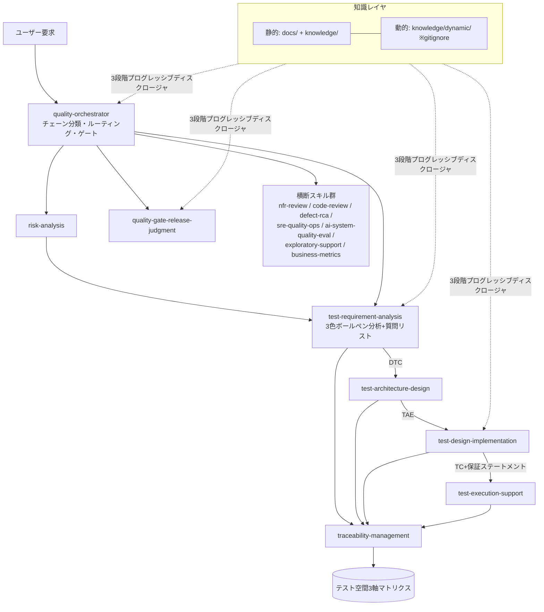
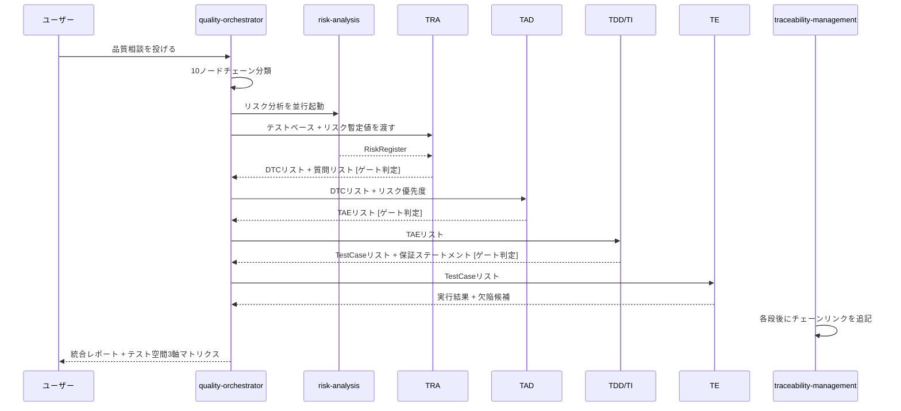

> **v2 status**: active — v2 でも設計の正典として参照する。

# ソフトウェア品質スキル・エコシステム設計プラン

## エグゼクティブサマリ

テスト・レビュー・不具合分析・リリース判定・SRE・事業品質指標分析まで、ソフトウェア品質に関わる業務を AI エージェントへ委譲するための**エコシステム設計**を定義する。中心となる構成は「オーケストレーター1つ＋単体でも動く専門スキル群」である。今回の成果物は設計プラン文書のみであり、スキル実体（SKILL.md 群）の作成は§5ロードマップの Phase 1 として後続タスクに位置づける。

設計は次の5原則（P1〜P5）に基づく。

- **P1: ナレッジベースが真実源、スキルは薄く**。`docs/` 配下の23文書に手順・データ契約・カタログが既に存在する。スキルはそれらを参照するだけで、内容を再記述しない。
  **根拠**: 再記述はドリフトを生む。`docs/` は独立した PR で更新され続けるため、スキル側に複製があると更新の度に同期漏れが発生する。また SKILL.md はサイズ予算が厳しく、常時コンテキストに載せられる分量ではない。
- **P2: スキル＝固有の成果物を生む品質活動**。10ノードのトレーサビリティチェーン（[品質知識スキーマ](../quality-models/quality-knowledge-schema.md)）上のノードに対応する活動だけをスキル化する。135技法・50チャーターはスキルではなくナレッジである。
  **根拠**: 「技法を選択する」という活動（テスト設計）は1スキルで足りる。技法1つ1つをスキル化すると `description` のトリガー精度が崩壊し、GPTs の20ファイル制限にも抵触する。
- **P3: 全スキルは単体実行可能。オーケストレーターは順序制御とトレーサビリティ付与のみを追加する**。
  **根拠**: 疎結合でなければ、オーケストレーター非対応のプラットフォーム（単発チャット、他社エージェント基盤）で価値を出せない。
- **P4: 正典中立＋プラットフォーム別アダプター**。既存の `CLAUDE.md -> AGENTS.md` シンボリックリンクと同じパターンを拡張する。
  **根拠**: 実行環境非依存（Claude Code / Cowork / Codex / GPTs）が最重要要件であるため、正典を1つ持ち、プラットフォームごとの薄いアダプターで消費する構造にする。
- **P5: 公開リポジトリに社内情報ゼロ**。動的ナレッジ（社内用語・品質基準・欠陥履歴）は構造的に排除する。
  **根拠**: 本リポジトリは MIT ライセンスの公開ナレッジベースであり、社内情報の混入はライセンス上・情報管理上のリスクになる。

本文書はハブであり、ナレッジ管理の詳細は [knowledge-management-design.md](./knowledge-management-design.md)、プラットフォーム移植の詳細は [portability-design.md](./portability-design.md) に分離する。

**根拠**: リポジトリ規約は「1文書200〜800行、焦点化された多数の文書＋ハブ」である。8出力セクションを1枚に収めると2000行超になり規約違反となる。`docs/README.md` が既にディレクトリ単位で索引する構造のため、新ディレクトリ＋ハブ文書という分割は既存パターンに一致する。

---

## §1 ドキュメント目録と品質領域マッピング

### 想定インプットとの差分（重要）

設計に着手する前に、実査で判明した3点の前提差分を明記する。

1. **ユーザーが想定した「添付資料」（テスト設計チュートリアル_テスコン2026／WACATE2023夏招待講演の PDF 等）は `docs/` に存在しない**。`docs/` は23ファイル・すべて Markdown＋CSV 1件・すべて日本語の調査レポート集である。ただしユーザーのプロンプト自体に両資料のエッセンス（技法カタログ1〜8、参照資料の要点6項目）が記載されているため、**プロンプト記載のカタログを補助インプットとして扱う**。
   **根拠**: 存在しない資料を前提に設計すると参照リンクが空振りする。実在する docs/ を主たる真実源とし、プロンプト由来の情報は出典が弱いものとして明示的にタグ付けする方が安全である。
2. **日本発のテスト設計技法の一部が `docs/` に未収録**：3色ボールペン分析、要求のメタモデル分析、ゆもつよメソッド（論理的機能構造分析）、Tiramis 8要素、ラルフチャート（HAYST は組合せ技法 COM-03 として一行言及のみ）、テスト観点/フレーム/コンテナ階層化。
   **根拠**: これらは日本のテスト設計コミュニティ（NPO ASTER・WACATE・テスコン等）で発展した手法であり、docs/ の調査は主に ISTQB/ISO/IEEE 系の英語圏標準を出典としているため収録漏れが生じている。Phase 2 で新規ナレッジ文書 `docs/test-techniques/japanese-test-design-methods.md` を作成する計画とし、それまでは各スキルの参照ナレッジに「プロンプト由来・要出典補強」とタグ付けする。
3. **プロダクト仕様書・過去の不具合データ・社内品質基準（動的ナレッジ）はリポジトリに一切存在しない**。
   **根拠**: 本リポジトリは公開ナレッジベースであるため（P5）、動的ナレッジは構造上コミットできない。テンプレートのみを設計し、実データは各プロジェクト側または非公開の `knowledge/dynamic/` に置く。

### docs/ 実査結果：全23ファイル目録

| パス（docs/配下） | 行数目安 | 内容要約 | 品質領域 | 対応チェーンノード |
|---|---|---|---|---|
| README.md | - | ナレッジベース索引ハブ。8ドメインの関係図 | 全体 | - |
| quality-models/quality-knowledge-schema.md | ~400 | 制御平面。10ノードチェーン（REQ→STK→RISK→QC→AC→TEST→MET→EV→REL→MON）＋ID体系＋AI品質9層分解＋8ステップ推論手順（§3）＋全文書マッピング表（§5） | 全体 | 全ノード |
| quality-models/iso25010-product-quality-model.md | ~390 | 25010:2023 9特性全表＋2011↔2023対応表＋SQuaRE構成＋要求→特性マッピング＋トレードオフマトリクス＋ゲート配置 | 品質特性 | QC, AC |
| quality-models/ai-system-quality-model.md | ~440 | ISO/IEC 25059、AI品質9層、pass@k/pass^k、LLM-as-judge メタ評価、メタモルフィック、ゴールデンセット | AI品質 | QC, TEST, MET |
| quality-management/ai-quality-assurance-and-management-research-report.md | ~260 | NIST AI RMF／ISO 42001／EU AI Act、AI向けQA/QCプロセス | AIガバナンス | RISK, REL, MON |
| quality-management/quality-metrics-pitfalls.md | ~350 | Goodhart/Campbellの法則、メトリクスゲーミング耐性、カウンターメトリクス、AI生成テストの指標増幅リスク | メトリクス | MET |
| quality-management/software-quality-gap-analysis-report.md | ~200 | 78属性ギャップ分析枠組み「証跡なき品質は品質なし」、90項目証跡チェックリスト | 品質診断 | EV, REL |
| quality-management/software-quality-management-practical-reference.md | ~250 | ISO 9001＋25010＋29119＋CMMI/TMMi＋DORA/SRE統合、IEEE 1028レビュー体系、組織規模別ロードマップ | 品質マネジメント | プロセス全般 |
| quality-management/world-class-qa-architect-comprehensive-analysis.md | ~260 | QAアーキテクト役割・コンピテンシーモデル（8役割領域＋KPI） | 組織・役割 | メタ |
| test-techniques/testing-standards-and-assurance-concepts.md | ~406 | ISO/IEC/IEEE 29119全部＋ISTQB v4.0、テストレベル×タイプ×技法保証マトリクス、オラクル分類、保証ステートメントYAMLテンプレート | テスト保証 | TEST |
| test-techniques/test-process-research-summary-test-design.md | ~943 | TRA→TAD→TDD→TI→TEパイプライン、JSONデータ契約（§6）、フェーズ別レビューゲート（§8）、13候補スキル（§5.1） | テストプロセス | TEST |
| test-techniques/test-techniques-skill-catalog.md | ~1040 | 135技法のYAMLスキルカード、S/A/B/R優先度、トップ20、ターゲット別レシピ、状況→技法選択マトリクス | テスト技法 | TEST |
| test-techniques/software-test-techniques-catalog-delivery.md | ~130 | カタログ検証レポート（95→135技法、AI/ML技法は保守的信頼度） | テスト技法 | TEST |
| test-techniques/test-technique-status-assessment.csv | 135行 | 技法目録CSV（ID・和英名・状態・優先度・参照URL） | テスト技法 | TEST |
| exploratory-testing/exploratory-testing-concepts-and-practice.md | ~1100 | ET理論・SBTM・小/大区分・AI支援境界（提案と後処理まで、探索は人間） | 探索的テスト | TEST |
| exploratory-testing/exploratory-testing-tours-verification-final.md | ~340 | ツアー出典検証（Whittaker正典／二次／現代拡張、信頼度A/B/C） | 探索的テスト | TEST |
| exploratory-testing/exploratory-testing-perspective-library.md | ~1350 | 検証済みツアーレンズ集（観点辞書） | 探索的テスト | TEST |
| exploratory-testing/exploratory-testing-charter-catalog-by-tour.md | ~2500 | 実行可能チャーター50件（C01–C50、P0/P1/P2、AI/LLM向け6件） | 探索的テスト | TEST |
| secure-development/secure-development-and-supply-chain.md | ~424 | NIST SSDF、OWASP Top10:2025/ASVS 5.0/LLM Top10、STRIDE、SBOM/SLSA/Sigstore、LLMエージェント防御設計 | セキュリティ | QC, RISK, TEST |
| operations-quality/production-quality-sre-observability.md | ~421 | DORA 5指標（2024）、SLI/SLO/SLA、エラーバジェット、バーンレート警報、OpenTelemetry、ブレームレスポストモーテム | SRE・運用 | MON, MET |
| governance-compliance/ai-governance-regulation-audit.md | ~390 | ISO 42001／NIST AI RMF／EU AI Act／日本AI法、監査証跡アーティファクト類型 | ガバナンス | EV, REL |
| governance-compliance/domain-specific-quality-and-safety-standards.md | ~408 | SIL/ASIL/DAL完全性水準、HAZOP/FMEA/FTA/STPA、アシュアランスケース（GSN） | 安全性 | RISK |
| human-centered-quality/accessibility-ux-human-centered-quality.md | ~553 | WCAG 2.2、EAA/ADA/日本法のタイムライン、自動チェック限界（~57%）、SUS/NPS/CSAT/レイジクリック、AI UI信頼較正 | UX・a11y | QC, MET |

**根拠**: この目録は§3のスキル定義（依存ナレッジ・技法の列）と§Cのカタログ対応表の基礎データになる。プラン作成時の実査結果をそのまま展開しており、再調査は行っていない。

### 不足領域リスト

- **欠陥分類タクソノミー（ODC: Orthogonal Defect Classification）** — 未収録。Phase 2 で新規文書化。
- **VOC・NPS・チャーン・LTV相関分析手法** — 最薄領域。SUS/NPS/CSAT は human-centered-quality に部分収録のみ。Phase 3 で新規文書化。
- **リリース Go/No-Go ディシジョンツリー集** — practical-reference と gap-analysis で部分カバーのみ、専用の意思決定木は未収録。
- **コードレビュー専用文書** — IEEE 1028 のレビュー体系は practical-reference に間接記載のみ。専用文書は不足。Phase 2 で新規文書化。
- **GQM・COQ（品質コスト）深掘り** — practical-reference に触れられているが深掘り文書は不足。Phase 3 候補。
- **日本発テスト設計技法**（3色ボールペン分析・要求のメタモデル分析・ゆもつよメソッド・Tiramis 8要素・ラルフチャート・観点/フレーム/コンテナ階層化） — 前述の想定インプット差分②を参照。

---

## §2 エージェント／スキル構成図



### 図の読み方

- **上段（ユーザー要求→ORC）**: すべての要求はまずオーケストレーターへ入る。ただし各スキルは単体でも直接起動できる（P3）ため、この矢印は「推奨経路」であって「唯一の経路」ではない。
- **中段（RISK→TRA→TAD→TDI→TE）**: テスト設計の主パイプライン。risk-analysis は TRA と並行実行され、TRA のゲート入力になる（§4で詳述）。矢印のラベル（DTC、TAE、TC+保証ステートメント）はスキル間のハンドオフで受け渡す成果物 ID の型を示す。
- **REL（quality-gate-release-judgment）**: パイプラインの出力を直接消費するとは限らず、証跡ベースで独立起動もできるため ORC から直接分岐させている。
- **横断スキル群（XC）**: 10ノードチェーンの特定フェーズに縛られず、必要なタイミングで随時呼ばれるスキル群。
- **traceability-management（TRC）**: 各段の後にチェーンリンクを追記し、テスト空間3軸マトリクスを生成・描画する。
- **知識レイヤ（K）**: 静的知識（docs/ + knowledge/）と動的知識（knowledge/dynamic/、gitignore）に分離し、3段階プログレッシブディスクロージャで全スキルから参照される（詳細は [knowledge-management-design.md](./knowledge-management-design.md)）。

**根拠**: Mermaid 図はプラン§Kをそのまま採用した。ラベルは日本語化済みで、独自の構成図を新規作成すると承認済みプランとの整合性が崩れるため流用する。

---

## §3 スキル定義一覧

16ユニット（オーケストレーター1＋スキル15）で構成する。分割の補助原則として**Tester Skillspace（Stuart Reid）**をエージェント設計のメタファーとして採用し、各スキルのナレッジ参照は「テスト技法」「ドメイン知識」「ITスキル（アーキテクチャ/インフラ）」「コミュニケーション（レビューコメントの書き方・質問リストの出し方）」の4象限のバランスを明記する。

**根拠（P2の分割基準）**: 135技法・50チャーターは「ナレッジ」であり「スキル」ではない。技法を1つ1つスキル化すると、(a) `description` によるトリガー精度が技法数分だけ希釈されて崩壊する、(b) GPTs の20ファイル制限に抵触する、という2つの実害が生じる。「技法を選択する」活動そのもの（TDD/TI スキル）を1つ用意し、技法カタログはそのスキルが参照するナレッジとして扱う。

**警告（全スキル共通・test-process文書の明示的アンチパターン対策）**: **分析から直接テストケースを生成することを禁止する**。TRA（要求分析）→ TAD（アーキテクチャ設計）→ TDD/TI（詳細設計・実装）の段階を必ず踏む。段階を飛ばすと、根拠・構造・厚みの正当性が失われた「整理されていないExcelの山」が量産される（[test-process-research-summary-test-design.md §9](../test-techniques/test-process-research-summary-test-design.md)）。

### #0 quality-orchestrator

- **目的**: ユーザー要求を10ノードチェーンに分類し、適切なスキルへルーティング。4段階複合フロー（TRA→TAD→TDD/TI→TE）の実行とゲート適用を担う。
- **トリガー条件**: 品質活動全般に関する相談で、どのスキルを使うべきか不明な依頼。例：「この決済機能のリリース判定をしたいが何から始めればいいか」
- **入力・出力**: 入力＝自然言語の相談文。出力＝ハンドオフエンベロープ（`source_skill: quality-orchestrator`）＋ルーティング先スキル名＋チェーンノード分類結果。
- **依存ナレッジ・技法**: [quality-knowledge-schema.md §3](../quality-models/quality-knowledge-schema.md)（8ステップ推論をそのまま採用）。4象限：テスト技法（軽）／ドメイン（軽）／ITスキル（ルーティングロジック）／コミュニケーション（明確化質問の設計、重）。
- **単体利用時の呼び出し方**: オーケストレーター自体が単体スキルであるため常に単体利用可能。上流成果物は不要（コールドスタートが前提）。
- **Phase**: MVP

### #1 test-requirement-analysis (TRA)

- **目的**: テストベース確認とテスト要求分析。仕様を能動的に分析・補完し、ユーザー／プロダクト／テスト組織の3視点で詳細テスト条件（DTC）を導出する。
- **トリガー条件**: 仕様・要求文書からテスト条件を洗い出したい依頼。例：「この決済API仕様書からテスト観点を出してほしい」
- **入力・出力**: 入力＝テストベース（仕様・要求・設計文書）。出力＝`HighLevelTestConditionList` / `DetailedTestConditionList`（`HTC-nnn` / `DTC-nnn`）＋質問リスト（必須出力）。
- **依存ナレッジ・技法**: [test-process-research-summary-test-design.md §4.3（テストベース確認・静的レビュー）・§4.4（テスト要求分析）](../test-techniques/test-process-research-summary-test-design.md)（本スキルは両活動を統合しているため2節とも参照する）、[testing-standards-and-assurance-concepts.md](../test-techniques/testing-standards-and-assurance-concepts.md)、[iso25010-product-quality-model.md](../quality-models/iso25010-product-quality-model.md)（要求→特性マッピング）。**3色ボールペン分析モードを内蔵**：仕様の重要箇所(赤)／構成要素(青)／疑問・矛盾(緑)タグ付け＋質問リスト自動生成を必須出力とする（※プロンプト由来・Phase 2で `japanese-test-design-methods.md` として文書化予定、現状は出典補強待ちとタグ付け）。4象限：テスト技法（重）／ドメイン（重、仕様理解）／ITスキル（軽）／コミュニケーション（質問リスト生成、重）。
- **単体利用時の呼び出し方**: 仕様書のテキストのみ渡せば単体起動可能。上流（risk-analysis）成果物がなければ、リスク欄は `assumption: true` 付きで暫定値を仮置きし、質問リストに確認依頼を追加する。
- **Phase**: MVP

### #2 risk-analysis

- **目的**: プロダクトリスク分析（影響度×発生確率）。FMEA/FTA/STPA/STRIDE の中から状況に応じた手法を選択し、TRA・TAD・リリース判定への入力を生成する。
- **トリガー条件**: 「このリリースのリスクを洗い出して」「重要度をどう決めればいいか」等の依頼。
- **入力・出力**: 入力＝機能概要、変更差分、既知の障害影響。出力＝`RiskRegister`（`RISK-nnn`）＋優先度付け根拠。
- **依存ナレッジ・技法**: [quality-knowledge-schema.md](../quality-models/quality-knowledge-schema.md)（RISKノードのデータ契約）、[domain-specific-quality-and-safety-standards.md](../governance-compliance/domain-specific-quality-and-safety-standards.md)（FMEA/FTA/STPA、影響度判定）、[secure-development-and-supply-chain.md](../secure-development/secure-development-and-supply-chain.md)（STRIDE）。ISO 31000 は [practical-reference](../quality-management/software-quality-management-practical-reference.md) 経由で参照。4象限：テスト技法（中）／ドメイン（重）／ITスキル（軽）／コミュニケーション（リスク説明、中）。
- **単体利用時の呼び出し方**: 機能概要のみで起動可能。過去の欠陥履歴（動的ナレッジ）がなければ、業界一般の既知リスクパターンから仮説を提示し `assumption: true` を付与。
- **Phase**: MVP

### #3 test-architecture-design (TAD)

- **目的**: テスト条件の構造化（テストレベル・タイプ・スイート・環境・厚み・担当の割当＝TAE）。
- **トリガー条件**: 「テスト条件を整理して、どの粒度・順序でテストするか設計してほしい」等の依頼。TRA 出力（DTC）を受けて起動するのが標準だが単体起動も可。
- **入力・出力**: 入力＝`DetailedTestConditionList`、リスク優先度。出力＝`TestArchitectureElement`（`TAE-nnn`）＋`ConditionAssignmentMatrix`。
- **依存ナレッジ・技法**: [test-process-research-summary-test-design.md §4.5](../test-techniques/test-process-research-summary-test-design.md)、[testing-standards-and-assurance-concepts.md](../test-techniques/testing-standards-and-assurance-concepts.md)（レベル×タイプ×技法マトリクス）。論理的機能構造分析（ゆもつよ）・Tiramis 8要素は将来ナレッジ（Phase 2、出典補強待ち）。4象限：テスト技法（重）／ドメイン（中）／ITスキル（重、構造設計）／コミュニケーション（軽）。
- **単体利用時の呼び出し方**: DTC がない場合、対象機能の説明文からスコープに関する質問を最大3件行い、簡易アーキテクチャをインラインで合成して `assumption: true` を付与する。
- **Phase**: MVP

### #4 test-design-implementation (TDD/TI)

- **目的**: 技法選択（135技法カタログ＋選択マトリクス）→カバレッジアイテム生成→テストケース生成。生成した各テストケースに保証ステートメントを必須付与する。
- **トリガー条件**: 「このテスト条件から具体的なテストケースを作ってほしい」等の依頼。TAD 出力（TAE）を受けて起動するのが標準。
- **入力・出力**: 入力＝`TestArchitectureElement`、使用可能な技法制約。出力＝`CoverageItemList`（`COV-nnn`）＋`TestCaseList`（`TC-nnn`）＋各ケースの `assurance_statement`（YAML）。
- **依存ナレッジ・技法**: [test-techniques-skill-catalog.md](../test-techniques/test-techniques-skill-catalog.md)（135技法、状況→技法選択マトリクス）、[test-technique-status-assessment.csv](../test-techniques/test-technique-status-assessment.csv)、[testing-standards-and-assurance-concepts.md §9](../test-techniques/testing-standards-and-assurance-concepts.md)（保証ステートメントテンプレート、オラクル分類）。ドメイン分析（BB-09）・組合せ/HAYST（COM-03）を含む。4象限：テスト技法（最重）／ドメイン（中）／ITスキル（軽）／コミュニケーション（保証ステートメントの説明責任、中）。
- **単体利用時の呼び出し方**: TAE がない場合、対象機能とリスク水準の質問を最大3件行い、簡易な TAE 相当（1グループ）をインライン合成して起動する。
- **Phase**: MVP

### #5 traceability-management

- **目的**: チェーンID管理、リンク切れ検出。テスト空間3軸マトリクス（レベル×タイプ×プロセス）の生成・描画。
- **トリガー条件**: 「要求からテストケースまでちゃんと紐づいているか確認して」「テスト空間のカバレッジを可視化して」等の依頼。
- **入力・出力**: 入力＝全成果物（REQ〜TC〜RUN の ID 参照群）。出力＝`TraceabilityMatrix`＋テスト空間3軸マトリクス（Markdownヒート表／Mermaid）。
- **依存ナレッジ・技法**: [quality-knowledge-schema.md §1.4](../quality-models/quality-knowledge-schema.md)（多対多関係、フォワード/バックワードトレース）、[test-process-research-summary-test-design.md §7](../test-techniques/test-process-research-summary-test-design.md)（トレース項目）。4象限：テスト技法（軽）／ドメイン（軽）／ITスキル（重、可視化・データ処理）／コミュニケーション（軽）。
- **単体利用時の呼び出し方**: 成果物一式（Markdown/JSON/CSVいずれか）を渡せば単体起動可能。ID 体系が不明な成果物は「未接続」として報告する。
- **Phase**: MVP

### #6 quality-gate-release-judgment

- **目的**: CI/CD品質ゲート・Go/No-Go判定。証跡ベースで判定し、カウンターメトリクスの提示と残存リスクの明示を強制する。
- **トリガー条件**: 「このリリース、出していいか判定してほしい」等の依頼。
- **入力・出力**: 入力＝証跡ファイル群（テスト結果、メトリクス、SBOM等）、受入基準。出力＝`ReleaseDecision`（`REL-nnn`：`go`/`no_go`/`conditional_go`）＋根拠証跡リンク＋残存リスク＋例外事項。
- **依存ナレッジ・技法**: [software-quality-gap-analysis-report.md](../quality-management/software-quality-gap-analysis-report.md)（90項目証跡チェックリスト）、[quality-metrics-pitfalls.md](../quality-management/quality-metrics-pitfalls.md)（Goodhart対策・カウンターメトリクス強制）、[iso25010-product-quality-model.md](../quality-models/iso25010-product-quality-model.md)（ゲート配置パターン）。COQ/GQM は practical-reference 経由。4象限：テスト技法（軽）／ドメイン（中）／ITスキル（軽、証跡パース）／コミュニケーション（判定説明、重）。
- **単体利用時の呼び出し方**: 証跡ファイルのパスまたは内容を直接渡せば単体起動可能。証跡が不足する項目は自動的に `missing` として判定を `conditional_go` 以下に制限する（証跡なき品質は品質なし、の原則を厳守）。
- **Phase**: MVP

### #7 test-execution-support (TE)

- **目的**: テスト実行支援、結果記録（TPR/RUN）、flaky テストのトリアージ。
- **トリガー条件**: 「このテストスイートを実行した結果をまとめて」「このテスト、たまに落ちるので原因を切り分けたい」等の依頼。
- **入力・出力**: 入力＝`TestProcedureList`、実行環境情報、実行ログ。出力＝`TestExecutionLog`（`RUN-nnn`）＋`DefectCandidateList`＋flaky判定結果。
- **依存ナレッジ・技法**: [test-process-research-summary-test-design.md §4.8（テスト実行）・§4.9（再テスト・回帰テスト）](../test-techniques/test-process-research-summary-test-design.md)（結果記録と変更関連テストの両方を担うため2節とも参照する）、[testing-standards-and-assurance-concepts.md §6](../test-techniques/testing-standards-and-assurance-concepts.md)（flaky実証データ、原因分類）。4象限：テスト技法（中）／ドメイン（軽）／ITスキル（重、CI/ログ解析）／コミュニケーション（軽）。
- **単体利用時の呼び出し方**: 実行ログのみでも起動可能。テストケース定義（TC）が無い場合はログからケース相当を逆推定し `assumption: true` を付与。
- **Phase**: P2

### #8 exploratory-testing-support

- **目的**: 50チャーター（C01–C50）からの選定提案、SBTM セッションログの後処理・デブリーフ支援。**探索の実行そのものは人間が行う**という役割境界を厳守する。
- **トリガー条件**: 「この機能を探索的にテストするならどのチャーターが向いているか」「セッションログをまとめてほしい」等の依頼。
- **入力・出力**: 入力＝対象機能、リスク傾向。出力＝推奨チャーターリスト（[チャーターカタログ](../exploratory-testing/exploratory-testing-charter-catalog-by-tour.md)の `C01`〜`C50`。トレースID としては本設計が導入する `CHT-` プレフィックス付き表記、例: `CHT-C07`）＋セッションデブリーフ要約。
- **依存ナレッジ・技法**: [exploratory-testing/](../exploratory-testing/exploratory-testing-concepts-and-practice.md) 全4ファイル（概念、ツアー検証、観点ライブラリ、チャーターカタログ）。4象限：テスト技法（重、ET固有）／ドメイン（中）／ITスキル（軽）／コミュニケーション（デブリーフ支援、重）。
- **単体利用時の呼び出し方**: 対象機能の説明のみで起動可能。リスク情報がなければ汎用チャーター（P0）を優先提案する。
- **Phase**: P2

### #9 code-review

- **目的**: 構造化コードレビュー・静的解析結果の解釈（正確性・セキュリティ・保守性の観点）。
- **トリガー条件**: 「このPRをレビューしてほしい」「静的解析の指摘を優先度付けしてほしい」等の依頼。
- **入力・出力**: 入力＝差分（diff）、静的解析結果。出力＝レビュー所見リスト（重大度付き）＋修正提案。
- **依存ナレッジ・技法**: [secure-development-and-supply-chain.md](../secure-development/secure-development-and-supply-chain.md)（SAST/DAST観点）、[practical-reference](../quality-management/software-quality-management-practical-reference.md)（IEEE 1028レビュー体系）。専用文書が不足しているため Phase 2 で新規文書化（§1不足領域参照）。4象限：テスト技法（軽）／ドメイン（中）／ITスキル（重）／コミュニケーション（レビューコメントの書き方、最重）。
- **単体利用時の呼び出し方**: diff のみで単体起動可能。静的解析結果がなければ目視レビューのみで実施し、その旨を出力に明記する。
- **Phase**: P2

### #10 defect-analysis-rca

- **目的**: 欠陥分類・根本原因分析（5 Whys／フィッシュボーン／FTA／STPA）・ポストモーテム支援。RISK/TEST ノードへのフィードバックを生成する。
- **トリガー条件**: 「この障害の根本原因を分析してほしい」「ポストモーテムのドラフトを作ってほしい」等の依頼。
- **入力・出力**: 入力＝欠陥票・インシデント記録。出力＝RCA レポート＋`RiskRegister` 更新提案（フィードバック）。
- **依存ナレッジ・技法**: [production-quality-sre-observability.md](../operations-quality/production-quality-sre-observability.md)（ブレームレスポストモーテム）、[domain-specific-quality-and-safety-standards.md](../governance-compliance/domain-specific-quality-and-safety-standards.md)（FTA/STPA）。ODC（欠陥分類タクソノミー）は未収録のため Phase 2 で新規文書化。4象限：テスト技法（中）／ドメイン（重）／ITスキル（軽）／コミュニケーション（ブレームレス、最重）。
- **単体利用時の呼び出し方**: インシデント記録のテキストのみで起動可能。分類タクソノミーが未整備の間は自由記述カテゴリで代替し、その旨を明記する。
- **Phase**: P2

### #11 nfr-review

- **目的**: ISO/IEC 25010:2023 ベースの非機能要求（NFR）レビュー。1スキル＋4レンズ（UI/UX+アクセシビリティ／性能／セキュリティ／アーキテクチャ）構成。特性間トレードオフマトリクスの提示を必須出力とする。
- **トリガー条件**: 「このAPIの非機能要件をレビューしてほしい」「性能とセキュリティのバランスを見てほしい」等の依頼。
- **入力・出力**: 入力＝対象仕様、レンズ指定（省略時は全レンズ）。出力＝レンズ別チェックリスト所見＋トレードオフマトリクス（必須）。
- **依存ナレッジ・技法**: [iso25010-product-quality-model.md](../quality-models/iso25010-product-quality-model.md)（トレードオフマトリクス、要求→特性マッピング）、[accessibility-ux-human-centered-quality.md](../human-centered-quality/accessibility-ux-human-centered-quality.md)、[secure-development-and-supply-chain.md](../secure-development/secure-development-and-supply-chain.md)、[production-quality-sre-observability.md](../operations-quality/production-quality-sre-observability.md)。4象限：テスト技法（軽）／ドメイン（重）／ITスキル（レンズにより変動）／コミュニケーション（トレードオフ説明、重）。
- **単体利用時の呼び出し方**: 仕様テキストのみで起動可能。レンズ未指定時は全4レンズを実施し、対象外レンズは「非該当」と明記する。
- **Phase**: P2

**NFR 4レンズを1スキルにする根拠**: 手順が同一（対象→25010特性マッピング→チェックリスト→根拠付き指摘→トレードオフ提示）であるため、4クローンにすると保守コストが4倍になる。レンズ固有の知識は `references/` 配下のファイルで分離する。

### #12 sre-quality-ops

- **目的**: SLI/SLO/SLA設計、エラーバジェット運用、バーンレート警報設計、DORA 5指標の解釈。
- **トリガー条件**: 「このサービスのSLOを設計してほしい」「DORA指標が悪化しているので原因を見てほしい」等の依頼。
- **入力・出力**: 入力＝サービス特性、既存メトリクス。出力＝SLI/SLO定義（`MON-nnn`）＋エラーバジェットポリシー＋警報設計。
- **依存ナレッジ・技法**: [production-quality-sre-observability.md](../operations-quality/production-quality-sre-observability.md)（DORA、SLO、バーンレート）、[practical-reference](../quality-management/software-quality-management-practical-reference.md)。4象限：テスト技法（軽）／ドメイン（中）／ITスキル（重、可観測性基盤）／コミュニケーション（軽）。
- **単体利用時の呼び出し方**: サービス概要のみで起動可能。既存メトリクスがなければ業界標準的なSLO水準を仮提案する。
- **Phase**: P2

### #13 ai-system-quality-eval

- **目的**: AI/LLM評価設計。pass@k/pass^k、LLM-judgeメタ評価（位置・冗長性・自己選好バイアス）、メタモルフィックテスト、ゴールデンセット設計、多段CI設計。
- **トリガー条件**: 「このLLM機能の評価方法を設計してほしい」「LLM-as-judgeの評価バイアスをチェックしてほしい」等の依頼。
- **入力・出力**: 入力＝AI機能の仕様、既存評価データ。出力＝評価設計（`TEST-nnn`、`method_type: llm_eval`）＋ゴールデンセット設計指針。
- **依存ナレッジ・技法**: [ai-system-quality-model.md](../quality-models/ai-system-quality-model.md)、[ai-quality-assurance-and-management-research-report.md](../quality-management/ai-quality-assurance-and-management-research-report.md)、[ai-governance-regulation-audit.md](../governance-compliance/ai-governance-regulation-audit.md)。4象限：テスト技法（重、AI評価固有）／ドメイン（中）／ITスキル（中）／コミュニケーション（限界の説明、重）。
- **単体利用時の呼び出し方**: AI機能の説明のみで起動可能。既存評価データがなければゴールデンセット設計の指針提示に留める。
- **Phase**: P2

### #14 quality-artifact-review

- **目的**: 他スキル成果物のメタレビュー。ギャップチェックリスト適合・保証ステートメント適合・プロセス一貫性（前工程の成果物が後工程で使われているか）を検証する。
- **トリガー条件**: 「TRAからTDDまでの成果物一式が整合しているかレビューしてほしい」等の依頼。
- **入力・出力**: 入力＝各段階の成果物（DTC/TAE/COV/TC/保証ステートメント等）。出力＝`ArtifactReviewFindingList`（文書点・工程一貫性・トレーサビリティ・説明責任・技術的妥当性の5観点）。
- **依存ナレッジ・技法**: [software-quality-gap-analysis-report.md](../quality-management/software-quality-gap-analysis-report.md)、[testing-standards-and-assurance-concepts.md](../test-techniques/testing-standards-and-assurance-concepts.md)、[test-process-research-summary-test-design.md §8.5](../test-techniques/test-process-research-summary-test-design.md)（成果物品質レビュー観点）。4象限：テスト技法（中）／ドメイン（軽）／ITスキル（軽）／コミュニケーション（レビュー所見、重）。
- **単体利用時の呼び出し方**: レビュー対象成果物一式があれば単体起動可能。前工程成果物が欠けている場合はその欠落自体を最重要所見として報告する。
- **Phase**: P2

### #15 business-quality-metrics

- **目的**: NPS/VOC/チャーン/LTV と品質シグナルの GQM（Goal-Question-Metric）ベース相関分析。
- **トリガー条件**: 「品質指標とチャーン率の関係を分析してほしい」等の依頼。
- **入力・出力**: 入力＝品質メトリクス群、事業指標群。出力＝GQM構造＋相関分析所見（因果は主張しない）。
- **依存ナレッジ・技法**: [accessibility-ux-human-centered-quality.md](../human-centered-quality/accessibility-ux-human-centered-quality.md)（SUS/NPS/CSAT）、[quality-metrics-pitfalls.md](../quality-management/quality-metrics-pitfalls.md)。**最薄領域**：VOC/チャーン/LTV相関手法は未収録のため、Phase 3 で手法文書の新規作成が前提。4象限：テスト技法（軽）／ドメイン（重、事業指標）／ITスキル（中、データ分析）／コミュニケーション（重、経営層への説明）。
- **単体利用時の呼び出し方**: 単体起動は可能だが、Phase 3 の手法文書が未整備の間は「相関分析の枠組み提示」に留め、確定的な結論は出さない旨を明記する。
- **Phase**: P3

### 補足: Tester Skillspace 4象限原則

各 SKILL.md のナレッジ参照は上記の通り「テスト技法／ドメイン知識／ITスキル（アーキテクチャ/インフラ）／コミュニケーション（レビューコメント・質問リスト）」の4象限バランスを明記する。
**根拠**: Stuart Reid の Tester Skillspace は「テスターに必要なのはテスト技法だけではない」ことを示すメタファーであり、スキル設計でも技法知識に偏重せず、ドメイン理解・IT基盤理解・対人コミュニケーションを明示的に設計対象にすることで、AIエージェントが「技法は正しいが的外れ」な出力を避けやすくなる。

### §C ユーザー提供技法カタログ（1〜8）との対応表

| カタログ分類 | 担当スキル | docs/ カバー状況 |
|---|---|---|
| 1. テスト要求分析・上流（TRA 3視点、リスクベース、ドメイン分析、3色ボールペン、メタモデル分析） | TRA (#1), risk-analysis (#2) | TRA/リスク/ドメイン分析(BB-09)は有。**3色ボールペン・メタモデル分析は未収録**→Phase 2 新規文書 |
| 2. テスト構造化・アーキテクチャ（TAD、ゆもつよ、Tiramis、HAYST/ラルフチャート、観点階層化） | TAD (#3) | TAD は有。**ゆもつよ・Tiramis・ラルフチャート・観点階層化は未収録**（HAYSTはCOM-03で組合せ技法として言及のみ）→Phase 2 新規文書 |
| 3. テスト詳細設計・実装（BB/WB技法、探索的、カバレッジ絞込、実装モデリング） | TDD/TI (#4), exploratory (#8), TE (#7) | 135技法カタログ＋50チャーターで最充実領域 |
| 4. 品質特性・非機能（25010:2023、新旧対応、トレードオフ、SQuaRE、SRE指標） | nfr-review (#11), sre-quality-ops (#12) | 充実（新旧対応表・トレードオフマトリクス既存） |
| 5. 不具合・欠陥分析（RCA、ODC、リグレッション分析） | defect-analysis-rca (#10), TE (#7) | FTA/STPA/ポストモーテムは有。**ODC・欠陥密度分析は未収録**→Phase 2 新規文書 |
| 6. プロセス・体系分析（テストの空間3軸、テスト開発プロセス、自動化ピラミッド） | orchestrator (#0), traceability (#5) | プロセスは充実。自動化ピラミッド/CI-CD統合はやや薄い |
| 7. 事業・組織品質分析（NPS/VOC、スキルスペース） | business-quality-metrics (#15) | **最薄**。SUS/NPS部分的。VOC/チャーン/LTVは未収録→Phase 3 新規文書。スキルスペースはメタ設計原則として採用済み |
| 8. 品質マネジメント・プロセス改善（COQ、CMMI/TMMi、IEEE 1028、GQM、ISO 31000） | release-judgment (#6), quality-artifact-review (#14), code-review (#9) のナレッジ | practical-referenceとgap-analysisで部分カバー。GQM/COQ深掘りはPhase 3新規文書候補 |

**根拠**: プラン検討時に技法カタログ（テスコン2026／WACATE2023由来のプロンプト記載情報）と docs/ 実在文書を突き合わせ、各カタログ分類がどのスキルに落ちるか・どこにギャップがあるかを事前に確定した対応表であり、そのまま展開する。

### §D 参照資料の要点6項目 → 設計への反映先

| 要点 | 反映先 |
|---|---|
| 1. テスト開発プロセス4段階＋工程一貫性（湯本氏） | オーケストレーターのフェーズ設計＝TRA→TAD→TDD/TI→TE。各段階を専用スキル化し、ハンドオフエンベロープで前段出力＝次段入力を強制する |
| 2. フィーチャー/テスト条件の定義揺れ（山﨑氏） | `knowledge/terminology/term-map.yaml`：JSTQB/ISO 29119/社内定義を並記、`divergence_note`＋`do_not_conflate` フラグ。スキルは出力にどの標準の定義を使ったか明記する |
| 3. テストの空間3軸（レベル×タイプ×プロセス） | `knowledge/test-space/matrix-template.yaml`＋traceability-management スキルが描画（Markdownヒート表/Mermaid） |
| 4. Tester Skillspace（テスト技法以外のスキルも必要） | 各 SKILL.md のナレッジ構成4象限原則（技法/ドメイン/IT/コミュニケーション）として全スキルに適用 |
| 5. 仕様書は能動的に分析・補完（3色ボールペン） | TRA スキルの仕様分析モード：赤/青/緑タグ付け＋欠落・矛盾・曖昧検出＋質問リスト自動生成を出力契約に含む |
| 6. 品質特性はトレードオフ関係（25010相関表） | nfr-review スキルの必須出力にトレードオフマトリクス提示。既存 iso25010 文書の相関表（旧特性名ベース）と新モデルの対応付けに言及する |

**根拠**: ユーザーが「必ず踏まえること」と指定した6項目であり、反映先を明示しないと設計の網羅性が検証できない。

---

## §4 オーケストレーション設計

### 2段階ルーティング

1. **チェーン分類**: 要求を10ノードチェーン（[quality-knowledge-schema.md §3](../quality-models/quality-knowledge-schema.md) の8ステップ推論）に分類する。
   **根拠**: 独自タクソノミーを新規発明せず、既存の制御平面を再利用する。8ステップ推論は「途中のステップを飛ばしてテストケース生成に直行しない」という最重要ルールを既に持っており、オーケストレーターの分類ロジックとして転用できる。
2. **ルーティング表の適用**: （ノード×意図動詞×ライフサイクルフェーズ）→スキルの対応表で担当スキルを決定する。曖昧な場合は明確化質問を1回まで許容し、それでも定まらない場合は入力が揃っている最上流フェーズへルーティングする。
   **根拠**: 明確化質問を無制限に許すとユーザー体験が悪化する。上流フェーズへ倒す方針は「情報が少ないときほど上流から手当てする」という TRA→TAD→TDD/TI の設計思想と整合する。

### ハンドオフエンベロープ

全スキル共通の出力形式（`schemas/handoff-envelope.schema.json` として正規化予定）。

```json
{
  "source_skill": "test-requirement-analysis",
  "phase": "TRA",
  "artifacts": [
    {
      "type": "DetailedTestConditionList",
      "schema_ref": "schemas/detailed-test-condition.schema.json",
      "items": [
        { "id": "DTC-001", "title": "1桁短いカード番号を拒否する" }
      ]
    }
  ],
  "trace_ids": ["REQ-012", "RISK-004", "DTC-001"],
  "assumptions": [
    { "field": "risk_level", "value": "unknown", "reason": "risk-analysis 未実行のため暫定" }
  ],
  "open_questions": [
    "Diners以外の海外ブランドの桁数仕様は確認済みか"
  ],
  "gate_status": "passed-with-risks"
}
```

**根拠**: `trace_ids` は既存ID体系（`REQ-`、`RISK-`、`DTC-`、`TC-` 等）をそのまま使い回すことで、traceability-management スキルが追加変換なしにリンクを追跡できる。`assumptions` と `open_questions` は単体利用時の「上流成果物なし」状態を後から検出・補完可能にするための必須フィールドである。`gate_status` は `passed` / `passed-with-risks` / `blocked` の3値とし、次段階への引き渡し可否をオーケストレーターが機械的に判定できるようにする。

### 4段階複合フロー（TRA→TAD→TDD/TI→TE）



### ゲート基準

各段階のゲート基準は [test-process-research-summary-test-design.md §8](../test-techniques/test-process-research-summary-test-design.md) のフェーズ別レビュー観点をそのまま流用する。

| フェーズ | ゲート観点（要約） |
|---|---|
| TRAレビュー | 使われ方・仕組み・全体像・リスク・テスト条件・パラメーター・不明点の分離 |
| TADレビュー | 構造・関係・厚み・担当・重複漏れ・粒度 |
| TDDレビュー | パラメーター・値候補・制約・カバレッジ・技法・期待結果・ケース数 |
| TIレビュー | 実行順序・手順・自動化・証跡・再現性 |

risk-analysis は TRA と並行実行し、`RiskRegister` を TRA ゲートの必須入力とする。traceability-management は各段後にチェーンリンクを追記する。MVP ではゲート判定をオーケストレーター内蔵とし、Phase 2 で quality-artifact-review スキルへ委譲する。

**根拠**: 独自のゲート基準を新規策定せず、test-process 文書が既に持つ実務的なチェックリストを再利用することで設計工数を抑え、かつ根拠文書と齟齬のないゲートにする。

### 単体利用の必須3セクション

全 SKILL.md は次の3セクションを必須で持つ。

1. **最小入力契約**: コールドスタート時に必要な入力を明記する（例：TRAなら「テストベース（仕様・要求文書）」のみで起動可能）。
2. **上流成果物なし時の振る舞い**: 例えば TAD なしで TDD/TI を起動した場合、スコープに関する質問を最大3件行い、簡易アーキテクチャをインラインで合成した上で `assumption: true` としてエンベロープに記録する。
3. **出力エンベロープ**: 単体実行であっても必ずハンドオフエンベロープ形式で出力し、後からオーケストレーションへ再取込可能にする。

**根拠**: 「疎結合」を単なる設計思想の宣言に留めず、検証可能なチェックリスト項目に落とし込む。この3セクションが欠けているスキルは単体利用不可とみなし、レビューで差し戻す基準にできる。

### プラットフォーム非依存の抽象化方針（概要）

SKILL.md の frontmatter に `capabilities`（`file_read` / `file_write` / `shell` / `web_search` 等の抽象能力名）を持たせ、プラットフォームごとの能力対応表（Claude Code→Read/Write/Bash/WebSearch、Codex→workspace read/write+shell、GPTs→file-search/code-interpreter または手動代替手順）でマッピングする。詳細な変換レシピと Claude Code 実装例は [portability-design.md](./portability-design.md) を参照。

**根拠**: 実行環境非依存が最重要要件（プランContext節）であるため、オーケストレーション設計自体もプラットフォーム固有APIに依存しない抽象化レイヤを前提に組む。

---

## §5 段階的ロードマップ

- **Phase 1 (MVP)**: 足場作成（`skills/`・`schemas/`・`knowledge/` 索引＋用語表シード＋動的テンプレート＋symlink）→ **skill-creator スキルを使って** #0〜#6 の7ユニットを作成 → 実プロジェクト1件で TRA→TAD→TDD/TI パイプラインを試行する。
- **Phase 2**: 残り8スキル（#7〜#14）＋不足ナレッジ文書3件の新規作成（コードレビュー技法／欠陥タクソノミー・ODC／日本発テスト設計技法＝3色ボールペン・ゆもつよ・Tiramis・メタモデル分析・観点階層化）＋ゲート判定の quality-artifact-review への委譲＋テスト空間マトリクスの描画実装。
- **Phase 3**: business-quality-metrics（#15、VOC/NPS/チャーン/LTV手法文書の新規作成が前提）＋GQM/COQ深掘り文書＋GPTsエクスポートビルドスクリプト＋動的ナレッジのプライベートリポジトリsymlink運用＋Cowork プラグイン化。

**根拠**: 単体価値の早い順（MVP）→ユーザースコープの網羅（P2）→不足ナレッジ・プラットフォームツーリングに依存するもの（P3）、という優先順位で並べている。MVPの7ユニットは、test-process文書自身が導出した最小5スキル（TRA・リスク・TAD・TDD・トレーサビリティ）にデータ契約が既に存在するため設計リスクが最小であることに加え、単体で即日価値が最も高い release-judgment を追加したものである。

**運用注記（タスク分解のタイミング）**: Phase 1 のタスク分解は [phase1-implementation-guide.md](./phase1-implementation-guide.md) として作成済み。Phase 2/3 の実装ガイドは**事前に作成せず**、Phase 1 完了時に統合試行（T12）の結果・トリガー言語の実測値・skill-creator の運用実績を反映して同形式で作成する。
**根拠**: Phase 2 のタスク詳細は Phase 1 が検証対象とする仮定（ルーティング精度・コンテキスト予算・description 設計）に依存する。実測前に固定すると、検証結果と矛盾したタスクが規範として残るドリフトを生む。

---

## §6 未解決の論点・要確認事項

1. **動的ナレッジの実データ不在**：社内用語・品質基準・欠陥履歴が空。テンプレートは実プロダクトでの検証が必要。
2. **対象プロダクト・CIシステム未確定**：ゲートスキルは証跡ファイルベースでCI非依存に設計することで回避する。
3. **実欠陥データ不在**：defect-rca と business-metrics は設計のみ可能で、評価は不能。
4. **ISO・ISTQB原文の引用ライセンス**：公開リポジトリでは言い換えが必須。term-map は定義の要約・出典参照方式とする方針とする。
5. **スキル `description` のトリガー言語**：日英併記が有力だが、プラットフォーム横断での実測が必要。skill-creatorのeval機能で検証する。
6. **オーケストレーターのコンテキスト予算**：16スキルの `description` を常時ロードする前提になっており、実測後に圧縮を検討する。
7. **GPTs結合ファイルのサイズ実測**：ドメイン結合で1MB超になる可能性がある。
8. **添付資料（テスコン2026・WACATE2023）の原本が未収録**：ユーザーから提供があれば `docs/` に取り込み、プロンプト由来ナレッジの出典を補強する。

---

## 関連ドキュメント

- [knowledge-management-design.md](./knowledge-management-design.md) — ナレッジ管理設計（静的/動的分離、用語対応表、テスト空間マトリクス、プログレッシブディスクロージャ）
- [portability-design.md](./portability-design.md) — ポータビリティ方針（SKILL.md frontmatter、プラットフォーム別変換レシピ、Claude Code実装例フル掲載）
- [phase1-implementation-guide.md](./phase1-implementation-guide.md) — Phase 1 実装ガイド（タスク分解、schemas/ 出典対応表、ルーティング表シード、スキル別受入基準）
- adr-0001-design-plan-snapshot.md — 本設計に至った調査過程・意思決定の記録（アーカイブ。正典は本文書以下3文書）
- [../quality-models/quality-knowledge-schema.md](../quality-models/quality-knowledge-schema.md) — 10ノードトレーサビリティチェーンとAIエージェント推論手順の主参照
- [../test-techniques/test-process-research-summary-test-design.md](../test-techniques/test-process-research-summary-test-design.md) — TRA/TAD/TDD/TI/TEのデータ契約とレビューゲートの主参照
- [../test-techniques/testing-standards-and-assurance-concepts.md](../test-techniques/testing-standards-and-assurance-concepts.md) — 保証ステートメントテンプレートの主参照
- [../test-techniques/test-techniques-skill-catalog.md](../test-techniques/test-techniques-skill-catalog.md) — 135技法カタログの主参照
- [../quality-models/iso25010-product-quality-model.md](../quality-models/iso25010-product-quality-model.md) — トレードオフマトリクスの主参照
- [docs/README.md](../README.md) — ナレッジベース全体の索引ハブ
