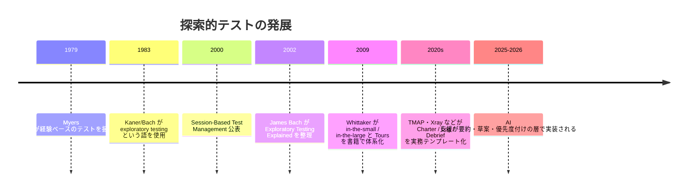
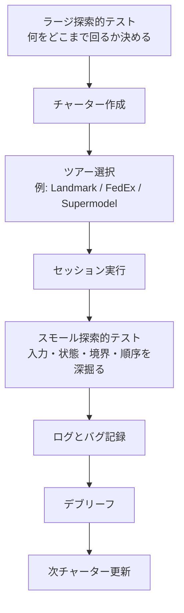
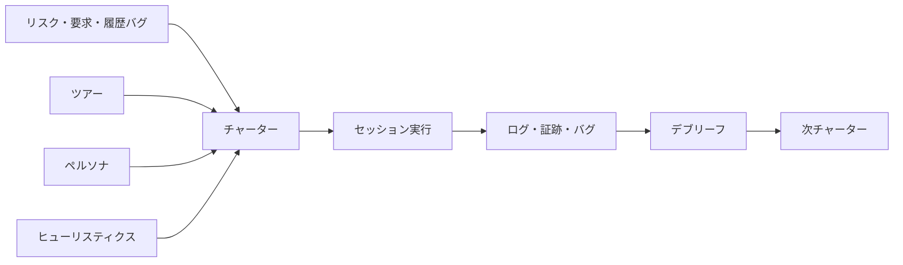
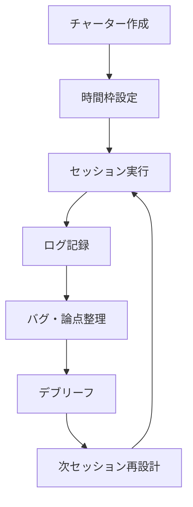
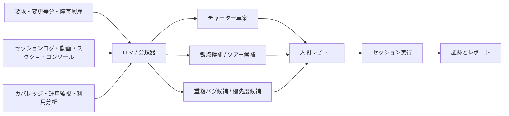

# 探索的テストの概念と実践

## エグゼクティブサマリ

探索的テストは、**学習・テスト設計・実行・結果解釈を並行して進める**テストアプローチであり、事前に詳細な手順を固定するスクリプト型テストとは異なり、テスターがその場で得た情報を次のテスト設計に反映させる点に本質があります。ISTQB/JSTQB の用語集は、探索的テストを「テスターの知識、対象の探索、以前の結果に基づいてテストを動的に設計・実行するアプローチ」と定義しており、James Bach や Cem Kaner らはこれを、より広く「学習・設計・実行の同時進行」として発展させてきました。

実務上、探索的テストは「行き当たりばったり」と混同されがちですが、主要な実践知はむしろ逆です。TMAP は、探索的テストを**チャーター・ログ・デブリーフ**で構造化し、時間枠を区切って実施することを推奨しています。Jonathan/James Bach の Session-Based Test Management は、セッションを「レビュー可能で、チャーターで方向付けされた、途切れないテスト作業の単位」と定義し、さらに TBS 指標やデブリーフによって管理可能性を高めました。つまり、探索的テストの価値は自由さそのものではなく、**自由さを、目的・記録・対話で統制すること**にあります。

有効性の面では、複数の産業研究と実験研究が、探索的テストは**短時間で多様かつ重大な欠陥を見つけやすい**ことを示しています。Itkonen らの複数事例研究では、複雑機能やユーザー視点の確認で探索的テストが使われ、利点として「汎用性」「短時間で品質の全体像を得られること」が挙げられました。一方で最大の弱点は**カバレッジ管理**でした。Afzal らの比較実験では、固定長 90 分セッションにおいて探索的テストが有意に多くの欠陥を発見し、難易度・タイプ・重大度の面でも広い範囲の欠陥を見つけました。

AI 活用は、探索的テストを自動化して置き換えるというより、**発想生成・チャーター草案・ログ要約・バグ報告ドラフト・優先度付け**を支援する形が現実的です。Xray は、探索セッションの要約やバグ報告草案への AI 利用を実験しつつ、出力の一貫性不足と人手レビューの必要性を明確に報告しています。mabl、Applitools、TestRail などの現行ツール群も、生成 AI によるテスト作成、UI の AI 検証、要求からのテストアイデア生成を打ち出していますが、NIST AI RMF や OECD の責任ある AI 指針が示す通り、**信頼性・説明可能性・バイアス・人間の監督**を組み込まなければ、品質活動そのものの信頼を損ねます。

このレポートの実務的結論は明確です。

探索的テストを組織能力にするには、次の三層で設計するのが最も再現性が高いです。

**戦略層ではチャーターとツアー、運営層では SBTM、実装層では AI 支援を限定的に組み込む。** そのうえで、スモール探索的テストは局所的な入力・状態・境界・データの深掘りに、ラージ探索的テストは機能横断・業務フロー横断・リスク横断の探索に使い分けるのが合理的です。

## 探索的テストの基礎

### 定義と本質

ISTQB/JSTQB の定義では、探索的テストは、テスターの知識、対象システムの探索、過去の結果を使ってテストを動的に設計・実行するアプローチです。James Bach と Cem Kaner の系譜では、さらにこれを、**学習・テスト設計・実行・結果解釈を相互支援的に並行させるスタイル**として捉えます。ここで重要なのは、探索的テストは「テストケースがないこと」ではなく、**あらかじめ固定しきらず、観察に応じて更新すること**だという点です。

また、探索的テストはアドホックテストと同一ではありません。TMAP は、探索的テストの特徴として、**リスクと価値へのフォーカス、チャーター、ログ、デブリーフ、時間枠、ペアまたはモブ、テストアイデアやツアーの準備**を挙げています。Xray も、探索的テストは「ランダムではない」と明言し、チャーターが方向を与えることで、自由と焦点を両立させると説明しています。

### 歴史

文献上の整理としては、1979 年の Myers らが経験ベースのテストを扱い、1983 年に Cem Kaner と James Bach が「exploratory testing」という語を用いた、と後続研究がまとめています。James Bach は 2002–2003 年に探索的テストの説明を体系化し、2000 年には SBTM が公表され、2009 年には James Whittaker がツアー・メタファと in-the-small / in-the-large を含む書籍を通じて、個人技に見えやすい探索的テストへ教育可能な枠組みを与えました。近年は TMAP や Xray のような実務フレームワークが、チャーター、ログ、ツール支援を公開し、運用可能性を高めています。



このタイムラインは、Afzal らの研究レビュー、Kaner/Bach の資料、SBTM の原典、Whittaker 書籍プレビュー、TMAP と現行ツール資料を統合して再構成したものです。

### 利点・欠点・適用場面

探索的テストの主な利点は、**複雑機能の理解を深めながら、未想定の欠陥を短時間で見つけやすいこと**です。Itkonen らの複数事例研究では、複雑機能に対する事前テストケース設計の難しさや、エンドユーザー視点での評価ニーズが導入理由として挙げられ、利点として汎用性と品質全体像の把握速度が報告されています。Afzal らの実験研究でも、探索的テストは固定長セッション内で有意に多くの欠陥を発見しました。

一方で、主要な欠点は**カバレッジの見える化、再実行可能性、結果の説明責任、スキル依存性**です。Itkonen らは最大の弱点をカバレッジ管理と述べ、TMAP はその対策としてログを重視しています。Afzal らは、精密な反復や回帰目的では制約があり、経験豊富なテスターが不在な状況にも注意が必要だと整理しています。

### 適用しやすい場面

以下の場面では、探索的テストの費用対効果が高い傾向があります。これらは ISTQB 系資料、複数事例研究、F-Secure のチーム探索的テスト事例、TMAP の実践知を総合した整理です。

| 適用場面 | なぜ有効か | 注意点 |
| --- | --- | --- |
| 要件が曖昧・流動的 | 学習しながら仮説を更新できる | チャーターで焦点を固定する |
| 新機能の初期評価 | 仕様漏れ・UX・例外系を発見しやすい | 後で重要経路は回帰資産化する |
| 複雑な機能連携 | 事前ケース化しづらい組み合わせを探索できる | ログがないと再現困難になる |
| リスク集中領域の深掘り | 既知の問題傾向を起点に攻めやすい | 局所最適に偏りやすい |
| デモ前・リリース前のスポットチェック | 短時間で品質感をつかみやすい | 網羅性の根拠には使いにくい |
| UX・回復性・中断・長時間利用の確認 | スクリプトでは見落としやすい使用感を拾える | 観察力と記録力が重要 |

## スモール探索的テストとラージ探索的テスト

### 定義

James Whittaker は、**Exploratory Testing in the Small** を、入力値、文字列長、状態、コードパス、環境、データといった、テスト中に絶えず発生する**局所的・戦術的な意思決定**の支援として説明しています。対して **Exploratory Testing in the Large** は、アプリケーション全体やテストスイートレベルで、どの経路・機能群・リスク群をどう探索するかという**広域的・戦略的な意思決定**を扱います。Whittaker の記述では、後者はツアーの概念と強く結びついています。

この区分は、ISTQB の標準用語というより、**Whittaker の実務的な整理**として理解するのが適切です。本レポートでは、AI に教示しやすいように、以下のように明確化します。

- **スモール探索的テスト**
単一画面、単一 API、単一フォーム、単一ワークステップなど、狭い対象に対して、入力・状態・境界・順序・データ・環境差を局所的に変化させる探索。
- **ラージ探索的テスト**
複数機能、ユーザージャーニー、機能横断フロー、構成差、リスク分布、履歴的故障分布を踏まえ、チームで広範囲をカバーしながら戦略的に探索する活動。

### 比較表

以下の比較表は、Whittaker の in-the-small / in-the-large の説明、TMAP のチャーター/時間枠/チーム実務、SBTM の運営単位を統合して実務向けに再構成したものです。

| 比較軸 | スモール探索的テスト | ラージ探索的テスト |
| --- | --- | --- |
| 目的 | 単一対象の挙動理解、入力・状態・境界の深掘り | 製品全体のリスク地図を広く・深く把握する |
| スコープ | 画面、フォーム、API、単一操作列 | アプリ全体、主要フロー、複数機能横断、構成横断 |
| 時間枠 | 15〜60 分の短い集中が多い。SBTM に載せるなら 30〜90 分が扱いやすい | 60〜180 分、または複数セッション連鎖 |
| 参加者 | 1 名またはペア | ペア、モブ、チーム横断、関係者参加型 |
| 成果物 | メモ、再現手順、観点一覧、次の仮説 | チャーター群、ツアー別結果、カバレッジ所見、優先度提案 |
| 主なヒューリスティクス | 境界、順序、無効値、状態遷移、データ変異 | ツアー、チャーター群、リスク優先度、履歴バグ、ペルソナ |
| 強み | 深い局所知見、高速、学習効率が高い | 見落とし削減、共有学習、広い品質像、組織横断の納得形成 |
| 主なリスク | 局所最適に陥る、全体像を見失う | イベント化して終わる、記録負債、焦点拡散 |
| 成功条件 | 明確なミッションと即時記録 | 事前のチャーター設計、役割分担、デブリーフ、統合レポート |

### 使い分けの実務原則

最も実務的なのは、**ラージで探索範囲を設計し、スモールで深掘る**運用です。つまり、まずラージ探索的テストで「どの機能群・リスク群・履歴故障群を回るか」を決め、個々のセッションの中ではスモール探索的テストで入力や状態を強く変化させる、という二層構造にすると、カバレッジと発見力を両立しやすくなります。Whittaker のツアーと SBTM は、この二層構造を自然に支える関係にあります。



このフローは、TMAP の「チャーター→実行とログ→デブリーフ」、Whittaker のツアー設計、SBTM の反復管理を統合したものです。

## テストツアーとテストチャーター

### テストツアーの概念

テストツアーは、Michael Bolton の整理を借りれば、**製品の特定の側面に対する directed search** です。Whittaker はこれを「新しい都市を観光する」メタファで体系化し、Business / Historical / Tourist / Entertainment / Hotel / Seedy の各 district にツアーを配置しました。Xray の整理では、ツアーはテスターが“なんとなく歩く”状態を避け、限られた時間の中で何を見にいくかを明確にするためのガイドとして機能します。

さらに重要なのは、**どのツアーが最良かは文脈次第**だという点です。Bolton は、ツアーの価値は最も多くのバグを見つけることではなく、テスターに新しい学びと有用な観点を与えることだと論じています。したがって、ツアーは固定メニューではなく、製品・リスク・規制・履歴バグ・テスター能力に応じて組み合わせるものです。

### 実務で使いやすいツアー分類

Whittaker の元々の命名は豊富ですが、チーム導入では**機能・構成・セキュリティ・UX・履歴/回帰・耐久/中断**のような実務カテゴリに再編した方が運用しやすいことが多いです。以下は、元のツアー群を実務カテゴリへマッピングした一覧です。

| 実務カテゴリ | 代表ツアー | 主な狙い |
| --- | --- | --- |
| 機能ツアー | Guidebook, Landmark, FedEx, Intellectual | 主要機能・業務価値・データ流れ・難条件を攻める |
| 構成ツアー | Configuration, Variability, Interoperability, Structure | 設定差、連携差、環境差を洗う |
| セキュリティツアー | Saboteur, Antisocial, 入力攻撃型チャーター | 認可・検証・リソース制約・不正入力・順序破壊 |
| UXツアー | Supermodel, User, Persona-based | 見た目、可用性、操作理解、アクセシビリティ |
| 履歴・回帰ツアー | Bad-Neighborhood, Museum, Prior Version | バグ多発域、レガシー、前版比較 |
| 耐久・中断ツアー | All-Nighter, Rained-Out, Obsessive-Compulsive | 長時間利用、中断・再開、繰り返しによる劣化 |

### 代表ツアーの目的・手順・チェックリスト

以下は、導入効果が高い代表例です。チェックリストは Whittaker 系ツアー、TMAP の test ideas、Xray のペルソナ/ツアー指針、Bolton/Kelly の tour inventory を実務的に統合したものです。

#### 機能ツアー

**目的**

顧客価値が最も高い機能、取引成立に直結する機能、デモや業務の主経路を重点的に確認する。Money Tour、Guidebook Tour、Landmark Tour、FedEx Tour が中核です。

**手順**

まず売り機能・主要ユースケース・主要データオブジェクトを抽出します。次に、ユーザーマニュアル・営業デモ・主要 KPI フローをたどり、データが入力から保存、再利用、出力に至るまでを追跡します。最後に Intellectual Tour 的に、複雑な入力、大量件数、例外的な組み合わせを投入します。

**チェックリスト**

- 最重要機能は最短経路と現実的経路の両方で動くか
- 入力したデータは保存・再読込・検索・出力まで整合するか
- デモで強調される機能は、例外系でも破綻しないか
- 大量データ、長文、特殊文字、極端値で破綻しないか
- 主経路の周辺機能が本流を壊さないか

#### 構成ツアー

**目的**

構成、設定、ブラウザ、デバイス、地域、言語、連携差による品質劣化を見つける。Configuration Tour、Variability Tour、Interoperability Tour、Structure Tour が該当します。

**手順**

設定項目を棚卸しし、影響の大きい組み合わせから試します。続いてブラウザ・OS・言語・タイムゾーン・ネットワーク条件・権限差を変え、同じ機能がどこまで同じ意味を保つかを確認します。外部サービス連携があれば、接続断・遅延・エラー応答も混ぜます。

**チェックリスト**

- 設定変更後に値が永続化されるか
- 環境を変えても意味的に同じ結果になるか
- デフォルト値と空欄時の処理は妥当か
- 外部連携の失敗時に回復可能か
- 切り替え前後でキャッシュや表示が矛盾しないか

#### セキュリティツアー

**目的**

不正入力、不正順序、認可欠陥、リソース飢餓、例外処理の脆さを発見する。Whittaker の Seedy District にある Saboteur、Antisocial、Obsessive-Compulsive が土台になります。Xray のペルソナ例では “Hacker Dave” のような攻撃者視点も有効です。

**手順**

まず、ログイン、権限変更、直接 URL/API 参照、入力フォーム、ファイルアップロード、トークン使用箇所を洗います。次に、順序を意図的に崩し、長大入力や形式違反、重複送信、強制更新、リフレッシュ、多重タブなどを試します。さらに、ネットワーク遮断、CPU/メモリ競合、権限のない操作を混ぜます。

**チェックリスト**

- 認可前提の操作が直接遷移で実行できないか
- 入力値検証は UI と API の両方で一貫しているか
- 多重送信や順序破壊で状態が壊れないか
- エラーメッセージが内部情報を漏らさないか
- リソース不足時に安全側へ失敗するか

#### UXツアー

**目的**

見た目、文言、理解しやすさ、アクセシビリティ、初見ユーザーの迷いを見つける。Supermodel Tour と User/Persona ベースの探索が中心です。

**手順**

まず視覚的一貫性、レイアウト、余白、色、アイコン、レスポンシブ崩れを見ます。次に、初見ユーザー、シニアユーザー、視認性が低い利用者などのペルソナでタスクを実行し、迷い、誤解、離脱点を観察します。

**チェックリスト**

- 主要 CTA が視認しやすいか
- エラー文言やヘルプが理解可能か
- ズーム、縮小、狭い画面で崩れないか
- キーボードや補助的操作でも成立するか
- フローの途中で「今どこか」が分かるか

#### 履歴・回帰ツアー

**目的**

バグが多かった場所、長く触られていないコード、前版との差分に集中する。Bad-Neighborhood、Museum、Prior Version が代表です。

**手順**

過去バグ、改修ログ、最近の大変更、障害票を集め、ホットスポットを選定します。そのうえで、過去の失敗モードを再演し、関連機能への波及も見ます。

**チェックリスト**

- 修正箇所の隣接機能が壊れていないか
- レガシー部分が新仕様と矛盾しないか
- 過去障害の再現条件が本当に消えているか
- 旧版でできたことが新版でもできるか

#### 耐久・中断ツアー

**目的**

長時間利用、キャンセル、再開、反復による劣化や破綻を見つける。All-Nighter、Rained-Out、Obsessive-Compulsive が代表です。

**手順**

処理途中で cancel、back、refresh、タブ切替、復帰を行い、状態回復を確認します。ブランク入力・放置・何度も同じ操作・長時間起動も試します。

**チェックリスト**

- 中断後に再開可能か
- キャンセルしても部分コミットしていないか
- 長時間利用でメモリや UI が劣化しないか
- 同一操作の反復で二重適用が起きないか
- 何もしない状態でも危険な else 句に入らないか

### テストチャーターの役割

チャーターは、ISTQB 用語集では「テスト目標、および場合によってはどうテストするかのアイデアを記した文」とされ、探索的テストで使われます。TMAP はこれを、**探索セッションの出発点を定める簡潔な文書**と定義し、Xray は「ミッション・ステートメント」と表現しています。要するにチャーターは、探索の自由を奪わずに、目的と境界だけを固定する最小限の設計物です。

チャーターの設計品質は軽視できません。Ghazi らの研究では、テストチャーター設計には 30 の影響因子と 35 の内容要素があり、クライアント要求、リスク領域、過去バグ、時間枠、対象機能の複雑性、ユーザージャーニー、対象アーキテクチャなどが設計に影響します。つまりチャーターは気分で書くものではなく、**リスク分析と文脈理解の凝縮物**です。

### チャーターの作り方

Xray が示す実用的な型は、

**Explore `<area/feature/risk>` with/using `<resources/restrictions/heuristics/tools>` to discover `<information>`**

です。これは Elisabeth Hendrickson や Maaret Pyhäjärvi の実務的定式化を受けたもので、短く、焦点があり、かつ手順書になりすぎない点が強みです。TMAP のテンプレートは、さらに tester、timebox、purpose、mission、test ideas、test object、scope、log、debriefing を含め、ペア・モブ運用や非機能要件まで扱える形になっています。



この関係図は、Ghazi らのチャーター設計因子、TMAP のチャーター構造、Xray のツアー・ペルソナ・ヒューリスティクス活用方針をまとめたものです。

### チャーターの具体例

**短時間セッション用**

`EXPLORE: ログイン画面`

`WITH: Chrome / Edge、画面幅 320px〜1440px、Supermodel Tour`

`TO DISCOVER: UI 崩れ、入力エラー表示、初見ユーザーの迷い`

このような型は、短時間でも目的、手段、発見したい情報が明確です。Xray も同種の「Explore the login page using Chrome and different screen sizes to discover problems with usability」を例示しています。

**長時間・複雑機能用**

`EXPLORE: 注文〜在庫引当〜請求確定までの業務フロー`

`WITH: FedEx Tour、例外データ、権限差、キャンセル再開`

`TO DISCOVER: データ不整合、状態遷移漏れ、例外時の回復不全`

これは TMAP がいう scope、timebox、test ideas、non-functionals を明示した複合型です。

**AI 支援セッション用**

`EXPLORE: 返品 API と返品 UI の整合性`

`WITH: AI による履歴障害要約、既存バグクラスタ、FedEx Tour、異常系データ`

`TO DISCOVER: UI/API ギャップ、再発傾向、優先度の高い未検証パス`

この型は、AI には事前要約と発想補助を担当させ、最終判断と探索の舵取りは人が行う前提にしています。Xray の AI 実験が「草案作成には有効だが、妥当性確認は人間が必要」と報告しているためです。

## SBTMと運営実務

### SBTM の基本プロセス

Session-Based Test Management は、探索的テストに管理単位を持ち込むための代表的手法です。James/Jonathan Bach は、セッションを「**途切れず、レビュー可能で、チャーター付きのテスト作業の塊**」と定義し、これを基本作業単位としました。各セッションの後にはデブリーフを行い、レポートと実際の学びを突き合わせます。

TMAP の実務フローは、**チャーターで準備 → 実行しながらログを取る → デブリーフで結論と助言をまとめる** の三部構成です。日本語の IPA 実践報告でも、セッションシートを用いて、管理者が事前指示し、テスターが結果を記録し、日次共有で次の方向を制御する方式が報告されています。



このプロセスは、Bach の SBTM 原典、TMAP、IPA の導入事例で共通して確認できます。

### タイムボックス

Bach のチームでは 90 分前後を基本、45 分程度を short、2 時間程度を long としていました。TMAP は、**30 分未満は短すぎ、3 時間超は集中維持が難しい**とし、30〜180 分を推奨しています。IPA の報告でも 30 分〜2 時間、1 日あたり 3 セッション程度が現実的とされています。SHIFT の実務知見でも、Web 系アプリでは 40〜120 分が扱いやすいと述べています。

実務上は、次のガイドが扱いやすいです。これは既存の推奨幅を基にした運用指針です。

| セッション長 | 向いている用途 |
| --- | --- |
| 30〜45 分 | 単一画面、単一 API、既知リスク再確認 |
| 45〜90 分 | 標準的な機能探索、1 チャーター 1 テーマ |
| 90〜120 分 | 複合フロー、データライフサイクル、構成差 |
| 120〜180 分 | モブ/チーム探索、大規模フロー、リリース前集中確認 |

### ログ・レポート様式

SBTM のセッションシートには、少なくとも **charter、tester、開始日時、TBS、data files、test notes、issues、bugs** が含まれます。TBS は **Test design & execution / Bug investigation & reporting / Session setup** の比率で、さらに **on charter / on opportunity** を記録します。TMAP も、入力と操作、期待結果、実結果、観察、欠陥 ID、デブリーフ結果をログに残すことを推奨しています。

### メトリクス例

SBTM のメトリクスは、テストケースの本数ではなく、**活動の実態と時間の使い方**を見ます。Bach らは、TBS 比率、セッション数、opportunity 率、非セッション作業量、日別・担当者別・領域別の breakdown を扱い、見積りや学習曲線や回帰深度の判断に使いました。ただし、彼ら自身が、**管理者のバイアスや報告の混乱で歪む危険**も指摘しています。

実務で有効なメトリクスは次の通りです。前半は原典に基づくもの、後半はその拡張提案です。

| メトリクス | 意味 | 使いどころ |
| --- | --- | --- |
| セッション数/日 | 実際にどれだけ探索できたか | 進捗把握 |
| TBS 比率 | 設計・調査・準備に時間がどう配分されたか | ボトルネック把握 |
| On-charter / Opportunity 比 | ミッション集中度と偶発探索度 | チャーター品質の確認 |
| バグ数/セッション | 発見効率 | 重点領域判断 |
| 重大バグ率 | 発見の質 | リスク評価 |
| 機能別セッション偏り | どこをどれだけ見たか | カバレッジ補正 |
| チャーター完遂率 | チャーター粒度の適切さ | 次回設計改善 |
| ログ再利用率 | 回帰・再テスト資産化の度合い | 継続改善 |

## AI活用による探索的テスト支援

### 結論

AI は、探索的テストの**代替者**ではなく、**観点生成と情報圧縮の補助者**として使うのが最も安全で効果的です。現時点のツール資料と実験報告を見る限り、AI が強いのは、要求や障害履歴からの**アイデア生成、チャーター草案化、結果要約、文書化補助、視覚差分の機械支援**であり、探索そのものの価値判断やリスク解釈は依然として人間の責務です。

### 実装パターン

#### テストアイデア生成

要求、仕様変更、障害履歴、ユーザーストーリー、監視報告を LLM に与え、

- 想定ユーザージャーニー
- 例外シナリオ
- 非機能リスク
-ツアー候補
を列挙させる使い方です。TestRail は要求から AI でテストアイデアを生成し、それを探索の出発点に使う運用を紹介しています。mabl は生成 AI を使ったテスト作成機能を公式に提供しています。

#### チャーター自動生成

Xray のチャーター構文や TMAP の charter fields をテンプレート化し、AI に「対象・観点・制約・発見したい情報」を埋めさせます。この方法は、特に継続的な sprint ごとの exploratory backlog 作成に向いています。ただし、Xray の AI 実験が示す通り、出力はあくまで草案であり、文脈の抜けや粒度の過不足は人間が補正する必要があります。

#### ログ解析と要約

セッションノート、画面録画、スクリーンショット、ブラウザコンソール、API ログを収集し、AI に**観察事項、異常の候補、次に掘るべき論点**を要約させる運用です。Xray は exploratory session の summary 生成をユースケースとして挙げ、Jira/Xray への証跡連携も支援しています。

#### バグ分類と重複統合

既存バグを埋め込み検索やクラスタリングにかけ、再発か新規か、機能分類、重大度候補、類似不具合との関連を提示させるやり方です。これは triage を速くしますが、重大度や優先度の最終判定を AI 任せにすると、説明責任が弱くなります。NIST AI RMF が強調する「測定・管理・信頼性」の観点からも、人間のレビューは外せません。

#### テスト優先度付け

変更差分、障害履歴、利用頻度、売上寄与、監視アラート、コードカバレッジ欠落を組み合わせ、AI に「今週どの探索チャーターを先に回すべきか」を提案させる方法です。Testrail は coverage 情報を exploratory testing の入力に使う考え方を示しており、AI はこの優先度付けの一部を補助できます。

#### 視覚・UI 支援

Applitools の Visual AI のように、目視差分検知を AI/ML で補助し、UI の見た目の回帰を機械支援する実装も有効です。これは Supermodel Tour や UX ツアーと特に相性が良く、探索の観察対象を減らし、本当に人が見るべき部分へ集中しやすくします。

### 典型アーキテクチャ



この構成は、mabl・TestRail・Xray・Applitools の現行機能と、NIST の AI TEVV / AI RMF の考え方を合わせた実装像です。

### 注意点

Xray の実験では、AI 生成の bug report は一貫性に欠け、入力ノートの質に強く依存し、重要文脈を落とすことがありました。したがって AI 活用は、**記録が粗いチームを救う魔法**ではなく、**記録品質が高いチームをさらに速くする補助**と考えるべきです。

また、NIST AI RMF は信頼できる AI の特性として、**正確性、ロバストネス、安全性、信頼性**を、OECD は**有害なバイアス、プライバシー、安全、説明責任**を挙げています。EU AI Act も人間の監督を重視しています。探索的テスト支援 AI においても、次の観点は必須です。

- **バイアス**
過去バグ履歴だけに寄せると、新規リスクを見落とす。
- **説明可能性**
なぜそのチャーターや優先度なのか説明できないと、品質会議で採用しにくい。
- **信頼性**
もっともらしいが誤った要約や再現手順を混ぜる危険がある。
- **機密性**
ログ、動画、個人情報、運用データを外部 LLM に送る設計は慎重に扱う必要がある。
- **人間の監督**
発見、重大度判断、リリース判断は人間が責任を持つ。

## チーム運営と事例

### 小規模チームの実践ワークフロー

2〜5 人程度の小規模チームでは、**ペアまたは単独 + 短いデブリーフ**が最も機動的です。TMAP はペアを推奨し、理由として、二人で知識が増え、一人が実行、一人が記録し、学習効果も高いことを挙げています。SHIFT も、セッションごとに目的を決め、結果を話し、次セッションを更新する反復を推奨しています。

実務フローは次のように設計すると安定します。

| 項目 | 推奨 |
| --- | --- |
| 役割 | テスター 1〜2 名、必要に応じて開発者同席 |
| セッション長 | 40〜90 分 |
| チャーター入力 | ユーザーストーリー、変更差分、直近障害 |
| 記録 | ノート、スクショ、短い動画、TBS 簡易版 |
| コミュニケーション | セッション後 10〜15 分の即時デブリーフ |
| 成果物 | バグ票、次チャーター、簡易日報 |

### 大規模チームの実践ワークフロー

大規模チームでは、探索的テストをイベント化しすぎると再現性が落ちるため、**チャーターの backlog 化、ツアーの標準語彙化、日次統合レポート**が重要です。TMAP はチャーターを Kanban バックログに載せる運用を示し、SBTM は hopper で未着手セッションを管理しました。IPA の国内事例でも、セッションシート、日次共有、機能別バグ傾向分析による方向制御が有効でした。

大規模向けには次の形が運営しやすいです。

| 項目 | 推奨 |
| --- | --- |
| 役割 | QA リード、ファシリテータ、ドメインエキスパート、実行者群、記録支援者 |
| セッション長 | 60〜180 分 |
| セッション構成 | チャーター単位、ツアー単位、機能群単位で配布 |
| コミュニケーション | 朝会で配布、実施後デブリーフ、日次品質レビュー |
| 成果物 | セッション集計、領域別バグ分布、チャーター消化率、次優先度 |
| 追加価値 | 開発・UX・PO を巻き込んだ共通理解形成 |

### 事例としてのラージ探索的テスト

**F-Secure の Team Exploratory Testing** は、ラージ探索的テストの好例です。研究は 2012〜2013 年、モバイルアプリの UI 改修と性能改善の 2 プロジェクトで行われ、合計 13 回の TET セッションが実施されました。各セッションは sprint 末に配置され、開発者、テスター、UX デザイナー、スクラムマスター、PO、PM などが参加し、ファシリテータとドメインエキスパートが支援しました。

**ステップごとの流れ** は次の通りです。

まず、ファシリテータが対象機能、新実装の状態、既知制約、既発見バグを準備し、壁や画面に可視化します。次に、複数参加者がそれぞれの端末で同じ焦点領域を探り、発見をその場で共有します。その後、得られた欠陥を収集・分類し、デモ前にチーム全体へ品質状況を還元します。

**成果** として、研究者らは TET が、同社の他の方法と比べて、欠陥数ベースで**高い効率**を示し、しかも usability defect を多く見つけたと報告しています。参加者は即時議論、学習、非テスターの視点獲得に価値を感じた一方、議論が集中を妨げることや、非テスター由来の曖昧な報告には注意が必要でした。

**教訓** は三つあります。

第一に、ラージ探索的テストは「大人数でわっと試す」だけではなく、**ファシリテータと領域焦点**が成功条件です。第二に、UX・開発・PO を巻き込むと、バグ発見だけでなく**品質認識の同期**が起きます。第三に、発見効率と議論量のバランスを取るため、セッション中と後半でコミュニケーションルールを分けると安定します。

### 事例としてのスモール探索的テスト

**James Bach の paired exploratory survey による医療機器スポットチェック**は、スモール探索的テストの非常に示唆的な事例です。1 日のペア探索で、James Bach と Oliver Bach の 2 名が、医療機器の主要機能とワークフローを短時間で調べ、全体品質のスポットチェックを行いました。セッションは約 7 時間で、そのうち**問題発見自体には約 2 時間**しか要していません。

**ステップごとの流れ** は明確です。

まず、二人のうち一人が操作し、もう一人がミッション管理と記録を担当しました。次に、広く主要機能を歩き回りつつ、状態遷移、順序、プローブ切替、エラー処理、安全モード移行などを観察しました。さらに、HICCUPPS の一貫性ヒューリスティクスを当てながら「何が不自然か」を見続け、見つかった問題を深掘りしました。

**成果** は非常に強烈です。報告書では、システムクラッシュ、エラー非表示、安全モード不全、メニュー凍結、誤った要求仕様実装、危険な UI/エラー表示など、複数の重大問題が列挙され、患者安全やリコールリスクに関わる所見まで示されました。しかも報告書は、問題の存在だけでなく、**その問題が示唆するテスト不足や設計上の状態モデル混乱**まで踏み込みました。

**教訓** は、スモール探索的テストは狭いスコープであっても浅いとは限らない、という点です。単一セッションでも、状態と順序とエラー処理に集中すれば、重大欠陥を短時間で可視化できます。また、ペアにすることで「操作」と「思考・記録」を分離でき、観察の質が上がります。特に高リスク領域では、短時間のスポットチェックでも十分に大きな価値を持ちます。

### 国内実務事例からの補足

日本の IPA 実践報告では、SBTM を金融機関向け審査システム保守開発と教育機関向け学生管理システム更改に導入し、**セッション消化率の管理、機能別バグ傾向の把握、日次情報共有による方向制御**が有効だったと報告されています。加えて、施策適用後は時間あたりのバグ摘出数の改善も確認されています。これは、探索的テストを「職人芸」で終わらせず、プロジェクト管理へ接続できることを示す日本語の有力事例です。

## テンプレート集

以下のテンプレートは、TMAP の charter template、SBTM の session sheet 構成、Xray の charter guidance、Ghazi らの charter content 研究を統合し、日本語実務用に再設計したものです。構造は一次資料に基づいていますが、文面はそのまま使えるように本レポートで再編しています。

### チャーター

#### 短時間セッション用チャーター

```
チャーターID:
セッション名:
対象:
時間枠: 30〜60分
担当:
目的:
EXPLORE:
WITH/USING:
TO DISCOVER:

スコープ:
非スコープ:
前提条件:
使用環境:
主要な観点:
- 入力
- 状態
- 表示
- エラー
- ログ
終了条件:
- 時間切れ
- 重大欠陥発見
- 次チャーターへ分岐
```

#### 長時間・複雑機能用チャーター

```
チャーターID:
業務フロー名:
対象システム / バージョン:
時間枠: 90〜180分
担当者:
同席者:
目的:
対象ユーザージャーニー:
対象データ:
適用ツアー:
- Landmark
- FedEx
- Bad-Neighborhood
- Supermodel
- Saboteur

期待するアウトカム:
- 発見したい品質情報
- 判断したいリスク
- 後続テストへ残す論点

スコープ:
非スコープ:
依存システム:
既知リスク:
過去障害参照:
終了時に答えるべき質問:
1.
2.
3.
```

#### AI支援セッション用チャーター

```
チャーターID:
対象:
時間枠:
担当:
AI支援の目的:
- 履歴障害要約
- テストアイデア生成
- セッション要約
- バグドラフト作成

人間が最終判断する項目:
- 重大度
- 優先度
- 再現手順の妥当性
- リリース可否

入力コンテキスト:
- 要件/チケット
- 過去バグ
- 利用分析
- 監視アラート
- 変更差分

EXPLORE:
WITH/USING:
TO DISCOVER:

AI出力の検証観点:
- 事実誤認がないか
- 過去バグに引きずられていないか
- 新規リスクを落としていないか
```

### セッションログ

```
セッションID:
チャーターID:
開始:
終了:
実施者:
ビルド/環境:
対象機能:

TBS:
- Test Design & Execution:      %
- Bug Investigation & Reporting: %
- Session Setup:               %

Charter / Opportunity:
- On Charter:      %
- On Opportunity:  %

操作・入力:
期待結果:
実結果:
観察メモ:
スクリーンショット/動画:
関連ログ:
問題/疑問:
仮説:
次に試すこと:
起票バグID:
デブリーフ要点:
```

### バグ報告フォーマット

```
件名:
分類:
重大度:
優先度:
発見チャーターID:
発見セッションID:
環境:
前提条件:

再現手順:
1.
2.
3.

期待結果:
実際結果:
観察された付随症状:
再現性:
- 常時
- 高い
- 低い
- 未確認

影響:
- 業務影響
- ユーザー影響
- セキュリティ影響
- データ整合性影響
- UX影響

証跡:
- スクリーンショット
- 動画
- ログ
- APIレスポンス
- コンソール

関連:
- 過去不具合
- 類似不具合
- 回帰の可能性
```

### レポートサマリ

```
| 日付 | セッションID | チャーター | 対象 | 時間 | 主ツアー | 主要発見 | 重大度高 | 次アクション |
|------|--------------|-----------|------|------|---------|----------|----------|--------------|
|      |              |           |      |      |         |          |          |              |
|      |              |           |      |      |         |          |          |              |
|      |              |           |      |      |         |          |          |              |
```

### テンプレート運用上のコツ

テンプレートは詳細にしすぎると、探索的テストを再びスクリプト型へ押し戻します。Xray は「具体的すぎると test case になる」と注意し、TMAP も charter は方向を与えるが、完全な手順書であってはならないと述べています。したがって、テンプレート運用では、**目的と境界は明示、具体手順は固定しすぎない**を原則にしてください。ログは濃く、チャーターは薄く、が基本です。

また、AI へ理解させるためのドキュメントとしては、以下のようにメタデータを揃えると扱いやすくなります。これは本レポートの実装提案です。

| 項目 | AI向けに明示すべき内容 |
| --- | --- |
| 対象 | 画面 / API / 業務フロー / データオブジェクト |
| 目的 | 何を知りたいのか。発見したい未知は何か |
| 制約 | 時間、環境、権限、利用可能データ |
| 観点 | 機能、構成、UX、セキュリティ、履歴、耐久 |
| エビデンス | 操作、期待、実際、ログ、動画、スクショ |
| 判断 | 重大度、優先度、次チャーター、回帰化候補 |

この形式にしておくと、AI は「探索の文脈」を失いにくくなります。逆に、単なる操作ログだけでは、何を期待していたのか、なぜ異常と判断したのかが失われ、AI にも人間にも説明可能な品質知識になりません。TMAP が expected result を含むログを重視しているのは、この点に直結します。