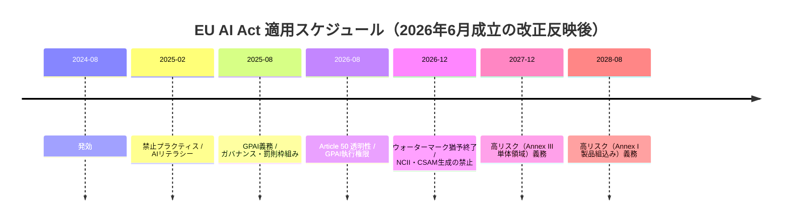
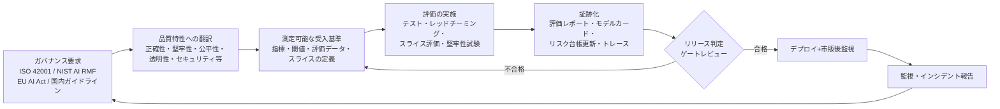

# AIガバナンス・規制・監査証跡リサーチレポート

> 執筆時点: 2026年7月。規制の適用時期・法令状態は本文中に「執筆時点」として明記しています。AIのQA/QCプロセス・事例・規格の全体像は [AIの品質保証と品質管理に関する調査報告書](../quality-management/ai-quality-assurance-and-management-research-report.md) に、AI品質特性の詳細は [AIシステム品質モデル](../quality-models/ai-system-quality-model.md)に委譲し、本ドキュメントは**ガバナンス・規制・監査証跡**に集中します。

## エグゼクティブサマリ

AIガバナンスの実務は、2024〜2026年で「原則論」から「監査可能な運用」へ移行しました。結論を先に述べると、以下の6点が本ドキュメントの要点です。

1. **組織の骨格は ISO/IEC 42001:2023（AIマネジメントシステム、AIMS）で作るのが最も再利用性が高い**です。箇条4〜10はISO 9001/27001と同じ調和構造（Harmonized Structure）であり、既存のQMS/ISMSに統合できます。認証制度は ISO/IEC 42006:2025（認証機関要求事項）の発行で本格化し、認証取得組織は2025年を通じて数十社規模、2026年初頭には世界で100社規模へ拡大したと報告されています。
2. **リスク管理の実務語彙は NIST AI RMF 1.0（Govern / Map / Measure / Manage）が事実上の共通言語**です。生成AIには補助プロファイル NIST-AI-600-1（2024年7月）が**12の生成AI固有リスク**と、4機能に紐づく推奨アクション（アクションID付き）を提供します。
3. **EU AI Act は「品質管理の法制化」**です。高リスクAIにはリスク管理システム、データガバナンス、技術文書、ログ、透明性、人間による監督、正確性・堅牢性・サイバーセキュリティ、QMS、適合性評価、市販後監視、重大インシデント報告が義務付けられます。
4. **適用時期は2025年11月提案の Digital Omnibus（AI Omnibus）により大きく変わりました**。執筆時点（2026年7月）では、欧州議会（2026年6月16日）とEU理事会（2026年6月29日）が改正を**正式採択済み**で、官報掲載（2026年7月中と見込み）の3日後に発効します。これにより高リスクAIの義務適用は、**Annex III（単体高リスク領域）が2027年12月2日、Annex I（製品組込み系）が2028年8月2日**へ延期されます。一方、**GPAI義務（2025年8月2日適用開始）と Article 50 の透明性義務（2026年8月2日）は原則維持**です。「提案段階」ではなく「成立済み（発効手続き中）」というのが正確な状態です。
5. **日本は法的拘束力の弱い推進型**です。AI推進法（人工知能関連技術の研究開発及び活用の推進に関する法律）が2025年5月28日成立・9月1日全面施行、初の人工知能基本計画が2025年12月23日に閣議決定されました。実務の中心は罰則のないソフトローである**AI事業者ガイドライン（第1.2版、2026年3月31日）**で、第1.2版ではAIエージェント・フィジカルAIへの対応が追記されています。
6. **監査対応の本質は「証跡アーティファクトの体系化」**です。AIリスク台帳、モデルカード/システムカード、データシート、評価レポート、技術文書、監査証跡（ログ）を、作成タイミングと維持責任を決めて運用することが、上記すべての規格・法令への共通解になります。AIエージェントが品質保証活動を担う場合は、**エージェント自身のトレース（tool call ログ・判断根拠）も証跡**として設計する必要があります。

## 1. ISO/IEC 42001:2023 — AIマネジメントシステム（AIMS）

### 1.1 規格の構成

ISO/IEC 42001:2023 は、AIシステムを開発・提供・利用する組織向けの**世界初のAIマネジメントシステム要求事項規格**です（2023年12月発行）。構成は他のマネジメントシステム規格（MSS）と同じ調和構造に従います。

| 箇条 | 内容 | PDCA上の位置 |
| --- | --- | --- |
| 4. 組織の状況 | 内外の課題、利害関係者、AIMSの適用範囲、組織のAIにおける役割（開発者・提供者・利用者等）の決定 | Plan |
| 5. リーダーシップ | トップマネジメントのコミットメント、AI方針、役割・責任・権限 | Plan |
| 6. 計画 | リスク及び機会への取り組み、**AIリスクアセスメント**、**AIシステム影響評価**、AI目標 | Plan |
| 7. 支援 | 資源、力量、認識、コミュニケーション、**文書化した情報** | Do |
| 8. 運用 | 運用の計画・管理、AIリスクアセスメントの実施、AIリスク対応、AIシステム影響評価の実施 | Do |
| 9. パフォーマンス評価 | 監視・測定・分析・評価、**内部監査**、マネジメントレビュー | Check |
| 10. 改善 | 継続的改善、不適合及び是正処置 | Act |

附属書は次の4つです。

| 附属書 | 性格 | 内容 |
| --- | --- | --- |
| Annex A | 規定（normative） | **9の管理目的・38の管理策**の参照リスト。AI方針、内部組織、AIシステムの資源、AIシステム影響評価、AIシステムライフサイクル、AIシステムのデータ、利害関係者への情報提供、AIシステムの責任ある利用、第三者・顧客との関係、の9領域 |
| Annex B | 規定 | Annex A管理策の実装ガイダンス |
| Annex C | 参考 | AI関連の組織目標とリスク源の例 |
| Annex D | 参考 | ドメイン・分野別規格との併用に関するガイダンス |

ISO/IEC 27001と同様に、組織はAnnex Aから適用する管理策を選択し、**適用宣言書（Statement of Applicability, SoA）**に選択理由と実装状況を文書化します。管理策の選択はAIリスクアセスメントとAIシステム影響評価の結果に比例させます。この「影響評価 → 管理策選択 → SoA → 内部監査」の連鎖が、そのまま外部監査で提示する証跡の背骨になります。

### 1.2 ISO 9001 / 27001 との関係と統合

| 観点 | ISO 9001（QMS） | ISO/IEC 27001（ISMS） | ISO/IEC 42001（AIMS） |
| --- | --- | --- | --- |
| 管理対象 | 製品・サービス品質 | 情報資産のセキュリティ | AIシステムの責任ある開発・提供・利用 |
| リスクの焦点 | 顧客要求の不充足 | 機密性・完全性・可用性 | AI固有リスク＋**個人・社会への影響**（影響評価が明示的要求） |
| 附属書管理策 | なし | Annex A（93管理策） | Annex A（38管理策）＋実装ガイダンス（Annex B） |
| 統合のしやすさ | 高（同一の調和構造） | 高（SoA運用も同型） | — |

統合実務のポイントは3つです。第一に、**文書体系を共通化**し、方針・リスク台帳・内部監査・マネジメントレビューを統合運用すること。第二に、27001のリスクアセスメントに**AIシステム影響評価（社会・個人への影響）を追加の観点として重ねる**こと（42001は影響評価を独立要求として持つ点が27001との最大の差分です）。第三に、認証審査を**統合審査（integrated audit）**として受けることです。認証サイクルは ISO/IEC 17021 系の枠組みに従い27001と同じ3年サイクル（初回審査→毎年のサーベイランス→更新審査）です。

### 1.3 認証の動向（執筆時点）

- **ISO/IEC 42006:2025**（AIMS審査・認証機関に対する要求事項）が2025年7月に発行され、認定を伴う認証制度が本格稼働しました。
- 認証取得組織は、2025年の大半を通じて世界で50社未満という観測があり、2026年1月には「世界で最初の100社」に入ったと公表する組織が現れる規模に拡大しています。早期取得の公表例として Anthropic（2025年1月）、Snowflake（2025年6月）、ServiceNow（2025年12月）、Microsoft などがあり、**AIベンダー選定の調達要件として要求される事例**が増えています。
- 日本では **JIS Q 42001**（ISO/IEC 42001の一致規格）が2025年8月に公示され、国内審査・社内標準を日本語規格ベースで運用できるようになっています。
- EU AI Act の高リスクAI向けQMS要求（Article 17）と ISO/IEC 42001 は構造が近く、**42001をQMSの実装基盤にして AI Act 固有要求（技術文書、ログ、適合性評価等）を上乗せする**アプローチが実務の主流です。ただし42001認証はAI Act適合の推定を与えるものではない点に注意が必要です（整合規格は CEN-CENELEC で策定中）。

## 2. NIST AI RMF 1.0 と Generative AI Profile

### 2.1 4機能と信頼性特性

NIST AI RMF 1.0（2023年1月）は米国の任意フレームワークで、AIリスク管理を4機能に整理します。

| 機能 | 目的 | 代表的な活動 | 生成される証跡の例 |
| --- | --- | --- | --- |
| **Govern** | リスク管理の文化・体制・説明責任を組織に根付かせる（他3機能を貫く横断機能） | 方針策定、役割・責任、インベントリ、サプライヤ管理、インシデント対応方針 | AI方針、AI台帳、責任分担表（RACI） |
| **Map** | 利用文脈を確立し、リスクを識別する | ユースケース定義、利害関係者分析、影響評価、リスク識別 | ユースケース定義書、影響評価書、リスク台帳エントリ |
| **Measure** | 識別したリスクを定量・定性的に分析・評価・追跡する | 評価指標の設計、テスト、レッドチーミング、TEVV（テスト・評価・検証・妥当性確認） | 評価計画、評価レポート、ベンチマーク結果 |
| **Manage** | リスクに資源を配分し、優先順位を付けて対応する | リスク対応、リリース判断、監視、インシデント対応、廃止 | リリース判定記録、監視ダッシュボード、インシデント記録 |

信頼できるAIの7特性（妥当性・信頼性、安全性、セキュリティとレジリエンス、説明責任と透明性、説明可能性と解釈可能性、プライバシー強化、公平性）は、Measure機能で「何を測るか」の語彙になります。特性の詳細と品質モデルへの展開は [AIシステム品質モデル](../quality-models/ai-system-quality-model.md) を参照してください。

### 2.2 Generative AI Profile（NIST-AI-600-1、2024年7月）

NIST-AI-600-1 は AI RMF の**ユースケース横断プロファイル**で、生成AIに固有または生成AIで増幅される**12のリスクカテゴリ**を定義します。

| # | リスクカテゴリ | 概要 |
| --- | --- | --- |
| 1 | CBRN Information or Capabilities | 化学・生物・放射性・核に関する危険情報へのアクセス容易化 |
| 2 | Confabulation | 事実に反する内容を自信を持って生成する（いわゆるハルシネーション） |
| 3 | Dangerous, Violent, or Hateful Content | 暴力扇動・ヘイト・自傷推奨コンテンツ |
| 4 | Data Privacy | 個人情報の漏えい・非同意の推知 |
| 5 | Environmental Impacts | 学習・推論の大規模計算による環境負荷 |
| 6 | Harmful Bias and Homogenization | 有害バイアスの増幅と出力の均質化 |
| 7 | Human-AI Configuration | 過度の依存、擬人化、**自動化バイアス**などの人間‐AI相互作用リスク |
| 8 | Information Integrity | 偽情報・誤情報の大規模生成 |
| 9 | Information Security | 攻撃面の拡大、サイバー攻撃能力の増幅 |
| 10 | Intellectual Property | 著作権・ライセンス保護されたコンテンツの無断複製 |
| 11 | Obscene, Degrading, and/or Abusive Content | 合成CSAM・非同意の親密画像等 |
| 12 | Value Chain and Component Integration | 第三者コンポーネント・サプライチェーンの不透明性 |

構造上の特徴は、各推奨アクションが**アクションID（例: GV-1.1-001）で AI RMF の Govern / Map / Measure / Manage のサブカテゴリに紐づき、対象リスクカテゴリがタグ付けされている**ことです。すでにAI RMFで管理体系を作っている組織は、生成AI向けの差分アクションだけを既存体系に追加できます。特にガバナンス観点では、**コンテンツ来歴（provenance）、デプロイ前テスト、インシデント開示**が重点領域として扱われています。

## 3. EU AI Act — リスク階層・義務・施行スケジュール

EU AI Act（Regulation (EU) 2024/1689）は2024年7月12日に官報掲載、**2024年8月1日発効**の世界初の包括的AI規制です。

### 3.1 リスク階層

| 階層 | 内容 | 主な義務 | 例 |
| --- | --- | --- | --- |
| 許容できないリスク | Article 5 の禁止プラクティス | **市場投入・使用の禁止**（2025年2月2日から適用） | サブリミナル操作、脆弱性の搾取、公的機関によるソーシャルスコアリング、職場・教育での感情推定（例外あり）、公共空間でのリアルタイム遠隔生体識別（法執行の狭い例外あり）。※2026年改正で**非同意の親密画像・CSAM生成AI**が禁止に追加（2026年12月2日から） |
| 高リスク | Annex I（EU製品安全法制の安全コンポーネント：機械、医療機器、車両等）と Annex III（単体の高リスク領域：生体識別、重要インフラ、教育、雇用、必須サービス（与信・保険）、法執行、移民・国境、司法・民主プロセス） | 第2章の要求事項一式＋適合性評価＋CEマーキング＋登録 | 採用スクリーニング、信用スコアリング、入試評価 |
| 限定リスク | Article 50 の透明性義務対象 | AIとの対話の開示、合成コンテンツの機械可読な表示（ウォーターマーク等）、ディープフェイクの開示 | チャットボット、画像生成 |
| 最小リスク | 上記以外 | 義務なし（任意の行動規範を推奨） | スパムフィルタ、ゲームAI |

これと直交する軸として**GPAI（汎用AIモデル）**の義務があります（3.3節）。

### 3.2 高リスクAIの義務（Articles 8–15, 17ほか）

| 条文 | 義務 | 監査で問われる証跡 |
| --- | --- | --- |
| Art. 9 リスク管理システム | ライフサイクル全体で継続的・反復的に実施。リスク識別→推定→評価→対策のループ。テストは**事前定義したメトリクスと確率的閾値**に照らして実施 | リスク管理計画、リスク台帳、テスト記録 |
| Art. 10 データとデータガバナンス | 学習・検証・テストデータの妥当性基準（代表性、誤りの最小化、文脈適合性）、バイアス検査・是正、データ来歴 | データガバナンス方針、データシート、バイアス評価記録 |
| Art. 11 技術文書 | 市場投入前に Annex IV 所定の技術文書を作成・最新化 | 技術文書一式（システム記述、開発プロセス、監視・機能・制御の記述、リスク管理、変更履歴） |
| Art. 12 記録保持（ログ） | システム稼働中のイベントを**自動記録**する機能を設計段階から組み込む（リスク特定・市販後監視・運用監視に必要な範囲） | ログ設計仕様、運用ログ。プロバイダ/デプロイヤのログ保持は原則**少なくとも6か月** |
| Art. 13 透明性・情報提供 | デプロイヤが出力を解釈し適切に使用できる使用説明（能力・制約・想定誤用・人間監督措置・保守） | 使用説明書（instructions for use） |
| Art. 14 人間による監督 | 効果的に監督できるヒューマンマシンインタフェースの設計（詳細は6章） | 監督設計文書、オーバーライド手順 |
| Art. 15 正確性・堅牢性・サイバーセキュリティ | ライフサイクルを通じた一貫した性能。正確性メトリクスの使用説明への記載、フィードバックループ・データポイズニング・敵対的攻撃への耐性 | 評価レポート、堅牢性テスト記録、セキュリティ対策記録 |
| Art. 17 品質マネジメントシステム | 上記を運用する文書化されたQMS（戦略、設計・開発手順、検証、データ管理、リスク管理、市販後監視、インシデント報告、コミュニケーション、記録、資源、説明責任枠組み） | QMSマニュアル・手順書（ISO/IEC 42001で骨格を実装可能） |
| Art. 43 適合性評価 | 原則は内部統制ベースの自己評価＋EU適合宣言＋CEマーキング。遠隔生体識別等の一部はノーティファイドボディ関与 | 適合性評価記録、EU適合宣言 |
| Art. 49 登録 | Annex III系はEUデータベースへ登録 | 登録記録 |
| Art. 72/73 市販後監視・重大インシデント報告 | 7章で詳述 | 市販後監視計画、インシデント報告記録 |

### 3.3 GPAI（汎用AIモデル）プロバイダの義務

GPAI義務は**2025年8月2日から適用済み**です（AI Officeによる制裁金等の執行権限は2026年8月2日から）。

| 対象 | 義務（条文） | 内容 |
| --- | --- | --- |
| すべてのGPAIプロバイダ | Art. 53 | (a) Annex XI に沿った技術文書の作成・維持、(b) 下流のAIシステムプロバイダへの情報・文書提供（能力と限界の理解に必要な範囲）、(c) EU著作権法遵守の方針（DSM指令のTDMオプトアウト尊重を含む）、(d) **AI Officeのテンプレートによる学習データ要約の公表**。※フリー&オープンソースで系統的リスクのないモデルは (a)(b) を一部免除、(c)(d) は免除されない |
| 系統的リスクのあるGPAI（学習計算量 10^25 FLOP 超で推定） | Art. 55（Art. 53に上乗せ） | (a) 最新技術水準の標準化されたプロトコルによるモデル評価（**敵対的テストの実施と文書化**を含む）、(b) EUレベルの系統的リスクの評価・軽減、(c) **重大インシデントの追跡・文書化・AI Office等への報告**、(d) 十分なサイバーセキュリティ保護 |

コンプライアンスの実務経路として、**GPAI行動規範（General-Purpose AI Code of Practice）**が2025年7月10日に公表されました。Transparency・Copyright（全プロバイダ向け）と Safety and Security(系統的リスクモデル向け)の3章構成で、署名により義務充足を示す任意の手段として欧州委員会とAI Boardが適切性を確認しています。

### 3.4 施行スケジュールと Digital Omnibus による変更（執筆時点の状態を含む）

**Digital Omnibus の経緯と状態**（複数ソースで確認済み）:

- 2025年11月19日: 欧州委員会が Digital Omnibus パッケージの一部として AI Act 改正（いわゆる AI Omnibus）を**提案**
- 2026年5月7日: EU理事会と欧州議会が**暫定政治合意**
- 2026年6月16日: 欧州議会が**正式採択**
- 2026年6月29日: EU理事会が**最終承認（正式採択）**
- 執筆時点（2026年7月）: 署名・官報掲載の手続き中（掲載は2026年7月中〜下旬と見込まれ、**掲載の3日後に発効**）

つまり執筆時点では「提案段階」ではなく「**両立法機関の採択が完了した成立済みの改正**（発効手続き中）」です。改正後のスケジュールは以下のとおりです。

| 適用日 | 内容 | Omnibusによる変更 |
| --- | --- | --- |
| 2024年8月1日 | 発効 | — |
| 2025年2月2日 | 禁止プラクティス、AIリテラシー義務 | — |
| 2025年8月2日 | GPAI義務、ガバナンス（AI Office・AI Board）、加盟国の当局指定・罰則枠組み、ノーティファイドボディ | 変更なし（維持） |
| 2026年8月2日 | Article 50 透明性義務、GPAIに対するAI Office執行権限（制裁金等） | **維持**。ただし既存システムのウォーターマーキング（機械可読表示）は2026年12月2日まで猶予 |
| 2026年12月2日 | 非同意の親密画像・CSAM生成AIの**禁止追加**が適用 | 新設 |
| ~~2026年8月2日~~ → **2027年12月2日** | **Annex III（単体高リスク領域）の高リスクAI義務** | **16か月延期**（無条件の期日延期として確定） |
| 2027年8月2日 | 2025年8月2日より前に上市されたGPAIモデルの遡及適用期限、大規模ITシステム関連 | — |
| ~~2027年8月2日~~ → **2028年8月2日** | **Annex I(製品組込み系)の高リスクAI義務** | **12か月延期** |
| 2027年8月2日 | 加盟国のAI規制サンドボックス設置期限 | 1年延期（旧2026年8月2日） |

このほか改正には、安全コンポーネント定義の限定（ユーザー支援・性能最適化機能の除外）、バイアス検出・是正目的での特別カテゴリデータ処理の限定的許容の拡大、SME・小型中堅企業（従業員750人以下・売上1.5億ユーロ以下）への簡素化措置の拡大などが含まれます。

罰則は、禁止プラクティス違反が最大3,500万ユーロまたは全世界売上高の7%、その他の主要義務違反が最大1,500万ユーロまたは3%です。

## 4. 日本の動向 — AI推進法とAI事業者ガイドライン

### 4.1 AI推進法（2025年）

「人工知能関連技術の研究開発及び活用の推進に関する法律」（令和7年法律第53号、通称AI推進法/AI法）は、**2025年5月28日成立、6月4日公布、2025年9月1日全面施行**です。日本初のAIに関する基本法ですが、EU AI Actとは思想が大きく異なります。

| 観点 | 内容 |
| --- | --- |
| 性格 | 基本法（推進法）。イノベーション促進とリスク対応の両立が目的で、**罰則規定なし** |
| 体制 | 内閣に**AI戦略本部**を設置し、司令塔機能を一元化 |
| 計画 | 法定計画として**人工知能基本計画**の策定を政府に義務付け（第18条） |
| 事業者の義務 | 直接の義務は限定的（活用事業者の責務として国の施策への協力等）。具体的統制は下位のガイドラインに委ねる構造 |
| 国の権能 | 不適正事案に関する調査、事業者への情報提供・指導・助言等（命令・制裁ではない） |

初の**人工知能基本計画**（副題「『信頼できるAI』による『日本再起』」）は**2025年12月23日に閣議決定**されました。技術動向の速さを踏まえ**当面毎年変更する**方針が明記されています。

### 4.2 AI事業者ガイドライン

総務省・経済産業省の「AI事業者ガイドライン」は、法的拘束力のないソフトローとして日本企業の実務基盤になっています。

| 版 | 公表日 | 主な内容 |
| --- | --- | --- |
| 第1.0版 | 2024年4月19日 | 従来の複数ガイドラインを統合。基本理念・共通指針＋主体別（開発者/提供者/利用者）の構成 |
| 第1.01版 | 2024年11月22日 | 軽微更新 |
| 第1.1版 | 2025年3月28日 | チェックリスト・具体的アプローチの拡充 |
| **第1.2版** | **2026年3月31日** | AI推進法の公布・施行を反映。**AIエージェント・フィジカルAIの定義・便益・リスク・対策を追記**。活用の手引き・チャットボット等の支援ツールも整備 |

実務上の使い方は、「経営層のガバナンス方針はAI事業者ガイドライン、マネジメントシステムはJIS Q 42001（ISO/IEC 42001）、リスク語彙はNIST AI RMF、EU向け提供があればEU AI Act」という重ね方が標準的です。個人データを扱う場合は個人情報保護法等の既存法制が直接適用される点は従来どおりです（[QA/QCレポート](../quality-management/ai-quality-assurance-and-management-research-report.md)参照）。

## 5. 証跡アーティファクトの体系 — 「監査で出せる状態」を作る

規格・法令が要求する文書は多様に見えますが、実体は次の6種のアーティファクトに収束します。**「作成タイミング」と「維持責任」を決めて初めて監査証跡になる**点が重要です。

| アーティファクト | 目的 | 主な記載項目 | 作成タイミング | 維持責任（例） | 対応する要求 |
| --- | --- | --- | --- | --- | --- |
| **AI risk register**（AIリスク台帳） | AIシステム単位のリスクの識別・評価・対応状況の一元管理 | リスクID、ユースケース、リスク源、影響対象（個人/組織/社会）、発生可能性・影響度、対応策、残余リスク、承認者、見直し日 | 企画時に起票、以後**変更・インシデント・定期レビューごとに更新** | リスクオーナー（事業部門）＋AIガバナンス事務局 | ISO 42001 箇条6/8、NIST AI RMF Map/Manage、EU AI Act Art. 9 |
| **Model card / System card** | モデル/システムの能力・限界・評価結果の透明性確保 | 想定用途と非想定用途、学習データ概要、評価指標とスライス別性能、公平性・安全性評価、制約、バージョン | モデル/システムの**リリースごと**（バージョン紐付け） | モデル開発チーム | NIST AI RMF Measure、EU AI Act Art. 13（使用説明の基礎資料）、GPAI Art. 53(b) |
| **Data sheet**（Datasheets for Datasets） | データセットの出自・構成・制約の文書化 | 作成動機、構成、収集方法、前処理、推奨用途・禁止用途、配布・維持方針、既知のバイアス | データセット**作成・取得時**、更新時 | データオーナー | ISO 42001 Annex A（データ）、EU AI Act Art. 10 |
| **Evaluation report**（評価レポート） | リリース判断・監査に足る評価結果の記録 | 評価計画（指標・閾値・データ）、結果、スライス評価、レッドチーミング結果、既知の欠陥、判定 | **デプロイ前ゲートごと**＋定期再評価 | QA/評価チーム | EU AI Act Art. 9(テストは事前定義メトリクスと閾値)/Art. 15、NIST Measure |
| **Technical documentation**（技術文書） | 規制当局・監査人がシステム全体を検証可能にする | システム記述、アーキテクチャ、開発プロセス、リスク管理、監視・制御、変更履歴（EU AI ActはAnnex IV様式） | 市場投入前に作成、**変更のたびに最新化** | プロバイダのコンプライアンス責任者 | EU AI Act Art. 11、GPAI Annex XI、ISO 42001 箇条7.5 |
| **Audit trail**（監査証跡・運用ログ） | 事後検証・インシデント調査・市販後監視の基盤 | 入出力イベント、判断結果、モデルバージョン、人間の介入・承認、時刻、異常 | **稼働中に自動記録** | 運用チーム（保持期間ポリシー付き） | EU AI Act Art. 12/19/26（原則6か月以上保持）、ISO 42001 Annex A |

運用の要諦は3点です。(1) すべてのアーティファクトを**AI台帳（インベントリ）のシステムIDに紐付け**、バージョンと承認履歴を残す。(2) 「最新版がどこにあるか」を一意にする（コピー配布をやめ、リポジトリ管理にする）。(3) 各アーティファクトに**オーナーと見直し周期**を設定し、形骸化を内部監査で検出する。この6点セットが揃っていれば、ISO 42001認証審査・EU AI Act適合性評価・顧客のベンダー監査のいずれにも同じ証跡で対応できます。

## 6. Human oversight の設計

### 6.1 3つの監督モード

EUのハイレベル専門家会合「信頼できるAIのための倫理ガイドライン」(2019)以来、人間による監督は3モードで整理されます。

| モード | 人間の関与 | 適する場面 | 設計上の要点 |
| --- | --- | --- | --- |
| **Human-in-the-loop (HITL)** | 個々の判断サイクルに人間が介在（AIは提案、人間が決定） | 高影響の個別判断（採用合否、与信、医療診断支援）、低頻度・高リスク | 人間側の判断品質がボトルネック。レビュー負荷と自動化バイアス対策が必須 |
| **Human-on-the-loop (HOTL)** | 人間は設計・監視に関与し、リアルタイムには介在しない（監視＋介入権） | 高頻度でリアルタイム介在が不可能な処理（不正検知、コンテンツフィルタ） | 監視ダッシュボード、閾値アラート、即時停止・ロールバック手段が必須 |
| **Human-in-command (HIC)** | システム全体の活動を統括し、いつ・どこで使うか、使わないかを決定する | すべてのAI利用の上位に常に必要（利用可否・停止・廃止の権限） | 経営層の責任分界、停止基準（kill criteria）の事前定義 |

EU AI Act Article 14 は高リスクAIについて、監督者が次を実行できるよう**プロバイダが設計段階で保証する**ことを求めます: (1) 能力と限界を適切に理解し異常を検知できる、(2) **自動化バイアス（出力への自動的な過度の依存傾向）を認識し続ける**、(3) 解釈ツールを用いて出力を正しく解釈できる、(4) 任意の状況で使用しない・出力を無視・上書き・取り消すと決定できる、(5) 介入または「**停止ボタン**」等で運転を中断できる。さらに遠隔生体識別（Annex III 1(a)）では、**力量・訓練・権限を持つ2名以上による個別確認**がなければ行動・決定できません（law enforcement等の限定的例外あり）。

### 6.2 監督の実効性 — 自動化バイアス対策

「人間がレビューしている」だけでは監督は機能しません。自動化バイアス（automation bias）はNIST-AI-600-1でも Human-AI Configuration リスクとして明示されています。実効性を持たせる設計パターンは次のとおりです。

| 対策 | 内容 | 効果測定 |
| --- | --- | --- |
| 不一致率のモニタリング | 人間の判断とAI提案の**不一致率**を継続測定。0%に近づいたらラバースタンプ化を疑う | 不一致率、修正率の時系列 |
| ブラインドレビューの混入 | 一部サンプルでAI提案を見せずに人間が独立判断し、判断品質を比較 | 独立判断との一致率 |
| 既知欠陥の注入テスト | 意図的に誤った提案を混ぜ、レビュー担当が検出できるかを試験 | 検出率 |
| 摩擦の設計 | 高影響判断では根拠の確認・理由記入を必須化（ワンクリック承認を禁止） | 承認所要時間の分布 |
| 権限と訓練 | 監督者に上書き権限と訓練を正式付与し、上書きが不利益にならない文化を明示 | 上書き件数とその後の正否 |
| 監督ログ | 誰が・いつ・何を承認/上書きしたかを監査証跡として記録 | 監督ログの完全性 |

## 7. Post-market monitoring と incident reporting

### 7.1 EU AI Act の要求

**Article 72（市販後監視）**: プロバイダは高リスクAIの性能・適合状況に関するデータを**稼働期間を通じて能動的・体系的に収集・分析する市販後監視システム**を確立し、**市販後監視計画を技術文書の一部**として作成しなければなりません。

**Article 73（重大インシデント報告）**: 高リスクAIのプロバイダは、重大インシデント（人の死亡または健康への重大な害、重要インフラの管理・運用の不可逆的な混乱、基本権保護のEU法義務の侵害、財産・環境への重大な害）を、発生した加盟国の市場監視当局に報告します。

| 事象 | 報告期限 |
| --- | --- |
| 一般の重大インシデント | 因果関係（または合理的可能性）の確立後直ちに、**遅くとも認知から15日以内** |
| 広範な侵害、重要インフラの混乱（Art. 3(49)(b)） | 直ちに、**遅くとも認知から2日以内** |
| 死亡 | 因果関係の確立または疑い後直ちに、**遅くとも認知から10日以内** |

初報は不完全でもよく、続報で補完する段階的報告が認められます。デプロイヤにも、重大インシデントを認知した場合のプロバイダへの通知義務があります。なお、系統的リスクのあるGPAIモデルには Article 55 に基づく独自のインシデント追跡・報告義務があります。

### 7.2 監視計画の作り方（実装手順）

1. **監視対象の定義**: 品質特性（正確性、堅牢性、公平性等）ごとに運用指標を定義し、リリース時の評価レポートの指標と**同じ定義**で継続測定できるようにします（リリース基準と運用監視の指標を分断しない）。
2. **データ収集経路の設計**: 自動ログ(Art. 12)、ユーザーフィードバック、苦情窓口、デプロイヤからの報告、公開情報を収集経路として明記します。
3. **閾値とエスカレーション**: 指標ごとに警戒閾値・停止閾値を定め、超過時の対応（調査→緩和→停止・ロールバック→再発防止）と責任者を決めます。重大インシデント該当性の判定フローと**2日/10日/15日の報告期限に間に合う社内SLA**を組み込みます。
4. **是正とフィードバック**: 監視結果をリスク台帳・リスク管理システム（Art. 9）へ還流し、必要なら技術文書・使用説明を更新します。実質的変更（substantial modification）に該当する変更は適合性評価のやり直し要否を判定します。
5. **記録**: 監視活動自体の記録（レビュー会議体、判定、対応）を証跡として残します。

## 8. 説明責任と責任分界 — provider / deployer とサプライチェーン

### 8.1 EU AI Act における役割区分

| 役割 | 定義（要旨） | 主な義務 |
| --- | --- | --- |
| **Provider（プロバイダ）** | AIシステム/GPAIモデルを開発し、自己の名称・商標の下で市場投入・サービス開始する者 | 第2章要求事項一式、QMS、技術文書、適合性評価、CEマーキング、登録、市販後監視、インシデント報告 |
| **Deployer（デプロイヤ）** | 自己の権限の下でAIシステムを業務利用する者（個人的・非職業的利用を除く） | 使用説明に従った利用、**人間による監督の担当者指定**（力量・訓練・権限の付与）、入力データの適切性確保（管理下にある範囲）、運用監視とプロバイダへの通知、ログ保持（原則6か月以上）、雇用の文脈では労働者への事前通知、公的機関等は基本権影響評価（FRIA、Art. 27） |
| Importer / Distributor | EU域外プロバイダの製品を輸入・流通する者 | 適合性の確認、文書保管、協力義務 |

重要なのは**役割の転換ルール（Art. 25）**です。デプロイヤ・輸入者・流通業者であっても、(a) 自己の名称・商標を高リスクAIに付す、(b) 実質的変更を加える、(c) 意図された目的を高リスクに変更する場合には**プロバイダとみなされ**、プロバイダ義務を全面的に負います。「買ってきたAIをチューニングして自社ブランドで出す」行為は責任の移転を伴います。

### 8.2 契約での責任分界

サプライチェーン上の責任を契約で明確化する際の主要チェック項目です。

| 分界点 | 契約で定めるべき事項 |
| --- | --- |
| 情報提供 | プロバイダからの技術文書・使用説明・モデルカードの提供範囲、更新時の通知義務（GPAIはArt. 53(b)の下流提供義務が根拠） |
| 変更管理 | ファインチューニング・プロンプト変更・再学習のどこまでが「実質的変更」に当たるかの整理と、変更時の再評価責任 |
| ログとデータ | ログの取得主体・保持期間・監査時の開示、入力データの品質責任の所在 |
| インシデント | 重大インシデントの相互通知SLA(規制期限より短く設定)、調査協力、報告の主担当 |
| 監査権 | 顧客・認証機関・規制当局による監査への協力範囲 |
| 免責と補償 | 規制違反時の費用負担、使用説明の範囲外利用の免責 |

## 9. AIエージェント自身の監査証跡 — agent trace と判断根拠の記録

AIエージェントが品質保証活動（テスト設計、コードレビュー、リリース判定支援等）を担う場合、**エージェント自身が監査対象**になります。「AIが確認しました」という主張は、トレースがなければ監査上は無価値です。人間の作業者に作業記録を求めるのと同じ水準で、エージェントに証跡を残させる設計が必要です。

### 9.1 記録すべき証跡の階層

| 階層 | 記録項目 | 目的 |
| --- | --- | --- |
| セッション/タスク | タスクID、目的、依頼者（人間/上位エージェント）、開始・終了時刻、使用モデルIDとバージョン、システムプロンプト/設定のバージョン | 「誰が何を依頼し、どの構成で実行したか」の再現性 |
| **Agent trace**（実行トレース） | ステップごとの計画・中間判断、分岐理由、リトライ、最終結論 | 判断過程の事後検証、逸脱の検出 |
| **Tool call log** | ツール名、入力パラメータ、出力（または出力のハッシュ/参照）、実行結果コード、時刻 | 実世界への作用（ファイル変更、API呼び出し等）の完全な追跡 |
| 参照根拠 | 参照したファイル・URL・検索結果・取得データの識別子とバージョン | 「何に基づいて判断したか」の裏付け（評価レポートの引用可能性） |
| **判断根拠の記録** | 合否判定・指摘事項について、適用した基準（チェックリストID・閾値）と判定理由の構造化記録 | リリース判断の説明責任。「なぜ合格としたか」に答える |
| 人間の関与 | 承認・修正・上書きのイベントと担当者 | Human oversight の証跡（6章と接続） |

### 9.2 実装上の指針

- **標準形式の採用**: OpenTelemetry の GenAI セマンティック規約が、エージェント・ワークフロー・ツール実行・モデル呼び出しをスパンとして表現する事実上の標準になりつつあり、トークン使用量・レイテンシ等のメトリクスも定義されています。独自形式よりも、OTel互換のトレースとして出力し任意のバックエンドで保全する構成が長期的に安全です。
- **改ざん耐性と保持期間**: 証跡は追記専用ストレージまたはハッシュチェーンで保全し、対象システムの規制上のログ保持要件（EU AI Act高リスクなら原則6か月以上、社内基準ではより長期）に合わせます。
- **機微情報の扱い**: トレースには入力データや個人情報が含まれ得るため、マスキング・参照化（本体は別管理でハッシュのみ記録）を設計に含めます。
- **品質保証エージェントの特則**: QA活動を行うエージェントには、(1) 適用した品質基準・チェックリストのバージョン、(2) 評価に使ったテストデータ・環境の識別子、(3) 検出した欠陥と見送った指摘（および理由）、(4) 確信度が低い判断のフラグ、を判断根拠として構造化記録させます。これにより、エージェントの成果物（評価レポート等）が5章の証跡体系にそのまま接続できます。
- **エージェント自体の評価**: エージェントの判断品質そのもの（見逃し率・誤指摘率）を定期的にサンプリング監査し、結果をリスク台帳に反映します。日本のAI事業者ガイドライン第1.2版がAIエージェントのリスクと対策を追記したのは、まさにこの領域です。

## 10. 品質エンジニアリングとの接続 — ガバナンス要求からリリース判断への変換

ガバナンス・規制要求は、そのままではテスト可能ではありません。**「規制条文 → 品質特性 → 測定可能な受入基準 → 評価 → 証跡 → リリース判断」**へ段階的に変換する手順を組織標準にすることで、コンプライアンスと品質エンジニアリングが一本のパイプラインになります。

### 変換手順（実務ステップ）

| 手順 | 内容 | 成果物 | 例（EU AI Act Art. 15 → 正確性） |
| --- | --- | --- | --- |
| 1. 要求の棚卸し | 適用される規格・法令の条文単位で要求を列挙し、AI台帳の対象システムにマッピング | 要求トレーサビリティ表 | 「適切な水準の正確性をライフサイクルを通じて達成」 |
| 2. 品質特性への翻訳 | 各要求を品質モデル上の特性に対応付ける（詳細は[AIシステム品質モデル](../quality-models/ai-system-quality-model.md)） | 特性マッピング表 | 機能正確性＋頑健性 |
| 3. 受入基準の定義 | 特性ごとに指標・閾値・評価データ・スライスを**企画段階で**確定（Art. 9の「事前定義したメトリクスと確率的閾値」に対応） | 評価計画 | 「主要スライスすべてでF1 ≥ X、最悪スライスとの乖離 ≤ Y」 |
| 4. 評価の実施 | 評価計画どおりにテスト・レッドチーミングを実施し、逸脱も含め記録 | 評価レポート | ベンチマーク＋摂動試験＋敵対的入力試験 |
| 5. 証跡化 | 評価結果をモデルカード・技術文書・リスク台帳へ反映し、バージョン紐付け | 更新済みアーティファクト一式（5章） | モデルカードの性能欄・制約欄更新 |
| 6. リリース判定 | ゲートレビューで基準充足・残余リスク・監督設計を確認し、判定と理由を記録 | リリース判定記録 | 条件付き承認（監視強化を条件） |
| 7. 運用への引き継ぎ | 受入基準と同一定義の指標で市販後監視を開始（7章） | 監視計画 | 正確性指標の週次監視と閾値アラート |

このパイプラインの利点は、監査対応が「特別な準備作業」ではなく**開発フローの副産物**になることです。逆に言えば、手順3（受入基準の事前確定）と手順5（証跡のバージョン紐付け）を省略すると、後からの監査対応コストが指数的に増大します。

## 主要参考文献

### 一次情報（規格・法令・政府文書）

- ISO/IEC 42001:2023 Information technology — Artificial intelligence — Management system: https://www.iso.org/obp/ui/en/#!iso:std:81230:en
- NIST AI Risk Management Framework: https://www.nist.gov/itl/ai-risk-management-framework
- NIST AI 600-1: Artificial Intelligence Risk Management Framework: Generative Artificial Intelligence Profile (2024): https://nvlpubs.nist.gov/nistpubs/ai/NIST.AI.600-1.pdf
- European Commission — AI Act (Regulatory framework for AI): https://digital-strategy.ec.europa.eu/en/policies/regulatory-framework-ai
- EU Artificial Intelligence Act — Article 14 (Human Oversight): https://artificialintelligenceact.eu/article/14/
- EU Artificial Intelligence Act — Article 55 (GPAI with Systemic Risk): https://artificialintelligenceact.eu/article/55/
- EU Artificial Intelligence Act — Article 72 (Post-Market Monitoring): https://artificialintelligenceact.eu/article/72/
- EU Artificial Intelligence Act — Article 73 (Reporting of Serious Incidents): https://artificialintelligenceact.eu/article/73/
- EU Artificial Intelligence Act — Implementation Timeline: https://artificialintelligenceact.eu/implementation-timeline/
- Council of the EU — Artificial intelligence: Council and Parliament agree to simplify and streamline rules (2026-05-07): https://www.consilium.europa.eu/en/press/press-releases/2026/05/07/artificial-intelligence-council-and-parliament-agree-to-simplify-and-streamline-rules/
- Council of the EU — Artificial intelligence: Council gives final green light to simplify and streamline rules (2026-06-29): https://www.consilium.europa.eu/en/press/press-releases/2026/06/29/artificial-intelligence-council-gives-final-green-light-to-simplify-and-streamline-rules/
- European Commission — The General-Purpose AI Code of Practice (2025-07-10): https://digital-strategy.ec.europa.eu/en/policies/contents-code-gpai
- European Commission — Ethics guidelines for trustworthy AI (High-Level Expert Group, 2019): https://digital-strategy.ec.europa.eu/en/library/ethics-guidelines-trustworthy-ai
- e-Gov 法令検索 — 人工知能関連技術の研究開発及び活用の推進に関する法律（令和7年法律第53号）: https://laws.e-gov.go.jp/law/507AC0000000053
- 内閣府 — 人工知能関連技術の研究開発及び活用の推進に関する法律（AI法）: https://www8.cao.go.jp/cstp/ai/ai_act/ai_act.html
- 内閣府 — 人工知能基本計画（2025年12月23日閣議決定）: https://www8.cao.go.jp/cstp/ai/ai_plan/ai_plan.html
- 総務省・経済産業省 — AI事業者ガイドライン（第1.2版、2026年3月31日）: https://www.meti.go.jp/shingikai/mono_info_service/ai_shakai_jisso/20260331_report.html
- 総務省 — 「AI事業者ガイドライン」掲載ページ: https://www.soumu.go.jp/main_sosiki/kenkyu/ai_network/02ryutsu20_04000019.html
- OpenTelemetry — GenAI semantic conventions（GenAI用セマンティック規約、専用リポジトリへ移管）: https://opentelemetry.io/docs/specs/semconv/gen-ai/

### 二次情報（法律事務所・専門解説等、Omnibus・認証動向の裏取りに使用）

- Gibson Dunn — EU AI Act Omnibus Agreement: Postponed High-Risk Deadlines and Other Key Changes: https://www.gibsondunn.com/eu-ai-act-omnibus-agreement-postponed-high-risk-deadlines-and-other-key-changes/
- Morgan Lewis — EU Approves Delays and Other Amendments to Certain EU AI Act Obligations (2026-06): https://www.morganlewis.com/pubs/2026/06/eu-approves-delays-and-other-amendments-to-certain-eu-ai-act-obligations-what-businesses-should-know
- DLA Piper — The Digital AI Omnibus: Proposed deferral of high risk AI obligations under the AI Act (update): https://knowledge.dlapiper.com/dlapiperknowledge/globalemploymentlatestdevelopments/2026/The-Digital-AI-Omnibus-Proposed-deferral-of-high-risk-AI-obligations-under-the-AI-Act
- Mindset Cyber — ISO/IEC 42001 Annex A Controls List (38 Controls): https://mindsetcyber.com.au/iso-42001-controls-list/
- Bright Defense — ISO 42001 Moves From AI Standard To Vendor Requirement（認証動向）: https://www.brightdefense.com/news/iso-42001-moves-from-ai-standard-to-vendor-requirement/
- Modulos — NIST AI RMF Generative AI Profile (NIST AI 600-1) — 12 Official Risk Categories: https://docs.modulos.ai/frameworks/nist-ai-rmf/generative-ai-profile
- PwC Japan — 「AI事業者ガイドライン（第1.2版）」改定のポイントと事業者への期待: https://www.pwc.com/jp/ja/knowledge/column/ai-governance/ai-guideline-03.html
- BUSINESS LAWYERS — 日本版AI法の概要と企業への影響: https://www.businesslawyers.jp/articles/1475

### 関連ドキュメント（本リポジトリ内）

- [AIの品質保証と品質管理に関する調査報告書](../quality-management/ai-quality-assurance-and-management-research-report.md) — AI QA/QCのプロセス・事例・規格概観
- [AIシステム品質モデル](../quality-models/ai-system-quality-model.md) — AI品質特性の詳細