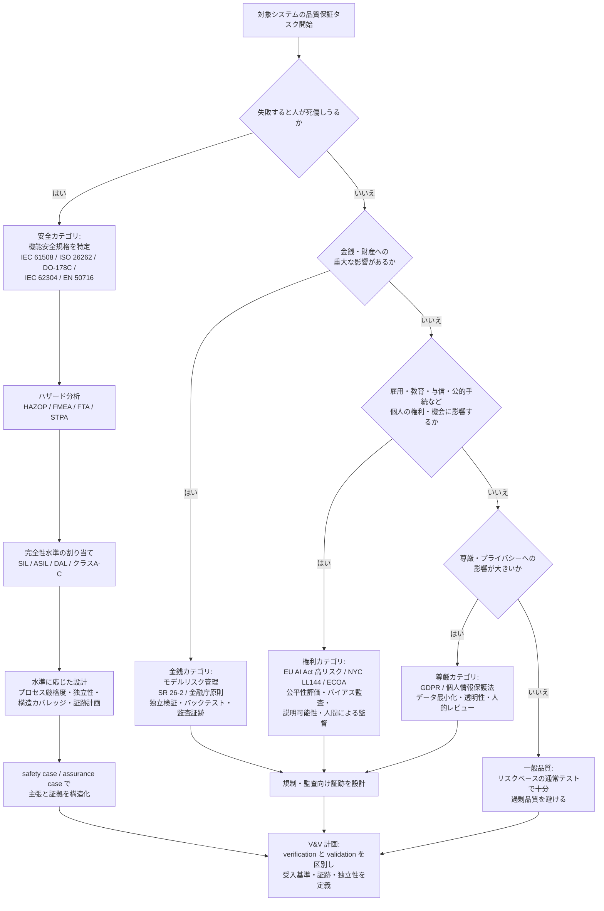

# ドメイン別品質・安全規格：安全性クリティカルシステムと規制ドメインの品質保証水準

## エグゼクティブサマリ

ソフトウェア品質保証の水準は、**ドメインによって「失敗が何を意味するか」が根本的に異なる**ため、一律に語ることができません。ToDo アプリのバグは再起動で済みますが、航空機の飛行制御ソフトウェアの欠陥は乗員乗客の死亡に、与信モデルの欠陥は生活基盤の喪失や違法な差別に直結します。本ドキュメントの結論は、**「対象システムのドメインと影響カテゴリ（安全・金銭・権利・尊厳）を最初に特定し、それに対応する完全性水準・規格・証跡要求を選択してから品質活動を設計する」**ことが、規制ドメインにおける品質保証の出発点だということです。

要点は次のとおりです。

- **safety と reliability と security は別物**です。仕様どおり高信頼に動くシステムでも、仕様自体が危険なら安全ではありません（Leveson の STAMP/STPA はこの認識に基づきます）。ソフトウェアの故障はランダム故障ではなく**系統的故障（systematic failure）**であるため、故障率ではなく**プロセスの厳格さと証跡**で保証水準を担保するのが機能安全規格の基本設計です。
- 主要ドメインは**完全性水準（integrity level）**という共通の考え方を持ちます。IEC 61508 の **SIL 1〜4**、ISO 26262 の **ASIL A〜D**、DO-178C の **DAL A〜E** はいずれも「失敗の影響が重いほど、プロセス厳格化・独立検証・構造カバレッジ（MC/DC 等）・証跡量の要求が段階的に上がる」仕組みです。
- ハザード分析は **HAZOP・FMEA/FMECA・FTA・STPA** を対象と目的で使い分けます。特に STPA は「コンポーネントが正常でも相互作用で事故が起きる」ソフトウェア集約システムに強く、比較研究では従来手法が見つけたシナリオをすべて捕捉した上で追加シナリオを発見したと報告されています。
- 規制ドメインでは **verification（正しく作ったか）と validation（正しいものを作ったか）の区別**が法的な意味を持ち、医療・製薬では **IQ/OQ/PQ** という段階的バリデーションが要求されます。
- 規制当局に対しては「テストした」ではなく、**assurance case / safety case（GSN 記法などで構造化した主張・議論・証拠の体系）と監査可能な証跡**で安全性を論証する必要があります。
- 2026 年時点の重要動向として、鉄道では **EN 50128/EN 50657 が EN 50716:2023 に統合**、金融では **FRB SR 11-7 が SR 26-2（2026 年 4 月）に置き換え**、医療 AI では **FDA の PCCP 最終ガイダンス（2024 年 12 月）**、EU では **AI Act の高リスク義務適用が Digital Omnibus により 2027 年 12 月へ延期**という変化があります。
- AI エージェントへの適用指針: **「このシステムが失敗すると誰に何が起きるか」を最初に質問し、影響カテゴリ→ドメイン規格→完全性水準→証跡計画の順で品質保証を設計する**こと。採用 AI と ToDo アプリを同じノリでテストしてはいけません。

関連ドキュメント: AI 特有の品質保証全般は [AIの品質保証と品質管理に関する調査報告書](../quality-management/ai-quality-assurance-and-management-research-report.md)、STPA を含む安全・高信頼系テスト技法は [テスト技法スキルカタログ](../test-techniques/test-techniques-skill-catalog.md)（SKILL-SAFE-01）、EU AI Act 等の規制詳細は [AIガバナンス・規制・監査](./ai-governance-regulation-audit.md)を参照してください。

## 1. safety-critical system の基本概念

### 1.1 safety・reliability・security の区別

この 3 つを混同すると品質保証の設計を誤ります。**信頼性が高い（仕様どおり安定して動く）システムでも、仕様自体が危険な状況を許すなら安全ではない**というのが安全工学の基本認識です。

| 概念 | 問い | 失敗の典型 | 主な保証手段 |
| --- | --- | --- | --- |
| safety（安全性） | システムが人・環境に許容できない危害を与えないか | 仕様どおり動いたのに事故が起きる（要求の欠落、危険な相互作用） | ハザード分析、安全要求、fail-safe 設計、safety case |
| reliability（信頼性） | 所定の条件・期間で意図した機能を果たし続けるか | 故障・停止・性能劣化 | 冗長化、故障率解析、耐久試験、フォールトトレランス |
| security（セキュリティ） | 意図的・悪意ある行為からシステムと情報を守れるか | 攻撃による改ざん・漏えい・乗っ取り | 脅威分析、アクセス制御、暗号化、侵入検知 |

3 者は独立ではなく相互作用します。セキュリティ侵害が安全機能を無効化する（例: 車載システムへの侵入）、信頼性向上のための冗長化が新たなハザードを生む、といった関係があるため、安全性クリティカルシステムでは 3 者を統合的に扱う必要があります（自動車では ISO 26262 と ISO/SAE 21434（サイバーセキュリティ）の併用が典型です）。

### 1.2 hazard（危害の潜在源）とリスク

ISO/IEC Guide 51 の整理では、**hazard は「危害（harm）の潜在的な源」**、**リスクは「危害の発生確率と危害の重大さの組み合わせ」**です。実務上重要なのは次の 2 点です。

- ハザードは「故障」と同義ではありません。すべてのコンポーネントが正常でも、環境条件・操作・相互作用の組み合わせでハザードは顕在化します（SOTIF や STPA が扱う領域）。
- リスクをゼロにはできないため、各規格は「**許容可能なリスク（acceptable / unreasonable でない risk）まで低減する**」ことを目標にし、その低減の度合いを完全性水準として段階化します。

### 1.3 fail-safe と fail-operational

故障時にシステムをどの状態へ持っていくかの設計方針は、ドメインの物理的性質で決まります。

| 方針 | 意味 | 前提 | 典型例 |
| --- | --- | --- | --- |
| fail-safe | 故障検出時に安全側の状態へ移行して停止する | 「安全な停止状態」が存在する | 鉄道の信号（故障時は赤現示）、産業機械の非常停止 |
| fail-operational | 故障後も（縮退してでも）機能を継続する | 停止自体が危険で、安全な停止状態がない | 航空機の飛行制御、高速走行中の自動運転システム |
| fail-silent | 故障時に誤った出力を出さず沈黙する | 他系統が引き継げる | 冗長構成の一系統 |
| graceful degradation（fail-soft） | 機能を段階的に縮退して継続する | 部分機能でも価値がある | 自動運転のミニマルリスク状態への移行 |

「止めれば安全」が成り立たないドメイン（航空、自動運転の高速走行時）では冗長化と fail-operational 設計が必須になり、アーキテクチャとテストの要求が大きく変わります。AI エージェントがテスト戦略を立てる際も、「このシステムに安全な停止状態はあるか」は最初に確認すべき質問の一つです。

## 2. hazard analysis の手法

代表的な 4 手法は、分析の出発点（トップダウン / ボトムアップ / 制御構造）と、捉えられる事故モデルが異なります。

| 手法 | アプローチ | 対象・得意領域 | 強み | 限界 | 主な適用フェーズ |
| --- | --- | --- | --- | --- | --- |
| HAZOP | ガイドワード（No/More/Less/Reverse 等）でパラメータの逸脱を系統的に検討 | プロセス産業（化学プラント等）の連続プロセス。IEC 61882 が指針 | 網羅的なブレインストーミングを構造化できる。運転手順の逸脱にも適用可 | 大規模系では工数大。ソフトウェアの論理欠陥には不向き | 設計中期（P&ID 等が固まった段階） |
| FMEA / FMECA | ボトムアップ。各コンポーネントの故障モードを列挙し影響を評価（FMECA は致命度分析を追加） | ハードウェア部品、製造工程（PFMEA）、設計（DFMEA）。IEC 60812 が指針 | 単一故障の影響を体系的に洗い出せる。RPN 等で優先付け可能 | 単一故障前提。複数故障の組合せや「故障なき事故」を捉えにくい | 詳細設計〜製造準備 |
| FTA | トップダウン。望ましくない事象（頂上事象）から論理ゲートで原因を分解 | 事故・システム喪失の原因構造の分析。IEC 61025 が指針 | 組合せ故障を扱える。最小カットセットや定量評価（発生確率）が可能 | 頂上事象を先に知っている必要がある。想定外の相互作用は木に現れない | 概念設計〜詳細設計、事故解析 |
| STPA | 制御構造分析。システムを制御ループとして捉え、安全でない制御行動（UCA）とその原因シナリオを特定 | ソフトウェア集約・自動化システム、人間-機械系。STAMP 理論（Leveson）に基づく | **コンポーネントが正常でも起きる事故**（相互作用・要求欠落・モード混乱）を捉える。比較研究では従来手法の発見シナリオをすべて含み追加シナリオも発見 | 定量評価には不向き。分析者のスキル依存が大きい | 概念設計の早期から適用可能（要求生成に強い） |

実務上の使い分けの目安は次のとおりです。

- **ハードウェアの故障起因**が支配的 → FMEA/FMECA + FTA の組み合わせが定番（機能安全規格の随所で要求されます）。
- **ソフトウェア・自動化・人間の関与**が支配的 → STPA を早期に適用し、安全制約を要求として抽出する（STPA から安全テストを導出する手順は [テスト技法スキルカタログ](../test-techniques/test-techniques-skill-catalog.md) の SKILL-SAFE-01 を参照）。
- **プロセスの逸脱**が支配的（化学・製薬） → HAZOP。
- 規格適合の文脈では、どの手法を使ったかだけでなく、**分析記録そのものが証跡**として監査対象になります。

## 3. 完全性水準の考え方：SIL・ASIL・DAL

### 3.1 共通の設計思想

3 つの体系はドメインも決め方も異なりますが、共通する思想は「**失敗の影響が重いほど、達成すべき目標と証明の厳しさを段階的に引き上げる**」ことです。水準が上がると典型的に次が要求されます。

| 要求の軸 | 水準が上がると何が起きるか |
| --- | --- |
| プロセス厳格化 | ライフサイクル各工程の計画・基準・記録の要求が増える。推奨技法（形式手法、静的解析等）が「推奨」から「強く推奨」へ格上げされる |
| 独立性（independence） | 検証者・評価者・監査者の開発チームからの独立度が上がる（人・部門・組織レベルの分離） |
| 構造カバレッジ | ステートメント → デシジョン（分岐） → **MC/DC** と、要求されるカバレッジ基準が強化される |
| 証跡（evidence） | 計画書・トレーサビリティ・レビュー記録・テスト結果・カバレッジ分析・構成管理記録など、監査可能な文書の種類と粒度が増える |
| ツール保証 | 開発・検証を自動化するツール自体の認定（tool qualification）が要求される |

ソフトウェアの故障は設計・要求の欠陥に起因する**系統的故障**であり、ハードウェアのようにランダム故障率で扱えません。そのため、どの体系でもソフトウェアに対しては「確率目標」ではなく「**プロセスと技法の厳格さ**」で完全性を担保します。

### 3.2 IEC 61508 の SIL（Safety Integrity Level）

IEC 61508 は電気・電子・プログラマブル電子（E/E/PE）安全関連系の機能安全の**親規格**で、SIL 1（最低）〜SIL 4（最高）の 4 水準を定義します。安全機能の動作モードにより目標指標が異なります。

| SIL | 低頻度作動要求モード：PFDavg（作動要求あたり失敗確率） | 高頻度・連続モード：PFH（1時間あたり危険側故障確率） | リスク低減の目安 |
| --- | --- | --- | --- |
| SIL 4 | 10⁻⁵ 以上 10⁻⁴ 未満 | 10⁻⁹ 以上 10⁻⁸ 未満 | 10,000〜100,000 倍 |
| SIL 3 | 10⁻⁴ 以上 10⁻³ 未満 | 10⁻⁸ 以上 10⁻⁷ 未満 | 1,000〜10,000 倍 |
| SIL 2 | 10⁻³ 以上 10⁻² 未満 | 10⁻⁷ 以上 10⁻⁶ 未満 | 100〜1,000 倍 |
| SIL 1 | 10⁻² 以上 10⁻¹ 未満 | 10⁻⁶ 以上 10⁻⁵ 未満 | 10〜100 倍 |

これらの確率目標はハードウェアのランダム故障に適用されるもので、ソフトウェア（系統的故障）に対しては SIL に応じた**技法・手法の選択表（推奨/強く推奨）とプロセス要求**で対応します。SIL 4 は単一システムで達成するのが極めて難しく、実務では冗長アーキテクチャや上位のリスク低減策と組み合わせます。

### 3.3 ISO 26262 の ASIL（Automotive Safety Integrity Level）

ISO 26262（自動車の機能安全）では、ハザード分析とリスクアセスメント（HARA）で各ハザード事象を 3 パラメータで評価し、**QM（品質管理のみ）→ ASIL A → B → C → D（最高）**を決定します。

| パラメータ | 意味 | 段階 |
| --- | --- | --- |
| Severity（S） | 危害の重大さ | S0（傷害なし）〜S3（生命に関わる・致命的） |
| Exposure（E） | その運転状況に遭遇する確率 | E0（極めて稀）〜E4（ほとんどの運転で発生） |
| Controllability（C） | 運転者等が危害を回避できる可能性 | C0（一般に制御可能）〜C3（制御困難・不可能） |

S3 + E4 + C3 の組み合わせが ASIL D になり、S0・E0・C0 を含む組み合わせは QM に落ちます。ASIL D の安全目標を単一要素で達成するのが難しい場合、**ASIL デコンポジション**（十分に独立した冗長要素へ低い ASIL を割り当てて分担する仕組み）が条件付きで認められています。ソフトウェア開発（ISO 26262-6）では、ASIL が上がるほどユニットテストの構造カバレッジ要求（ステートメント→ブランチ→MC/DC）や技法の推奨度が強化されます。

### 3.4 DO-178C の DAL（Design Assurance Level）

DO-178C（民間航空機搭載ソフトウェア）では、故障状態（failure condition）の深刻度に応じてソフトウェアレベル A〜E を割り当てます。

| DAL | 故障状態の分類 | 構造カバレッジ要求 | 独立性 |
| --- | --- | --- | --- |
| A | Catastrophic（航空機喪失・多数の死亡） | **MC/DC** + デシジョン + ステートメント | 検証の独立性要求が最も厳しい |
| B | Hazardous（重大な傷害・少数の死亡） | デシジョン + ステートメント | 主要検証に独立性要求 |
| C | Major（不快・軽傷レベルの影響） | ステートメント | 独立性要求が緩和 |
| D | Minor（軽微な影響） | 構造カバレッジ要求なし | さらに緩和 |
| E | No safety effect（安全影響なし） | 適合活動の要求なし | — |

満たすべき目標（objectives）の数と「独立性付きで満たすべき目標」の数がレベルに応じて増加します。**MC/DC（Modified Condition/Decision Coverage）**は「デシジョン内の各条件が、そのデシジョンの結果に独立に影響することを示す」カバレッジ基準で、DAL A のコード検証の中核です。DO-178C 本体に加え、ツール認定（DO-330）、モデルベース開発（DO-331）、オブジェクト指向技術（DO-332）、形式手法（DO-333）の補足文書があります（4.5 節参照）。

### 3.5 三体系の対応関係の注意

SIL・ASIL・DAL は決定方法（確率目標 / S-E-C / 故障状態分類）が異なるため、**単純な等価変換はできません**。「ASIL D ≒ SIL 3 相当」のような対応表が流通していますが、契約・認証の場面では必ず各規格の定義に立ち返る必要があります。

## 4. ドメイン別規格の概観

### 4.1 機能安全の親規格：IEC 61508

| 項目 | 内容 |
| --- | --- |
| 目的 | E/E/PE 安全関連系の全安全ライフサイクル（概念〜廃棄）にわたる機能安全の達成 |
| 対象 | 産業機械・プロセス・あらゆる E/E/PE 安全関連系（セクター規格の基礎） |
| 特徴的要求 | SIL 1〜4、安全ライフサイクル管理、ハードウェアはランダム故障の確率評価、ソフトウェアは SIL 別の技法選択表と系統的能力（systematic capability）、機能安全アセスメントの独立性 |
| 派生規格 | ISO 26262（自動車）、IEC 62304 の参照元となる考え方、EN 5012x（鉄道）、IEC 61511（プロセス）など、各セクター規格の親 |

### 4.2 自動車：ISO 26262・SOTIF（ISO 21448）・ODD

| 規格 | 目的・対象 | 特徴的要求 |
| --- | --- | --- |
| ISO 26262 | 量産車の E/E システムの**機能安全**（故障・誤動作起因のリスク） | HARA による ASIL 決定、安全目標→機能安全要求→技術安全要求の階層、ASIL 別のプロセス・カバレッジ・独立性要求、ASIL デコンポジション |
| ISO 21448（SOTIF） | **故障がなくても**生じる危険、すなわち意図した機能の**機能不足（functional insufficiency）や合理的に予見可能な誤使用**に起因するリスク（2019 年に PAS、2022 年に国際規格化） | 既知/未知 × 安全/危険のシナリオ分類、機能不足とトリガー条件の分析、未知の危険シナリオを減らすための検証・妥当性確認戦略（シナリオベーステスト、フィールド監視） |
| ISO 34503 | 自動運転システムの **ODD（Operational Design Domain: 設計上の運行範囲）**の仕様化要求 | ODD の記述形式（道路条件・環境条件・交通条件等の分類）、ODD 境界の明示 |

自動運転では「システムは ODD 内でのみ安全に動作するよう設計される」ため、**ODD の定義そのものが安全要求**になります。ODD 外検知時のミニマルリスク状態への移行（fail-operational の一形態）や、SOTIF の「未知の危険シナリオ」低減がテストの中心課題になる点が、従来の機能安全と大きく異なります。認識系（カメラ・ML モデル）は「正しく実装されても性能限界で危険を生む」ため、ISO 26262 だけでは扱えず SOTIF が補完します。

### 4.3 医療：IEC 62304・FDA（SaMD / AI 対応機器 / PCCP）・EU MDR

| 規格・規制 | 目的・対象 | 特徴的要求 |
| --- | --- | --- |
| IEC 62304 | 医療機器ソフトウェアの**ライフサイクルプロセス**要求 | ソフトウェア安全クラス **A（傷害の可能性なし）/ B（重篤でない傷害）/ C（死亡・重篤な傷害）**に応じて、開発・保守・リスク管理・構成管理・問題解決プロセスの要求深度が変わる。SOUP（出所不明ソフトウェア）の管理 |
| FDA の SaMD 規制 | **SaMD**（ハードウェア医療機器の一部でなく、単体で医療目的を果たすソフトウェア）の規制。IMDRF の定義・リスク分類を参照 | IMDRF 枠組みでは「情報の重要度（inform / drive / treat・diagnose）× 状態の深刻度（non-serious / serious / critical）」で影響度 I〜IV に分類。市販前届出（510(k)）・De Novo・PMA 等の経路と設計管理・市販後監視 |
| FDA の AI 対応機器・**PCCP** | AI/ML 対応医療機器の**継続的改良**と安全性の両立 | **PCCP（Predetermined Change Control Plan）最終ガイダンス（2024 年 12 月公表、2025 年 1 月ウェビナー）**: 市販前申請の中で「予定される変更の内容・変更を開発/検証/実装する方法・影響評価」を事前承認し、範囲内の変更は再申請なしで実施可能にする仕組み。2025 年 1 月には AI 対応機器ソフトウェア機能の**ライフサイクル管理と申請推奨のドラフトガイダンス**も公表（透明性・バイアス管理・TPLC を含む。最終化状況は 2026 年時点で未確認）。2025 年 8 月には FDA・Health Canada・英 MHRA が PCCP の共同指導原則を公表 |
| EU MDR（Regulation (EU) 2017/745） | EU の医療機器規制。ソフトウェアの分類は **Annex VIII Rule 11** | 診断・治療の判断に情報を提供するソフトウェアは原則 Class IIa 以上（死亡・不可逆的悪化につながる判断なら Class III、重大な悪化なら Class IIb）となり、ノーティファイドボディの関与が必要。ガイダンスは MDCG 2019-11（2025 年 6 月に rev.1 公表） |

医療ドメインの特徴は、**製品そのものの認証に加えて QMS（ISO 13485 等）・臨床評価・市販後監視までが規制パッケージ**になっている点、そして AI に対しては「学習による変化」を PCCP のような**変更管理の事前計画**で統制しようとしている点です（詳細な AI 事例は [AIの品質保証と品質管理に関する調査報告書](../quality-management/ai-quality-assurance-and-management-research-report.md) を参照）。

### 4.4 航空：DO-178C とその補足文書

| 文書 | 役割 |
| --- | --- |
| DO-178C | 民間航空機搭載ソフトウェアの認証のためのソフトウェアライフサイクル・検証目標（DAL A〜E、3.4 節参照） |
| DO-330 | **ツール認定（tool qualification）**。ツールの使用により DO-178C のプロセスが「排除・削減・自動化」され、かつそのツール出力が別途検証されない場合に、ツール自体の認定を要求。ドメイン非依存に書かれており他分野でも参照される |
| DO-331 | モデルベース開発・検証の補足（追加の目標と指針） |
| DO-332 | オブジェクト指向技術と関連技法の補足 |
| DO-333 | 形式手法の補足（形式検証をテストの代替・補完として用いる場合の指針） |

航空は「**証跡の完全性**」において最も厳格なドメインです。要求からコード・テストケースまでの双方向トレーサビリティ、独立性付き検証、構造カバレッジ分析、逸脱の正当化がすべて監査対象であり、認証機関（FAA/EASA）との合意形成（PSAC: 認証計画）から始まる点が特徴です。

### 4.5 鉄道：EN 50128 から EN 50716 へ

| 項目 | 内容 |
| --- | --- |
| 旧体系 | EN 50128:2011（信号・制御・防護システムのソフトウェア）、EN 50657:2017（車上・車両のソフトウェア） |
| 現行 | **EN 50716:2023「Railway applications – software development」が両者を統合・置換**（CENELEC が 2023 年末に採択、2024 年から適用）。旧規格の中核要求は概ね維持され、旧規格下で開発されたソフトウェアの適合も経過措置として認められる |
| 特徴的要求 | ソフトウェアへの SIL 割り当て（SIL 0〜4）、SIL 別の技法選択表（Annex）、役割の独立性（要求者・実装者・検証者・妥当性確認者・アセッサーの分離）、ライフサイクル管理・ツール分類と証跡 |
| 周辺規格 | EN 50126（RAMS プロセス）、EN 50129（安全関連電子システムの安全性立証 = safety case）と 3 点セットで運用 |

鉄道は fail-safe 設計（故障時は安全側 = 停止・赤信号）が成立しやすいドメインであり、safety case（EN 50129）による安全性立証の伝統が強い点が特徴です。

### 4.6 金融：モデルリスク管理と公平性

金融は「人命」ではなく**金銭・権利への影響**が支配的なドメインで、規制の枠組みも機能安全とは別系統（プルーデンス規制・消費者保護）です。

| 規制・指針 | 目的・対象 | 特徴的要求 |
| --- | --- | --- |
| FRB SR 11-7（2011） | 米銀のモデルリスク管理の監督ガイダンス（FRB・OCC 共同） | モデルの開発・実装・使用、**独立したモデル検証（effective challenge）**、ガバナンス・方針・統制の 3 本柱。モデル台帳・文書化・定期再検証 |
| **FRB SR 26-2（2026 年 4 月 17 日）** | SR 11-7 と SR 21-8 を**置き換える改訂ガイダンス**（FRB・OCC・FDIC） | **重要度（materiality）ベース**の統制強度調整、モデル定義の絞り込み（単純計算・決定論的ルールを除外）、検証頻度をリスク・変更速度に応じて柔軟化。**生成 AI・エージェント型 AI は「新しく急速に進化中」として本ガイダンスの適用範囲から明示的に除外**。主に総資産 300 億ドル超の銀行組織向け |
| ECOA / Regulation B と CFPB Circular 2022-03 | 与信判断の公平性・説明義務（米） | 信用拒否等の不利益処分には**具体的な主要理由の通知（adverse action notice）**が必要。CFPB は「**モデルがブラックボックスで説明できないことは免責にならない**」と明言。代替データ利用への監視も強化 |
| 金融庁「モデル・リスク管理に関する原則」（2021 年 11 月） | 日本の大手金融機関（G-SIBs・D-SIBs 等）向けの 8 原則 | ガバナンス、モデルの定義と台帳、開発・検証・承認プロセス、独立検証（第 2 線）、内部監査（第 3 線）。2024 年 12 月に高度化プログレスレポートを公表 |
| 金融庁「AI ディスカッションペーパー」 | 金融分野の AI 利活用の論点整理 | **第 1.0 版（2025 年 3 月）**で健全な利活用促進の初期論点を整理、**第 1.1 版（2026 年 3 月）**では AI エージェント（「特定の目標を達成するために自律的に行動する AI システム」）に関する節を新設 |

金融ドメインのテストで特徴的なのは、精度検証に加えて**バックテスト・ベンチマーク比較・感応度分析・アウトカム分析**というモデル検証の語彙が確立していること、そして与信・スコアリングでは**属性別の公平性評価と不利益理由の説明可能性**が法的要求に直結することです。

### 4.7 採用・教育など人への影響が大きい AI

| 規制 | 対象 | 特徴的要求 |
| --- | --- | --- |
| EU AI Act の高リスク分類（Annex III） | 雇用（採用・選考・昇進・解雇の判断）、教育・職業訓練（入学・成績評価）、自然人の信用評価・スコアリング、必須サービスへのアクセス、法執行等 | 高リスク AI には、リスク管理システム、データガバナンス、技術文書、ログ記録、透明性、**人間による監督**、精度・頑健性・サイバーセキュリティ、QMS、適合性評価を要求。**Digital Omnibus（2026 年 5 月 7 日暫定合意、6 月に欧州議会・理事会承認）により、Annex III 単体高リスクシステムの義務適用は 2026 年 8 月から 2027 年 12 月 2 日へ、Annex I 組込み型は 2028 年 8 月 2 日へ延期**（官報掲載を経て発効） |
| NYC Local Law 144 | ニューヨーク市の**自動化雇用決定ツール（AEDT）** | 使用前 1 年以内の**独立第三者によるバイアス監査**（性別・人種/民族・交差属性ごとの選抜率・スコアの格差分析）、監査結果サマリの公表、候補者への事前通知。違反には 1 日あたり 500〜1,500 ドルの民事制裁 |

このカテゴリの「失敗」は人身事故ではなく、**機会の不当な剥奪・差別・尊厳の侵害**です。したがってテストの中心は、属性別スライス評価・disparate impact 分析・説明可能性・人間による監督経路の検証になります。規制の詳細は [AIガバナンス・規制・監査](./ai-governance-regulation-audit.md)を参照してください。

## 5. validation と verification：規制文脈での厳密な区別

### 5.1 定義

| 用語 | 問い | 内容 | 典型的な活動 |
| --- | --- | --- | --- |
| verification（検証） | **正しく作ったか**（Are we building the product right?） | 各開発工程の成果物が、前工程で定めた仕様・要求に適合しているかの確認 | レビュー、静的解析、単体・統合テスト、トレーサビリティ確認、カバレッジ分析 |
| validation（妥当性確認） | **正しいものを作ったか**（Are we building the right product?） | 完成したシステムが、実際の使用条件・使用者・使用目的（intended use）でユーザーニーズを満たすかの確認 | 実環境・実ユーザー相当でのシステムテスト、臨床評価、ユーザビリティ評価、フィールド試験 |

日常の開発では曖昧に使われがちですが、規制ドメインでは両者が**別個の規制要求**です。例えば医療機器の設計管理では design verification と design validation が別の要求項目であり、仕様どおり動くこと（verification 合格）を示しても、意図した使用環境で安全・有効であること（validation）を示したことにはなりません。AI ではこの区別がさらに重要です。モデルがテストセットで高精度（verification 的合格）でも、実運用の入力分布・ユーザー・運用手順で意図どおり機能するか（validation）は別問題だからです。

### 5.2 IQ/OQ/PQ（医療・製薬系のバリデーション）

医療機器製造や製薬では、設備・工程・コンピュータ化システムのバリデーションを段階化した **IQ/OQ/PQ** が確立しています。

| 段階 | 名称 | 確認内容 |
| --- | --- | --- |
| IQ | Installation Qualification（据付時適格性評価） | 設備・システムが仕様どおり正しく設置・構成・接続されているか（設置環境、ユーティリティ、文書・ソフトウェアの存在確認） |
| OQ | Operational Qualification（運転時適格性評価） | 定められた運転範囲・パラメータ全域で正しく動作するか（管理限界、想定される故障モード、ワーストケース条件の試験） |
| PQ | Performance Qualification（性能適格性評価） | 実際の生産条件・実負荷で、所定の品質仕様を満たす製品を**一貫して**作り続けられるか |

ソフトウェアが製造・品質プロセスに組み込まれる場合（LIMS、製造実行システム等）は、この枠組みに沿った**コンピュータ化システムバリデーション（CSV。製薬業界では GAMP 5 が代表的指針）**が要求されます。「テストが通った」ではなく「**意図した用途に対する適格性が文書化された証拠で示された**」状態がゴールである点が、一般のソフトウェアテストとの本質的な違いです。

## 6. regulatory acceptance の考え方：assurance case と証跡

### 6.1 規制当局が受け入れるのは「議論＋証拠」

規制ドメインでは、開発者が「安全です」と主張するだけでは足りず、**規制当局・認証機関・アセッサーが監査可能な形で、主張（claim）→議論（argument）→証拠（evidence）の連鎖**を提示する必要があります。これを体系化した文書が **assurance case**（安全性に限定する場合は **safety case**）です。鉄道（EN 50129）や英国の防衛・原子力では safety case の提出が明示的な要求であり、自動運転（例: UL 4600）でも中心概念になっています。

### 6.2 GSN（Goal Structuring Notation）の概要

GSN は safety case の議論構造を図式化する記法で、1990 年代にヨーク大学で開発され、2011 年にコミュニティ標準として標準化されました（現在は SCSC の Assurance Case Working Group が GSN Community Standard を維持）。主要素は次のとおりです。

| 要素 | 図形 | 意味 |
| --- | --- | --- |
| Goal | 長方形 | 主張（例:「システム X はハザード H を許容可能なレベルまで低減している」） |
| Strategy | 平行四辺形 | ゴールをサブゴールに分解する議論の方針（例:「特定した全ハザードごとに議論する」） |
| Solution | 円 | 主張を支える証拠への参照（テスト結果、解析報告、レビュー記録） |
| Context | 角丸長方形 | 主張の前提となる文脈（ODD、運用条件、定義） |
| Assumption / Justification | 楕円（A/J 標記） | 仮定・正当化の明示 |

トップゴール（「システムは意図した運用文脈で許容可能に安全である」）を、戦略を介してサブゴールに分解し、最終的にすべての末端ゴールが Solution（証拠）で支えられる構造を作ります。**証拠のないゴール、文脈のない主張が視覚的に露呈する**ことが GSN の実務価値です。

### 6.3 監査で必要な証跡の種類

ドメインを問わず、規制監査・認証審査で要求される証跡はおおむね次のカテゴリに整理できます。

| 証跡カテゴリ | 例 | 主張できること |
| --- | --- | --- |
| 計画 | 開発計画、検証計画、認証計画（PSAC 等）、構成管理計画 | プロセスが事前に定義され合意されていた |
| 要求と設計 | 要求仕様、安全要求、アーキテクチャ文書、ハザード分析記録 | 何を作るべきかが特定され、リスクが分析された |
| トレーサビリティ | 要求⇔設計⇔コード⇔テストの双方向対応表 | 抜け（未実装要求）と過剰（要求なきコード）がない |
| 検証記録 | レビュー記録、静的解析結果、テスト手順と結果、**カバレッジ分析**、逸脱と正当化 | 定義した基準で検証が実施された |
| 独立性の記録 | 検証者・アセッサーの役割分担、独立評価報告 | 自己申告ではなく独立の視点で確認された |
| 構成管理・変更管理 | バージョン管理記録、変更依頼・影響分析・再検証記録、問題報告（PR）管理 | 審査対象物が特定でき、変更が統制されている |
| ツール・環境 | ツール認定記録（DO-330 等）、テスト環境の適格性 | 自動化が結果の信頼性を損なっていない |
| 運用・市販後 | 市販後監視計画、インシデント報告、定期安全性報告 | 出荷後も安全性が維持・監視されている |

AI エージェントにとっての含意は明確です。規制ドメインの成果物は「動くコード＋テスト」ではなく、**このマトリクスを埋める文書群**であり、テスト実行そのものより「何を根拠に十分と言えるかの議論」と「後から監査可能な記録」の設計が先に来ます。

## 7. 影響カテゴリ別の品質保証水準マッピング

「失敗が誰に何をもたらすか」を 4 カテゴリで整理すると、要求される品質保証水準を体系的に選択できます。複数カテゴリに該当する場合は最も厳しい水準に合わせます。

| 影響カテゴリ | 失敗の意味 | 典型ドメイン | 支配的な枠組み | 品質保証の重心 |
| --- | --- | --- | --- | --- |
| 安全（生命・身体） | 死亡・傷害・健康被害 | 航空、自動車、医療、鉄道、産業機械 | IEC 61508 系の機能安全規格 + 当局認証 | ハザード分析、完全性水準、fail-safe/fail-operational、構造カバレッジ、safety case |
| 金銭・財産 | 経済的損失、市場・決済の混乱、誤った与信判断 | 銀行・証券・保険、決済、会計 | SR 26-2 / 金融庁モデル・リスク管理原則、内部統制（J-SOX 等） | 独立モデル検証、バックテスト、リコンサイル、監査証跡、障害時の復旧目標 |
| 権利（機会・法的地位） | 雇用・教育・与信・公的給付の機会の不当な剥奪、差別 | 採用 AI、入試・成績評価、与信スコアリング、公的手続 | EU AI Act 高リスク、NYC LL144、ECOA/Reg B、個人情報保護法制 | 属性別公平性評価、バイアス監査、説明可能性（不利益理由の通知）、人間による監督、異議申立て経路 |
| 尊厳・心理・プライバシー | プロファイリングによる侵害、屈辱的な誤判定、機微情報の露出 | 生体認証、コンテンツモデレーション、メンタルヘルス系アプリ | GDPR/個人情報保護法、EU AI Act（禁止・透明性義務） | データ最小化、同意・透明性、誤判定の人的レビュー、レッドチーミング |

このマッピングの含意は、**「品質保証水準はシステムの技術構成ではなく、失敗の影響で決まる」**ということです。同じ「ML モデルを含む Web アプリ」でも、レコメンドなら通常品質、与信なら金銭＋権利、診断支援なら安全カテゴリの水準が適用されます。

## 8. ドメイン比較マトリクス

「採用 AI と ToDo アプリを同じノリでテストしない」ための一覧表です。

| ドメイン | 失敗の意味 | 支配的規格・規制 | 要求される証跡 | テストで特に重視される点 |
| --- | --- | --- | --- | --- |
| 航空（搭載ソフト） | 墜落・多数の死亡 | DO-178C + DO-330/331/332/333、FAA/EASA 認証 | 認証計画、全工程トレーサビリティ、独立検証記録、MC/DC カバレッジ分析、ツール認定 | 要求ベーステスト＋構造カバレッジの完全性、ロバストネス（異常入力・境界）、独立性 |
| 自動車 | 事故・乗員/歩行者の死傷 | ISO 26262、ISO 21448（SOTIF）、ISO 34503（ODD）、UN 規則 | HARA 記録、安全ケース、ASIL 別検証記録、SOTIF 分析、ODD 定義 | ASIL 別カバレッジ、シナリオベーステスト、ODD 境界・縮退動作、HIL/SIL 試験 |
| 医療 | 患者の死亡・重篤な傷害、誤診断 | IEC 62304、ISO 14971（リスクマネジメント）、FDA 規制（SaMD/PCCP）、EU MDR | 設計管理文書、リスクマネジメントファイル、V&V 記録、臨床評価、市販後監視、（AI）PCCP | 安全クラス別 V&V、意図した使用に対する validation、ユーザビリティ、（AI）性能の継続監視とバイアス |
| 鉄道 | 衝突・脱線・死傷 | EN 50716（旧 EN 50128/50657）、EN 50126/50129 | safety case（EN 50129）、SIL 別技法選択の根拠、役割独立性の記録、アセスメント報告 | SIL 別技法・カバレッジ、fail-safe 動作（安全側遷移）の検証、独立アセスメント |
| 金融（モデル・与信） | 経済損失、違法な差別、説明不能な拒否 | SR 26-2（旧 SR 11-7）、ECOA/Reg B・CFPB、金融庁モデル・リスク管理原則、AI DP | モデル台帳、開発文書、独立検証報告、バックテスト記録、不利益理由通知、バイアス分析 | 独立検証（effective challenge）、アウトカム分析・感応度分析、属性別公平性、説明可能性 |
| 採用・教育 AI | 機会の不当な剥奪、差別、尊厳侵害 | EU AI Act 高リスク（Annex III）、NYC LL144、雇用差別法制 | 技術文書、リスク管理記録、独立バイアス監査報告（公表）、候補者への通知、人間監督の設計 | 属性別・交差属性の disparate impact、説明可能性、人間による監督経路、ドリフト監視 |
| 一般 Web アプリ（ToDo 等） | 不便・軽微なデータ損失 | 契約・一般消費者保護のみ（特別規制なし） | 通常の開発記録で十分 | 機能・回帰・使い勝手。リスクベースで軽量に |

## 9. AI エージェントへの適用指針

### 9.1 最初に確認すべきこと

AI エージェントがテスト・品質保証タスクを受けたら、コードを読む前に次を確認します。

1. **失敗の影響**: 「このシステムが誤動作・誤判定すると、誰に何が起きますか（死傷 / 金銭損失 / 機会剥奪 / 尊厳・プライバシー侵害 / 不便のみ）」
2. **ドメインと規制**: 「対象は医療・自動車・航空・鉄道・金融・雇用/教育のいずれかに関係しますか。適用される規格・規制・社内規程はありますか」
3. **完全性水準**: 「SIL/ASIL/DAL/ソフトウェア安全クラス等の割り当てはありますか。なければ誰がどう決めますか」
4. **安全状態**: 「安全な停止状態はありますか（fail-safe が成立するか、fail-operational が必要か）」
5. **証跡要求**: 「監査・認証・当局提出を想定した文書化要求はありますか。トレーサビリティと独立検証は必要ですか」

この確認を飛ばして「ユニットテストを書いてカバレッジ 80%」といった一般 Web アプリの流儀を適用することが、規制ドメインでは最も危険な失敗モードです。逆に、ToDo アプリに MC/DC や safety case を要求するのは過剰品質です。

### 9.2 ドメイン判定→品質保証水準の選択フロー

### 9.3 水準選択後のテスト設計への反映

| 選択された水準・カテゴリ | テスト設計への反映例 |
| --- | --- |
| 安全・高水準（DAL A/B、ASIL C/D、SIL 3/4、クラス C） | 要求ベーステスト＋MC/DC 等の構造カバレッジ、異常系・ロバストネステスト、独立した検証チーム、全成果物のトレーサビリティ、ツール認定の確認、STPA 由来の安全制約テスト（SKILL-SAFE-01） |
| 安全・中低水準（DAL C/D、ASIL A/B、SIL 1/2、クラス B） | デシジョン/ブランチカバレッジ、境界値・異常系の重点化、リスク上位機能への集中 |
| 金銭（モデルリスク） | 独立検証、バックテスト・ベンチマーク比較・感応度分析、本番相当データでのアウトカム分析、変更時の再検証トリガー定義 |
| 権利（公平性） | 属性別・交差属性のスライス評価、disparate impact 指標、説明可能性の検証（不利益理由が具体的に出せるか）、人間監督・異議申立て経路の E2E テスト、独立バイアス監査への備え |
| 一般品質 | リスクベースの機能・回帰テスト。上位水準の儀式（safety case 等）は持ち込まない |

いずれの場合も、最終成果物には「どの水準を、どの根拠で選んだか」を記録してください。水準選択の記録自体が、後の監査・レビューにおける最初の証跡になります。

## 主要参考文献

### 機能安全・完全性水準

- IEC 61508 / SIL の概要（Wikipedia: Safety integrity level）: https://en.wikipedia.org/wiki/Safety_integrity_level
- TÜV SÜD, IEC 61508 Functional Safety Standard: https://www.tuvsud.com/en-us/services/functional-safety/iec-61508
- ISO 26262 / ASIL の解説（Synopsys Glossary）: https://www.synopsys.com/glossary/what-is-asil.html
- Automotive Safety Integrity Level（Wikipedia）: https://en.wikipedia.org/wiki/Automotive_Safety_Integrity_Level
- DO-178C testing / DAL 別カバレッジ要求（Rapita Systems）: https://www.rapitasystems.com/do178c-testing
- DO-330 Software Tool Qualification（LDRA）: https://ldra.com/do-330/
- DO-330/DO-331/DO-332/DO-333 の位置づけ（TASKING）: https://www.tasking.com/do-330/

### ハザード分析

- Leveson & Thomas, STPA Handbook (2018): https://www.flighttestsafety.org/images/STPA_Handbook.pdf
- Comparison of the FMEA and STPA safety analysis methods – a case study (Software Quality Journal): https://link.springer.com/article/10.1007/s11219-017-9396-0
- Comparison of the HAZOP, FMEA, FRAM and STPA Methods for the Hazard Analysis of Automatic Emergency Brake Systems: https://www.researchgate.net/publication/353563986_Comparison_of_the_HAZOP_FMEA_FRAM_and_STPA_Methods_for_the_Hazard_Analysis_of_Automatic_Emergency_Brake_Systems

### 自動車（SOTIF・ODD）

- ISO/PAS 21448:2019 Road vehicles — Safety of the intended functionality（iso.org。2022 年に国際規格 ISO 21448 として発行）: https://www.iso.org/standard/70939.html
- SOTIF と ODD の関係（Automotive IQ）: https://www.automotive-iq.com/functional-safety/articles/navigating-sotif-iso-21448-and-ensuring-safety-in-autonomous-driving

### 医療

- IEC 62304 の安全クラス解説（Johner Institute）: https://blog.johner-institute.com/iec-62304-medical-software/safety-class-iec-62304/
- FDA, Software as a Medical Device (SaMD): https://www.fda.gov/medical-devices/digital-health-center-excellence/software-medical-device-samd
- IMDRF, SaMD: Possible Framework for Risk Categorization: https://www.imdrf.org/documents/software-medical-device-possible-framework-risk-categorization-and-corresponding-considerations
- FDA, Marketing Submission Recommendations for a Predetermined Change Control Plan (PCCP) for AI-Enabled Device Software Functions（最終ガイダンス）: https://www.fda.gov/regulatory-information/search-fda-guidance-documents/marketing-submission-recommendations-predetermined-change-control-plan-artificial-intelligence
- FDA, AI-Enabled Device Software Functions: Lifecycle Management and Marketing Submission Recommendations（ドラフトガイダンス、2025 年 1 月）: https://www.fda.gov/regulatory-information/search-fda-guidance-documents/artificial-intelligence-enabled-device-software-functions-lifecycle-management-and-marketing
- FDA/Health Canada/MHRA, PCCP Guiding Principles（2025 年 8 月）: https://www.fda.gov/medical-devices/software-medical-device-samd/predetermined-change-control-plans-machine-learning-enabled-medical-devices-guiding-principles
- MDCG 2019-11 rev.1（EU MDR ソフトウェアの資格判定・分類、2025 年 6 月更新）: https://health.ec.europa.eu/latest-updates/update-mdcg-2019-11-rev1-qualification-and-classification-software-regulation-eu-2017745-and-2025-06-17_en

### 鉄道

- From EN 50128 to EN 50716（QA Systems）: https://www.qa-systems.com/blog/from-en-50128-to-en-50716-railway-software-compliance/
- EN 50716 Railway Applications の概要（Verifysoft）: https://www.verifysoft.com/en_EN_50716_Railway_Applications.html

### 金融

- FRB SR 11-7, Supervisory Guidance on Model Risk Management: https://www.federalreserve.gov/frrs/guidance/supervisory-guidance-on-model-risk-management.htm
- FRB SR 26-2, Revised Guidance on Model Risk Management（2026 年 4 月 17 日）: https://www.federalreserve.gov/supervisionreg/srletters/SR2602.htm
- CFPB Circular 2022-03（ブラックボックスモデルと不利益理由通知）: https://files.consumerfinance.gov/f/documents/cfpb_2022-03_circular_2022-05.pdf
- CFPB, Black-Box Credit Models に関するプレスリリース: https://www.consumerfinance.gov/about-us/newsroom/cfpb-acts-to-protect-the-public-from-black-box-credit-models-using-complex-algorithms/
- 金融庁「モデル・リスク管理に関する原則」（2021 年 11 月）: https://www.fsa.go.jp/common/law/ginkou/pdf_02.pdf
- 金融庁「金融機関のモデル・リスク管理の高度化に向けたプログレスレポート(2024)」: https://www.fsa.go.jp/news/r6/ginkou/20241212/20241212.html
- 金融庁「AI ディスカッションペーパー（第 1.0 版）」概要（2025 年 3 月）: https://www.fsa.go.jp/news/r6/sonota/20250304/aidp_summary.pdf
- 金融庁「AI ディスカッションペーパー（第 1.1 版）」（2026 年 3 月）: https://www.fsa.go.jp/news/r7/sonota/20260303/aidp.html

### AI 規制（雇用・教育等）

- EU AI Act, Annex III: High-Risk AI Systems: https://artificialintelligenceact.eu/annex/3/
- Council of the EU, AI 簡素化パッケージに関するプレスリリース（2026 年 5 月 7 日暫定合意）: https://www.consilium.europa.eu/en/press/press-releases/2026/05/07/artificial-intelligence-council-and-parliament-agree-to-simplify-and-streamline-rules/
- Gibson Dunn, EU AI Act Omnibus Agreement — Postponed High-Risk Deadlines: https://www.gibsondunn.com/eu-ai-act-omnibus-agreement-postponed-high-risk-deadlines-and-other-key-changes/
- NYC DCWP, Automated Employment Decision Tools (AEDT): https://www.nyc.gov/site/dca/about/automated-employment-decision-tools.page
- NYC Rules, Automated Employment Decision Tools（最終規則）: https://rules.cityofnewyork.us/rule/automated-employment-decision-tools-2/

### バリデーション・assurance case

- IQ/OQ/PQ の解説（Greenlight Guru）: https://www.greenlight.guru/blog/iq-oq-pq-process-validation
- IQ/OQ/PQ の解説（The FDA Group）: https://www.thefdagroup.com/blog/a-basic-guide-to-iq-oq-pq-in-fda-regulated-industries
- Goal Structuring Notation（Wikipedia）: https://en.wikipedia.org/wiki/Goal_structuring_notation
- Assurance Case Guide — Argument Structure（Argevide）: https://www.argevide.com/documents/assurance-case-guide.pdf
