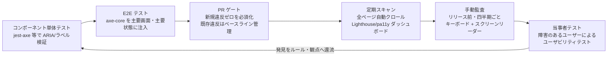
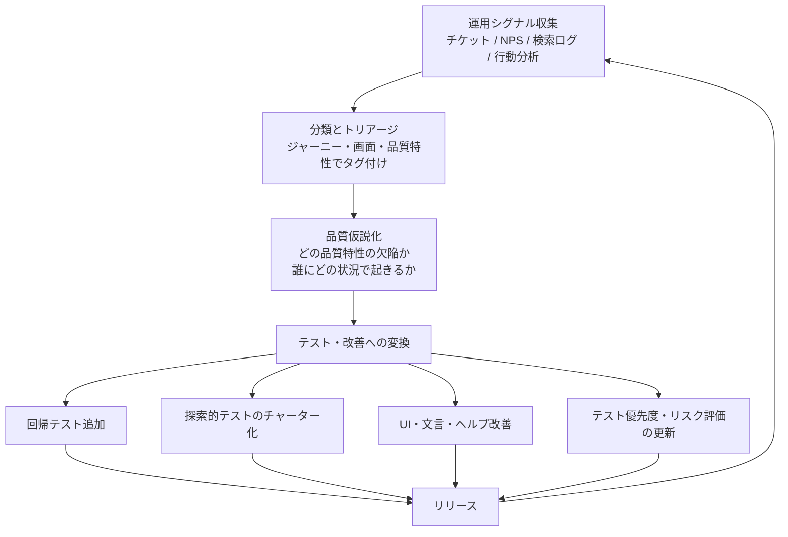

# アクセシビリティ・UX・人間中心品質

## エグゼクティブサマリ

ソフトウェア品質を「仕様通り動くこと」に矮小化すると、**実際のユーザーが目的を達成できるか**という最も重要な問いが抜け落ちます。本ドキュメントは、アクセシビリティ・ユーザビリティ・インクルーシブデザイン・運用データ活用・AI UI の信頼較正までを、テスト・品質活動に組み込める形で体系化します。

- **アクセシビリティは法的要求になった。** 日本では障害者差別解消法の改正により 2024 年 4 月から民間事業者にも合理的配慮の提供が義務化され、EU では European Accessibility Act が 2025 年 6 月 28 日から適用開始、米国では ADA Title II 規則が州・地方政府に WCAG 2.1 AA を義務付けました。「アクセシビリティ対応は任意の品質向上」という前提は、主要市場ではすでに成立しません。
- **WCAG 2.2 が現行の事実上の世界標準である。** WCAG 2.2 は 2023 年 10 月に W3C 勧告となり、2025 年 10 月には ISO/IEC 40500:2025 として国際規格化されました。日本の JIS X 8341-3 も WCAG 2.2 相当への改正作業が進行中です（2026 年時点、改正時期は未確定）。達成基準が**技術非依存・テスト可能**な文として書かれていることは、QA がそのまま検証条件に変換できることを意味します。
- **自動チェックだけでは不十分だが、無視できる量でもない。** 自動検出できる問題は全体の一部にとどまるというのが伝統的な通説（達成基準ベースで 2〜3 割程度とされる）ですが、Deque の自社調査は「イシュー件数ベースでは 57% を自動検出できた」と報告しています。いずれにせよ、キーボード操作・スクリーンリーダー・ズーム等の**手動テストと自動チェックの組み合わせ**が実務の前提です。
- **ユーザビリティは測定可能である。** タスク成功率・完了時間・エラー率・SUS などの標準指標と、形成的/総括的評価の使い分けにより、UX 品質は主観論ではなく品質データとして扱えます。「5 人テストすれば十分」説には**明確な適用条件と限界**があります。
- **運用データは品質のセンサーである。** サポートチケット、解約、NPS/CSAT、検索ログ、レイジクリックは、リリース後のユーザー困難を示すシグナルであり、テスト優先度と探索的テストのチャーターへ還流させるべき情報源です。
- **AI/LLM UI では「どの程度信頼してよいか分かること」自体が品質である。** appropriate reliance（適切な依拠）と trust calibration（信頼の較正）は、過信と不信の両方を品質欠陥として扱う枠組みを与えます。EU AI Act は AI との対話や AI 生成コンテンツの明示を法的義務にしつつあります（第 50 条、2026 年 8 月 2 日適用）。

---

## 1. WCAG 2.2: 原則・適合レベル・新規達成基準

### 1.1 POUR 4 原則

WCAG（Web Content Accessibility Guidelines）は、4 つの原則（POUR）の下に 13 のガイドラインと達成基準（Success Criteria）を階層化した構造を持ちます。

| 原則 | 意味 | 代表的な達成基準の例 |
| --- | --- | --- |
| **Perceivable（知覚可能）** | 情報と UI コンポーネントは、ユーザーが知覚できる方法で提示できなければならない | 非テキストコンテンツの代替テキスト、キャプション、コントラスト、テキスト拡大 |
| **Operable（操作可能）** | UI コンポーネントとナビゲーションは操作可能でなければならない | キーボード操作、十分な時間、発作の防止、フォーカス管理、ターゲットサイズ |
| **Understandable（理解可能）** | 情報と UI の操作は理解可能でなければならない | 読みやすさ、予測可能な挙動、入力支援、エラーの特定と修正提案 |
| **Robust（堅牢）** | コンテンツは、支援技術を含む多様なユーザーエージェントが確実に解釈できるほど堅牢でなければならない | 名前・役割・値（name, role, value）の機械可読性 |

POUR は「障害種別ごとの対応リスト」ではなく、**ユーザーとコンテンツの間で成立すべき条件**を原則化したものです。このため、視覚・聴覚・運動・認知など複数の障害特性を横断して適用できます。

### 1.2 適合レベル A / AA / AAA

| レベル | 位置づけ | 実務上の扱い |
| --- | --- | --- |
| **A** | 最低限。満たさないと一部のユーザーがコンテンツにアクセスできない | すべての公開コンテンツで必須と考えるべき水準 |
| **AA** | 標準的な到達目標。より広いユーザーニーズに対応 | 各国の法規制・公共調達が参照する事実上の要求水準（EAA、ADA Title II 規則、総務省ガイドライン等） |
| **AAA** | 最高水準。特定コンテンツでは満たせない場合がある | 全面適用は推奨されておらず、可能な範囲で選択的に採用 |

適合（conformance）はページ単位で判定され、あるレベルに適合するには、そのレベルと下位レベルのすべての達成基準を満たす必要があります。

### 1.3 WCAG 2.2 で追加された達成基準（9 件）

WCAG 2.2 は 2023 年 10 月 5 日に W3C 勧告として公開され（現行版は 2024 年 12 月 12 日改訂版）、WCAG 2.1 に対して以下の 9 つの達成基準を追加しました（W3C 公式仕様で確認済み）。

| 達成基準 | 英語名 | レベル | 概要 |
| --- | --- | --- | --- |
| 2.4.11 | Focus Not Obscured (Minimum) | AA | フォーカスを受け取った UI 部品が、固定ヘッダー等の作成者由来のコンテンツで完全に隠されない |
| 2.4.12 | Focus Not Obscured (Enhanced) | AAA | フォーカスを受け取った UI 部品がまったく隠されない（部分的な被覆も不可） |
| 2.4.13 | Focus Appearance | AAA | フォーカスインジケーターの面積・コントラストが十分である |
| 2.5.7 | Dragging Movements | AA | ドラッグ操作に依存する機能は、ドラッグ以外の単一ポインタ操作でも実行できる |
| 2.5.8 | Target Size (Minimum) | AA | ポインタ操作のターゲットが最小サイズ（24×24 CSS ピクセル相当）を満たすか、例外条件に該当する |
| 3.2.6 | Consistent Help | A | ヘルプ手段（連絡先、チャット等）がページ間で一貫した位置に提供される |
| 3.3.7 | Redundant Entry | A | 同一プロセス内で一度入力した情報の再入力を求めない（自動入力・選択可能にする） |
| 3.3.8 | Accessible Authentication (Minimum) | AA | 認証で認知機能テスト（パスワードの記憶・転記等）だけに依存しない。代替手段や支援（パスワードマネージャー、コピー&ペースト許可等）を提供 |
| 3.3.9 | Accessible Authentication (Enhanced) | AAA | 認証の認知機能テストについて、例外を狭めた強化版 |

また、WCAG 2.0/2.1 にあった **4.1.1 Parsing（構文解析）は WCAG 2.2 で削除（obsolete 扱い）** されました。現代のブラウザ・支援技術では HTML パースエラーの影響が他の達成基準でカバーされるためです。

新規 9 基準の傾向として、**認知障害・運動機能障害・高齢ユーザーへの配慮**（再入力の削減、認証の負荷軽減、ドラッグ代替、ターゲットサイズ）が強化されており、「重度の障害への特別対応」ではなく「誰にとっても使いやすい UI の底上げ」に近づいています。

### 1.4 達成基準が「技術非依存・テスト可能」であることの意味

WCAG の達成基準は、意図的に次の 2 つの性質を持つよう書かれています。

1. **技術非依存（technology-neutral）**: 達成基準は HTML 固有の記述を含まず、Web・PDF・ネイティブモバイル等に適用可能な抽象度で書かれています。具体的な実装方法は、規範的でない Techniques / Understanding 文書に分離されています。
2. **テスト可能（testable）**: 各達成基準は「満たしている / 満たしていない」を判定できる記述文になっています。主観的な「使いやすい」ではなく、検証可能な条件として定義されています。

QA・テスト設計の観点では、これは次を意味します。

- 達成基準を**そのまま合否判定条件（テストオラクル）として使える**。「1.4.3: テキストのコントラスト比が 4.5:1 以上か」は測定可能な検証項目になる。
- 実装技術が変わっても（React でも Flutter でも）検証条件は変わらないため、**チェックリスト・テスト観点が技術更新に対して安定**する。
- 一方で「テスト可能」は「自動テスト可能」を意味しない。多くの基準は人間の判断（代替テキストの妥当性、読み上げ順序の意味的正しさ等）を要する（第 3 章参照）。

### 1.5 WCAG 3.0 の動向

WCAG 3.0 は W3C Working Draft の段階です（2026 年 3 月 3 日付ドラフトを確認。仕様自体に「完成まで数年を要する」と明記）。主な方向性は次の通りです。

| 項目 | WCAG 2.x | WCAG 3.0（ドラフト時点） |
| --- | --- | --- |
| 構造 | 原則 → ガイドライン → 達成基準 | ガイドライン（アウトカム文）→ 要件（requirements）→ 技術別メソッド |
| 適合 | ページ単位、A/AA/AAA | A/AA/AAA に代わる複数レベルの新しい適合モデルを検討中 |
| 対象範囲 | 主に Web コンテンツ | Web に加え、モバイル・ウェアラブル・VR/AR 等へ拡張 |
| 評価 | 達成基準ごとの合否 | ユーザーニーズに基づくアウトカム評価・段階評価を検討中 |

**実務上の結論**: WCAG 3.0 は監視対象ではあっても、現時点の適合目標にすべきではありません。法規制・調達要件は当面 WCAG 2.1/2.2 AA を参照し続けます。

---

## 2. 法規制・規格の対応

### 2.1 概観: 主要法域の要求

| 法域 | 制度 | 対象 | 技術基準 | 状況（2026 年時点） |
| --- | --- | --- | --- | --- |
| 日本 | JIS X 8341-3:2016 + 障害者差別解消法 | 公的機関（ガイドラインで強く要請）、民間事業者（合理的配慮は義務、環境の整備は努力義務） | JIS X 8341-3:2016（= WCAG 2.0）適合レベル AA が目安 | 2024/4/1 改正法施行。JIS は WCAG 2.2 相当へ改正作業中 |
| EU | European Accessibility Act（指令 2019/882） | EC サイト、銀行、電子書籍、交通、通信等の製品・サービス（マイクロ企業のサービスは免除） | EN 301 549 経由で実質 WCAG 2.1 AA | 2025/6/28 から新規サービスに適用。既存サービスは最長 2030/6/28 まで経過措置 |
| 米国（公共） | ADA Title II 規則（DOJ 最終規則 2024/4/24） | 州・地方政府の Web/モバイルアプリ | WCAG 2.1 AA | 遵守期限は 2026 年 4 月の規則で 1 年延長: 人口 5 万以上 → 2027/4/26、5 万未満・特別区 → 2028/4/26 |
| 米国（連邦） | Section 508（改正 2017） | 連邦政府機関の ICT と調達 | WCAG 2.0 AA を規格として引用 | 施行済み |
| 米国（民間） | ADA Title III | 公共施設に相当する民間事業 | 明示的な技術基準の規則はない（訴訟では WCAG が事実上の参照基準） | 訴訟リスクとして継続 |
| 国際規格 | ISO/IEC 40500:2025 | — | WCAG 2.2 と同一 | 2025/10/21 承認。各国規格が参照する基盤 |

### 2.2 日本: JIS X 8341-3 と障害者差別解消法

**JIS X 8341-3:2016** は ISO/IEC 40500:2012（= WCAG 2.0）の一致規格であり、内容は WCAG 2.0 と技術的に同一です。運用面ではウェブアクセシビリティ基盤委員会（WAIC）が試験方法や表記ガイドラインを整備しており、対応度は次の 3 段階で表記されます。

| 表記 | 意味 |
| --- | --- |
| **準拠** | 所定の試験を実施し、対象達成基準をすべて満たすことを確認した |
| **一部準拠** | 一部の達成基準を満たさない（満たさない項目を明示する） |
| **配慮** | 試験による確認はしていないが、達成基準を考慮して制作した |

「準拠」を名乗るには JIS X 8341-3:2016 附属書 JB に基づく試験の実施と結果公開が前提です。総務省「みんなの公共サイト運用ガイドライン（2024 年版）」は、公的機関に対して**適合レベル AA 準拠**と、年 1 回の試験実施・結果公開を求めています。

**障害者差別解消法**（2021 年改正、2024 年 4 月 1 日施行）により、民間事業者にも次が求められます。

1. **不当な差別的取扱いの禁止**（義務）
2. **合理的配慮の提供**（改正により努力義務 → **法的義務**）: 障害者から社会的障壁の除去を求める意思表示があった場合、過重な負担のない範囲で対応する
3. **環境の整備**（努力義務）: 合理的配慮を個別対応で行う前提となる、施設・設備・情報アクセスの事前改善

重要な整理として、**ウェブアクセシビリティ対応そのものが 2024 年 4 月に直接義務化されたわけではありません**。Web 対応は主に「環境の整備」（努力義務）に位置づけられます。ただし、環境が整備されていないと個別の合理的配慮要求への対応コストが増大し、対応拒否が「過重な負担」と認められにくくなるため、実務上は事前のアクセシビリティ確保が最も合理的な選択になります。

**JIS 改正の動向**: WCAG 2.2 が ISO/IEC 40500:2025 として承認されたことを受け、2025 年 10 月に JIS X 8341-3 改正原案作成委員会が設置され、ISO/IEC 40500 との一致規格（IDT）としての改正作業が進行中です。改正後は AA 準拠に必要な達成基準数が増える見通しですが、公示時期は本ドキュメント作成時点で未確定です。

### 2.3 EU: European Accessibility Act（EAA）

指令 2019/882（EAA）は、2025 年 6 月 28 日以降に提供される対象製品・サービスにアクセシビリティ要求を課します。対象には EC サイト、消費者向け銀行サービス、電子書籍、旅客運送のデジタルサービス、通信サービス、ATM・券売機等が含まれます。サービスについては従業員 10 人未満かつ年商 200 万ユーロ以下のマイクロ企業が免除され、既存サービスには最長 2030 年 6 月 28 日までの経過措置があります。Web/アプリの技術基準としては、整合規格 EN 301 549 を通じて実質的に WCAG 2.1 AA が参照されます。罰則は加盟国ごとに定められ、罰金や市場からの排除を含み得ます。

**日本企業への含意**: EU 域内の消費者に製品・サービスを提供する場合、拠点が EU 外でも対象になり得ます。「国内向けだからアクセシビリティは後回し」という判断は、越境 EC・SaaS では成立しません。

### 2.4 米国: ADA と Section 508

- **ADA Title II 最終規則**（DOJ、2024 年 4 月 24 日公布）は、州・地方政府の Web コンテンツとモバイルアプリに WCAG 2.1 AA を義務付けました。遵守期限は 2026 年 4 月の規則で 1 年延長され、人口 5 万人以上の団体は 2027 年 4 月 26 日、5 万人未満と特別区は 2028 年 4 月 26 日です。根本的変更や過度の負担にあたる場合の限定的な例外があります。
- **Section 508**（2017 年改正基準）は、連邦政府機関が開発・調達・維持・使用する ICT に WCAG 2.0 AA を引用適用します。連邦調達に参加するベンダーには事実上の必須要件です。
- **ADA Title III**（民間事業者）には Web の技術基準を定めた規則はまだありませんが、Web アクセシビリティ訴訟では WCAG 適合が事実上の和解・判断基準として機能しています。

---

## 3. アクセシビリティテストの実務

### 3.1 自動チェックの範囲と限界

自動チェックツール（axe-core、Lighthouse、WAVE、pa11y 等）で検出できる問題は全体の一部にとどまります。割合の主張には注意が必要です。

| 主張 | ソース | 注意点 |
| --- | --- | --- |
| 自動検出できるのは問題の 20〜30% 程度という従来の通説 | Deque 自身が「widely-accepted belief」として言及 | 達成基準（項目）ベースの概算であり、厳密な単一出典があるわけではない |
| axe による自動テストは**イシュー件数ベースで平均 57%** を検出（Intelligent Guided Testing 併用で約 80%） | Deque「Automated Accessibility Coverage Report」: 2,000 件超の監査、約 13,000 ページ、約 30 万イシューの分析 | ベンダー自社調査であること、「達成基準の網羅率」ではなく「発見されたイシュー件数の割合」に定義を変えた測定であることに留意 |
| ホームページの 94.8% に WCAG 2 の検出可能な失敗があり、1 ページ平均 51 エラー。低コントラストテキストは 79.1% のページに存在し、6 種類のエラーで全体の 96% を占める | WebAIM Million 2025（上位 100 万ホームページの自動分析） | 自動検出可能な範囲のみの数字。それでもこれだけの量が放置されている |

実務上の結論は次の通りです。

- 自動チェックは**大量・高頻度・回帰検出**に強く、低コントラスト・alt 欠落・ラベル欠落・ARIA 誤用など高頻度エラーの大半を機械的に捕捉できる。まず自動チェックを CI に入れることの費用対効果は非常に高い。
- しかし「自動チェック全パス = アクセシブル」は成立しない。**代替テキストの妥当性、フォーカス順序の意味的正しさ、読み上げ体験の理解可能性、キーボードトラップ、認知的な分かりやすさ**は人間の判断を要する。
- 割合の数字（57% 等）を引用する際は、**測定単位（達成基準ベースか、イシュー件数ベースか）と出典の利害関係**を必ず添える。

### 3.2 手動テストの基本セット

| テスト | 観点 | 代表的な確認項目 |
| --- | --- | --- |
| キーボード操作 | 2.1.x, 2.4.x | Tab/Shift+Tab で全機能へ到達できるか。フォーカスが視認できるか。フォーカストラップがないか。論理的な順序か。Esc で閉じられるか |
| スクリーンリーダー | 1.1.1, 1.3.x, 4.1.2 | 名前・役割・値が読み上げられるか。見出し・ランドマークで移動できるか。動的更新（ライブリージョン）が通知されるか。読み上げ順序が視覚順序と整合するか |
| コントラスト | 1.4.3, 1.4.11 | 通常テキスト 4.5:1 以上、大きなテキスト 3:1 以上。UI 部品・グラフィカルオブジェクトも 3:1 以上 |
| ズーム・リフロー | 1.4.4, 1.4.10 | テキスト 200% 拡大で機能・情報が失われないか。400% 相当（幅 320 CSS px）で横スクロールなしに利用できるか |
| 表示設定の変更 | 1.4.12 ほか | 行間・文字間隔の調整、OS のハイコントラスト・ダークモード、prefers-reduced-motion への追従 |
| 認知・理解 | 3.x | エラーの特定と修正提案があるか。タイムアウトの警告・延長があるか。指示が色・形・位置だけに依存していないか |

### 3.3 支援技術マトリクス

テスト対象の支援技術は、利用実態データに基づいて優先順位付けします。WebAIM Screen Reader User Survey #10 によると、デスクトップの主要スクリーンリーダーは JAWS（主利用 40.5%）と NVDA（同 37.7%）が拮抗し、macOS の VoiceOver が 9.7%、モバイルでは iOS VoiceOver が 70.6% で圧倒的です。

| 優先度 | OS | 支援技術 | ブラウザ | 備考 |
| --- | --- | --- | --- | --- |
| 高 | Windows | NVDA | Chrome / Firefox | 無償。CI 後の手動確認の第一候補 |
| 高 | Windows | JAWS | Chrome / Edge | 企業・行政ユーザーで利用率が高い |
| 高 | iOS | VoiceOver | Safari | モバイルで最優先 |
| 中 | macOS | VoiceOver | Safari | Mac ユーザー向け |
| 中 | Android | TalkBack | Chrome | Android ユーザー向け |
| 補助 | 各 OS | 拡大鏡、音声入力、スイッチコントロール | — | プロダクトのユーザー層に応じて追加 |

すべての組み合わせを毎回テストするのは非現実的なため、**「高優先の 2〜3 組み合わせで主要ジャーニーを手動確認し、残りはリスクベースでローテーション」**が現実的な運用です。

### 3.4 CI への組み込み

運用のポイント:

- **新規違反ゼロ**を PR ゲートにする（既存負債で CI を赤くし続けると形骸化するため、ベースラインと分離する）。
- 自動チェックは**状態を変えて**実行する（モーダル表示中、エラー表示中、ローディング中など。初期表示のみのスキャンは検出漏れが大きい）。
- 手動監査の発見は、再発防止として lint ルール・コンポーネントライブラリ・デザインシステムに還流させる。
- 探索的テストに組み込む場合は、[探索的テスト観点ライブラリ](../exploratory-testing/exploratory-testing-perspective-library.md)のアクセシビリティツアー観点（キーボードのみで一周する、スクリーンリーダーで一周する等）をチャーター化すると運用しやすくなります。

---

## 4. ユーザビリティテスト

### 4.1 ユーザビリティの定義と評価の型

ISO 9241-11:2018 は、ユーザビリティを「特定のユーザーが、特定の利用状況において、システム・製品・サービスを、**有効性（effectiveness）・効率（efficiency）・満足（satisfaction）**をもって特定の目標を達成できる度合い」と定義します。「使いやすさ一般」ではなく、**誰が・何のために・どの状況で**を固定して初めて測定可能になる点が重要です。

| 評価の型 | 目的 | 時期 | 主な出力 |
| --- | --- | --- | --- |
| **形成的評価（formative）** | 問題を発見して設計を改善する | 設計・開発の反復中 | 発見された問題のリスト、重大度、改善案 |
| **総括的評価（summative）** | 完成した設計をベンチマークと比較して総合評価する | リリース前後、競合比較時 | タスク成功率・時間・SUS 等の定量指標 |

### 4.2 定量指標

| 指標 | 定義 | ベンチマークの目安 |
| --- | --- | --- |
| タスク成功率 | タスクを完了できた参加者の割合 | MeasuringU の分析（115 テスト・1,189 タスク・3,472 ユーザー）では**平均 78%**。上位 25% は 92% 超、下位 25% は 49% 未満 |
| タスク完了時間 | タスク達成までの所要時間 | 絶対値より、目標値・前バージョン・競合との比較で使う（分布が歪むため幾何平均等の扱いに注意） |
| エラー率 | タスク中の誤操作・逸脱の回数 | 重大度（回復可能か、気づけるか）とセットで記録する |
| SUS | 10 項目 5 件法の標準化質問紙。0〜100 のスコア | 多数の研究の**平均は 68**（= 50 パーセンタイル）。80 以上で上位グループ。スコアはパーセントではない点に注意 |
| SEQ 等の単一項目尺度 | タスク直後に難易度を 7 件法等で尋ねる | タスク単位の難所特定に軽量で有効 |

### 4.3 手法の使い分け

| 手法 | 概要 | 向いている場面 |
| --- | --- | --- |
| Think-aloud（発話思考法） | 参加者に操作しながら考えを声に出してもらう | 形成的評価。誤解・期待とのズレの発見に最も費用対効果が高い。時間計測とは両立しにくい |
| モデレート形式 | ファシリテーターが同席（対面/リモート）し、タスク提示と深掘り質問を行う | 複雑なフロー、プロトタイプ、深い理由の探索 |
| アンモデレート形式 | ツール経由で参加者が単独実施 | 多数参加者での定量測定、単純タスク、地理的分散。ただし脱線や誤解に介入できない |
| ヒューリスティック評価 | 専門家が経験則（第 6 章）に照らして UI を検査 | ユーザーテストの前に明白な問題を除去する。ユーザーテストの代替にはならない |

### 4.4 「5 人で十分」説の根拠と限界

- **根拠**: Nielsen と Landauer（1993）は、問題発見数が「1 − (1−L)^n」で近似でき、1 人あたりの問題発見率 L が平均約 31% の場合、**5 人で約 85% の問題を発見できる**ことを示しました。これが「ユーザーテストは 5 人で十分」の出典です。
- **限界**: Faulkner（2003）は 60 人のテストデータから 5 人のサブセットを繰り返し抽出し、5 人グループの発見率は**最低 55%〜最高ほぼ 100% と大きくばらつく**ことを示しました。10 人にすると最低でも 80%、20 人で最低 95% でした。つまり「平均 85%」は当たり外れの大きい平均値です。
- **適用条件の整理**:

| 条件 | 5 人で十分か |
| --- | --- |
| 形成的評価を**反復的に**行う（5 人 → 修正 → また 5 人） | 妥当。反復全体での発見効率が最大化される |
| 発見率 L が低い問題（低頻度・複雑フロー・特定条件でのみ発現） | 不十分。L=20% なら 85% 到達に約 9 人、L=10% なら約 18 人必要 |
| ユーザーグループが複数ある（例: 業務管理者と一般ユーザー） | グループごとに数人ずつ必要 |
| 総括的評価・定量比較（成功率や時間の統計的比較） | 不十分。信頼区間を出すには一般に 20 人以上が必要 |

**結論**: 「5 人」は「1 ラウンドの形成的テストの推奨サイズ」であり、「ユーザビリティ検証全体が 5 人で完了する」という意味ではありません。

---

## 5. インクルーシブデザインと認知負荷

### 5.1 インクルーシブデザインの原則

Microsoft Inclusive Design の 3 原則が実務でもっとも参照されます。

| 原則 | 意味 |
| --- | --- |
| **Recognize exclusion（排除に気づく）** | 排除は、設計者が自分のバイアスで問題を解くときに生まれる。人と体験のミスマッチとして排除を認識する |
| **Learn from diversity（多様性から学ぶ）** | 障害のある当事者は適応の専門家であり、その知見から設計を学ぶ |
| **Solve for one, extend to many（一人のために解き、多くの人へ広げる）** | 制約の強い状況で機能する設計は、より多くの人に恩恵を広げられる |

中核概念である **Persona Spectrum** は、障害を「個人の属性」ではなく「状況とのミスマッチ」として捉え直します。

| スペクトラム | 例（片手操作の場合） |
| --- | --- |
| 恒久的（permanent） | 片腕の欠損 |
| 一時的（temporary） | 腕の骨折・怪我 |
| 状況的（situational） | 乳児を抱えている、荷物を持っている |

この見方に立つと、アクセシビリティ対応は「少数ユーザーへの特別対応」ではなく、**全ユーザーがいつか通る状況への品質投資**になります（例: 字幕は聴覚障害者だけでなく、騒がしい場所・音を出せない場所のユーザーにも有効）。

### 5.2 認知負荷と設計

認知負荷理論（John Sweller）は、ワーキングメモリの容量が限られていることを前提に、負荷を 3 種類に分けます。

| 負荷の種類 | 意味 | 設計への含意 |
| --- | --- | --- |
| 課題内在性負荷（intrinsic） | 課題そのものの本質的な複雑さ | 分割・段階化で管理する（一度に 1 つの意思決定にする） |
| 課題外在性負荷（extraneous） | 提示方法の悪さが生む不要な負荷 | **設計で削減すべき対象**。ノイズ、無関係な情報、一貫性のない UI、専門用語 |
| 学習関連負荷（germane） | 理解・スキーマ形成に使われる有益な負荷 | ユーザーの学習に振り向ける（意味のあるグルーピング、良い既定値） |

UI 品質の観点では、**再認 > 再生（recognition over recall）**、プログレッシブディスクロージャー、適切なデフォルト、チャンキング、一貫したパターンの再利用が、課題外在性負荷を下げる代表的な手段です。「機能的には正しいが、ユーザーの頭の中の容量を浪費する UI」は品質欠陥として扱うべきです。

### 5.3 プレーンランゲージ

プレーンランゲージは 2023 年に国際規格化されました。**ISO 24495-1:2023** は「読み手第一」を軸に、次の 4 原則を定めます。

1. 読み手が**必要な情報を得られる**（relevant: 関連性）
2. 必要な情報を**容易に見つけられる**（findable: 発見可能性）
3. 見つけた情報を**理解できる**（understandable: 理解可能性）
4. 理解した情報を**使える**（usable: 利用可能性）

UI テキスト・エラーメッセージ・ヘルプ・利用規約はすべて対象になり得ます。日本語圏では、在留外国人等に向けた「やさしい日本語」の取り組みも同じ方向の実践です。品質活動としては、**「読み手がこの文から次の行動を決められるか」**をテキストの合否基準にするのが実用的です。

---

## 6. エラー予防・回復の設計品質

### 6.1 Nielsen の 10 ユーザビリティヒューリスティック

Jakob Nielsen の 10 ヒューリスティック（Nielsen Norman Group）は、ヒューリスティック評価・UI レビューの共通言語として機能します。

| # | ヒューリスティック | 要点 |
| --- | --- | --- |
| 1 | システム状態の視認性 | 今何が起きているかを適時フィードバックする |
| 2 | システムと現実世界の一致 | ユーザーの言葉・概念・順序で語る |
| 3 | ユーザーの制御と自由 | 「非常口」を用意する。取り消し・やり直し |
| 4 | 一貫性と標準 | プラットフォーム慣習・自製品内の一貫性を守る |
| 5 | エラーの予防 | エラーが起きる前に防ぐ（制約、確認、良い既定値） |
| 6 | 想起より再認 | 記憶に頼らせず、選択肢・情報を見えるようにする |
| 7 | 柔軟性と効率性 | 初心者にも熟練者にも効率的な経路（ショートカット等） |
| 8 | 美的で最小限のデザイン | 無関係な情報で本質的な情報を薄めない |
| 9 | エラーの認識・診断・回復の支援 | 平易な言葉で問題を特定し、建設的な解決策を示す |
| 10 | ヘルプとドキュメント | 必要な場面で、文脈に即した簡潔なヘルプを提供する |

### 6.2 エラーメッセージの品質基準

NN/g のエラーメッセージガイドラインを検証条件に変換すると、次のチェックリストになります。

| 基準 | 悪い例 | 良い例 |
| --- | --- | --- |
| 平易な言葉で書く（エラーコードだけにしない） | `Error 0x80070057` | 「有効期限の形式が正しくありません」 |
| 問題を正確に特定する | 「入力が不正です」 | 「カード番号は 14〜16 桁の数字で入力してください」 |
| 建設的な解決策を示す | 「処理に失敗しました」 | 「時間をおいて再試行するか、○○から再開できます」 |
| エラーの場所が視覚・支援技術の両方で分かる | ページ上部にのみ赤文字 | フィールドに関連付け、`aria-describedby` 等で通知 |
| ユーザーの入力を保持する | フォーム全消去 | 入力値を保持し、問題箇所だけ修正させる |
| 責めない・不安にさせない | 「不正な操作です」 | 「この操作は現在の状態では実行できません」 |

エラーメッセージは、ユーザーが**説明を読む動機が最も高い瞬間**に表示されるテキストであり、品質投資の回収効率が高い領域です。

### 6.3 予防・確認・回復の設計パターン

| 層 | パターン | 例 |
| --- | --- | --- |
| **予防** | 制約・形式ガイド・良い既定値・危険操作の分離 | 入力例の提示、無効な選択肢の非表示、削除ボタンを主要動線から離す |
| **確認** | 破壊的操作の確認・影響範囲の明示・タイプして確認 | 「37 件を完全に削除します」+ 対象一覧、リポジトリ名の再入力 |
| **取り消し（undo）** | 実行後の一定時間の取り消し・ソフトデリート | 送信取り消し、ごみ箱、30 日間の復元 |
| **回復** | 下書き自動保存・セッション復元・再試行 | フォーム自動保存、途中再開、冪等な再送信 |
| **復旧支援** | 状態の説明とリカバリ経路の提示 | 障害時に「今できること」を示す、サポートへの引き継ぎ情報の自動添付 |

原則は「**確認ダイアログより undo**」です。確認は習慣化されて読み飛ばされるため、可能なら実行後に安全に取り消せる設計の方がエラー耐性は高くなります。QA はこの層構造を「エラーを起こそうとする」テストで検証します（不正入力 → メッセージ品質、破壊操作 → 確認と取り消し、中断 → 復元）。

---

## 7. ユーザージャーニー単位の品質

### 7.1 画面単位からジャーニー単位へ

画面単体では合格でも、ジャーニー全体では失敗しているケースは多くあります（例: 各フォームは使いやすいが、5 画面で同じ情報を 3 回入力させる。WCAG 2.2 の 3.3.7 Redundant Entry はまさにこれを問題化した基準です）。ジャーニー単位の品質評価では次を確認します。

| 観点 | 確認内容 |
| --- | --- |
| 到達性 | 入口（検索、メール、通知）からゴールまで途切れなく進めるか |
| 継続性 | 中断・離脱後に再開できるか。チャネル間（モバイル ↔ PC、Web ↔ 電話サポート）で文脈が引き継がれるか |
| 累積負荷 | ステップ数、入力回数、意思決定回数、待ち時間の合計 |
| 感情曲線 | 不安が高まる箇所（決済、個人情報、取り消せない操作）で信頼を支える情報があるか |
| 例外経路 | 在庫切れ・審査落ち・書類不備などの「ハッピーパス外」の体験が設計されているか |
| 計測可能性 | ジャーニーの各ステップに計測点があり、離脱・失敗を観測できるか |

### 7.2 業務ユーザーとエンドユーザーの品質要求の違い

| 観点 | 業務ユーザー（強制利用・訓練前提） | エンドユーザー（自発利用） |
| --- | --- | --- |
| 利用動機 | 職務として使う。使わない選択肢がない | 嫌なら離脱・解約できる |
| 学習 | 訓練・マニュアル・OJT が期待できる | 初回利用で自力理解できる必要がある |
| 利用頻度 | 高頻度・長時間・反復的 | 低頻度・断続的な場合が多い |
| 品質の重心 | **効率**（キーボード操作、一括処理、情報密度、応答速度）、**エラーコスト**（誤入力が業務事故になる）、長時間利用の疲労 | **学習容易性**（自己説明的 UI）、**信頼形成**、初回体験、離脱ポイントの排除 |
| 悪い品質の現れ方 | 離脱ではなく、回避策・二重入力・シャドー IT・現場の疲弊として蓄積する | 離脱・解約・低評価レビューとして表面化する |
| 評価指標の例 | 処理件数/時間、エラー率、訓練時間、サポート依存度、SUS | コンバージョン、タスク成功率、継続率、NPS/CSAT |

重要な注意が 2 点あります。第一に、**業務ユーザーは「我慢できる」だけで「品質要求が低い」わけではない**ということです。強制利用では不満が離脱として観測されないため、品質問題が見えにくく、疲労・ミス・訓練コストとして静かに蓄積します。第二に、**アクセシビリティ要求は両者で等しく存在します**。むしろ雇用の場面では、障害のある従業員が業務システムを使えないことは合理的配慮の問題に直結します。

---

## 8. 品質シグナルとしての運用データ

### 8.1 シグナルの種類と読み方

リリース後の運用データは、テストでは再現しにくい「実ユーザー × 実環境 × 実データ」での品質を映すセンサーです。

| シグナル | 何が分かるか | 品質活動への還流 |
| --- | --- | --- |
| サポートチケット・問い合わせ分類 | ユーザーがどこで詰まるか。ドキュメント・UI のどちらの欠陥か | 問い合わせトップ N を UI/文言改善とテスト観点に変換。「問い合わせが発生した操作」を回帰テスト・探索チャーターに追加 |
| 解約（チャーン）・解約理由 | 品質問題が事業損失に転化した最終形 | 解約前の行動パターン（エラー遭遇、機能未到達）を遡って特定し、該当ジャーニーのテスト優先度を上げる |
| NPS / CSAT | 体験全体の水準と推移 | 単体では原因が分からないため、自由記述の分類・他シグナルとの突合で使う。スコアの推移をリリースと重ねて品質退行を検知 |
| 検索ログ（サイト内検索） | ユーザーの語彙、見つけられない情報、期待した機能の不在 | 検索して 0 件・離脱したクエリを IA・ラベリング・ヘルプの改善対象に。ユーザーの語彙をテストデータ・文言に反映 |
| レイジクリック / デッドクリック / エラークリック | 反応しない・壊れている・クリックできそうに見える UI への苛立ち | 発生箇所をヒートマップ・セッションリプレイで特定し、該当コンポーネントの探索的テストと自動テストを強化 |
| フォーム離脱・ファネル分析 | ジャーニーのどのステップで失敗するか | 離脱率の高いステップを、入力負荷・エラーメッセージ・不安要素の観点で重点テスト |
| アクセシビリティ関連の問い合わせ・支援技術の UA 情報 | 支援技術ユーザーの実際の困難 | 支援技術マトリクス（3.3 節）の優先順位を実データで補正 |

### 8.2 還流の仕組み化

運用のポイント:

- シグナルは**ジャーニー・画面・品質特性で共通タグ付け**し、テスト資産と同じ語彙で管理する（そうしないと還流が属人化します）。
- 「問い合わせ 0 件」は「問題なし」を意味しない。**問い合わせをあきらめた層・支援技術で到達すらできない層**は声を上げられないため、能動的な調査（ユーザビリティテスト・当事者テスト）と組み合わせる。
- NPS/CSAT のような総合指標は遅行指標であり、レイジクリックやエラー率のような**先行指標とセット**で品質ダッシュボードを構成する。

---

## 9. 影響を受けやすいユーザーへの品質

平均的ユーザーで問題がなくても、特定のユーザー群には致命的な障壁になる設計があります。影響評価は「対象ユーザー群 × 起こりやすい障壁 × 検証方法」で整理します。

| ユーザー群 | 起こりやすい障壁 | 影響評価・テストの観点 |
| --- | --- | --- |
| 高齢者 | 小さい文字・低コントラスト、細かいポインタ操作、短いタイムアウト、新規 UI パターンの学習負荷、複雑な認証 | 拡大表示（200%+）での崩れ、ターゲットサイズ（2.5.8）、タイムアウト延長（2.2.1）、慣習的パターンからの逸脱、多要素認証の代替手段 |
| 障害のあるユーザー | 支援技術非互換、キーボード不能、感覚単一チャネル依存（色のみ・音のみ）、発作誘発コンテンツ | 第 3 章の手動テスト一式 + 当事者参加のユーザビリティテスト。「WCAG 適合」と「実際に使える」のギャップを当事者テストで検証 |
| 多言語利用者・非母語話者 | 機械翻訳しにくい UI 文言、文化依存のメタファー、ロケール（日付・通貨・住所・氏名形式）の決め打ち、翻訳後のレイアウト崩れ | 疑似翻訳（pseudo-localization）でのレイアウト検証、名前・住所の多様な形式の入力受理、アイコン・色の文化的意味、プレーンランゲージ化・「やさしい日本語」対応 |
| 低リテラシー・低デジタルリテラシー利用者 | 専門用語・長文・抽象的なエラーメッセージ、暗黙の操作慣習（スワイプ、長押し）、複雑な多段フロー | 文章の平易さ（ISO 24495-1 の 4 原則）、読了せずに操作した場合の安全性、途中保存と再開、電話・対面など代替チャネルへの導線 |
| 低速回線・低性能端末の利用者 | 大容量ページ、タイムアウト、オフライン時のデータ喪失 | 帯域制限・古い端末での実機テスト、失敗時の入力保持、軽量版の提供 |
| 危機的状況のユーザー | 災害・医療・金融トラブル時は誰もが認知的に「低リテラシー状態」になる | 緊急系ジャーニー（利用停止、不正利用連絡等）を最も平易・最短・最頑健に設計しテストする |

この表は Persona Spectrum（5.1 節）と対応しています。**「影響を受けやすいユーザー」は固定的な少数派ではなく、状況次第ですべてのユーザーが含まれる**という前提で品質を評価します。

---

## 10. AI/LLM UI の人間中心品質

### 10.1 「どの程度信頼してよいか分かること」が品質である

AI 出力は確率的に誤るため、従来の「正しい出力を返すこと」だけでは品質を定義できません。人間と AI の協調に関する研究では、次の概念が中核になっています。

| 概念 | 定義 |
| --- | --- |
| **Appropriate reliance（適切な依拠）** | AI の助言が正しいときには従い、誤っているときには従わない、をユーザーが判別して行動できること。過度の依拠（overreliance）と過小の依拠（underreliance）の両方を減らすことが目標 |
| **Trust calibration（信頼の較正）** | システムの実際の信頼性（どこで強く、どこで誤るか）に、ユーザーの信頼水準が一致するよう調整されること |

つまり、**「ユーザーがこの AI をどの程度・どの範囲で信頼してよいか理解できること」自体が製品品質**です。過信も不信も品質欠陥です。

| 失敗モード | 現象 | 帰結 |
| --- | --- | --- |
| 過信（overreliance / misuse） | もっともらしい誤り（ハルシネーション）をそのまま採用する。自動化バイアス | 誤情報に基づく意思決定、事故、責任問題 |
| 不信（underreliance / disuse） | 正しい出力も疑って使わない、機能を放棄する | 導入価値の喪失、非効率な手作業への回帰 |

注意すべき研究知見として、**説明を付ければ適切な信頼が生まれるとは限りません**。自信に満ちた流暢な説明は、ユーザーの批判的検討を減らし、かえって過信を強めることがあります。「説明がある = 信頼較正ができている」とみなすのは検証としては不十分です。

### 10.2 設計要素と品質観点

| 設計要素 | 内容 | QA が検証すべきこと |
| --- | --- | --- |
| 能力と限界の明示 | 何ができ、何が苦手で、どの程度誤るかを事前に伝える（Microsoft HAX ガイドライン G1「何ができるかを明確に」、G2「どの程度うまくできるかを明確に」） | 初見ユーザーが利用前に限界を認知できるか。誇大な能力表現がないか |
| 不確実性の提示 | 確信度・情報源・「わからない」の表明・ヘッジ表現 | 不確実な出力が確実であるかのように表示されないか。情報源リンクが実在し内容と整合するか |
| AI 生成の明示 | AI との対話であること、コンテンツが AI 生成であることの開示。EU AI Act 第 50 条はチャットボットの開示、合成コンテンツの機械可読なマーキング、ディープフェイクの開示を義務化（2026 年 8 月 2 日適用） | 開示が「最初の接触時点までに」「明確に」なされるか。人間の応対と誤認させる演出がないか |
| 誤り時の指摘・修正手段 | フィードバックボタン、出力の修正・再生成、根拠の確認手段 | 誤りを報告する経路が機能するか。報告が改善に反映される仕組みがあるか |
| 回復・エスカレーション | 人間への引き継ぎ、AI を介さない代替経路、実行前のプレビューと取り消し | AI が失敗し続けるループから抜けられるか。エージェント型では破壊的アクション前の確認・undo があるか |
| 段階的な自律性 | 影響の大きい操作ほど人間の確認を挟む（human-in-the-loop） | 権限・影響度に応じた確認設計になっているか。確認が形骸化していないか |

### 10.3 AI UI の品質評価チェックリスト

テスト設計に組み込みやすい形の問いに変換すると次のようになります。

| # | 検証項目 |
| --- | --- |
| 1 | ユーザーは、これが AI であること・何が得意で何が苦手かを、利用開始前に知ることができるか |
| 2 | 出力の不確実性（確信度・根拠・鮮度）は、出力自体と同じ目立ちやすさで提示されるか |
| 3 | もっともらしいが誤った出力を提示したとき、ユーザーが誤りに気づける手がかり（出典、検証手段）があるか |
| 4 | ユーザーが誤りを指摘・修正・報告する手段があり、それが実際に機能するか |
| 5 | AI の応答なしでもタスクを完了できる代替経路（人間サポート、従来 UI）があるか |
| 6 | 破壊的・不可逆なアクションの前に、確認・プレビュー・取り消しが提供されるか |
| 7 | モデル更新等で挙動が変わる際、ユーザーが期待を再較正できる情報が提供されるか（HAX G18） |
| 8 | 上記が支援技術ユーザーにも成立するか（不確実性表示が視覚のみになっていないか、ストリーミング出力がスクリーンリーダーで追えるか） |
| 9 | 過信を誘発する演出（過度に断定的な文体、人間らしさの偽装、能力の誇張）がないか |
| 10 | 法規制上の開示義務（EU AI Act 第 50 条等、提供地域の規制）を満たすか |

8 番が示す通り、**AI UI の人間中心品質はアクセシビリティと独立ではありません**。不確実性の提示や AI 開示が視覚表現だけに依存していれば、それ自体が新しいアクセシビリティ欠陥になります。

---

## 関連ドキュメント

- [探索的テスト観点ライブラリ](../exploratory-testing/exploratory-testing-perspective-library.md) — アクセシビリティツアーを含む探索観点のカタログ。本ドキュメントの観点をチャーター化する際の起点
- [ISO/IEC 25010 製品品質モデル](../quality-models/iso25010-product-quality-model.md) — インタラクション容易性（Interaction Capability）等の品質特性の体系。本ドキュメントの内容を品質特性へマッピングする際に参照

---

## 主要参考文献

### WCAG・W3C

- W3C. Web Content Accessibility Guidelines (WCAG) 2.2. https://www.w3.org/TR/WCAG22/
- W3C. WCAG 2 Overview (WAI). https://www.w3.org/WAI/standards-guidelines/wcag/
- W3C. WCAG 2.2 is a W3C Recommendation（2023 年 10 月 5 日勧告）. https://www.w3.org/news/2023/web-content-accessibility-guidelines-wcag-2-2-is-a-w3c-recommendation/
- W3C. W3C WCAG 2.2 approved as ISO/IEC international standard（ISO/IEC 40500:2025）. https://www.w3.org/press-releases/2025/wcag22-iso-pas/
- W3C. WCAG 3.0 Working Draft. https://www.w3.org/TR/wcag-3.0/
- ISO. ISO/IEC 40500:2025 — W3C Web Content Accessibility Guidelines (WCAG) 2.2. https://www.iso.org/standard/91029.html

### 日本の法規制・JIS

- WAIC. JIS X 8341-3:2016 解説. https://waic.jp/docs/jis2016/understanding/
- WAIC. JIS X 8341-3:2016 と WCAG 2.1、WCAG 2.2 などを同時に対応することはできますか？. https://waic.jp/qa/jis-wcag/
- WAIC. JIS X 8341-3 改正概要（臨時 WG6、2026 年 2 月セミナー資料）. https://waic.jp/wp-content/uploads/2026/02/20260206-waic-a11y-seminar-2.pdf
- 政府広報オンライン. 事業者による障害のある人への「合理的配慮の提供」が義務化. https://www.gov-online.go.jp/article/202402/entry-5611.html
- 内閣府. リーフレット「令和 6 年 4 月 1 日から合理的配慮の提供が義務化されました」. https://www8.cao.go.jp/shougai/suishin/sabekai_leaflet-r05.html
- 総務省. みんなの公共サイト運用ガイドライン（2024 年版）. https://www.soumu.go.jp/main_content/000945249.pdf

### 欧米の法規制

- EUR-Lex. Directive (EU) 2019/882 (European Accessibility Act). https://eur-lex.europa.eu/eli/dir/2019/882/oj/eng
- Accessible.org. European Accessibility Act (EAA) Summary. https://accessible.org/european-accessibility-act-eaa-summary/
- ADA.gov. Fact Sheet: New Rule on the Accessibility of Web Content and Mobile Apps Provided by State and Local Governments. https://www.ada.gov/resources/2024-03-08-web-rule/
- Federal Register. Nondiscrimination on the Basis of Disability; Accessibility of Web Information and Services of State and Local Government Entities（2024 年最終規則）. https://www.federalregister.gov/documents/2024/04/24/2024-07758/nondiscrimination-on-the-basis-of-disability-accessibility-of-web-information-and-services-of-state
- Federal Register. Extension of Compliance Dates（2026 年 4 月の期限延長）. https://www.federalregister.gov/documents/2026/04/20/2026-07663/extension-of-compliance-dates-for-nondiscrimination-on-the-basis-of-disability-accessibility-of-web
- U.S. Access Board. W3C WCAG 2.2 Now Available（Section 508 は WCAG 2.0 を引用）. https://www.access-board.gov/news/2023/11/27/w3c-wcag-2-2-now-available/

### アクセシビリティテスト

- Deque. Automated Testing Study identifies 57% of Digital Accessibility Issues. https://www.deque.com/blog/automated-testing-study-identifies-57-percent-of-digital-accessibility-issues/
- Deque. The Automated Accessibility Coverage Report. https://www.deque.com/automated-accessibility-coverage-report/
- WebAIM. The WebAIM Million — 2025 report. https://webaim.org/projects/million/2025
- WebAIM. Screen Reader User Survey #10 Results. https://webaim.org/projects/screenreadersurvey10/

### ユーザビリティ・UX

- ISO. ISO 9241-11:2018 — Usability: Definitions and concepts. https://www.iso.org/obp/ui/#iso:std:iso:9241:-11:ed-2:v1:en
- Nielsen Norman Group. 10 Usability Heuristics for User Interface Design. https://www.nngroup.com/articles/ten-usability-heuristics/
- Nielsen Norman Group. Error-Message Guidelines. https://www.nngroup.com/articles/error-message-guidelines/
- Nielsen Norman Group. Formative vs. Summative Usability Evaluation. https://www.nngroup.com/videos/formative-vs-summative-evaluation/
- Nielsen Norman Group. UX Research Methods: Glossary. https://www.nngroup.com/articles/research-methods-glossary/
- MeasuringU. Measuring Usability with the System Usability Scale (SUS). https://measuringu.com/sus/
- MeasuringU. What Is A Good Task-Completion Rate?. https://measuringu.com/task-completion/
- Faulkner, L. (2003). Beyond the five-user assumption: Benefits of increased sample sizes in usability testing. Behavior Research Methods. https://link.springer.com/article/10.3758/BF03195514
- Loop11. Why 5 UX Testers Are Almost Never Enough. https://www.loop11.com/why-5-ux-testers-are-almost-never-enough/
- Fullstory. What are Rage Clicks?. https://www.fullstory.com/blog/rage-clicks/

### インクルーシブデザイン・プレーンランゲージ

- Microsoft. Inclusive Design. https://inclusive.microsoft.design/
- Microsoft. Inclusive 101 Guidebook. https://inclusive.microsoft.design/articles/inclusive-101-guidebook
- EdTech Books. Cognitive Load Theory. https://edtechbooks.org/encyclopedia/cognitive_load_theory
- ISO. ISO 24495-1:2023 — Plain language — Part 1: Governing principles and guidelines. https://www.iso.org/standard/78907.html
- Plain Language Association International. ISO Plain Language Standard. https://plainlanguagenetwork.org/plain-language/iso-plain-language-standard/

### AI/LLM UI の人間中心品質

- ACM Journal on Responsible Computing. A Systematic Review on Fostering Appropriate Trust in Human-AI Interaction. https://dl.acm.org/doi/10.1145/3696449
- International Journal of Human–Computer Interaction. Psychological Traits and Appropriate Reliance: Factors Shaping Trust in AI. https://www.tandfonline.com/doi/full/10.1080/10447318.2024.2348216
- arXiv. To Rely or Not to Rely? Evaluating Interventions for Appropriate Reliance on Large Language Models. https://arxiv.org/pdf/2412.15584
- Microsoft. HAX Toolkit — Guidelines for Human-AI Interaction. https://www.microsoft.com/en-us/haxtoolkit/ai-guidelines/
- EU Artificial Intelligence Act. Article 50: Transparency Obligations. https://artificialintelligenceact.eu/article/50/
