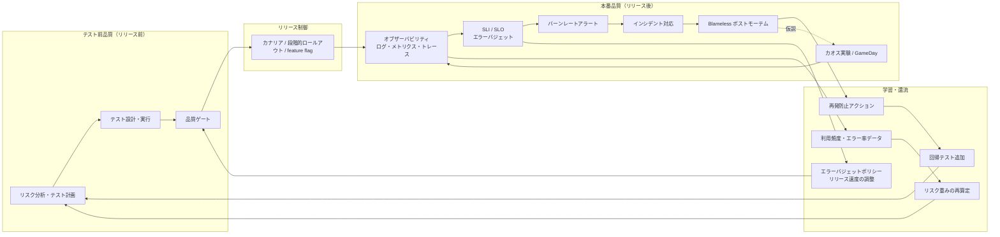

# 本番運用品質・SRE・オブザーバビリティ

## エグゼクティブサマリ

本ドキュメントは、「**品質はリリース前に完了するものではなく、本番で継続的に観測・修正されるもの**」という本番運用品質の体系を整理した調査資料です。テスト前品質（リリース前の検証活動）と本番品質（運用中の観測・制御・学習）を一続きの品質制御ループとしてつなぐことを目的とします。

実務上の要点は次の五つです。

第一に、**DORA メトリクスは 2024 年に 4 指標から 5 指標へ拡張されました**。現行（2026 年時点の dora.dev 公式ガイド）は、スループット 3 指標（変更リードタイム、デプロイ頻度、失敗デプロイ復旧時間）と不安定性 2 指標（変更失敗率、デプロイ手戻り率）です。テスト通過率がリリース前の「ゲート指標」であるのに対し、DORA はデリバリーの「結果指標」であり、両者は代替関係ではなく補完関係にあります。

第二に、**SLO とエラーバジェットは、信頼性とリリース速度のトレードオフを感情論から定量的な意思決定に変える装置**です。SLI（何を測るか）→ SLO（どこまでを目標とするか）→ エラーバジェット（どれだけ失敗を許容するか）→ エラーバジェットポリシー（バジェット枯渇時に何をするか）の順に設計します。

第三に、**オブザーバビリティはログ・メトリクス・トレースの 3 本柱を OpenTelemetry で標準化し、アラートは SLO ベースのバーンレート方式に寄せる**のが現代の実務形です。閾値ベースの症状アラートを乱発するより、「エラーバジェットをどの速度で消費しているか」に基づくマルチウィンドウ・マルチバーンレートアラートのほうが、精度・再現率・検知時間・リセット時間のバランスに優れます。

第四に、**リリース自体を品質制御装置として設計します**。カナリアリリース・段階的ロールアウト・Blue-Green・feature flag は「デプロイ＝全ユーザーへの露出」を分離し、障害の爆発半径を制御します。ただし feature flag は在庫（フラグ負債）としての管理コストを伴います。

第五に、**インシデントは組織学習の入力**です。重大度分類とインシデントコマンド体制で対応を標準化し、blameless postmortem で「人ではなくシステムとプロセスを直す」。さらに本番の障害・利用・エラーデータをリスクベーステストの再重み付けと回帰テストへ還流させることで、品質フィードバックループが閉じます。

DORA・SRE の概観と品質メトリクス全体の位置付けは [ソフトウェア品質管理実務リファレンス](../quality-management/software-quality-management-practical-reference.md) を参照してください。本ドキュメントはその「本番運用品質」部分を深掘りするものです。

## DORA メトリクス：デリバリーパフォーマンスの結果指標

### 現行定義（5 指標）

DORA（DevOps Research and Assessment）の公式ガイド（dora.dev）は、ソフトウェアデリバリーパフォーマンスの指標を現在 **「スループット（throughput）」3 指標と「不安定性（instability）」2 指標の計 5 指標** として定義しています。

| 分類 | 指標 | 公式定義（要旨） |
| --- | --- | --- |
| スループット | 変更リードタイム（change lead time） | 変更がバージョン管理へのコミットから本番デプロイまでに要する時間 |
| スループット | デプロイ頻度（deployment frequency） | 一定期間内のデプロイ回数、またはデプロイ間隔 |
| スループット | 失敗デプロイ復旧時間（failed deployment recovery time） | 失敗して即時対応を要したデプロイからの復旧に要する時間 |
| 不安定性 | 変更失敗率（change fail rate） | デプロイ後に即時対応（hotfix、ロールバック等）を要したデプロイの割合 |
| 不安定性 | デプロイ手戻り率（deployment rework rate） | 本番インシデントの結果として発生した「計画外の」デプロイの割合 |

### 指標の変遷（必ず現行定義を確認すること）

DORA の指標は年によって定義が変わっており、**古い資料の「Four Keys」をそのまま引用すると現行定義とずれる**点に注意が必要です。dora.dev の公式履歴ページによる変遷は以下のとおりです。

| 年 | 変更内容 |
| --- | --- |
| 2014–2015 | 初期の 4 指標（デプロイ頻度、変更リードタイム、MTTR、変更失敗率）が「スループット」と「安定性」の 2 分類で確立 |
| 2018 | 運用指標として「availability（可用性）」を追加し、「Software Delivery and Operational (SDO) performance」へ拡張 |
| 2021 | availability を「reliability（信頼性）」に置き換え（レイテンシ・性能・スケーラビリティを包含） |
| 2023 | MTTR を「failed deployment recovery time」に改名・スコープ縮小（インフラ障害等を除外し、変更起因の失敗のみに限定） |
| 2024 | 第 5 の指標「deployment rework rate（デプロイ手戻り率）」を追加し、「Software Delivery Throughput and Instability」の 5 指標モデルへ |

手戻り率が追加された背景は、変更失敗率が「チームが行う手戻り量の代理変数」として機能していたことを研究上で分離・検証するためです。手戻り率は「デリバリー能力のうち、新機能ではなく問題修正に費やされている割合」を可視化します。AI によるコード生成が増える環境では、**速く書けるが手戻りも増える**という状態を検出する指標として重要性が増しています。

### パフォーマンスレベルの目安

DORA の年次調査（Accelerate State of DevOps Report）はクラスタ分析により Elite / High / Medium / Low の 4 水準を提示しています。2024 年版の水準（二次情報による要約）は以下のとおりです。

| 水準 | デプロイ頻度 | 変更リードタイム | 変更失敗率 | 復旧時間 |
| --- | --- | --- | --- | --- |
| Elite | オンデマンド | 1 日未満 | 約 5% | 1 時間未満 |
| High | 日次〜週次 | 1 日〜1 週間 | 約 20% | 1 日未満 |
| Medium | 週次〜月次 | 1 週間〜1 か月 | 約 10% | 1 日未満 |
| Low | 月次〜半年ごと | 1〜6 か月 | 約 40% | 1 週間〜1 か月 |

2024 年版では **Medium クラスタの変更失敗率が High より低い**という逆転が初めて観測されました。表中の 4 指標が常に連動するとは限らないことを示す例であり、水準表は「等級付け」ではなく傾向の目安として使うべきです。

### テスト通過率との違い・誤用への注意

| 観点 | テスト通過率 | DORA メトリクス |
| --- | --- | --- |
| 測定対象 | リリース前の検証活動の結果 | 本番へのデリバリーとその後の安定性 |
| 役割 | 品質ゲート（予測的・事前） | 結果指標（実証的・事後） |
| 限界 | テストが検出できる欠陥しか反映しない | 原因を特定しない（診断には別の分析が必要） |

誤用として特に避けるべきは次の三つです。

- **個人評価への転用**: DORA はチーム・システム単位の能力指標であり、個人の成績評価に使うと指標の操作（ゲーミング）を誘発します。
- **文脈を無視したチーム間比較**: サービス特性（規制、リスク許容度、アーキテクチャ）が異なるチームの数値を横並びで比較しない。自チームの経時変化を見るのが基本です。
- **スループットだけの最適化**: デプロイ頻度だけを追うと、変更失敗率・手戻り率の悪化として跳ね返ります。5 指標は必ずセットで観測します。

## SLI / SLO / SLA とエラーバジェット

### 三層の定義（Google SRE 本）

Google SRE 本（Service Level Objectives 章）による定義は以下のとおりです。

| 用語 | 定義 | 実務での意味 |
| --- | --- | --- |
| SLI（Service Level Indicator） | 提供するサービスレベルのある側面を注意深く定義した定量的指標 | 「何を測るか」。リクエストレイテンシ、エラー率、スループット、可用性など |
| SLO（Service Level Objective） | SLI で測定されるサービスレベルの目標値または範囲 | 「どこまでを内部目標とするか」。例: 30 日間の成功リクエスト率 99.9% 以上 |
| SLA（Service Level Agreement） | SLO と、それを満たした（または満たせなかった）場合の帰結を含む、ユーザーとの明示的・暗黙的な契約 | 「守れなかったら何が起きるか」。**未達時の帰結が明示されていなければそれは SLA ではなく SLO** |

SLO は SLA より厳しく設定するのが通常です。SLA 違反は契約上の帰結を伴うため、SLO を内側の防衛線として先に破らせ、対応の時間を確保します。

### SLI の選び方

SRE 本はシステム種別ごとに重視すべき SLI を整理しています。

| システム種別 | 重視する SLI |
| --- | --- |
| ユーザー向けサービス | 可用性、レイテンシ、スループット |
| ストレージシステム | レイテンシ、可用性、耐久性（durability） |
| ビッグデータ・パイプライン | スループット、エンドツーエンドレイテンシ |
| すべてのシステム | 正確性（correctness） |

計測上の重要な原則は、**平均ではなくパーセンタイル（p50 / p95 / p99 等）を使う**ことです。平均は瞬間的な高負荷やテールレイテンシを隠蔽します。またユーザー体験に近い位置（ロードバランサやクライアント側）で測るほど SLI としての妥当性が上がります。

### SLO 目標値の設定原則

SRE 本が挙げる目標値設定の原則は以下の五つです。

1. **現状の性能を根拠に目標を選ばない**: 現状追認の目標は、持続不可能な水準への固定化を招きます。
2. **シンプルに保つ**: 複雑な集計式は性能変化の解釈を困難にします。
3. **「絶対」を避ける**: 「常に利用可能」のような目標は高コストで非現実的です。
4. **SLO の数を最小限にする**: 事業価値と明確に結び付く指標だけを SLO にします。
5. **最初から完璧を目指さない**: 緩い目標から始めて締める方が、逆方向より容易です。

### エラーバジェットとエラーバジェットポリシー

**エラーバジェットは「SLO を破ってよい割合」を予算として明示したもの**です。SLO が 99.9% なら、エラーバジェットは 0.1%（30 日換算で約 43.2 分の全面停止に相当）です。この予算が残っている限り、リリース・実験・計画メンテナンスにリスクを取れます。

エラーバジェットの本質は、**機能開発速度と信頼性のトレードオフを、開発チームと運用チームが共有する単一の数値で議論できるようにする**ことです。「もっと速く出したい」対「壊れるから出したくない」という対立を、「予算が残っているか」という事実の問いに置き換えます。

予算を使い切ったときの行動をあらかじめ合意しておくのが**エラーバジェットポリシー**です。SRE Workbook の公開例では以下が規定されています。

- 直近 4 週間ウィンドウでエラーバジェットを超過した場合、**P0 問題とセキュリティ修正を除くすべての変更・リリースを停止**し、SLO 内に戻るまで信頼性改善に集中する。
- 単一インシデントが 4 週間分バジェットの 20% 超を消費した場合、**ポストモーテムを必須**とし、少なくとも 1 件の P0 アクションアイテムを課す。
- 同一種別の障害が四半期バジェットの 20% 超を消費した場合、四半期計画で対処する。
- ポリシーの適用やバジェット計算に関する不一致は経営層（例では CTO）にエスカレーションする。

ポリシーの目的は懲罰ではなく、**「データが信頼性優先を示したとき、チームが信頼性だけに集中する許可を与える」**ことです。

## オブザーバビリティ：3 本柱と OpenTelemetry

### テレメトリの 3 本柱と OpenTelemetry のシグナル

オブザーバビリティの基本は**ログ（イベントの記録）、メトリクス（実行時に取得される測定値）、トレース（リクエストがアプリケーションを通過する経路）**の 3 本柱です。ベンダー中立の標準である OpenTelemetry は、これらを「シグナル」として定義しています。

| シグナル | 定義（opentelemetry.io） | 主用途 |
| --- | --- | --- |
| トレース | リクエストがアプリケーションを通る経路 | 分散システムの因果関係・ボトルネック特定 |
| メトリクス | 実行時に取得される測定値 | 傾向監視、SLI 算出、アラート |
| ログ | イベントの記録 | 詳細な事象調査、監査 |
| バゲッジ（baggage） | シグナル間で受け渡される文脈情報 | シグナル横断の相関付け |
| プロファイル（開発中） | コードレベルのリソース使用の記録 | 性能の深掘り |

3 本柱は独立に集めるのではなく、**トレース ID・リクエスト ID で相互に相関付けられて初めて「未知の問題を調査できる」状態**になります。

### 構造化ログ

ログは自由文ではなく、**機械可読な構造化形式（JSON 等）で、一貫したフィールドスキーマを持たせて出力**します。実務上の推奨は以下です。

- タイムスタンプ、重大度、サービス名、trace_id / span_id、リクエスト ID、テナント/ユーザー識別子（PII に注意）を標準フィールド化する。
- 検索・集計の前提となるフィールド名を全サービスで統一する（OpenTelemetry のセマンティック規約が命名の基準として使えます）。
- 個人情報・秘密情報をログに残さないことを、出力時のスキーマ検証で強制する。

### 高カーディナリティの扱い

カーディナリティとは**集合内のユニーク値の数**であり、ユーザー ID やリクエスト ID は最高カーディナリティの属性です。Honeycomb の議論が示すとおり、**「デバッグの大半は干し草の山から針を探す作業であり、高カーディナリティこそが細かい針を追跡可能にする」**（例:「us-west-1 の shard3 にいる iOS 11.0.4・フランス語パックのカナダのユーザー」を横断条件で絞り込む）ものです。

実務上のポイントは次のとおりです。

- **時系列メトリクスのラベルに高カーディナリティ属性を入れない**: メトリクス基盤はラベルの組合せごとに時系列を持つため、ユーザー ID などを入れるとコストと性能が破綻します。
- **高カーディナリティの調査はトレース／構造化イベント側で行う**: メトリクスで「何かがおかしい」を検知し、トレース・イベントで「誰の・どのリクエストか」を特定する分担が基本形です。
- サンプリング（特にテールサンプリング）で「エラーや遅いリクエストは残し、正常系は間引く」制御を行います。

### SLO ベースのアラート設計（バーンレートアラート）

SRE Workbook（Alerting on SLOs 章）は、アラートの良し悪しを 4 属性で評価します。

| 属性 | 意味 |
| --- | --- |
| 精度（precision） | 検知したイベントのうち本当に重要だった割合 |
| 再現率（recall） | 重要なイベントのうちアラートが発火した割合 |
| 検知時間（detection time） | 問題発生からアラートまでの時間 |
| リセット時間（reset time） | 問題解消後もアラートが鳴り続ける時間 |

単純なエラー率閾値アラートはこの 4 属性を両立できません。推奨は**バーンレート（burn rate）**に基づく方式です。バーンレートは「エラーバジェットを消費する速度」で、**バーンレート 1 は SLO 期間ちょうどでバジェットを使い切る速度**を意味します。

最終形として推奨されるのが**マルチウィンドウ・マルチバーンレートアラート**です。長い窓で有意性を、短い窓（長い窓の 1/12 が目安）で「今も燃えているか」を確認し、リセット時間を短縮します。99.9% SLO・30 日間での推奨パラメータは以下です。

| 深刻度 | 長い窓 | 短い窓 | バーンレート | 消費バジェット |
| --- | --- | --- | --- | --- |
| ページ（即時呼出） | 1 時間 | 5 分 | 14.4x | 2% |
| ページ（即時呼出） | 6 時間 | 30 分 | 6x | 5% |
| チケット（翌営業日対応） | 3 日 | 6 時間 | 1x | 10% |

この設計の品質管理上の意義は、**アラートが「症状の羅列」ではなく「ユーザー影響（SLO 違反リスク）」に直結する**ことです。原因ベースのアラートを積み上げるより、SLO ベースに集約するほうがアラート疲れを抑制できます。

## リリース戦略：デプロイを品質制御装置にする

### カナリアリリースと段階的ロールアウト

SRE Workbook はカナリアリリースを**「サービスに対する変更の部分的かつ時間を限定したデプロイと、その評価」**と定義します。設計上の要点は以下です。

- **カナリア集団の選定**: 問題検出に足るトラフィック量・継続時間を確保しつつ、影響を小さく保つ。ピーク時間帯の挙動も評価対象に含める。
- **同時に走らせるカナリアは 1 つ**: 複数の変更を同時にカナリアするとシグナルが汚染されます。
- **前後比較ではなく対照群比較**: 時間はメトリクス変動の最大要因のため、「デプロイ前 vs 後」ではなく「カナリア群 vs 対照群」で比較します。
- **エラーバジェットの保全**: カナリア人口 5% でエラー率 20% なら全体影響は 1% に留まります。全量デプロイでの失敗と比べ、消費するバジェットが桁違いに小さくなります。

段階的ロールアウト（progressive rollout）はカナリアの多段化です。初期段階は小さな集団に対しクラッシュ率などの厳格な指標で判定し、後続段階で人口を拡大しながらより繊細な指標（ビジネス指標等）を評価します。

### Blue-Green デプロイ

Blue-Green は本番環境を 2 系統（blue / green）用意し、新バージョンを待機系に展開してから切り替える方式です。瞬時切替は高速なロールバック手段を与えますが、SRE Workbook が示すとおり、**トラフィックを両環境へ徐々に分配すればカナリア群と対照群として機能**させられます。切替の速さ（Blue-Green）と評価の細かさ（カナリア）は組み合わせて使えます。

### Feature Flag：品質制御装置とフラグ負債

Feature flag（feature toggle）は「デプロイ」と「リリース（ユーザーへの露出）」を分離する仕組みで、Martin Fowler のサイトの整理では**寿命（longevity）と動性（dynamism）**の 2 軸で 4 分類されます。

| 分類 | 寿命 | 動性 | 用途 |
| --- | --- | --- | --- |
| Release Toggle | 短命（数日〜数週） | 静的 | 未完成機能を無効化したままトランクベース開発で出荷 |
| Experiment Toggle | 数週〜数か月 | 高（ユーザー単位で一貫） | A/B テスト・実験 |
| Ops Toggle | 数日〜無期限（kill switch） | 中（即時再構成が必要） | 障害時の機能縮退・負荷制御 |
| Permissioning Toggle | 長命（年単位） | 高（リクエスト単位） | プレミアム/ベータ機能の権限制御 |

品質制御装置としての価値は、**障害時にデプロイなしで機能を無効化できる（Ops Toggle）、リスクの高い変更を限定ユーザーにだけ露出できる（Release/Experiment Toggle）**点にあります。

一方で **flag は「維持コスト付きの在庫（フラグ負債）」**です。条件分岐の組合せがテスト空間を拡大し、放置されたフラグは Knight Capital の障害のような重大事故の温床になります。ライフサイクル管理の実務は以下です。

- フラグ作成時に**削除タスクをバックログへ同時登録**する。
- フラグに**有効期限を設定**し、期限切れフラグが残っていると**テストが失敗する仕組み**を入れる。
- **フラグ総数の上限**を決め、新規追加には既存の削除を求める。

### Rollback / Roll-forward の使い分け

| 手段 | 適する状況 | 注意点 |
| --- | --- | --- |
| ロールバック（rollback） | カナリア・デプロイ直後に異常を検知した場合の第一選択。原因調査より先に「出血を止める」 | スキーマ変更やデータ書込みを伴う変更は単純に戻せないことがある。ロールバック可能性はリリース前に設計・検証しておく |
| ロールフォワード（roll-forward） | 旧バージョンへ戻せない場合（非互換なデータ移行後、旧版にも欠陥がある場合）や、修正が小さく検証済みの場合 | 「修正版を急いで作る」プロセス自体が新たな欠陥源になる。緊急リリースにも最低限の検証ゲートを維持する |

SRE Workbook のカナリア章が示す原則は、**カナリア指標が対照群から乖離したら、まず停止してロールバックする**ことです。ロールフォワードは「戻れない・戻らないほうが安全」と判断できる場合の選択肢であり、既定値はロールバックに置くのが安全側の設計です。データベースマイグレーションは expand-contract（後方互換を保つ二段階変更）で「常に戻れる」状態を維持します。

## インシデントマネジメント

### 重大度分類（severity）

対応の強度を事前に定義した重大度で決めます。以下は PagerDuty の公開インシデント対応ドキュメントの分類です。

| レベル | 特徴 | 対応 |
| --- | --- | --- |
| SEV-1 | 広範な顧客影響、SLA を超える重大な機能劣化、データ露出級のセキュリティ問題 | インシデントコマンダーを即時招集、経営通知・対外広報を伴う |
| SEV-2 | 多数の顧客の利用に影響する重大なシステム問題 | メジャーインシデント対応（IC 関与）を発動 |
| SEV-3 | 大半のユーザーには影響しない部分的な機能低下、拡大の恐れがある問題 | 担当チームへ高緊急度で通知、必要ならエスカレーション |
| SEV-4 | 顧客影響のない性能劣化・個別コンポーネント障害 | 低緊急度で担当チームへ |
| SEV-5 | コア機能に影響しない不具合・表示崩れ | チケット起票で対応 |

運用原則は二つです。**SEV-2 以上をメジャーインシデントとして自動的に本格対応へ入れる**こと、そして**判断に迷ったら高いほうの重大度として扱う**（対応中に格付け議論をしない）ことです。

### インシデントコマンド体制

Google SRE 本（Managing Incidents 章）は、災害対応の Incident Command System に基づく役割分担を提示します。

| 役割 | 責務 |
| --- | --- |
| インシデントコマンダー（IC） | 全体状況の把握と対応体制の構築。技術作業はしない |
| オペレーション担当（Ops Lead） | 復旧作業の実行。**インシデント中にシステムを変更してよい唯一のロール** |
| コミュニケーション担当 | ステークホルダーへの定期更新、記録の維持 |
| 計画担当（Planning） | バグ起票、リソース調整、長期対応、交代管理などの後方支援 |

管理されていないインシデントの典型的失敗は、(1) 技術問題への没頭で全体状況を失う、(2) コミュニケーション不全、(3) 勝手な変更（freelancing）による状況悪化、の三つです。全員が「自分の仕事」をしていても、指揮系統がなければ悪化する点が本質です。

### 対応フローとコミュニケーション

インシデント宣言の基準（Google SRE 本）は、**複数チームの関与が必要 / 顧客に見える影響がある / 1 時間集中して解析しても解決しない**のいずれかです。基準は事前に決めておき、宣言をためらわせない文化にします。

- **ライブインシデント状態ドキュメント**: 複数人が同時編集できる場所に、判断・状態変化・試行を時系列で記録します。対応中の共有と、後のポストモーテムの一次資料を兼ねます。
- **明示的な引き継ぎ**: 「あなたが今からインシデントコマンダーです。よいですね？」と明示的に宣言し、応答を確認してから交代します。
- **対応の優先順位**: まず影響拡大を止め（stop the bleeding）、サービスを復旧し、原因調査のための証拠を保全します。根本原因の特定は復旧より後で構いません。
- **平時の準備**: 手順書の整備、役割のローテーション、定期的な訓練（後述の GameDay）で対応能力を組織に定着させます。

## Blameless Postmortem：インシデントからの組織学習

### 原則

ポストモーテムは**「インシデント、その影響、緩和・解決のための行動、根本原因、再発防止のフォローアップ行動を記録した文書」**です（Google SRE 本）。blameless（非難なし）とは、**関係者全員が善意で、その時点で持っていた情報に基づいて正しい行動をしたと仮定する**ことを意味します。この考え方は医療・航空業界に由来し、核心は次の一文に集約されます。

> 人は「直せ」ない。しかしシステムとプロセスは直せる。（"You can't 'fix' people, but you can fix systems and processes."）

個人を非難する文化では、インシデントの隠蔽・報告遅延・情報の出し渋りが起き、組織は学習機会を失います。blameless は「責任を問わない」ことではなく、**説明責任の対象を個人からシステム設計に移す**ことです。

### 作成トリガーとテンプレート

ポストモーテムを書く基準（トリガー）は事前に定義します。Google SRE 本の例は、閾値を超えるユーザー可視のダウンタイム・劣化、あらゆるデータ損失、オンコール対応（ロールバック、トラフィック迂回等）の発生、解決時間の閾値超過、監視の欠陥（人手での発見）です。

テンプレートの標準的な構成要素は以下です。

| セクション | 内容 |
| --- | --- |
| サマリ | 何が起き、影響はどの規模だったか（影響ユーザー数・時間・SLO/エラーバジェット消費） |
| タイムライン | 検知・エスカレーション・緩和・解決の時系列（ライブ状態ドキュメントから再構成） |
| 根本原因と寄与要因 | 単一犯人探しではなく、複数の寄与要因とその相互作用 |
| うまくいったこと / いかなかったこと / 幸運だったこと | 検知・対応プロセス自体の評価 |
| アクションアイテム | 再発防止・検知改善・影響軽減の具体策（担当者・期限付き） |

### 再発防止アクションの品質

ポストモーテムの価値はアクションアイテムの質で決まります。品質基準として実務で使えるのは以下です。

- **具体的・担当者付き・期限付き**であること。「気を付ける」「周知する」は行動ではありません。
- **予防・検知・緩和のバランス**: 再発予防だけでなく、「次は 5 分で検知できるか」「影響を 1/10 にできるか」も問います。
- **優先度付けと完了追跡**: エラーバジェットポリシーの例が示すように、大きくバジェットを消費したインシデントには P0 アクションアイテムを義務付け、完了までバックログで追跡します。
- **レビューを必須にする**: 「レビューされないポストモーテムは、存在しなかったのと同じ」（SRE 本）。シニアエンジニアが根本原因の深さとアクション計画の妥当性を確認します。

### 組織学習への展開

書いて終わりにせず、**恩恵を受けうる最も広い読者に共有**します。実践例として、ポストモーテムの読書会、月次のインシデントレビュー会、優れたポストモーテムの表彰、経営層自身の参加が挙げられます。ポストモーテムの蓄積は、後述するテスト優先度更新とカオス実験の仮説の一次情報源になります。

## カオスエンジニアリング

### 原則（Principles of Chaos Engineering）

principlesofchaos.org はカオスエンジニアリングを**「本番の混乱状態（turbulent conditions）に耐えるシステム能力への確信を得るために、システムで実験を行う訓練」**と定義します。「ランダムに壊す」ことではなく、**仮説駆動の実験**である点が本質です。実験は次の 4 ステップで設計します。

1. **定常状態の定義**: システムの正常な振る舞いを測定可能な出力（スループット、エラー率、レイテンシのパーセンタイル等）で定義する。内部属性ではなく**測定可能な出力**に注目します。
2. **仮説の設定**: 「対照群でも実験群でも定常状態は維持される」と仮説を立てる。
3. **現実の事象を変数として導入**: サーバ停止、ネットワーク分断、レイテンシ増加、依存サービス障害など、実際に起こりうる・影響の大きい事象を注入する。
4. **仮説の反証を試みる**: 対照群と実験群の定常状態の差分から弱点を特定する。

発展原則は、**本番での実験を優先する**（本番トラフィックでしか本物の挙動は得られない）、**実験を自動化して継続的に実行する**、そして**爆発半径（blast radius）を最小化する**ことです。

### 本番で安全に実験するための設計

- **小さく始める**: ステージング → 本番の限定トラフィック → 拡大、の順で確信を積み上げます。カナリアリリースと同じ「小さな人口で試す」原理です。
- **即時中断スイッチ**: 定常状態の逸脱が閾値を超えたら実験を自動停止する仕組み（abort 条件）を必ず用意します。
- **エラーバジェットとの接続**: 実験に割り当ててよいリスク量をエラーバジェットから拠出します。バジェットが枯渇しているときは実験を行いません。
- **ポストモーテムを仮説源にする**: 過去のインシデントの寄与要因は「まだ検証されていない類似の弱点」の候補リストです。

### GameDay

GameDay は AWS Well-Architected の定義で**「障害や事象をシミュレートし、システム・プロセス・チームの対応をテストする」**演習です。技術的な障害注入だけでなく、**インシデントコマンド体制・コミュニケーション・手順書が機能するかという「人間側の定常状態」を検証する**点に価値があります。カオス実験が「システムの仮説検証」、GameDay が「組織の仮説検証」という分担で併用します。

カオス実験の具体的な実験設計手順は、[テスト技法スキルカタログ](../test-techniques/test-techniques-skill-catalog.md) の SKILL-RES-01（カオスエンジニアリング実験を設計する）を参照してください。

## 本番データに基づくテスト優先度更新：品質フィードバックループ

本セクションは、ここまでの各要素（DORA、SLO、オブザーバビリティ、ポストモーテム）を**テスト前品質へ還流させる実務パターンの統合**です（個別要素は前掲の一次情報に基づきますが、ループ全体の型は実務慣行の整理です）。

### フィードバックの 3 経路

| 経路 | 本番側の入力 | テスト側の更新 |
| --- | --- | --- |
| 障害 → 回帰テスト | インシデント・ポストモーテム・エスケープした欠陥 | 再現テストを書いてから修正し、回帰スイートへ恒久追加。同型の欠陥を狙うテスト（変異的な観点追加）も検討 |
| 利用実態 → 優先度 | 機能別の利用頻度、ユーザーフロー、トラフィック分布 | リスクベーステストの「影響度」を実測値で更新。使われていない機能のテストを縮小し、主要フローの E2E を厚くする |
| エラー実態 → 優先度 | 機能・エンドポイント別のエラー率、SLO/バジェット消費の内訳、手戻り率の内訳 | リスクベーステストの「発生確率」を実測値で更新。バジェットを消費しているコンポーネントのテスト・カナリア指標を強化 |

リスクベーステストの重み（リスク = 影響度 × 発生確率）は、リリース前は推定に頼らざるを得ませんが、**本番データが入った後は推定を実測で置き換えられる**のがこのループの要点です。

### 品質フィードバックループ全体像

このループが機能している状態は、DORA 指標で観測できます。障害からの学習が回帰テストとカナリア指標に反映されれば**変更失敗率と手戻り率が下がり**、ロールバック手段とインシデント体制が整えば**失敗デプロイ復旧時間が短くなり**、エラーバジェットに余裕が生まれれば**デプロイ頻度とリードタイムを攻められる**、という構造です。

### 運用のリズム（実務推奨）

- **リリースごと**: カナリア評価、フラグ棚卸し（期限切れ確認）。
- **週次**: エラーバジェット残高の確認、アラート精度（誤報率）の見直し。
- **月次〜四半期**: 利用頻度・エラー率データによるリスクベーステスト再重み付け、ポストモーテムのアクションアイテム完了率の確認、DORA 指標の経時レビュー。

## AI/LLM システムの本番品質監視への応用（概要）

LLM を含む AI システムでは「同一入力でも出力が揺れる」「正解が一意でない」ため、**リリース前評価だけでは品質を保証できず、本番でのオンライン監視が前提**になります。本節は概要に留め、評価手法・品質モデルの詳細は [AI システム品質モデル](../quality-models/ai-system-quality-model.md)に委譲します。

- **出力品質のオンライン監視**: 従来のインフラ指標（レイテンシ、エラー率、トークン使用量・コスト）に加え、出力そのものの品質（正確性、根拠忠実性、安全性）を本番トラフィックのサンプリング評価で監視します。SLI/SLO の枠組みは「応答の品質スコア p95」「ガードレール違反率」のような品質 SLI に拡張して適用できます。
- **ドリフト**: 入力分布の変化（ユーザー層・話題の変化）、依存モデルの更新、プロンプトの変更はいずれも品質劣化の要因になります。定常状態（品質スコアの基準線）を定義して逸脱を検知する発想は、カオスエンジニアリングの定常状態仮説と同型です。
- **ユーザーフィードバックの評価データ化**: 明示的フィードバック（評価ボタン、報告）と暗黙的シグナル（再質問、途中離脱、コピー率）を収集し、**失敗事例を評価データセット（回帰評価）へ還流**させます。これは前節の「本番障害 → 回帰テスト」ループの AI 版です。
- **テレメトリの標準化**: OpenTelemetry には生成 AI 向けのセマンティック規約（GenAI semantic conventions）が整備されており、LLM 呼び出し・エージェントのスパン、メトリクス、イベントの記録方法や、主要プロバイダ（Anthropic、OpenAI、AWS Bedrock、Azure AI 等）・MCP 向けの規約が定義されています。AI システムの観測も既存のオブザーバビリティ基盤の延長線上で標準化できます。

## 主要参考文献

### 一次情報（本文で直接検証・参照した公式資料）

- DORA, "DORA's software delivery metrics: the five keys" — https://dora.dev/guides/dora-metrics-four-keys/ （現行 5 指標の定義）
- DORA, "A history of DORA's software delivery metrics" — https://dora.dev/insights/dora-metrics-history/ （指標の変遷）
- Google SRE Book, "Service Level Objectives" — https://sre.google/sre-book/service-level-objectives/ （SLI/SLO/SLA、目標値設定）
- Google SRE Workbook, "Alerting on SLOs" — https://sre.google/workbook/alerting-on-slos/ （バーンレートアラート）
- Google SRE Workbook, "Example Error Budget Policy" — https://sre.google/workbook/error-budget-policy/ （エラーバジェットポリシー例）
- Google SRE Workbook, "Canarying Releases" — https://sre.google/workbook/canarying-releases/ （カナリア、段階的ロールアウト、Blue-Green）
- Google SRE Book, "Managing Incidents" — https://sre.google/sre-book/managing-incidents/ （インシデントコマンド体制）
- Google SRE Book, "Postmortem Culture: Learning from Failure" — https://sre.google/sre-book/postmortem-culture/ （blameless postmortem）
- OpenTelemetry, "Signals" — https://opentelemetry.io/docs/concepts/signals/ （テレメトリシグナルの定義）
- OpenTelemetry, "Semantic conventions for generative AI systems" — https://opentelemetry.io/docs/specs/semconv/gen-ai/ （GenAI セマンティック規約。専用リポジトリ https://github.com/open-telemetry/semantic-conventions-genai へ移管）
- Principles of Chaos Engineering — https://principlesofchaos.org/ （カオスエンジニアリングの原則）
- Pete Hodgson (martinfowler.com), "Feature Toggles (aka Feature Flags)" — https://martinfowler.com/articles/feature-toggles.html （フラグの 4 分類とフラグ負債）
- PagerDuty Incident Response Documentation, "Severity Levels" — https://response.pagerduty.com/before/severity_levels/ （重大度分類）
- Charity Majors (honeycomb.io), "So You Want To Build An Observability Tool" — https://www.honeycomb.io/blog/so-you-want-to-build-an-observability-tool （高カーディナリティ・高次元性）
- AWS Well-Architected Framework, "Game day (concept)" — https://wa.aws.amazon.com/wellarchitected/2020-07-02T19-33-23/wat.concept.gameday.en.html （GameDay の定義）

### 二次情報（数値の突合に使用）

- Octopus Deploy Blog, "The 2024 DevOps performance clusters" — https://octopus.com/blog/2024-devops-performance-clusters （2024 年版 State of DevOps のクラスタ水準の要約。原典は DORA "Accelerate State of DevOps Report 2024"）

### 関連ドキュメント（本リポジトリ内）

- [ソフトウェア品質管理実務リファレンス](../quality-management/software-quality-management-practical-reference.md) — DORA・SRE を含む品質メトリクス全体の概観
- [テスト技法スキルカタログ](../test-techniques/test-techniques-skill-catalog.md) — SKILL-RES-01: カオスエンジニアリング実験を設計する
- [AI システム品質モデル](../quality-models/ai-system-quality-model.md) — AI/LLM システムの品質評価の詳細