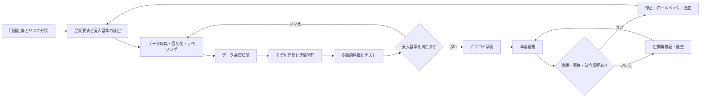

# AIの品質保証と品質管理に関する調査報告書

## エグゼクティブサマリー

AIの品質保証は、従来ソフトウェアのQA/QCをそのまま移植するだけでは不十分です。AIシステムは、コードだけでなく、データ、モデル、評価基準、運用環境、人間の意思決定、法的義務までを含む**社会技術システム**として管理する必要があるためです。NIST AI RMFは、信頼できるAIの要件として、**妥当性・信頼性、安全性、セキュリティとレジリエンス、説明可能性、透明性、プライバシー強化、公平性、説明責任**を位置付けており、AISTの機械学習品質マネジメントガイドラインも、AI品質を工程管理と評価の両輪で扱う必要性を強調しています。

実務上の整理としては、**QAは「良いAIを作る仕組みを設計・運用すること」**、**QCは「出来上がったAIと運用中のAIが基準を満たすかを検査・監視すること」**です。前者は方針、役割、データ管理、開発プロセス、変更管理、監査などの予防的統制を中心にし、後者は評価、テスト、監視、逸脱検知、障害対応などの検出的統制を中心にします。AIでは、QCの結果がそのままQA改善の入力になるため、両者は循環関係にあります。

規格・法制度の観点では、**NIST AI RMF 1.0**が実務フレーム、**NIST AI 600-1**が生成AI向け補助プロファイル、**ISO/IEC 42001**がAIマネジメントシステム要求事項、**ISO/IEC 23894**がAIリスクマネジメント指針、**ISO/IEC 25059**がAI向け品質モデル、**ISO/IEC 5259シリーズ**がAI向けデータ品質、**ISO/IEC 42005**がAI影響評価、**EU AI Act**が法的義務、**日本のAI事業者ガイドライン**と**JIS X 22989 / JIS Q 42001 / JIS Q 38507**が国内実装基盤という位置づけです。特にEU AI Actは、高リスクAIに対し、**リスク管理、データガバナンス、透明性、人間による監督、精度・頑健性・サイバーセキュリティ、品質マネジメントシステム、事後監視**を要求しており、法令順守と品質管理が事実上統合されています。

学術面では、AI品質の難しさはかなり一貫して示されています。代表例として、SculleyらはMLシステムの**隠れた技術的負債**を指摘し、Breckらは**データ検証を本番MLの中核工程**として位置付けました。Riccioらの体系的マッピング研究は、MLシステムのテストが単体テストだけでなく、**データ、モデル、統合、運用**まで拡張されることを示し、Aliらの品質モデル調査は、**包括的なAI品質モデルと定量指標がまだ十分成熟していない**と結論づけています。生成AIではHELMが、**精度だけでなく、較正、頑健性、公平性、毒性、効率**を並列評価する「多面評価」が必要だと示しました。

したがって、企業のベストプラクティスは「高性能モデルを一度作る」ことではなく、**データ品質管理 → リスクベース設計 → 多面的評価 → デプロイ前ゲート → 本番監視 → 継続的再検証 → 逸脱対応**という運用ループを持つことです。特に、データ契約、ラベル品質監査、スライス評価、較正評価、回帰テスト、分布シフト監視、対抗例テスト、RAG/LLMのレッドチーミング、インシデント管理を組み合わせる構成が、現時点で最も現実的です。

中小企業向けには、まず短期で**AI台帳・用途分類・最低限の評価指標・監視項目・責任者**を定義し、中期で**自動テストとモデル監視**、長期で**監査可能なAIMS相当の運用**へ進む段階導入が現実的です。重要なのは、高価な専用製品の導入よりも先に、**受入基準、データの出自、変更履歴、再現可能性、逸脱時の停止・ロールバック手順**を整備することです。ISO/IEC 42001やNIST AI RMFは、まさにこの順番で組織能力を整えることを想定しています。

## 定義と概念

AI品質保証と品質管理を最も実務的に整理すると、**AI品質保証（AI QA）は、AIシステムが所定の品質要求を継続的に満たせるように、組織・工程・役割・基準・記録・改善の仕組みを整えること**であり、**AI品質管理（AI QC）は、学習前後・デプロイ前後のデータ、モデル、出力、運用状態を測定・検査し、基準未達や逸脱を検出すること**です。一般の品質管理実務でもQAは工程中心、QCは検査中心と整理されており、AIでもこの区別は有効ですが、AIではモデルの性能がデータや環境変化に依存するため、QCは出荷前検査で終わらず、**本番後の継続監視まで拡張**されます。

AISTは、機械学習AIの品質管理が難しい理由として、品質要求の曖昧さ、データとモデルの相互依存、環境変化による性能変動、学習の統計性、説明の難しさなどを挙げています。NIST AI RMFも、AI品質を単なる精度ではなく、利害関係者と利用文脈を踏まえた**多次元的な信頼性属性のバランス**として捉えています。つまり、AI品質とは「高精度」であることではなく、**目的適合性と害の抑制を両立する状態**です。

### QAとQCの違い

| 観点 | AI QA | AI QC | 実務上の含意 |
| --- | --- | --- | --- |
| 主目的 | 欠陥や事故を未然に防ぐ仕組みづくり | 欠陥・逸脱・劣化を検出する | QCの結果をQA改善に戻す閉ループが必要 |
| 主対象 | 方針、役割、プロセス、変更管理、監査、教育 | データ、ラベル、モデル、出力、監視指標 | AIでは本番後QCの重要度が特に高い |
| 主な時点 | 企画・設計・開発・運用全体 | 学習前、学習後、デプロイ前後、本番中 | 「出荷時合格」で完結しない |
| 代表的成果物 | AI方針、リスク台帳、データ基準、評価計画、監査記録 | テスト結果、性能報告、ドリフト警報、障害記録 | 記録が監査性と再現性の基盤になる |
| 管理の性格 | 予防的・組織的 | 検出的・測定的 | 両方を統合しないとAI品質は安定しない |

出典: ASQ、ISOの品質管理解説、NIST AI RMF、AIST機械学習品質マネジメントの整理を基に作成。

### 関連用語

日本ではJIS X 22989が、AIシステムを「人間が定義した目標に対して、コンテンツ、予測、推奨、意思決定などの出力を生成する工学的システム」として整理しており、これが品質議論の前提語彙になります。NIST AI RMFは、信頼できるAIの特性として、**妥当性・信頼性、 安全性、 セキュリティとレジリエンス、 説明可能性と解釈可能性、 プライバシー強化、 公平性、 説明責任と透明性**を提示しています。

| 用語 | 実務的な意味 | 代表的な確認方法 |
| --- | --- | --- |
| 信頼性 | 同じ条件で期待どおりの結果を安定して出せること | 再現評価、再学習差分、運用SLA確認 |
| 頑健性 | ノイズ、欠損、入力変動、攻撃、環境変化に耐えること | ノイズ注入、対抗例、異常入力、フェイルセーフ試験 |
| 公平性 | 特定属性や集団に不当な不利益を与えないこと | 属性別スライス評価、TPR差・統計的パリティ差 |
| 説明可能性 | 出力やプロセスについて理解可能な根拠を提供できること | 説明文、特徴量寄与、モデルカード、ユーザー理解テスト |
| 安全性 | 身体・心理・経済・社会的害を不当に生じさせないこと | ハザード分析、用途制限、人間介在、停止手順 |
| プライバシー | 個人情報や機微データの不適切利用・漏えいを防ぐこと | 最小化、匿名化、同意、越境移転確認、監査ログ |
| 透明性 | 利用者や監督者が用途・限界・前提を把握できること | 技術文書、利用説明、制約提示、監査証跡 |
| セキュリティ | モデルやデータが改ざん・漏えい・悪用されにくいこと | 脅威分析、アクセス制御、秘密管理、モデル防御 |

NISTの説明可能AIでは、説明可能性はさらに**Explanation, Meaningful, Explanation Accuracy, Knowledge Limits**の四原則で整理されます。実務上重要なのは、**説明があること**と**その説明が正しく、受け手に理解可能で、必要以上の錯誤や情報漏えいを生まないこと**を区別する点です。説明精度は意思決定精度と同義ではありません。

## 規格・ガイドライン・法制度

AI品質保証の実務では、個別ツールより先に**どの文書群を設計原則として採用するか**を決める必要があります。最も安定した組み合わせは、**組織運営はISO/IEC 42001、リスク管理はISO/IEC 23894、データ品質はISO/IEC 5259系列、品質特性の整理はISO/IEC 25059、生成AI固有リスクはNIST AI 600-1、法令順守はEU AI Actや個人情報法制**という重ね方です。日本国内組織なら、これに**AI事業者ガイドライン**と関連JISを重ねるのが実務的です。

| 文書 | 性格 | QA/QCに関わる要点 | 実務への示唆 |
| --- | --- | --- | --- |
| NIST AI RMF 1.0 | 任意フレームワーク | GOVERN, MAP, MEASURE, MANAGE の4機能でAIリスクを管理し、信頼できるAI特性を多面的に扱う。メトリクスと閾値は文脈依存で、人間の判断が必要と明示。 | 社内標準の骨格に向く。評価指標を「精度だけ」にしない設計がしやすい。 |
| NIST AI 600-1 GenAI Profile | 任意の補助プロファイル | 生成AI特有または増幅されるリスクを整理し、特に Governance, Content Provenance, Pre-deployment Testing, Incident Disclosure を重視。 | 生成AI/LLMでは、一般MLよりも事前試験と事故開示設計を厚くする必要がある。 |
| ISO/IEC 42001 | 要求事項規格 | AIマネジメントシステム（AIMS）の確立・実施・維持・継続的改善を要求。AIを提供・利用する組織向け。 | AI QAを個人技ではなく、組織システムとして定着させる中核。既存のISO 9001/27001と統合しやすい。 |
| ISO/IEC 23894 | 指針 | AI特有の不確実性を踏まえたリスクマネジメント指針。既存リスク管理への統合を支援。 | AI案件だけ別管理にせず、全社ERMやモデルリスク管理へ統合しやすい。 |
| ISO/IEC 25059 | 品質モデル | AIシステム向け品質モデル。AI固有の品質特性を製品品質の観点で整理。 | 要求定義や受入基準づくりで「何を品質と呼ぶか」を明文化しやすい。 |
| ISO/IEC 5259シリーズ | データ品質 | 分析・機械学習向けデータ品質の枠組みと品質測定を扱う。 | データ品質を主観ではなく、測定可能な管理対象にする基盤。 |
| ISO/IEC 42005 | 指針 | AIシステムが個人・集団・社会へ与える影響評価を支援。透明性、説明責任、信頼の向上を狙う。 | 高影響ユースケースでは、テスト結果だけでなく「誰にどんな影響を与えるか」を文書化すべき。 |
| ISO/IEC 38507 | ガバナンス指針 | 経営・統治層がAI利用を有効・効率的・受容可能に統治するための指針。 | 取締役会・経営会議レベルの責任分界と監督事項を定義するのに有効。 |
| EU AI Act | 法規制 | 高リスクAIに、継続的リスク管理、データガバナンス、人間の監督、精度・頑健性・サイバーセキュリティ、QMS、技術文書、事後監視を要求。 | EU市場やEU関連ユーザーに届くAIは、品質管理がそのまま法令順守要件になる。 |
| 日本 AI事業者ガイドライン Ver.1.2 | ソフトロー | 2024年の統合ガイドラインを更新した非拘束的実務指針で、マルチステークホルダー検討を経て策定。 | 日本企業の基礎方針、説明責任、リスクに応じた統制設計の起点として使いやすい。 |
| JIS X 22989 / JIS Q 42001 / JIS Q 38507 | 国内標準 | AI概念・用語、AIMS、AI利活用のガバナンス影響をJIS化。JIS Q 42001は2025年8月公示、JIS Q 38507は2026年2月制定。 | 国内監査・社内標準・取引先説明を日本語規格ベースで進めやすい。 |

EU AI Actについては、欧州委員会の公式ページが、**2024年8月1日に発効し、原則として2026年8月2日に全面適用、ただし一部は前倒し適用**と案内しています。高リスクAIに対しては、リスク管理が**ライフサイクル全体にわたる継続的・反復的プロセス**であること、テストを**事前定義したメトリクスと確率的閾値**で実施すること、そして品質マネジメントシステムを整備することが明文化されています。これは、QCを単発の精度試験ではなく、**規制順守可能な継続統制**へ引き上げる要求です。

日本ではAI事業者ガイドラインが法的拘束力を持つわけではありませんが、AIの社会実装とガバナンスを両立させるための**ソフトロー**として設計されており、用途ごとのリスクの大きさに応じた対策を求めています。加えて、AIで個人データを扱う場合は、AI固有法制というより、**個人情報保護法、越境移転、漏えい対応、利用目的、委託先監督**など既存法制が直接効きます。個人情報保護委員会は、生成AI利用時も個人情報保護法の規律に従うよう注意喚起しています。

## 学術知見と評価枠組み

学術文献を俯瞰すると、AI品質保証は大きく三つの流れに分かれます。第一に、**AIシステムの工学的複雑性**を扱う研究。第二に、**データ・モデル・説明・公平性など個別品質特性**を扱う研究。第三に、**評価の標準化・ベンチマーク化**を扱う研究です。重要なのは、これらが互いに代替ではなく補完関係にあることです。

| 文献 | 主題 | QA/QCへの示唆 |
| --- | --- | --- |
| Sculley et al., *Hidden Technical Debt in Machine Learning Systems* | MLシステムの技術的負債 | モデル精度が良くても、データ依存・フィードバックループ・設定管理不足で品質は破綻しうる。QAはMLOps/変更管理を含むべき。 |
| Breck et al., *Data Validation for Machine Learning* | 本番ML向けデータ検証 | データをコードと同等の本番資産として扱い、スキーマ・統計・異常値・分布差分を継続検証すべき。 |
| Riccio et al., *Testing machine learning based systems: a systematic mapping* | MLテスト研究の体系化 | テスト対象はモデルだけでなく、データ、学習パイプライン、統合、運用条件まで広がる。 |
| Ali et al., *A Systematic Mapping of Quality Models for AI Systems, Software and Components* | AI品質モデルの整理 | 包括的で実証済みの品質モデルはまだ不足しており、企業は複数標準を組み合わせる必要がある。 |
| Gebru et al., *Datasheets for Datasets* | データセット文書化 | データの動機、構成、収集方法、用途制約、維持方針を文書化しないと、後工程のQCが不安定化する。 |
| Mitchell et al., *Model Cards for Model Reporting* | モデル文書化 | モデル性能を集団別・条件別に公開し、適用範囲と限界を明示することが透明性と監査性を高める。 |
| Hardt et al., *Equality of Opportunity in Supervised Learning* | 公平性指標 | 公平性は単一概念ではなく、少なくともTPR差など複数の定義がある。指標選択自体がガバナンス判断。 |
| Guo et al., *On Calibration of Modern Neural Networks* | 確率較正 | 高精度でも確率が信頼できるとは限らない。リスク判断用途では較正が必須。 |
| Liang et al., *HELM* | LLMの多面的評価 | 生成AIは精度だけでなく、較正、頑健性、公平性、毒性、効率の同時評価が必要。 |

この文脈で重要なのは、AI品質の理論枠組みが**単一の最適化問題ではない**ことです。たとえば、NISTの説明可能AIは、説明可能性を「説明があること」「受け手に意味があること」「説明が実際の内部処理を正しく反映すること」「知識限界を越えた誤用を防ぐこと」に分けています。また公平性研究では、統計的パリティ、機会均等、較正などが同時に満たせない場合もあり、指標選択は**業務目的・法的文脈・影響の大きさ**に依存します。したがって、QAは「正しい指標を選ぶこと」まで含み、QCは「選んだ指標を継続的に測ること」を担います。

## 実務ベストプラクティス

実務の要点を先に言えば、AI QA/QCは**モデル中心**ではなく、**ユースケース中心・データ中心・運用中心**で設計するのが最も失敗しにくいです。NIST AI RMF、EU AI Act、AISTガイドライン、AISIのデータ品質・レッドチーミング文書は、表現こそ異なりますが、ほぼ同じ構造を示しています。すなわち、**目的・影響・権限の定義 → データ管理 → 開発・テスト → デプロイ判断 → 本番監視 → 逸脱対応**です。

### 推奨プロセスフロー

以下は、汎用企業向けに標準文書と学術知見を統合した実装フローです。特に、**受入基準をデプロイ前ではなく企画段階で固定すること**、**本番監視から再学習までを一つの統制ループとして設計すること**が重要です。

### 手法比較

| 手法 | 主目的 | 利点 | 限界 | 実装上の注意点 | 主な根拠 |
| --- | --- | --- | --- | --- | --- |
| データ契約・スキーマ検証 | 欠損、型崩れ、意味変更の早期検知 | 最も費用対効果が高い予防策 | 意味の劣化やラベル誤りは見逃す | 学習・推論両方で同じ期待値を持つこと | |
| ラベル品質監査 | 教師データの誤り削減 | 実性能改善に直結しやすい | 高コスト、人手依存 | 難例・境界例を重点監査する | |
| スライス評価 | 属性群・条件群ごとの差を見る | バイアスや局所的不具合を見つけやすい | 集団分割が多いと統計的に不安定 | 法的に扱える属性と代理変数の取り扱いに注意 | |
| 較正評価 | 予測確率の信頼性確認 | リスク判断や閾値設計に有効 | 精度改善とは別問題 | ECE/Brierを業務損失と紐付ける | |
| 回帰テスト | モデル更新で既存品質を壊さない | CI/CDに載せやすい | 新リスクには弱い | ゴールデンデータセットと固定プロンプトセットを維持 | |
| 統合・E2Eテスト | 前処理、特徴量、推論API、UIの整合確認 | 本番障害の予防に有効 | 原因切り分けは難しい | モデルだけでなく周辺コードと依存先もバージョン固定 | |
| 分布シフト監視 | 入力分布や出力分布の変化検知 | ラベル遅延環境でも有効 | 品質劣化と直結しない場合がある | KS/JSなどを特徴量ごとに用い、過検知を抑える | |
| 対抗例・頑健性テスト | 入力攪乱や悪意ある攻撃への耐性確認 | 高リスク用途で必須 | 実装負荷が高い | 攻撃面をデータ、モデル、推論APIに分ける | |
| LLMレッドチーミング | 有害出力、幻覚、脱獄、プロンプト注入の確認 | 生成AI特有の欠陥を発見しやすい | テスト網羅性に限界 | 役割、資産、脅威シナリオ、許容残余リスクを定義する | |
| 継続的再検証 | 本番後の品質維持 | 劣化の早期発見と監査性向上 | ラベル収集や人手評価が必要 | 月次・四半期で再評価を定例化する | |

### 実装上の重要論点

データ品質管理では、AISTとAISIの文書が共通して、AIの品質は入力データの品質に強く依存すると述べています。したがって、**データ由来、収集条件、更新頻度、欠損、代表性、ラベル基準、除外基準、加工履歴、利用制約**を記録し、できればデータシート形式で残すのが望ましいです。生成AIやRAGでは、学習データだけでなく、**検索インデックス、システムプロンプト、評価用プロンプト、ナレッジ更新履歴**も品質対象になります。

モデル開発では、実験管理、データ版管理、評価セット凍結、モデルカード、再現可能な環境が必要です。Sculleyらが指摘した通り、MLシステムの大半はモデル本体以外のコードと運用ロジックで構成されるため、**「モデルだけ追えばよい」という設計は品質事故の温床**です。

ガバナンス面では、NIST AI RMF、ISO/IEC 42001、EU AI Act、AI事業者ガイドラインがいずれも、**役割分担、記録、リスクオーナー、変更審査、教育、監査**を要求または推奨しています。品質責任を「データサイエンス部門だけ」に閉じ込めず、事業責任者、法務、セキュリティ、個人情報保護、運用、監査を含む**横断責任体制**が必要です。

## ツールとフレームワーク

ツール選定では、まず「何を自動化したいか」を切り分けるべきです。実務では、**データ品質、評価実験、フェアネス、監視、トレース、レッドチーミング、文書化**が混ざりがちですが、一本で全部を賄える製品はありません。中小企業であれば、最初は**OSS中心に最小構成**を組み、監視や監査要件が高まった段階で商用製品を追加する方式が現実的です。

| ツール | 区分 | 主な機能 | 適用範囲 | 言語/プラットフォーム | 導入コストの目安 |
| --- | --- | --- | --- | --- | --- |
| Great Expectations | OSS | データ期待値、スキーマ検証、品質ドキュメント生成 | データ品質 | Python、各種データ基盤連携 | OSS無料、商用不明 |
| TensorFlow Data Validation | OSS | データ統計、スキーマ推定、異常データ検出 | MLパイプライン前処理・学習前検証 | Python、TFX | OSS無料 |
| Evidently | OSS | データ/予測ドリフト、品質テスト、AI評価 | 監視・継続検証 | Python、自ホスト | OSS無料 |
| Deepchecks | OSS/商用 | テスト、評価、監視、LLM評価 | 開発〜本番監視 | Python | OSSあり、商用費用は不明 |
| Giskard | OSS/商用 | LLM評価、脆弱性検査、レッドチーミング | LLM/ML品質・安全性 | Python | OSSあり、商用費用は不明 |
| Fairlearn | OSS | 公平性評価と軽減 | フェアネス | Python | OSS無料 |
| IBM AIF360 | OSS | 多数の公平性指標と軽減アルゴリズム | フェアネス | Python、R | OSS無料 |
| MLflow | OSS | 実験管理、モデル管理、LLM/Agent評価・監視 | MLOps・評価 | Python中心、各種連携 | OSS無料 |
| Arize Phoenix | OSS/商用 | LLMトレース、評価、観測性、障害調査 | GenAI運用 | Python、TypeScript、Java、OTLP | PhoenixはOSS無料、商用は要問い合わせ |
| LangSmith | 商用 | LLM/Agentのトレース、評価、コスト監視 | GenAI運用 | フレームワーク非依存、各種統合 | 無料枠あり、以降従量課金/商用 |
| whylogs | OSS | 軽量なデータプロファイリング | データ品質・観測性 | Python | OSS無料 |

選定の目安として、**表形式データ中心の予測モデル**なら Great Expectations + TFDV + Evidently + MLflow + Fairlearn で十分なことが多く、**LLM/RAG中心**なら Giskard or Phoenix + LangSmith + OWASP/AISIベースのレッドチーミングを組み合わせる方が効果的です。観測性や監査性が必要になってから商用に拡張する方が、初期投資を抑えやすいです。

## ケーススタディ

### Amazonの採用AI

Reutersによれば、Amazonは2014年頃から履歴書評価の自動化を試みたものの、学習データが男性優位の採用履歴を反映していたため、女性候補者に不利な評価傾向が生じ、最終的に廃止しました。これは、**過去データのバイアスがそのまま学習対象になったこと**、**属性別スライス評価や運用前の公平性検証が不十分だったこと**、**改善の見通しよりもリスクが大きいと判断したこと**を示す典型例です。品質の観点では、モデル精度以前に、**用途妥当性・学習データ適格性・公平性受入基準**の設計が不足していました。

### Royal Free NHSとDeepMindの医療データ連携

ICOは、Royal Free London NHS Foundation TrustがDeepMindに約160万人分の患者データを提供した件について、患者に十分な透明性を与えず、知識や同意のないまま大量の機微情報を共有したと整理しています。ICOは、こうした事例が**privacy by design**を最初から組み込む必要性を示したと述べています。これは、AI品質を性能だけで測る危うさを示す事例であり、**透明性、データ最小化、目的適合性、患者への選択肢、事前影響評価**が欠けると、たとえ公益目的であっても品質不適合になることを示しています。

### シンガポール金融当局のVeritasイニシアティブ

MASのVeritasは、AI・データアナリティクスを**Fairness, Ethics, Accountability, Transparency**の観点で評価できるようにするための官民コンソーシアムであり、評価方法、ケーススタディ、オープンソース・ツールキットを段階的に整備してきました。2022年公表文書では、27の業界プレイヤーによる評価方法とツールキットが示され、2023年のToolkit 2.0では公平性だけでなく倫理・説明責任・透明性も扱うよう拡張されています。また、7つの金融機関の統合経験をまとめた白書では、**内部ガバナンスへの埋め込み、文書化、評価方法の共通化**が重要な教訓として示されています。これは成功事例というより、**制度化された品質運用への移行事例**と見るべきです。

### ケース比較

| 事例 | 成功/失敗 | 成功要因 | 失敗要因 | 実務的教訓 |
| --- | --- | --- | --- | --- |
| Amazon採用AI | 失敗 | 問題発見後に中止判断を行った点 | バイアスを含む履歴データ、用途適格性評価不足、公平性QC不足 | 「使えるデータ」と「使ってよいデータ」は違う。 |
| Royal Free–DeepMind | 失敗 | 公益目的そのものは明確 | 透明性不足、同意・周知不足、機微データ管理不備 | プライバシーと説明責任は品質要件であり、後付けできない。 |
| MAS Veritas | 相対的成功 | 監督当局・業界・ツール・ケーススタディを一体化 | 各社への実装負荷、評価方法の継続更新が必要 | 高影響AIでは「原則」より「評価方法」と「記録様式」が重要。 |

## 指標・メトリクス・導入ロードマップ・リスク

### 品質評価指標と閾値設定

AIの品質指標は、**タスク性能、予測信頼性、分布変化、フェアネス、安全性、運用品質**に分けて設定するのが実務的です。EU AI Actは、高リスクAIのテストを**事前定義されたメトリクスと確率的閾値**で行うことを求め、NIST AI RMFは、どの指標を採用し、どの閾値を置くかは**利用文脈に応じた人間の判断**が必要と述べています。よって、閾値は「業界標準を一律適用」ではなく、**業務損失・規制影響・人権影響・代替手段の有無**から決めるべきです。

| 指標 | 計算方法 | 主な用途 | 閾値設定の考え方 |
| --- | --- | --- | --- |
| Accuracy | \((TP+TN)/N\) | バランスした分類問題 | クラス不均衡では単独利用を避ける。 |
| Precision | \(TP/(TP+FP)\) | 誤警報コストが高い場合 | 審査工数や誤通知コストから逆算。 |
| Recall | \(TP/(TP+FN)\) | 見逃しコストが高い場合 | 医療・不正検知では高めに設定。 |
| F1 | \(2PR/(P+R)\) | Precision/Recallの均衡 | 片方を重視するならF\(\beta\)へ。 |
| ROC-AUC / AP | しきい値非依存の識別力 / PR曲線要約 | ランキング、閾値探索 | 不均衡時はAPを優先しやすい。 |
| Brier Score | \(\frac{1}{N}\sum (p_i-y_i)^2\) | 確率予測の質 | 低いほど良い。較正用途ではECEと併用。 |
| ECE | \(\sum_b \frac{ | B_b | }{N}\left |
| MAE | \(\frac{1}{N}\sum | y_i-\hat{y}_i | \) |
| Equal Opportunity Gap | \( | TPR_g-TPR_{g'} | \) |
| KS統計量 | \(\sup_x | F_n(x)-G_m(x) | \) |
| JS Distance | 分布間差分の対称距離 | 分布シフト検出 | 特徴量ごとに閾値を分ける方が安定。 |

閾値設定の実務は、**一回で正解を決める作業ではなく、基準線を置いて再校正していく作業**です。たとえば、初期導入時は「現行業務や人手判定をベースライン」にし、次に「リスク別の最小受入水準」を決め、最後に「運用実績を踏まえた見直し」をかけます。NIST AI RMFの観点では、ここに利害関係者の判断を入れないと、どれほど精密な数式でも品質保証としては不完全です。

### 中小企業向け導入ロードマップ

以下は、NIST AI RMF、ISO/IEC 42001、AIST/AISI、日本のAI事業者ガイドラインをもとにした**現実的な概算モデル**です。金額は推定であり、既存のデータ基盤・SRE/MLOps・法務体制の有無で大きく変動します。ここでは新規に品質運用を整える企業を想定しています。

| 期間 | 目的 | 主な実施項目 | 推奨体制 | 概算リソース |
| --- | --- | --- | --- | --- |
| 短期 | 最低限の統制を作る | AI台帳、用途分類、責任者設定、受入基準、評価セット確定、ログ設計、停止手順、個人情報入力ルール | 事業責任者 0.2 FTE、ML/開発 1名、品質担当 0.5名、法務/情シス兼務 | 2〜4人月、ツール費 0〜100万円程度 |
| 中期 | 反復運用を回す | データ検証自動化、回帰テスト、自動監視、モデル/プロンプト版管理、月次再検証 | 上記に加えてMLOps/SRE 0.5名、レビュー会議を定例化 | 4〜8人月、年額 100〜500万円程度 |
| 長期 | 監査可能なAIMS相当に近づける | 影響評価、監査、教育、サプライヤ管理、レッドチーミング、第三者評価、ISO/JIS整合 | 管理責任者、品質責任者、監査/法務、運用責任者の明確化 | 8〜16人月、年額 500万円〜数千万円規模 |

少人数で始める場合の優先順位は、**データ品質 > 受入基準 > 監視 > 文書化 > 高度な自動化**です。逆に、初期段階で過度に高価な観測性製品や完全自動評価に投資しても、基準や権限が曖昧だと効果が出ません。品質の土台は、ツールより先に**定義・記録・責任分界**です。

### 主要リスクと法的・倫理的留意点

| リスク | 典型症状 | 緩和策 | 主な留意点 |
| --- | --- | --- | --- |
| バイアス・差別 | 集団間で誤判定率が偏る | スライス評価、データ見直し、しきい値補正、人的審査 | 指標選択自体がガバナンス判断。 |
| プライバシー侵害 | 個人データの不適切入力・再利用・漏えい | 最小化、委託先確認、越境移転確認、匿名化、ログ統制 | 日本では個人情報保護法、EUではGDPR等が併走。 |
| 幻覚・情報整合性 | もっともらしい誤答、根拠不明回答 | 根拠提示、RAG評価、ヒューマンチェック、利用制限 | 生成AIでは品質問題が安全・責任問題に直結。 |
| 分布シフト・劣化 | 本番で性能が徐々に悪化 | ドリフト監視、再検証、再学習判定 | ラベル遅延時は代理指標も必要。 |
| 敵対的攻撃 | データ汚染、プロンプト注入、回避攻撃 | 脅威分析、入力保護、権限分離、レッドチーミング | LLMでは完全除去より被害局所化設計が重要。 |
| サプライチェーンリスク | 外部モデル・データ・API依存の不具合 | ベンダ評価、契約条項、SBOM相当、利用条件確認 | モデル更新が自社QCを破ることがある。 |
| 説明不能・監査不能 | なぜその出力か説明できない | モデルカード、技術文書、説明方式の設計 | 説明の有無と説明の正確さは別管理。 |
| ガバナンス不在 | 責任者不明、停止判断不能 | AI台帳、RACI、承認ゲート、監査 | 高リスク用途ほど組織責任が重い。 |

法的には、**EU AI Actの適用対象か否か**を最初に切り分けるべきです。EU向け提供やEU域内で利用される高リスク用途であれば、品質管理はそのまま法的義務となります。日本国内中心でも、個人情報保護法、業法、消費者保護、労働、医療、金融などの分野法が先に効く場合が多く、AIガイドラインはそれを補完する位置づけです。

### 主要参考文献

以下は、本報告で特に負荷の大きかった主要出典です。リンクは各引用を参照してください。

- NIST, *Artificial Intelligence Risk Management Framework (AI RMF 1.0)*.
- NIST, *Artificial Intelligence Risk Management Framework: Generative Artificial Intelligence Profile (NIST AI 600-1)*.
- European Commission, *AI Act timeline and regulatory framework*.
- EUR-Lex, *Regulation (EU) 2024/1689*.
- ISO, *ISO/IEC 42001:2023 – AI management systems*.
- ISO, *ISO/IEC 42005:2025 – AI system impact assessment*.
- ISO, *ISO/IEC 38507:2022 – Governance implications of the use of AI by organizations*.
- ISO, *ISO/IEC 23894 – AI risk management*.
- ISO, *ISO/IEC 25059 – Quality model for AI systems*.
- ISO, *ISO/IEC 5259 series – Data quality for analytics and ML*.
- 経済産業省, *AIマネジメントシステムの国際規格が発行されました*.
- 経済産業省, *AI事業者ガイドライン Ver.1.2*.
- AIST, *機械学習品質マネジメントガイドライン*.
- AISI, *データ品質マネジメントガイドブック* / *AIセーフティに関するレッドチーミング手法ガイド*.
- Gebru et al., *Datasheets for Datasets*.
- Mitchell et al., *Model Cards for Model Reporting*.
- Sculley et al., *Hidden Technical Debt in Machine Learning Systems*.
- Breck et al., *Data Validation for Machine Learning*.
- Riccio et al., *Testing machine learning based systems: a systematic mapping*.
- Ali et al., *A Systematic Mapping of Quality Models for AI Systems, Software and Components*.
- Hardt et al., *Equality of Opportunity in Supervised Learning*.
- Guo et al., *On Calibration of Modern Neural Networks*.
- Liang et al., *Holistic Evaluation of Language Models*.
- Reuters, *Amazon scraps secret AI recruiting tool that showed bias against women*.
- ICO, *Google DeepMind and class action lawsuit*.
- MAS, *Veritas Initiative* と関連文書群.