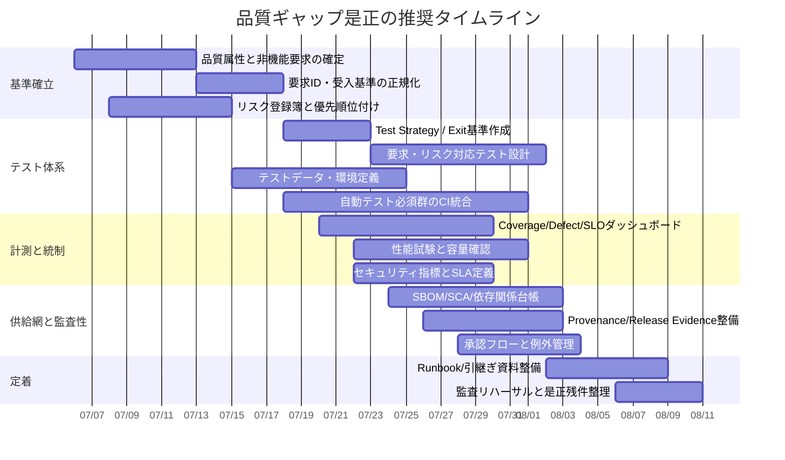
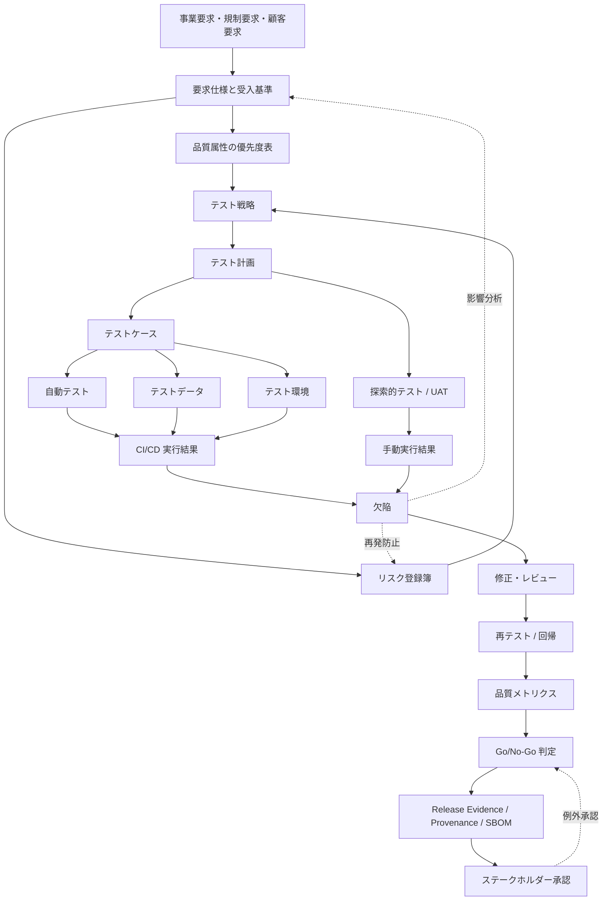

# ソフトウェア品質ギャップ分析報告書

## エグゼクティブサマリー

現時点の結論は明確です。**最大のギャップは「品質が不足していること」そのものの確証ではなく、「品質を説明し、測定し、追跡し、承認できる証跡が見えていないこと」です。今回、プロジェクト固有の資料・メモ・成果物は提示されていないため、ほぼ全領域が未特定**です。ただし、実務上のリリース判定や監査では、証跡が見えない項目は「存在するかもしれない」ではなく、**当面は Missing と同等に扱う**ほうが妥当です。ISO/IEC 25010 は品質モデルを要求の完全性確認、テスト目標設定、品質管理基準、受入基準の識別に用いられるとし、ISO/IEC/IEEE 29119 はテストプロセスとテスト文書の標準を、ISO 9001 は文書化情報・力量・測定評価・継続的改善を要求しています。したがって、証跡未提示そのものが品質ガバナンス上の高リスクです。

加えて、セキュリティは OWASP ASVS と NIST SSDF を基準にすると、要件・設計・テスト・脆弱性対応・プロビナンスまでを一貫して管理する必要があります。依存関係については SBOM がソフトウェア部品とサプライチェーン関係の正式な記録であり、CISA・NTIA・IPA も透明性と運用体制を重視しています。つまり、**「要件はあるが追えない」「テストはあるが網羅性を示せない」「脆弱性対応はしているが依存関係の全体像がない」**という状態は、品質の実力以前に、品質説明責任の欠落として扱われます。

| 最高リスクのギャップ | なぜ高リスクか | 直近で必要な是正 |
| --- | --- | --- |
| 品質要求の基準書未提示 | 何をもって「良い品質」とするかが曖昧だと、受入・テスト・改善がすべて主観化する | 品質属性ごとの受入基準と優先度を明文化 |
| リスク評価未提示 | 高リスク機能にテストやレビューを集中できず、重要欠陥を見逃しやすい | リスク登録簿とリスクベーステスト方針を作成 |
| 要求→テスト→欠陥のトレーサビリティ未提示 | 変更影響分析、未テスト要求の検出、欠陥の再発防止が弱くなる | RTM または ALM 上の双方向リンクを整備 |
| 測定指標と閾値未提示 | 品質が「改善したか」「出荷可能か」を定量判断できない | SLO/KPI/欠陥/カバレッジ/セキュリティ指標を定義 |
| 依存関係・SBOM・プロビナンス未提示 | サプライチェーン上の脆弱性や EOL ライブラリの混入を見落とす | SBOM 生成、SCA 導入、ビルド由来証明を整備 |
| 承認・例外・リリース証跡未提示 | 誰が何を承認したかが残らず、監査・再現・責任分界が不明瞭になる | デプロイ承認、ブランチ保護、リリースエビデンスを有効化 |

上記を高リスクとした理由は、ISO/IEC 25010 が品質モデルを要求・テスト・受入に接続する基盤として位置付け、ISO/IEC/IEEE 29119 がテストの統治・管理・実施プロセスを定義し、ISO 9001 が測定・評価・改善と文書化情報を重視し、NIST SSDF が「現在の到達状態」と「望ましいセキュア開発実践」の差分をギャップとして扱い、アクションプラン化することを明示しているためです。

## 評価前提と判定基準

本報告は、**あなたのプロジェクト資料が未提示**であることを前提にした「厳格な暫定評価」です。そのため、各項目に「提示状況」と「暫定評価」を分けています。**提示状況が未特定**でも、リリース判断上は**Missing\***として扱います。ここでの `Missing*` は「存在しないと断定」ではなく、**現時点で確認可能な証跡がない**ことを意味します。したがって、このレポートは最終監査結果ではなく、**証跡収集の優先順位を決めるためのギャップ分析**です。

評価の基準は、品質特性には ISO/IEC 25010:2023、非機能要求の具体化には IPA の「非機能要求グレード」、テストプロセスと文書には ISO/IEC/IEEE 29119、QMS・文書化情報・力量・測定評価には ISO 9001、セキュリティ要件と検証には OWASP ASVS 5.0 と NIST SSDF、リスク評価には ISO 31000 と NIST SP 800-30、依存関係透明性には SBOM 指針、トレーサビリティには IBM の要求‐テスト連携、リリース統制には GitHub/GitLab の承認・保護・エビデンス機能を採用しています。

なお、あなたが指定した品質次元はそのまま評価軸として採用していますが、標準との対応付けには注意が要ります。ISO/IEC 25010:2023 は製品品質モデルを 9 特性で定義しており、補助的な整理では **testability は maintainability の下位特性、scalability は flexibility の下位特性**として扱われます。したがって、今回のテーブルでは、**保守性・可搬性・拡張性・テスタビリティを別々に評価しつつ、基準参照は ISO 25010 系で統一**しています。

判定ルールは以下です。

| 用語 | 意味 |
| --- | --- |
| Present | 直近版の証跡があり、承認され、運用でも参照されている |
| Partial | 証跡はあるが、古い・未承認・未連携・閾値未定義・継続運用なし |
| Missing | 証跡が見当たらない |
| Missing* | あなたからは未提示。実務上は Missing と同等に扱う暫定判定 |
| 優先度 Critical | 出荷判定・重大障害・重大脆弱性・規制影響に直結 |
| 優先度 High | 重大ではないが品質説明責任と再現性に強く影響 |
| 優先度 Medium | 早期是正が望ましいが直近出荷停止までは通常不要 |
| 工数 S/M/L/XL | S=1–2日、M=3–5日、L=1–2週、XL=2–4週 |

## 詳細ギャップ分析

以下の表は、*現時点ではほぼ全項目が Missing\**である**ことを前提にした、証跡回収と体制整備の優先順位表です。構成は ISO/IEC 25010、ISO/IEC/IEEE 29119、ISO 9001、OWASP ASVS、NIST SSDF、ISO 31000 / NIST SP 800-30、SBOM 指針、トレーサビリティおよびリリース統制の実務資料に沿っています。特に、ASVS は要件を識別子単位で管理でき、SSDF は secure development のギャップをアクションプランに落とし込む前提を持つため、セキュリティと依存関係周りは単なるスキャン結果ではなく、要件化・追跡・継続運用**まで見ないと不十分です。

| 領域 | 提示状況 | 暫定評価 | 必要な証跡 | 優先度 | 推奨アクション | 推奨オーナー | 工数 |
| --- | --- | --- | --- | --- | --- | --- | --- |
| 機能正確性 | 未特定 | Missing* | 要求仕様、受入条件、主要業務フローの期待結果、回帰結果 | Critical | 重要業務フローを列挙し、要求ごとに期待値を固定化。高優先度要求を自動回帰へ | PO / QA / DEV | M |
| 信頼性 | 未特定 | Missing* | SLI/SLO、障害履歴、復旧手順、バックアップ/リストア試験、フェイルオーバー結果 | Critical | 可用性目標、障害分類、復旧試験、障害後レビューを定義 | SRE / DEV | L |
| 性能 | 未特定 | Missing* | 負荷モデル、p95/p99、容量計画、性能試験結果、ボトルネック分析 | Critical | 性能目標を user journey 単位で定義し、負荷・ストレス・容量試験を分離 | SRE / DEV | L |
| セキュリティ | 未特定 | Missing* | 脅威分析、ASVS 対応表、SAST/DAST/SCA/secret scan、脆弱性台帳、ペンテスト | Critical | ASVS レベル選定、SSDF ベースの安全な開発実践、脆弱性 SLA を定義 | SEC / DEV | L |
| ユーザビリティ | 未特定 | Missing* | 主要ユーザシナリオ、ユーザ調査、操作性評価、アクセシビリティ結果 | High | 主要タスク成功率と操作時間を定義し、UX/アクセシビリティ評価を追加 | UX / PO | M |
| 保守性 | 未特定 | Missing* | アーキ図、ADR、複雑度/重複率、静的解析、変更影響分析、テスト容易性 | High | モジュール境界、変更影響分析、静的解析と refactor 優先順を確定 | DEV | M |
| 可搬性 | 未特定 | Missing* | サポート環境一覧、インストール/アップグレード/ダウングレード手順、移行試験 | Medium | 実行環境マトリクスとインストール検証を整備 | DEV / OPS | M |
| スケーラビリティ | 未特定 | Missing* | ワークロード成長前提、スケール試験、容量上限、劣化点 | High | 成長シナリオ別に水平/垂直スケール検証を実施 | SRE / DEV | M-L |
| テスタビリティ | 未特定 | Missing* | モック/スタブ方針、観測性、ログ/トレース、テストフック、容易性レビュー | High | 依存注入、観測性、テストデータ注入点、環境再現性を改善 | DEV / QA | M |
| テスト戦略・計画 | 未特定 | Missing* | テスト方針、スコープ、レベル、エントリ/退出基準、役割、スケジュール | Critical | リスクベースの master test plan を作成 | QA | M |
| テストケース | 未特定 | Missing* | 要求に紐づくテストケース一覧、正/異常/境界/例外 | Critical | 要求とリスクで優先度付けし、欠陥履歴から回帰ケースを再編 | QA / DEV | M-L |
| テストデータ | 未特定 | Missing* | 代表/境界/異常/匿名化データ、生成ルール、更新手順 | High | データ設計書と生成自動化、個人情報マスキングを整備 | QA / DATA / SEC | M |
| テスト環境 | 未特定 | Missing* | 環境構成、バージョン固定、外部依存、再現手順、監視設定 | Critical | 本番類似度と再現性を定義し、IaC で管理 | SRE / QA | L |
| 自動テスト | 未特定 | Missing* | 単体/結合/API/E2E 契約、安定性、実行頻度、失敗時の扱い | Critical | 必須回帰を CI で自動化し、 flaky test 管理を導入 | QA Automation / DEV | L |
| 手動テスト | 未特定 | Missing* | 探索的テスト charters、UAT、可用性/操作性の人手評価 | High | 自動化しにくい領域に限定して責務を再定義 | QA / PO / UX | M |
| CI/CD 統合 | 未特定 | Missing* | パイプライン定義、必須チェック、ブランチ保護、デプロイ承認 | Critical | protected branch、status checks、deployment approvals を強制 | Platform / DEV | M |
| カバレッジ測定 | 未特定 | Missing* | 要求カバレッジ、コードカバレッジ、リスクカバレッジ、計測ロジック | Critical | 3 種の coverage を別軸でダッシュボード化 | QA / DEV | M |
| 欠陥メトリクス | 未特定 | Missing* | 密度、重大度、検出率、流出率、再発率、MTTR、起票→収束データ | Critical | defect taxonomy と SLA を標準化 | QA / DEV / SRE | M |
| 性能 KPI / SLO | 未特定 | Missing* | 速度、成功率、可用性、エラーバジェット、容量閾値 | Critical | SLI/SLO を定義し、アラートと release gate に連結 | SRE / PO | M |
| セキュリティ指標 | 未特定 | Missing* | CVSS 別件数、修正期間、ASVS 充足率、依存脆弱性、秘密情報漏えい | Critical | 脆弱性 SLA と例外承認フローを設計 | SEC | M |
| 要求→テスト→欠陥のトレーサビリティ | 未特定 | Missing* | RTM または ALM リンク、要求変更影響、テスト結果、欠陥連携 | Critical | 双方向リンクを必須化し、未連結項目をゼロに | QA / PO / DEV | M-L |
| 品質標準整合 | 未特定 | Missing* | ISO/IEC 25010 に基づく品質特性の優先度表、受入基準 | High | プロジェクト専用品質モデルを tailoring | QA / PO / Architect | M |
| QMS・文書化・力量 | 未特定 | Missing* | レビュー規程、教育履歴、手順書、監視・分析・改善の証跡 | High | 最低限の QMS ライト版を定義し、文書責任者を置く | PM / Quality Manager | M-L |
| OWASP / SSDF 準拠 | 未特定 | Missing* | secure coding 基準、security requirements、脆弱性対応手順、プロビナンス | Critical | ASVS + SSDF マッピング表を作成し、 pipeline に反映 | SEC / DEV / Platform | L |
| MISRA 適用性 | 未特定 | 適用可否未判定 | 組込み有無、対象言語、 safety/security criticality、MISRA ルールセット | 条件依存 | 組込み/C/C++/安全系なら適用判定を最優先で実施 | Architect / Embedded Lead | S |
| リスク評価 | 未特定 | Missing* | リスク登録簿、発生可能性×影響、残余リスク、受容基準 | Critical | 変更・機能・依存関係単位でリスク評価を実施 | PM / QA / SEC / PO | M |
| 外部ベンチマーク | 未特定 | Missing* | 競合/業界/前リリース比較、DORA、UX 指標、性能比較 | Medium | 自社履歴と外部基準を分けてベースライン化 | PM / SRE / QA | M |
| サードパーティ依存関係 | 未特定 | Missing* | SBOM、ライセンス、EOL 状態、脆弱性、ブロック理由、例外台帳 | Critical | SBOM 生成、SCA 定期実行、EOL 監視、例外承認を導入 | SEC / Platform / DEV | L |
| ツールチェーンと自動化 | 未特定 | Missing* | 静的解析、SCA、secret scan、artifact provenance、release evidence | High | ビルド由来証明と監査証跡を release 単位で保存 | Platform / SEC | M-L |
| ドキュメントと知識移転 | 未特定 | Missing* | 運用 Runbook、障害対応、ADR、引継ぎ資料、FAQ、教育記録 | High | 属人化しやすい領域から順に runbook 化 | PM / Tech Lead / SRE | M |
| ステークホルダー承認 | 未特定 | Missing* | UAT 承認、残留リスク承認、例外承認、リリース Go/No-Go 記録 | Critical | 承認役割、自己承認禁止、例外の期限付き承認を定義 | PO / QA / SEC / Release Manager | M |

この表で特に重要なのは、**要求、リスク、テスト、欠陥、リリース承認が一本の管理線で繋がっていない限り、品質は改善できても説明できない**という点です。IBM の統合レポートでも、要求ごとに「テスト計画・テストケースの有無」「承認済みか」「実行済みか」「総合結果」が見える構造が重視されています。また GitHub / GitLab は、ブランチ保護、必須レビュー、デプロイ承認、リリースエビデンスによって、この説明責任を実装レベルで支えられます。

## 収集すべきアーティファクトチェックリスト

実務上は、「何があるか」よりも**何が証跡として再利用できるか**が重要です。ISO 9001 は文書化情報、力量、測定評価、改善を重視し、ISO/IEC/IEEE 29119 はテスト文書テンプレートを、SSDF はセキュリティ要求・設計判断・プロビナンス・脆弱性対応を追跡対象に含めています。したがって、下表のアーティファクトは**監査・引継ぎ・再現・変更影響分析**の最小セットとして扱うのが妥当です。

| 優先 | アーティファクト | 用途 | 最低条件 |
| --- | --- | --- | --- |
| A | 品質属性一覧と優先度表 | 品質要求の基準化 | 各品質属性に受入条件・優先度・オーナーがある |
| A | 非機能要求仕様 | 可用性・性能・運用・セキュリティの明確化 | IPA 非機能要求グレード相当の網羅性がある |
| A | 要求仕様と受入基準 | 機能正確性の基準化 | 要求 ID が一意で受入条件がある |
| A | リスク登録簿 | リスクベーステストと残余リスク管理 | 影響・可能性・対策・残余リスク・承認者がある |
| A | Master Test Plan / Test Strategy | テスト統治 | スコープ、役割、環境、入口/出口基準が定義済み |
| A | 要求対応テストケース一覧 | 網羅性説明 | 要求 ID またはリスク ID に紐付く |
| A | 探索的テスト charters / UAT 記録 | 自動化外の補完 | 観点・結果・発見事項が残る |
| A | テストデータ設計書 | 再現性・PII 管理 | データ種別、生成方法、匿名化方針がある |
| A | テスト環境定義書 / IaC | 再現性 | 本番との差分が説明できる |
| A | CI/CD 定義ファイル | 品質ゲートの自動化 | 必須チェックと失敗時挙動が明記される |
| A | カバレッジレポート | 網羅性の定量判断 | 要求・コード・リスク別に見える |
| A | 欠陥台帳 | 収束管理 | 重大度・優先度・原因・修正版・再発有無がある |
| A | 性能試験計画・結果 | 容量・劣化点把握 | workload、p95/p99、成功条件、ボトルネック分析を含む |
| A | SLI/SLO 文書とエラーバジェット方針 | 信頼性運用 | 指標、目標、アラート、逸脱時対応がある |
| A | セキュリティ要求表 | セキュア開発の基準化 | ASVS レベルまたは同等基準への対応表がある |
| A | 脅威分析 / 脆弱性台帳 | セキュリティ設計と運用 | 脅威、対策、残留リスク、担当が明確 |
| A | SBOM と SCA レポート | 依存関係透明性 | バージョン、ライセンス、既知脆弱性、EOL を含む |
| A | リリース承認記録 / 例外承認票 | Go/No-Go の説明責任 | 承認者、条件、期限、未解決事項がある |
| B | ADR / アーキ図 | 保守性・変更影響分析 | 主要設計判断が残る |
| B | Runbook / 障害対応手順 | MTTR 短縮 | 監視、一次切り分け、復旧手順が記載される |
| B | 教育記録 / 引継ぎ記録 | 知識移転 | 対象者、内容、確認方法がある |
| B | Release evidence / artifact provenance | 監査・供給網保証 | どのコード・成果物・テストから release が出来たか示せる |
| C | 外部ベンチマーク比較表 | 相対評価 | 自社前版・競合・業界基準の比較がある |
| C | MISRA 適用判定書 | 組込み時の規格適用 | 対象言語・対象範囲・例外管理が明確 |

## 推奨メトリクスと暫定閾値

以下は**標準そのものの必須値ではなく、資料未提示のプロジェクトに対してまず導入しやすい暫定ベースライン**です。ISTQB は coverage・defect・risk・availability・response time などを代表的メトリクスとして挙げ、DORA は delivery performance の 4 指標、Google SRE は SLO と error budget の運用、NVD は CVSS を重大度尺度、NIST は情報セキュリティメトリクスを柔軟に選定・運用すべきとしています。したがって、**絶対値だけでなく、継続トレンドと release gate への接続**を前提に使うことが重要です。

| 指標 | 暫定閾値 | 使い方 | 補足 |
| --- | --- | --- | --- |
| 要求カバレッジ | Critical 要求は 100%、全体は 95% 以上 | リリース前ゲート | 未連結要求が 1 件でも Critical ならブロック |
| リスクカバレッジ | Critical / High リスクは 100% | リスクベース判定 | 予防テストまたは検出機構のどちらか必須 |
| コードカバレッジ | 単体テスト line/statement 80% 以上、branch 70% 以上。Critical モジュールは branch 90% 以上 | 傾向監視 + 下限ゲート | 数字のみでなく変更差分 coverage も併用 |
| 自動テスト必須スイート成功率 | 100% | マージ/デプロイゲート | flaky test は別管理に隔離 |
| flaky test 率 | 2% 未満 | テスト基盤健全性 | 2 スプリント連続超過ならテスト基盤改善を優先 |
| Open defect 数 | Sev1/Critical=0、Sev2/High は期限付き例外のみ | リリース判定 | 例外は回避策・オーナー・期限必須 |
| 欠陥密度 | 絶対値固定より**前 3 スプリント平均比で 20% 以上悪化したら要原因分析** | 傾向監視 | 欠陥密度は製品特性依存が強い |
| MTTR | P1 は 4 時間以内、P2 は 1 営業日以内 | 運用品質 | 重大度ごとに別閾値を置く |
| 変更障害率 | 15% 未満を当面目標 | DORA 監視 | 運用成熟前はトレンド改善を主目標にしてよい |
| SLO 可用性 | 一般的なユーザ向けサービスは 99.9% を初期値、業務影響が大きい場合は 99.95% 以上を検討 | サービス品質 | error budget は 1 - SLO |
| error budget 消費 | 期間内超過ゼロ。高 burn rate 検知でリリース抑制 | 信頼性統制 | 予算使い切り時の行動を事前定義 |
| API 遅延 | 同期 API の初期目標として p95 読取 300ms、更新 500ms、p99 1s 以内 | 性能 gate | システム特性で要調整 |
| Web UX | p75 LCP 2.5s 以下、INP 200ms 以下、CLS 0.1 以下 | Web 製品向け | フィールドデータを優先 |
| セキュリティ重大度 | Internet-facing 資産で CVSS 9.0 以上の未対処ゼロ、CVSS 7.0 以上は release 前に是正または期限付き承認 | セキュリティ gate | CVSS は重大度であり、リスクは別途業務文脈で補正 |
| 脆弱性修正 SLA | Critical 7日以内、High 30日以内、Medium 90日以内 | 継続運用 | 悪用実証あり・露出ありなら短縮 |
| ASVS 充足率 | 選定レベルの Must 項目 100% | セキュリティ検証 | 例外は compensating control を文書化 |
| 依存関係健全性 | 本番依存の EOL ライブラリ 0、SBOM は各 release で生成 | 供給網管理 | 重大ライブラリは transitive dependency も監視 |
| プロビナンス | 本番配布アーティファクトの 100% に provenance / evidence を紐付け | 監査・供給網保証 | release 単位で保存・再検証可能にする |
| 承認遅延 | Go/No-Go 承認の未完了ゼロ | リリース統制 | 条件付き承認は期限付きに限定 |

この閾値表のうち、Web UX の LCP / INP / CLS は Google の Core Web Vitals の公式しきい値を採用しています。SLO と error budget は Google SRE の考え方、DORA 4 指標は Google Cloud の公式解説、CVSS は NVD の重大度尺度、coverage・defect・risk 指標は ISTQB の整理を基礎にしています。欠陥密度や変更障害率などは業種ごとの差が大きいため、**固定値での合否判定よりも、まずはベースライン化と悪化検知のルール化**を推奨します。

## 優先参照ソース

以下は、**まず当たるべき一次情報と、実務に直結する補助ソース**です。あなたの要望どおり、**公式標準・原典・ベンダードキュメントを優先**し、日本語ソースがあるものは併記しています。

| 優先 | ソース | 使いどころ | 日本語 |
| --- | --- | --- | --- |
| 最優先 | ISO/IEC 25010:2023 の公式ページ | 品質属性の公式な参照モデル | 公式本文は主に英語 |
| 最優先 | IPA 非機能要求グレード | 非機能要求の漏れ防止、要求レベルの具体化 | あり |
| 最優先 | ISO/IEC/IEEE 29119-2 / -3 | テストプロセス、テスト文書、手動/自動/非機能テスト整理 | 公式は主に英語 |
| 最優先 | ISO 9001:2015 公式ページ | 文書化情報、力量、測定評価、改善、承認フロー | 公式は主に英語 |
| 最優先 | OWASP ASVS 5.0 公式ページ | セキュリティ要求と検証の基準化 | 公式英語。日本語はコミュニティ/案内あり |
| 最優先 | NIST SSDF SP 800-218 / SSDF project page | セキュア開発プロセス、プロビナンス、脆弱性応答 | 英語 |
| 最優先 | ISO 31000 / NIST SP 800-30 | 品質リスク評価、残余リスク判断 | 英語 |
| 高 | NVD CVSS ページ | 脆弱性重大度の共通尺度 | 英語 |
| 高 | NTIA SBOM minimum elements / CISA SBOM / IPA SBOM 手引き | 依存関係透明性、ライセンス、供給網管理 | IPA は日本語 |
| 高 | OWASP Dependency-Track / Dependency-Check | SCA と SBOM ベースの運用 | 英語 |
| 高 | IBM DOORS / ETM traceability docs | 要求→テスト→欠陥の追跡設計 | 英語 |
| 高 | GitHub branch protection / deployment approvals / attestations | 必須レビュー、環境承認、ビルド由来証明 | 一部日本語あり |
| 高 | GitLab deployment approvals / release evidence | デプロイ承認、監査証跡、リリース証拠 | 日本語あり |
| 高 | Google SRE SLO / Error Budget | 信頼性目標、アラート、エラーバジェット運用 | 英語 |
| 高 | DORA 指標の公式解説 | 配送性能・変更安定性・MTTR の外部ベンチマーク | 日本語あり |
| 条件付き最優先 | MISRA 公式と MISRA Compliance:2020 | 組込み/C/C++/安全系ソフトの場合の規範 | 英語 |
| 条件付き高 | Core Web Vitals 公式解説 | Web 製品の UX 性能指標 | 一部日本語あり |
| 補助 | ISO 25000 Portal | 25010 の特性・下位特性整理の理解補助 | 英語 |

## 是正ロードマップとトレーサビリティ可視化

是正の順序は、**要求の定義→リスクの優先順位付け→テストとトレーサビリティ→測定とゲート→供給網と承認**の順が最も合理的です。これは、ISO/IEC 25010 が要求定義・テスト目標・受入基準の起点になり、ISO/IEC/IEEE 29119 がテスト統治を支え、SSDF がセキュア開発のギャップをリスクベースで埋め、GitHub/GitLab が承認と証跡を実装できるためです。

トレーサビリティは、単に表を作ることではなく、**変更影響分析・未テスト要求の検出・欠陥再発防止・承認の説明責任**を成立させる仕組みです。IBM のトレーサビリティ/テストレポートは、要求単位のテスト計画、テストケース、承認状態、実行状態、結果を見せる構造を採っています。GitLab の release evidence や GitHub の attestations / approvals を加えると、**要求から release artifact までの証跡鎖**を構築できます。

このフローで重要なのは、**要求と欠陥の間をテストが媒介し、メトリクスと承認が最後に乗る**ことです。要求・テスト・欠陥・承認のどれか一つが欠けると、品質判断は「感覚の会議」になりがちです。逆に、この流れが繋がれば、品質はかなり冷静に扱えます。ソフトウェア品質の世界に魔法は少ないですが、**リンクは裏切りません**。