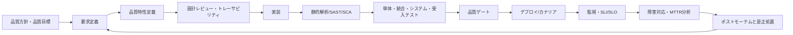
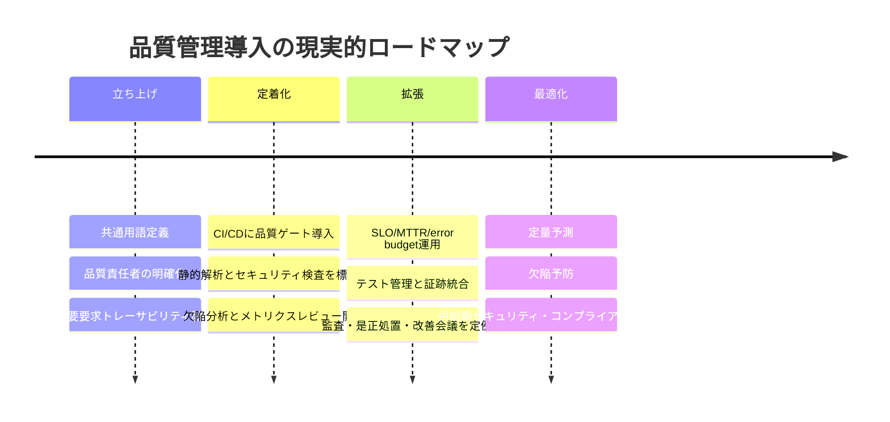

# ソフトウェア品質管理実務リファレンス

## エグゼクティブサマリ

世界水準のソフトウェア品質管理を実務で機能させるには、**品質を「テスト活動」ではなく「経営管理システム」と「工学的制御システム」の二層で扱う**のが最も再現性の高いアプローチです。上位層では ISO 9001 のような品質マネジメントシステムで方針・責任・監査・継続的改善を回し、下位層では ISO/IEC 25010 の品質特性、ISO/IEC/IEEE 12207 のライフサイクルプロセス、IEEE 1012 と ISO/IEC/IEEE 29119 の V&V・テストプロセス、CMMI や TMMi の成熟度改善を組み合わせて、要求から運用までを定量管理します。ISO/IEC 15504 系の SPICE は現在 330xx 系に置き換わっており、新規導入では 33004/33020 系の理解を前提にしたほうが実務上は安全です。

実務上の要点は三つです。第一に、**品質特性を要求として明文化**することです。可用性、性能、保守性、セキュリティ、回復性などを「よいシステム」の感覚論で終わらせず、仕様、受け入れ条件、運用品質指標に落とし込みます。第二に、**品質を CI/CD と本番運用に埋め込む**ことです。静的解析、SAST/SCA、単体・統合・E2E テスト、品質ゲート、カナリア、監視、SLO、ポストモーテムまでが一続きの品質制御ループになります。第三に、**品質メトリクスは“数を増やす”より“意思決定に効くものを厳選する”**ことです。DORA 指標、テストカバレッジ、欠陥密度、欠陥流出率、MTTR、重複率、技術的負債比率、セキュリティレビュー率などを、リリース判定・投資配分・改善優先順位付けに結び付けてはじめて価値を持ちます。

日本語実務で特に有用なのは、JSTQB/ISTQB の用語体系と、IPA の「非機能要求グレード」です。前者はテスト、欠陥、検証、テストレベル、カバレッジなどの共通語彙を提供し、後者は可用性、性能・拡張性、運用・保守性、移行性、セキュリティ、システム環境・エコロジーの観点で非機能要求の抜け漏れを防ぎます。品質不全の多くは、実装力不足よりも**要求の曖昧さ、責任の分散、測定設計の欠如**から起きるため、この二つは日本の現場で特に効きます。

本報告書の実務結論は明確です。**小規模組織は「品質の最小有効システム」を 90 日で立ち上げること、中規模組織は品質ゲートとトレーサビリティをプロセス標準として定着させること、大規模組織は品質・セキュリティ・コンプライアンス・運用品質を単一のガバナンスモデルで統合すること**が最優先です。規格準拠は目的ではなく、再現性のある品質供給能力を作る手段として使うべきです。

## 中核概念と用語体系

ソフトウェア品質管理を混乱させる最大要因は、**似た言葉を異なる意味で使うこと**です。まず基準点として、ISO 9000 系では品質を「対象が要求を満たす程度」と定義しており、ISO 9001 はその品質を継続的に実現するための QMS を要求します。つまり品質は「バグが少ないこと」だけではなく、要求、期待、利用状況、法規制、運用品質まで含む概念です。ISO/IEC 25010 はこの品質を、機能適合性、性能効率性、互換性、信頼性、セキュリティ、保守性などの特性に分解して、要求・測定・評価できる形にします。

実務では **QA、QC、テスト、V&V を分けて設計**する必要があります。IEEE 730 はソフトウェア品質保証プロセスの計画・統制・実行を扱い、IEEE 1012 は V&V を「成果物がその活動の要求に適合しているか」と「製品が意図された用途・ユーザニーズを満たすか」を判断するプロセスとして扱います。ISO/IEC/IEEE 29119 はテストを、あらゆるライフサイクルモデルで適用できるガバナンス・マネジメント・実行プロセスとして定義します。したがって、**QA はプロセスそのものの信頼性を作る活動、QC は成果物の品質判定活動、テストは QC を構成する主要技法、V&V は設計から運用までにまたがる適合性・妥当性評価の総称**として整理すると、組織運用が安定します。

下表は、品質管理で最低限そろえるべき用語の実務定義です。

| 用語 | 実務での意味 | 使いどころ |
| --- | --- | --- |
| 品質 | 要求・期待・制約をどれだけ満たせているか | 目標設定、受入判定、監査 |
| 品質保証 | 品質が安定して実現されるようプロセスを設計・監査・改善すること | 標準化、監査、品質計画 |
| 品質管理 | 成果物や工程を測定し、逸脱を是正すること | レビュー、テスト、統計管理 |
| テスト | 欠陥・リスク情報を得るために成果物を評価する活動 | 動的検証、回帰確認、受入判定 |
| 検証 | 各工程成果物がその工程の要求を満たすか確認すること | 仕様レビュー、設計レビュー、単体試験 |
| 妥当性確認 | 製品が利用目的とユーザニーズを満たすか確認すること | 受入試験、UAT、運用適合確認 |
| 欠陥 | 成果物が要求や仕様を満たしていない不備 | 不具合分析、予防策立案 |
| 故障 | 実行中に要求を満たせない事象 | 障害管理、SRE、再発防止 |
| 信頼性 | 一定条件・一定期間、要求機能を果たし続ける度合い | SLO、可用性設計、耐障害性 |
| 保守性 | 修正・改善・適応を効率良く行える度合い | 設計、静的解析、負債管理 |
| 可用性 | 必要時に稼働・アクセス可能な度合い | SLA/SLO、運用設計、DR |
| セキュリティ | 権限に応じて情報・機能を保護し攻撃に耐える度合い | セキュア開発、監査、脆弱性管理 |

この表の定義は、ISO 9001/9000 系の品質概念、IEEE 1012 の V&V、ISTQB/JSTQB の用語集、ISO/IEC 25010 系の品質特性を実務向けに要約したものです。ISTQB では検証を「作業成果物が仕様を満たしていることを確認するプロセス」、欠陥を「要求や仕様に満たない作業成果物上の不完全性」、故障を「実行時に要求を満たさない事象」として扱っています。ISO 25010 系の解説では、信頼性の下位概念として可用性・障害許容性・回復性、保守性の下位概念としてモジュール性・解析性・修正性・テスト容易性、セキュリティの下位概念として機密性・完全性・真正性・責任追跡性などが整理されています。

一つだけ強調すると、**テスト結果が良いことと品質が高いことは同義ではありません**。要求が曖昧なら、良いテストでも悪い製品を合格させます。逆に、要求が明確でトレーサブルなら、テストは品質の証拠装置として強く働きます。品質は「要求工学 × 設計品質 × 実装品質 × 運用品質」の積です。

## 規格とフレームワークの使い分け

規格は多いですが、実務では **役割ごとに分けて使う** と分かりやすくなります。すなわち、**管理系、製品品質系、プロセス系、テスト系、成熟度系、教育系**です。以下の対応表を起点にすると、導入順序を誤りにくくなります。

| 規格・フレームワーク | 主目的 | 適用範囲 | 現場での使い方 |
| --- | --- | --- | --- |
| ISO 9001 | QMS の確立・維持・継続的改善 | 組織全体 | 品質方針、責任、監査、是正処置、マネジメントレビュー |
| ISO/IEC 25010 | 品質特性の体系化 | 製品・システム | 非機能要求、品質評価軸、受入基準 |
| ISO/IEC/IEEE 12207 | ソフトウェアライフサイクル共通枠組み | 企画〜廃止 | プロセス定義、役割定義、工程間整合 |
| ISO/IEC 15504 / 330xx | プロセス能力評価 | 組織・プロジェクト | アセスメント、改善計画、能力レベル評価 |
| IEEE 1012 | V&V プロセス標準 | システム・ソフト・HW | レビュー/分析/試験の整合設計 |
| IEEE 730 | SQA プロセス標準 | 開発・保守プロジェクト | SQA 計画、監査、統制、証跡管理 |
| ISO/IEC/IEEE 29119 | テストプロセス・文書・技法 | 全ライフサイクル | テスト方針、文書テンプレート、リスクベースドテスト |
| CMMI | 組織能力・成熟度向上 | 組織横断 | 改善ロードマップ、成熟度評価、経営連携 |
| TMMi | テストプロセス成熟度向上 | テスト組織・QA 組織 | テスト標準化、測定、欠陥予防、最適化 |
| ISTQB/JSTQB シラバス | 共通語彙・教育体系 | 個人/組織 | スキル標準、研修カリキュラム、採用基準 |

この整理の重要ポイントは四つあります。**第一に、ISO 9001 は「組織の品質運営」、ISO/IEC 25010 は「何を品質とみなすか」、12207 は「どう開発・保守するか」を扱う**ため、競合ではなく補完関係です。第二に、**SPICE は 15504 を歴史的参照として理解しつつ、現行運用は 33004/33020 系を見る**のが妥当です。ISO 15504-5 は withdrawn で、33020 はプロセス能力評価の測定枠組み、33004 は参照モデル・アセスメントモデル・成熟度モデルの要求を規定します。第三に、**IEEE 1012/730/29119 は“現場のやり方”に近い**ので、プロジェクト標準やテンプレートに落とし込みやすいです。第四に、**CMMI/TMMi/ISTQB は法規制や ISO の代替ではなく、改善・教育・成熟度可視化の実装レイヤ**として使うと効果が出ます。

CMMI は現在、開発・サービス・サプライヤ管理に加え、セキュリティやデータ管理、人材管理などを含む統合モデルへ広がっています。成熟度レベルは Level 0 から 5 までで、Level 2 はプロジェクト管理された状態、Level 3 は組織標準に基づく定義済み状態、Level 4 は定量管理、Level 5 は継続最適化です。一方 TMMi はテストプロセスに特化し、Level 4 で測定に基づく製品・プロセス品質管理、Level 5 で欠陥予防と最適化に進みます。品質組織の改善には、この二つを**CMMI = 組織運営、TMMi = テスト運営**として二層で使うのが実践的です。

JSTQB/ISTQB は規格ではありませんが、**組織に品質文化をインストールする“共通言語装置”**として極めて重要です。JSTQB は Foundation/Advanced/各種 Specialist の日本語シラバスを継続提供しており、現場教育や職種定義に直結させやすい点が大きな利点です。規格が「何を守るか」を示し、シラバスが「現場の人がどう理解するか」を支えます。

## 品質モデルと開発プロセスへの統合

品質が高い組織は、品質活動を工程の最後に置きません。**要求、設計、実装、デプロイ、運用の各フェーズに品質制御点を埋め込み、証拠が自動的に蓄積される状態**を作ります。V モデルはこの原理を最も分かりやすく表したモデルで、開発の各フェーズに対応するテストレベルを明示し、検証と妥当性確認を構造化します。IEEE 1012 も V&V を全ライフサイクルにまたがるプロセスとして扱っており、29119 はこの考え方を任意の SDLC に適用できるよう一般化しています。

上図の流れは、ISO 9001 の継続的改善、12207 のライフサイクル、29119 のテストプロセス、NIST SSDF のセキュア開発、DORA/SRE の本番品質管理を重ね合わせた実務形です。重要なのは、**品質ゲートの前に要求トレーサビリティを置くこと、品質ゲートの後に監視と学習ループを置くこと**です。前者がないと「何を満たせば合格か」が曖昧になり、後者がないと「本当に良い品質だったか」を学習できません。

TMMi はこの統合を**テストプロセス改善の成熟度**として整理します。TMMi Foundation は TMMi を自由に利用できるテスト成熟度モデルとして提供しており、TMMi Model v2.0 は Agile と DevOps の実践例、Quality Engineering、AI との接続まで取り込んでいます。現代的な意味では、TMMi は「テスト部門の改善モデル」ではなく、**自動化と運用品質を含めた品質エンジニアリング組織の改善モデル**として読むほうが実務的です。

CMMI は、品質を単独の工程ではなく**組織能力**として扱います。Level 2 以上では計画・測定・統制が前提となり、Level 4 では予測可能な定量管理、Level 5 では継続最適化が要求されます。この考え方は DevOps/CI-CD と矛盾しません。むしろ、**DevOps は変更フローの高速化、CMMI はその高速化を持続可能にする管理能力**として併用できます。

DevOps/CI-CD で特に重要なのは、品質を「デプロイ前の阻止」だけでなく「本番での制御」まで広げることです。DORA は現在、ソフトウェアデリバリーパフォーマンスを測る主要指標として deployment frequency、change lead time、failed deployment recovery time、change failure rate、deployment rework rate の 5 指標を提示しています（変遷と現行定義の詳細は[本番運用品質・SRE・オブザーバビリティ](../operations-quality/production-quality-sre-observability.md)を参照）。Google SRE は SLO と error budget を用いて、機能開発速度と信頼性のトレードオフを定量的に管理します。これは品質管理の観点では、**“不具合を減らす”から“許容リスクの範囲で価値を最適化する”への進化**です。

日本の業務システムや基幹システムでは、IPA の「非機能要求グレード」を要求定義フェーズに差し込むと効果的です。可用性、性能・拡張性、運用・保守性、移行性、セキュリティなどの要求を体系的に洗い出せるため、ISO/IEC 25010 の品質特性を日本語の実務会話へ翻訳する役割を果たします。つまり、**25010 が品質モデル、IPA 非機能要求グレードが要求定義の実務テンプレート**です。

## 品質指標と測定設計

品質指標の設計で最も重要なのは、**指標を「観察用」と「制御用」に分けること**です。観察用は現状把握、制御用は合否判定や投資判断に使います。すべてを制御指標にすると、現場はメトリクスに最適化し始めます。逆に観察用だけだと、改善が進みません。理想は、**経営指標 3〜5、品質ゲート指標 5〜8、分析用指標は必要に応じて追加**です。

下表は、実務で頻度高く使うメトリクスです。式は規格・公式定義から導いた実務式で、閾値欄は**公式既定値があるものはそれを優先し、ないものは導入初期の推奨値**として示しています。

| 指標 | 実務式 | 推奨の見方 | 閾値例 |
| --- | --- | --- | --- |
| 要求トレーサビリティ率 | 紐付済み要求数 ÷ 対象要求数 × 100 | 重要要求ほど 100% 必須 | 重要要求は 100% |
| ステートメントカバレッジ | 実行済み文数 ÷ 実行可能文数 × 100 | 広く浅い検査 | 新規コード 80% 以上を開始点 |
| ブランチカバレッジ | 通過分岐数 ÷ 総分岐数 × 100 | 分岐起因欠陥に有効 | 重要ロジックは 80% 以上を開始点 |
| 欠陥密度 | 欠陥数 ÷ サイズ | kLOC, FP, story 単位を固定 | しきい値より推移監視が重要 |
| 欠陥検出率 DDP | 当該レベル検出欠陥数 ÷ 当該以降で見つかった総欠陥数 | テストレベルの効率測定 | 結合/システムで高水準を期待 |
| 変更失敗率 CFR | 障害化した変更数 ÷ 総変更数 × 100 | DevOps 安定性の中核 | 0〜15% は強い水準 |
| MTTR | 総復旧時間 ÷ 障害件数 | 回復性・運用力 | 重大障害は 60 分未満を目標化しやすい |
| MTBF | 総稼働時間 ÷ 障害件数 | 信頼性の基礎 | 上昇傾向が望ましい |
| 可用性 | 稼働時間 ÷ 全時間 × 100 | SLO/契約水準 | 99.9% 以上など業務要求依存 |
| 重複率 | duplicated_lines ÷ lines × 100 | 保守性の劣化検知 | 新規コード 3% 以下 |
| 技術的負債比率 | remediation cost ÷ development cost × 100 | 保守性と将来コスト | Sonar の A は 5% 以下 |
| セキュリティホットスポットレビュー率 | レビュー済み件数 ÷ 総件数 × 100 | リリース前統制 | 新規 100% |

この表の定義根拠は、ISTQB の statement coverage / branch coverage / defect density / defect detection percentage の用語、IBM の MTTR / MTBF 定義、DORA/Four Keys の change failure rate と lead-time family、SonarQube の duplication density / technical debt ratio / quality gate 条件です。Sonar の公式既定で、**新規コードのテストカバレッジ 80%以上、重複率 3% 以下、全 Security Hotspots レビュー済み、No new issues** が品質ゲートの代表条件として示されています。

DORA の歴史的ベンチマークは、**高い品質と高いデリバリー速度が両立できる**ことを示した点で重要です。2019〜2021 の公式資料では、上位組織はオンデマンドまたは 1 日複数回のデプロイ、1 時間未満〜1 日未満の変更リードタイム、0〜15% の change failure rate、1 時間未満の回復時間を示しています。これは「速く出すと品質が落ちる」という発想が必ずしも正しくないことを示す有力な実証です。

ただし、**カバレッジ単独では品質を表せません**。カバレッジは「どこを通したか」であり、「何を保証したか」ではないからです。実務では、カバレッジは以下のように組み合わせて使うと強くなります。

- 重要要求トレーサビリティ率
- 重要機能のブランチカバレッジ
- 欠陥流出率
- MTTR
- 変更失敗率
- 新規コード重複率
- 新規重大脆弱性ゼロ

この組み合わせにすると、**要求品質、実装品質、運用品質、セキュリティ品質**を一枚のダッシュボードで見られます。

## ツールと自動化の選定

ツール選定の原則は、**“機能の多さ”より“証拠がつながるか”**です。品質管理で本当に効くツールは、①開発フローに自然に埋め込める、②結果を API/レポート/監査証跡として残せる、③トレーサビリティを切らない、④品質ゲートを自動化できる、の四条件を満たすものです。CI/CD、静的解析、セキュリティ、テスト管理、トレーサビリティが別々の島になっていると、監査可能性も改善速度も落ちます。

### 代表製品の比較

| 製品 | 主カテゴリ | 主な用途 | 導入コストの目安 | 適用規模 | 長所 | 注意点 |
| --- | --- | --- | --- | --- | --- | --- |
| GitHub Actions | CI/CD | build/test/deploy 自動化 | public/self-hosted は無料、private は無料分超過で従量 | 小〜大 | GitHub 連携が強い、導入が速い | ランナー/課金設計が必要 |
| GitLab Premium/Ultimate | DevSecOps 統合 | SCM、CI/CD、セキュリティ、コンプライアンス | Premium は $29/user/月、Ultimate は要見積 | 中〜大 | 単一製品で統合しやすい | フル活用には運用設計が必要 |
| Jenkins | CI/CD | 柔軟な自動化ハブ | OSS 無償 | 中〜大 | プラグイン豊富、自由度高い | 保守・セキュリティ負荷は自前 |
| SonarQube | 静的解析/品質ゲート | コード品質、重複、負債、品質ゲート | Free あり、$34/月〜 | 小〜大 | 品質ゲートの標準化に強い | ルール/除外設計が必要 |
| Snyk | AppSec | SCA/SAST/Container/IaC | Free、Team $25/月/開発者〜 | 小〜大 | 開発者寄り UX、SDLC 埋込が容易 | 製品ごとの契約整理が必要 |
| TestRail | テスト管理 | ケース、計画、実行、カバレッジ、証跡 | Professional $37/席/月、Enterprise $45/席/月 | 中〜大 | テスト管理が明快、監査向き | 別途 Jira/CI 連携設計が必要 |
| Xray for Jira | Jira ネイティブ品質管理 | 要求・テスト・欠陥のトレーサビリティ | Atlassian 有償、30日試用 | 小〜大 | Jira と要件/欠陥を密結合 | Jira 前提、全体原価は Jira 依存 |
| Allure TestOps | テストオーケストレーション | 自動テスト結果集約、品質可視化 | $39/ユーザー/月〜 | 中〜大 | 自動テストとの親和性が高い | 手動要求管理は補完が必要 |

この比較表のコストと主機能は各製品の公式ページに基づいています。GitHub Actions は public repositories と self-hosted runners で無料、private repositories はプランごとの無料枠と従量課金、標準 Linux 2-core runner は $0.006/分などの課金です。GitLab Premium は $29/user/月で、GitLab は SCM・CI/CD・セキュリティ・コンプライアンスを統合します。SonarQube は private projects 向け free tier があり、100k LOC まで $34/月からです。Snyk は Free、Team $25/月/開発者からで、SCA/SAST/Container/IaC を提供します。Jenkins は OSS の自動化サーバです。TestRail は Professional $37/席/月、Enterprise $45/席/月で、トレーサビリティとカバレッジ報告、監査機能を備えます。Xray は Jira ネイティブのテスト管理で、Standard/Advanced の試用が可能な Atlassian Marketplace 有償製品です。Allure TestOps Cloud は $39/ユーザー/月からです。

実務上の選び方は次の通りです。**小規模チーム**は GitHub Actions または GitLab、SonarQube、Snyk を中心にして、テスト管理は軽量に始めるのが合理的です。**中規模以上**で複数チーム・複数リリース列がある場合は、TestRail か Xray のようなトレーサビリティ基盤が効きます。**規制産業や大規模組織**では、CI/CD 自動化よりも「監査証跡、変更承認、品質ゲート、SBOM/プロバナンス、セキュリティ例外承認」の証拠連結が本質になるため、統合プラットフォームまたは厳格な証跡設計が必要です。

## リスク、コンプライアンス、セキュリティ品質

高度な品質管理では、**セキュリティを別物として扱わない**ことが重要です。ISO/IEC 25010 でもセキュリティは品質特性の一つとして扱われ、Google SRE も「安全でなければ本当に信頼できるとは言えない」と明示しています。つまり、セキュリティ品質は品質管理の外部要素ではなく、**品質そのものの一部**です。

統合の際に核となるのは、次の五つの枠組みです。

| 枠組み | 役割 | 実務での使い方 |
| --- | --- | --- |
| ISO/IEC 27001 | 情報セキュリティ管理システム | 組織統制、資産・リスク・監査 |
| NIST SSDF | セキュア開発実践 | SDLC へのセキュリティ埋め込み |
| OWASP ASVS | アプリケーション検証要求 | セキュリティ受入基準・レビュー基準 |
| NIST CSF 2.0 | サイバーリスク管理 | ガバナンス、識別、防御、検知、対応、復旧 |
| SLSA | サプライチェーン完全性 | ビルド証跡、改ざん防止、由来保証 |

この表の使い方はシンプルです。**ISO/IEC 27001 は組織統制、SSDF は開発実務、ASVS は製品レベルの技術検証、CSF 2.0 は経営・リスク対話、SLSA はビルドと供給網の完全性**に使います。SSDF は「多くの SDLC モデルはセキュリティを十分扱わないため、各 SDLC 実装にセキュア開発実践を追加する必要がある」と明言しており、まさに品質管理への統合を想定しています。OWASP ASVS は技術的セキュリティコントロール検証の基礎を提供し、SLSA は改ざん防止と provenance を重視します。NIST CSF 2.0 はどのような組織にも有用な長期的ガイダンスとして設計されています。

日本語資料としては、SAJ による NIST SP 800-218 SSDF 1.1 日本語翻訳版、IPA の非機能要求グレードが有用です。前者はセキュア開発フレームワークの実務浸透に使いやすく、後者はセキュリティを非機能要求の一項目として早い段階で定義するのに役立ちます。つまり、**セキュリティ品質は「開発後に診断で確認するもの」ではなく「要件・設計・ビルド・運用で継続制御するもの」**です。

実務での統合ポイントは次の通りです。

| フェーズ | 品質・セキュリティ統合ポイント | 必要な証跡 |
| --- | --- | --- |
| 要求 | 25010 + IPA 非機能要求グレード + 脅威モデル | 要求仕様、リスク登録簿 |
| 設計 | アーキレビュー、ASVS 対応方針、分離・最小権限 | 設計レビュー記録、対策方針 |
| 実装 | SAST、SCA、Secrets、IaC 検査 | スキャン結果、例外承認 |
| ビルド | 再現性、署名、provenance、SBOM | ビルドログ、署名、SBOM |
| テスト | 機能試験 + セキュリティ検証 + 回復性試験 | テスト結果、欠陥票、攻撃シナリオ結果 |
| リリース | 品質ゲート、重大脆弱性ゼロ、ロールバック確認 | リリース判定記録 |
| 運用 | SLI/SLO、監査ログ、インシデント対応、ポストモーテム | 監視証跡、インシデント報告、改善アクション |

Google SRE の error budget policy は、SLO を外したときに変更凍結や信頼性改善にリソースを寄せる判断を定量化しています。これをセキュリティに拡張すると、**重大脆弱性超過時はリリース制限、SLO 超過時は機能凍結、供給網証跡不足時は出荷禁止**のような統合ルールを作れます。これが品質・セキュリティ・コンプライアンスが分断されない運用です。

## 導入ロードマップとチェックリスト

品質管理の導入は、規格を一度に全部入れるより、**「共通語彙 → 測定 → 自動化 → ガバナンス」の順に育てる**ほうが成功率が高いです。以下は組織規模別の実務ロードマップです。これは ISO 9001、12207、29119、CMMI、TMMi、DORA、SSDF の考え方を、現場導入しやすい順番に並べ替えたものです。

### 規模別ロードマップ

| 組織規模 | 最初の 90 日 | 次の 180 日 | 1 年以内の到達点 |
| --- | --- | --- | --- |
| 小規模 | 品質責任者を一人決める、要求とテストの紐付けを始める、CI で静的解析・単体テスト・品質ゲートを動かす | 重要機能の受入基準と SLO を定義、脆弱性検査と依存ライブラリ管理を追加 | リリース判定が属人でなくなり、変更失敗率と MTTR を継続監視 |
| 中規模 | プロジェクト共通の品質指標と定義を標準化、テスト管理基盤を選定 | 品質ゲートをブランチ/PR に強制、トレーサビリティと監査証跡を整備 | 品質会議が数値ベースで回り、改善投資が欠陥・運用データに基づく |
| 大規模 | 組織横断 QMS 方針、標準プロセス、例外承認フローを整備 | 事業部横断で SQA、AppSec、SRE、監査を接続し、リスク登録簿を共通化 | 品質・セキュリティ・コンプライアンス・運用の統合ガバナンスが定着 |

### 実務チェックリスト

以下を満たしていれば、品質管理はかなり強い状態です。

- 品質用語が社内で統一されている
- 重要要求に受入基準がある
- 要求とテストと欠陥が追跡できる
- CI で静的解析、単体テスト、依存関係検査が自動化されている
- 品質ゲートに落ちた変更はマージできない
- 本番で SLI/SLO と MTTR を見ている
- ポストモーテムが blame-less で、再発防止が backlog に入る
- セキュリティ例外は期限付き・責任者付きで管理される
- メトリクスが経営レビューまたは開発レビューで使われている
- 監査証跡がツールから再現できる

このチェックリストは、ISO 9001 の QMS、12207 のライフサイクル、29119 のテストプロセス、TMMi の成熟度、SSDF/ASVS/SLSA のセキュリティ統合、SRE/DORA の運用品質管理を横断した最小公倍数です。

### 主要論文・公式資料

実務で参照優先度が高い資料を、**日本語資料優先**で挙げます。

- **JSTQB 公式サイトのシラバス・用語集**
日本語で共通語彙をそろえる起点として最優先です。Foundation/Advanced/Specialist を継続公開しています。
- **IPA 非機能要求グレード**
非機能要求の抜け漏れ防止に極めて有効です。可用性、性能・拡張性、運用・保守性、移行性、セキュリティなどを体系化しています。
- **SAJ 公開の NIST SSDF 日本語翻訳版案内**
セキュア開発を品質管理に統合する日本語導入資料として使いやすいです。
- **ISO 9001 / ISO 9000 family 公式ページ**
QMS と品質概念の公式アンカーです。ISO/IEC/IEEE 90003 への参照も押さえられます。
- **ISO/IEC 25010 公式ページと ISO 25000 PORTAL**
品質特性モデルの公式アンカーと実務理解に役立つ解説です。
- **ISO/IEC/IEEE 12207、IEEE 1012、IEEE 730、ISO/IEC/IEEE 29119**
ライフサイクル、V&V、SQA、テストプロセスの土台です。
- **CMMI / TMMi 公式資料**
組織成熟度改善の設計に必要です。TMMi v2.0 は Agile/DevOps/AI との接続を明記しています。
- **DORA Reports / Google SRE**
品質を本番運用と経営成果へ接続する実証研究と運用実践です。
- **What We Know About Software Test Maturity and Test Process Improvement**
テスト成熟度改善に関する代表的な学術的整理の一つです。TMMi 文脈の実証・知見整理として参照価値があります。

総括すると、世界最高水準の品質技術者が現場で使うべきリファレンスは、**ISO 9001 で運営基盤を作り、ISO/IEC 25010 で品質要求を定義し、12207 と 29119 と IEEE 1012/730 で開発/検証を制御し、CMMI/TMMi で組織能力を高め、DORA/SRE で本番品質を回し、SSDF/ASVS/SLSA でセキュリティ品質を統合する**、この一枚絵に集約されます。ここまでつながると、品質は「最後に頑張る活動」ではなく、**組織が価値を安定供給する能力そのもの**になります。