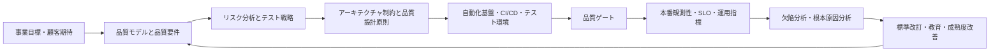

# 世界最高水準のQAアーキテクトになるための総合分析レポート

# エグゼクティブサマリー

本レポートの結論は明確です。**世界最高水準のQAアーキテクト**とは、「テストに詳しい人」ではなく、**事業目標・リスク・アーキテクチャ・開発プロセス・運用指標・規制要求を一つの品質システムとして設計し、継続的に改善できる人材**です。中核にあるのは、①品質特性を要件として定義する力、②リスクベースでテストと品質投資を最適配分する力、③自動化・CI/CD・観測性を前提に品質を“実行可能な仕組み”へ落とす力、④セキュリティ・プライバシー・AI・アクセシビリティまで含めて品質責任を拡張する力、⑤組織横断で意思決定を動かす力です。ISO/IEC/IEEE 29119 はテストの共通言語とプロセスを、ISO/IEC 25010 と 25022/25023 は品質モデルと測定を、ISO/IEC/IEEE 42010 はアーキテクチャ記述を、ISO/IEC/IEEE 29148 は要求工学を、TMMi と CMMI は成熟度改善を、NIST SSDF と OWASP はセキュリティ品質を支えます。つまり、トップクラスのQAアーキテクトは「テスト実行者」ではなく、**品質のシステムアーキテクト**です。

実務上の優先順位は、**規格暗記よりも“品質アーキテクチャの実装能力”**です。優先度の高い順に並べると、まず **品質モデル化と品質要件定義**、次に **テスト設計とリスク分析**、その次に **自動化基盤・CI/CD・テスト環境設計**、続いて **非機能テスト、セキュリティ、観測性、運用品質**、最後に **成熟度改善・組織設計・人材育成** です。AI/ML 時代には、これに **データ品質・非決定性・モデル評価・実運用モニタリング** が追加されます。DORA は高い成果を出す組織がデリバリ性能と信頼性を同時に測ることを示し、Google SRE は SLO/エラーバジェットを通じて品質を事業判断へ接続する方法を提示しています。AI 活用についても DORA は、AI は弱い組織を救う魔法ではなく、既存の強みや弱みを増幅する、と示しています。したがって、QAアーキテクトの最重要ミッションは、個別ツールの導入ではなく、**品質を継続的に改善できる能力体系と運用モデルを組織に埋め込むこと**です。

本レポートの前提は、**主としてWeb、API、モバイル、クラウドネイティブ、SaaS、エンタープライズ情報システムを含む一般的なソフトウェア開発組織**を想定することです。医療、航空宇宙、車載、産業制御などの分野では、追加でドメイン固有規格や規制が必要です。この点は未指定事項として扱い、該当ドメインでは本レポートをベースラインとして上位拡張する前提で整理します。なお、本レポートは公開一次情報を優先しつつ、役割定義や評価基準の一部については複数規格を統合した**実務上の推奨設計**を含みます。

## 調査の前提と到達像

QAアーキテクトの世界水準を定義するには、まず「品質」と「テスト」の境界を正しく引く必要があります。ISO/IEC 25010 はシステム・ソフトウェア製品品質を、機能適合性、性能効率性、互換性、使用性、信頼性、セキュリティ、保守性、移植性という形で体系化しています。ISO/IEC/IEEE 29119 は、その品質をどのようにテストで検証・管理するかを定義し、ISO/IEC/IEEE 29148 は要求としてどう記述するかを支えます。つまり、QAアーキテクトは「テストの人」ではなく、**品質モデル、要求、設計、検証、測定、改善の連鎖をつなぐ役割**です。

さらに、ISO/IEC/IEEE 42010 が示すように、アーキテクチャ記述は利害関係者の関心事をビューとビューポイントで整理する営みです。QAアーキテクトは、これを品質の文脈に移し、**「どの品質特性を、どのリスク前提で、どのテスト戦略・観測指標・品質ゲートで保証するか」**を構造化して記述する必要があります。ここで重要なのは、品質が“後工程の検査”ではなく、要件と設計段階から埋め込まれるべきだということです。IPA の共通フレームも、設計による品質の作り込みと、テストによる品質検証を対応づけて扱っています。

以下の表は、本レポートで採用する到達像の前提です。

| 項目 | 本レポートでの扱い |
| --- | --- |
| 想定対象 | Web、API、モバイル、クラウド、SaaS、一般的な業務システムを中心に整理 |
| 品質の定義 | ISO/IEC 25010 の品質特性を中心に、運用品質と品質インユースまで含めて扱う |
| テストの定義 | ISO/IEC/IEEE 29119 に沿って、組織・管理・動的テストを統合して扱う |
| 役割の定義 | 単なるテストマネージャではなく、品質戦略・品質アーキテクチャ・品質プラットフォーム・品質ガバナンスを統合する横断ロール |
| 習熟度モデル | SFIA の責任レベルを土台に、TMMi/CMMI の成熟度観点を加えた実務モデルを採用 |
| 未指定事項 | 規制産業や安全性クリティカル領域は追加規格を別途上乗せする前提 |

到達像を一言で表すなら、**「品質要求をアーキテクチャ、パイプライン、テスト資産、メトリクス、組織運営へ変換できる人」**です。ここでの“世界最高”とは、個人の技術力だけではなく、品質システム全体の設計能力と経営インパクトまで含む概念です。ISO 25022/25023 は品質の定量評価を支え、ISO 15939 は測定プロセスの枠組みを与え、DORA はデリバリ性能を測る共通指標を提示しています。トップクラスのQAアーキテクトは、この3層をつないで、**「品質は良くなったのか」「その結果、リリース速度や障害率はどう変わったのか」**まで説明できます。

## 職務設計と組織設計

QAアーキテクトの責任範囲は、プロジェクト単位のテスト計画より広く、**組織の品質設計原則を定め、複数プロダクトへ適用可能な品質プラットフォームを構築し、品質に関する意思決定を制度化すること**にあります。ISO/IEC/IEEE 29119-2 は組織レベル、テストマネジメントレベル、動的テストレベルを区別しています。世界水準のQAアーキテクトは、最低でも組織レベルとテストマネジメントレベルを扱い、テストの標準化、測定基盤、レビュー、ゲート、教育、改善サイクルの責任を持つべきです。TMMi はレベルが上がるほど、測定、欠陥予防、最適化が重要になることを示しており、CMMI も高成熟組織では定量・統計的管理と因果分析を重視します。

この役割は、開発部門の外側にある検査部門として設計すると失敗しやすいです。Google SRE が示す SLO/エラーバジェットの考え方では、品質は開発速度と対立するものではなく、**意思決定の境界条件**です。DORA も高成果組織が、デプロイ頻度、変更のリードタイム、変更失敗率、復旧時間、信頼性を統合して見ていると示しています。したがって QA アーキテクトは、V字型の最終検査責任者ではなく、**開発・運用・セキュリティ・プロダクトの合意形成装置**として位置付けるのが適切です。

責任範囲、成果物、KPI、組織内の位置付けは、次のように設計すると実務に乗せやすくなります。

| 領域 | 主要責任 | 主な成果物 | 推奨KPI | 主要根拠 |
| --- | --- | --- | --- | --- |
| 品質戦略 | 品質特性、品質目標、品質投資の優先順位を定義する | 品質戦略書、品質ポリシー、品質特性マップ | 品質要求の明確化率、品質リスクの残余件数 | ISO/IEC 25010、25022、25023 |
| テストアーキテクチャ | テストレベル、テストタイプ、環境、データ、依存関係戦略を設計する | テストアーキテクチャ記述、環境方針、データ戦略 | テスト環境準備のリードタイム、環境起因失敗率 | ISO/IEC/IEEE 29119-2、42010、IPA非機能要求グレード |
| 品質プラットフォーム | 自動化基盤、CI/CD、レポーティング、品質ゲートを標準化する | 共通テストフレームワーク、CIテンプレート、品質ゲート定義 | パイプライン成功率、回帰テスト所要時間、品質ゲート不通過率 | GitHub Actions、Jenkins、GitLab CI/CD、ISTQB TAE |
| 非機能・信頼性 | 性能、可用性、耐障害性、SLO、観測性を設計する | SLO定義、負荷試験計画、可観測性ダッシュボード | エラーバジェット消費率、MTTR、変更失敗率 | Google SRE、DORA、k6、JMeter、ISTQB CT-PT |
| セキュリティ・プライバシー | セキュリティ検証基準とプライバシー配慮を品質活動へ埋め込む | セキュリティテスト戦略、脅威ベース試験計画、データ取扱基準 | 重大脆弱性検出率、修正リードタイム、実データ使用削減率 | NIST SSDF、OWASP ASVS/WSTG/MASVS、GDPR、ISO/IEC 27701 |
| 改善・成熟度 | 欠陥分析、根本原因分析、標準改訂、人材育成を継続する | RCAレポート、改善バックログ、スキルマップ | 再発欠陥率、フレーキーテスト率、改善項目完了率 | ISTQB Glossary、TMMi、CMMI、Google flaky tests |

組織上のレポートラインは、**開発組織に深く組み込みつつ、品質標準に関しては横断権限を持つマトリクス型**が現実的です。完全な独立品質部門は、監査や規制対応では有効でも、内製プロダクト組織ではフィードバック速度を落とすことがあります。一方で完全分散型だと、標準不統一、ツール乱立、品質定義の分裂が起きやすくなります。TMMi と CMMI の成熟度観点から見ても、横断プロセスとローカル実装を接続する設計が最も持続的です。

## 技術スキル体系

世界最高水準のQAアーキテクトに必要な技術スキルは、単に「自動化ができる」では足りません。必要なのは、**品質要件を検証可能な設計へ落とし、それを継続的に実行可能なプラットフォームへ変換する一連の技術**です。ISO/IEC/IEEE 29119-4 はテスト設計技法を、29119-5 はキーワード駆動、29119-6 はアジャイル適用、29119-11 と ISO/IEC TS 42119-2 はAIシステム評価を拡張しています。ISTQB も自動化、性能、セキュリティ、AIテストを別領域として整備しています。つまり、トップクラスのQAアーキテクトは**技法、実装、運用、拡張規格の横断理解**が必要です。

本レポートでは習得レベルを、SFIA の責任レベルを実務向けに簡略化し、次の4段階で定義します。**実践**は自律的に適用できる段階、**設計**は複数案件へ再利用可能な設計ができる段階、**アーキテクト**は標準・プラットフォーム・原則を定められる段階、**組織戦略**は組織全体の投資と能力開発を方向づけられる段階です。これは SFIA の autonomy / influence / complexity の考え方と整合的です。

| スキル領域 | 詳細な知識要素 | 世界水準の期待到達レベル | 評価エビデンス例 | 主要根拠 |
| --- | --- | --- | --- | --- |
| テスト設計とリスク分析 | 同値分割、境界値、デシジョンテーブル、状態遷移、組合せ、探索的テスト、リスクベースドテスト、要求トレーサビリティ | アーキテクト | リスク傾斜型テスト戦略、要求‐テスト‐欠陥の双方向トレーサビリティ | ISO/IEC/IEEE 29119-4、29148、JSTQB Foundation/Advanced |
| テスト自動化とSDET | フレームワーク設計、テストコード設計原則、待機戦略、隔離性、データ駆動、失敗分析、保守性 | アーキテクト | 共通ライブラリ、Page/Object/Screen モデル、失敗診断設計 | Playwright、Selenium、Cypress、Appium、ISTQB TAE/TAS |
| API・統合・契約テスト | APIテスト、契約テスト、サービス仮想化、依存性分離、モック戦略、下流互換性 | アーキテクト | Pact 契約運用、WireMock 仮想化、API回帰基盤 | Pact、WireMock、Postman |
| CI/CD とテストインフラ | パイプライン・アズ・コード、マトリクス実行、キャッシュ、並列化、シークレット、自己ホスト/クラウドランナー | アーキテクト | Jenkinsfile / workflow / .gitlab-ci.yml の共通テンプレート | GitHub Actions、Jenkins、GitLab CI/CD |
| 性能・信頼性テスト | 負荷/ストレス/耐久/スパイク、SLO、エラーバジェット、容量計画、分散試験、統計解釈 | アーキテクト | 負荷モデル、SLO連動の性能ゲート、容量レポート | k6、JMeter、ISTQB CT-PT、Google SRE |
| セキュリティテスト | セキュリティ要求、認証/認可/セッション/入力検証/業務ロジック、SAST/SCA/DAST、脆弱性管理 | アーキテクト | ASVS準拠チェックリスト、ZAP自動診断、Semgrepルール運用 | OWASP ASVS、WSTG、MASVS、ZAP、Semgrep、ISTQB CT-SEC/STE |
| アクセシビリティと使用性 | WCAG 2.2、ARIAパターン、自動検査と人手評価の役割分担、品質インユース | 設計〜アーキテクト | axe 導入、アクセシビリティ基準、UX観点の欠陥分類 | WCAG 2.2、WAI-ARIA、axe、Playwright accessibility |
| 観測性と品質測定 | ログ・メトリクス・トレース、テスト結果集約、品質スコアカード、SLI/SLO、DORA 指標 | アーキテクト | OpenTelemetry 計装、品質ダッシュボード、品質レビュー会 | OpenTelemetry、DORA、ISO 15939、ISO 25022/25023 |
| AI/ML システムテスト | 非決定性、データ品質、ドリフト、偏り、モデル評価、プロンプト/ガードレール、対向試験 | アーキテクト〜組織戦略 | AI評価基盤、データ品質指標、モデル回帰レポート | ISO/IEC TR 29119-11、ISO/IEC TS 42119-2:2025、ISO/IEC 5259-2:2024、ISTQB CT-AI、EU AI Act |
| 欠陥分析と改善 | RCA、因果関係分析、フレーキー分析、ミューテーションテスト、品質債務管理 | アーキテクト | 欠陥分類体系、RCA運用、mutation score 改善 | ISTQB Glossary、Google flaky tests、PIT/Stryker、TMMi/CMMI |

この表のうち、特に差がつきやすいのは **自動化・性能・セキュリティ・AIテスト・観測性** です。多くのチームは E2E 自動化までは到達しますが、**テスト失敗の診断可能性**、**フレームワーク保守性**、**本番指標との接続**、**非機能要件への定量的リンク**で止まりがちです。Playwright がブラウザコンテキストの分離と再現性を強く押し出し、Selenium が W3C WebDriver ベースで広い互換性を提供し、Cypress が並列化や分析をクラウドで拡張し、Appium がモバイル横断自動化を担うのは、それぞれ品質アーキテクチャ上の強みが異なるからです。世界水準のQAアーキテクトは、これらを「好き嫌い」でなく、**対象プロダクトのリスク構造と運用モデル**で選びます。

加えて、**データ品質**は今後の必須科目です。ISO/IEC 25012 はデータ品質モデルを、25024 はその測定方法を与えます。AI システムでは ISO/IEC 5259-2 が分析・機械学習文脈のデータ品質モデルと測定の重要性を明示しています。特に高リスク AI では、EU AI Act が訓練・検証・テストデータの品質と、精度・堅牢性・サイバーセキュリティを要求しており、QAアーキテクトは「ソフトウェア品質」だけでなく **データ品質とモデル運用品質** を品質責務の中へ統合しなければなりません。

## ソフトスキル体系

世界最高水準のQAアーキテクトが圧倒的に強いのは、技術そのものよりも、**複雑な品質課題を人・組織・意思決定の問題として扱えること**です。SFIA は quality assurance、quality management、stakeholder relationship management を独立したスキルとして定義し、責任レベルに応じて自律性、影響範囲、複雑性、知識を拡張していきます。QAアーキテクトが SFIA 的に高レベルへ進むほど、個別案件での実行よりも、**標準化・助言・横断調整・戦略設定**の比重が増えます。

| ソフトスキル | 卓越状態の定義 | 評価指標の例 | 主要根拠 |
| --- | --- | --- | --- |
| リーダーシップ | 品質方針を“監視”ではなく“共通成功条件”として浸透させる | 横断合意形成速度、標準採用率、改善施策の継続率 | SFIA Quality Management / Quality Assurance |
| ステークホルダー管理 | 開発、運用、セキュリティ、プロダクト、経営の利害を構造化して調整する | 争点の未解決期間、品質判断のエスカレーション件数 | SFIA RLMT |
| アーキテクチャ思考 | 利害関係者の関心事を品質ビューに翻訳し、矛盾を明示して整合させる | ADR採択率、重大な設計後戻り件数 | ISO/IEC/IEEE 42010、29148 |
| 経済的意思決定 | 品質活動をコストではなく、リードタイム・失敗率・復旧時間・顧客影響で最適化する | 変更失敗率、MTTR、品質投資対効果 | DORA、SRE error budget |
| ファシリテーション | レビュー、RCA、品質ゲート会議を“責める場”でなく“学習の場”へ変える | RCA実施率、再発欠陥率、会議後アクション完了率 | ISTQB root cause analysis、CMMI high maturity |
| コーチング | テストスキルを属人化から組織能力へ変える | スキルマップ改善率、育成後のレビュー品質 | TMMi Professional / Assessor criteria、SFIA assessment |
| 危機対応 | 障害時に blame ではなく containment・learning・prevention に進める | インシデント後 RCA 完了率、同種障害再発率 | Google SRE、SSDF、CMMI CAR |
| 文章化と可視化 | 曖昧な品質議論を、要求・基準・証拠・判断ログとして残す | ADR/テスト文書の更新率、品質会議の再解釈工数 | ISO/IEC/IEEE 29119-3、42010 |

実務で特に重要なのは、**品質を“正しさ”ではなく“選択の問題”として扱えるか**です。SRE のエラーバジェットは、信頼性をゼロリスク化せず、事業と技術の間で許容可能な失敗量を定義する考え方です。これはQAアーキテクトにもそのまま当てはまります。すべてをテストするのではなく、**どこに深く投資し、どこを観測で補い、どこをリスク受容するか**を説明できる人が強いのです。

また、トップクラスのQAアーキテクトは、**ツール導入をプロセス改善と混同しません**。TMMi と CMMI が示すように、成熟度はツール保有ではなく、実践の定着、測定、因果分析、最適化で上がります。したがって、ソフトスキルの評価は「発表が上手い」ではなく、**品質の制度と振る舞いを変えたか**で測るべきです。

## 規格・基準・成熟度モデル

世界最高水準を目指すなら、規格は「試験対策の暗記リスト」ではなく、**品質設計の座標系**として使うべきです。ISO/IEC/IEEE 29119 はテストの共通語彙とプロセスを、SQuaRE シリーズは品質モデルと測定を、要求工学・アーキテクチャ記述・ライフサイクル規格は上流との接続を担います。これにセキュリティ、プライバシー、AI、アクセシビリティの標準を重ねることで、現代的な QA アーキテクチャが成立します。

| 規格・基準 | 何を定義するか | 適用範囲 | QAアーキテクトの実務での使い方 | 主要根拠 |
| --- | --- | --- | --- | --- |
| ISO/IEC 25010 | 製品品質モデルと品質インユースモデル | 全ソフトウェア・システム | 品質特性を要件化し、品質リスクマップの土台にする | |
| ISO/IEC 25022 | 品質インユース測定 | 利用時品質 | UX、実運用品質、受入後の品質評価に使う | |
| ISO/IEC 25023 | 製品品質測定 | システム・ソフトウェア製品 | 品質特性ごとの定量指標と評価方法に使う | |
| ISO/IEC 25012 / 25024 | データ品質モデルと測定 | データ品質 | テストデータ、分析基盤、AI用データの品質要件・測定に使う | |
| ISO/IEC/IEEE 29119-1 | テストの一般概念 | 全般 | テスト方針・用語・共通理解の基盤にする | |
| ISO/IEC/IEEE 29119-2 | テストプロセス | 組織・プロジェクト・活動 | 組織標準、テスト戦略、運営モデル、品質ゲートの設計に使う | |
| ISO/IEC/IEEE 29119-3 | テスト文書テンプレート | 全般 | テスト戦略書、計画書、設計、結果、完了報告の標準化に使う | |
| ISO/IEC/IEEE 29119-4 | テスト技法 | 全般 | テスト設計レビューや技法標準の基準に使う | |
| ISO/IEC/IEEE 29119-5:2024 | キーワード駆動テスト | 自動化 | 自動化資産の再利用・抽象化レベル設計に使う | |
| ISO/IEC TR 29119-6 | アジャイル適用ガイド | アジャイル開発 | スプリント内品質活動、回帰戦略、DoD 改良に使う | |
| ISO/IEC TR 29119-11 | AIベースシステムのテスト指針 | AIシステム | 非決定性、受入基準設定困難性、AI特有の試験観点整理に使う | |
| ISO/IEC TS 42119-2:2025 | ISO 29119 の AI システム適用 | AIシステム | リスクベースでAI向けテスト実務へ落とし込む | |
| ISO/IEC/IEEE 29148 | 要求工学 | 上流全般 | 品質要件の明確化、受入基準、トレーサビリティ設計に使う | |
| ISO/IEC/IEEE 42010 | アーキテクチャ記述 | システム・ソフトウェア | 品質ビュー、品質制約、品質決定の記述に使う | |
| ISO/IEC/IEEE 12207 / 15288 | ライフサイクルプロセス | ソフトウェア / システム | テストを開発・運用・保守の全体プロセスへ接続する | |
| ISO/IEC 15939 | 測定プロセス | 測定全般 | 品質メトリクス設計、品質ダッシュボード運用に使う | |
| NIST SP 800-218 SSDF | セキュア開発の実践 | 開発プロセス | セキュリティ品質を開発工程へ埋め込む | |
| OWASP ASVS / WSTG / MASVS | Web・Webテスト・Mobile のセキュリティ検証基準 | Web / Mobile | セキュリティ要求・テスト観点・検証深度の基準に使う | |
| WCAG 2.2 / WAI-ARIA APG | アクセシビリティ基準と実装パターン | Web | 自動/手動 a11y テストの基準に使う | |
| ISO/IEC 27001 / 27701 | セキュリティ / プライバシー管理 | 組織管理 | テスト環境、ログ、個人データ取り扱い統制に使う | |
| ISO/IEC 29147 / 30111 | 脆弱性開示 / 脆弱性処理 | セキュリティ運用 | 脆弱性の受領、トリアージ、修正フローと接続する | |
| ISO/IEC 42001 | AIマネジメントシステム | 組織レベルのAI | AI品質・統制・説明責任の上位ガバナンスに使う | |
| TMMi | テスト成熟度モデル | 組織のテストプロセス | テスト組織の改善ロードマップに使う | |
| CMMI | 組織能力・パフォーマンス改善 | 組織全体 | テスト単体でなく、開発能力全体との整合を取る | |
| IPA 非機能要求グレード / 共通フレーム | 日本での要求・工程標準 | 日本向け実務 | 非機能要件の漏れ防止、工程接続、受入観点整理に使う | |

規格の使い方で最も重要なのは、**全部をそのまま導入しないこと**です。ISO 29119 も IPA の非機能要求グレードも、テーラリングが前提です。実務では、まず 25010 で品質特性を選び、29148 で要求化し、29119-2/3/4 で検証プロセスと成果物を整え、25022/25023/15939 で測定を組み、TMMi/CMMI で改善の優先順位をつける、という順に使うのが最も失敗しにくいです。

## ツール・フレームワーク比較

ツール選定では、**「何が最強か」ではなく「どのアーキテクチャに最も適合するか」**が重要です。たとえば、Playwright は再現性とモダンブラウザ対応を重視するチームに向き、Selenium は互換性と既存資産重視の組織に向きます。Cypress は開発者体験とクラウド分析が強く、Appium はモバイル横断が主戦場です。API では Pact と WireMock が補完関係にあり、性能では k6 と JMeter が運用思想ごと異なります。CI/CD では GitHub Actions、Jenkins、GitLab CI/CD が採用基盤の違いを持ちます。

### 機能・API・モバイル自動化の比較

| ツール | 主用途 | 強み | 弱み | 導入コスト目安 | 学習コスト | 主要根拠 |
| --- | --- | --- | --- | --- | --- | --- |
| Playwright | Web E2E、自動化、a11y/API | Chromium/Firefox/WebKit を1APIで扱え、隔離された browser context で再現性を高めやすい | Web中心。既存 Selenium 資産の移行はコストがある | 低〜中（OSS、CI/ブラウザ実行基盤は別） | 中 | |
| Selenium | Web 自動化の標準基盤 | W3C WebDriver準拠、主要ブラウザ互換、既存資産が豊富 | フレームワーク設計を自前で整える必要が大きい | 低〜中（OSS、Grid/運用設計次第） | 中〜高 | |
| Cypress | Web テストとクラウド分析 | 開発者体験が良く、CI 並列化・Replay・分析を Cloud で拡張しやすい | Cloud 価値を使わないと優位が薄い場面がある | 低（OSS）〜中/高（Cloud利用） | 低〜中 | |
| Appium | モバイル UI 自動化 | iOS/Android を横断し、複数言語と多プラットフォームを扱える | 実機・環境差異・安定化にノウハウが要る | 中（OSSだが実機運用費あり） | 高 | |
| Postman | API テスト、監視、コラボレーション | Collection Runner、Monitors、CLI により手動から自動まで橋渡ししやすい | コードベースの複雑な検証では限界がある | 低〜中（Freeあり、監視や拡張で増加） | 低 | |
| Pact | 契約テスト | consumer-driven contract により破壊的変更の検出に強い | 契約設計の成熟がないと形骸化しやすい | 低（OSS運用） | 中 | |
| WireMock | API モック、サービス仮想化 | 依存分離、未実装APIの並行開発、エッジケース再現に強い | 実挙動との乖離管理が必要 | 低（OSS運用） | 中 | |

### 性能・セキュリティ・環境の比較

| ツール | 主用途 | 強み | 弱み | 導入コスト目安 | 学習コスト | 主要根拠 |
| --- | --- | --- | --- | --- | --- | --- |
| k6 | プロトコル/ブラウザ性能試験 | スクリプト指向で CI/Kubernetes/Cloud 展開しやすく、SLO との接続が明確 | 非エンジニアにはやや敷居が高い | 低〜中 | 中 | |
| Apache JMeter | 負荷試験の汎用基盤 | HTTP/DB/JDBC など対象が広く、GUI と豊富な実績がある | テスト計画が肥大化しやすく、保守性設計が必要 | 低〜中 | 中 | |
| OWASP ZAP | DAST / Web脆弱性検査 | 無償で始めやすく、自動化・Docker・アクティブ/パッシブスキャンに対応 | 誤検知・安全な運用範囲の理解が必要 | 低 | 中 | |
| Semgrep | SAST/SCA/Secrets | 開発者向けに導入しやすく、ルールとデータフローで高速に回せる | 高度なルール運用は設計力が要る | 低〜中 | 中 | |
| BrowserStack | 実機・クロスブラウザクラウド | 実デバイス群、並列実行、CI連携、ローカル環境接続が強い | SaaS コストが増えやすい | 中〜高 | 低〜中 | |
| GitHub Actions | CI/CD | GitHub 統合、workflow YAML、マトリクス、ホステッドランナー | 大規模運用では分散制御やコスト設計が必要 | 低〜中 | 低〜中 | |
| Jenkins | CI/CD | 柔軟性が高く、オンプレや複雑パイプラインに強い | 自己運用負荷が高い | 中〜高 | 中〜高 | |
| GitLab CI/CD | CI/CD と DevSecOps 統合 | 開発〜検証〜リリースまでを一体的に扱いやすい | GitLab 前提色が強い | 中 | 中 | |
| OpenTelemetry | 観測性標準 | ベンダ中立でトレース・メトリクス・ログを統合しやすい | 可視化基盤は別途設計が必要 | 低〜中 | 中 | |
| axe-core / Axe | a11y 自動検査 | WCAG ベースの自動検査を既存フローへ統合しやすい | 自動検査だけでは十分でない | 低（axe-core）〜中/高（商用拡張） | 低 | |

導入コストの見方にも注意が必要です。**OSS の無料 = 総コストが低い**ではありません。Jenkins、Selenium Grid、Appium 実機運用、JMeter 大規模試験は、インフラと保守で高コスト化しやすいです。一方、BrowserStack や Cypress Cloud はライセンス費が見えやすい一方で、運用を外部化できるため、組織規模によっては総コストが下がることがあります。GitHub Actions は無料枠と従量課金が明確で、GitLab も Free/Premium/Ultimate の分かりやすい構造です。したがって、QAアーキテクトはライセンスだけでなく、**運用人件費、環境差異吸収コスト、待ち時間コスト、診断コスト**まで含めて比較するべきです。

## 実践パターン・学習ロードマップ・将来展望

### ベストプラクティス

世界水準の QA アーキテクトが採るベストプラクティスは、共通して **“仕組み化”** に寄っています。まず、品質特性を ISO/IEC 25010 の言葉で明示し、受入基準と非機能要求を曖昧な形容詞から測定可能な形へ変換します。次に、ISO/IEC/IEEE 29119-2/3 に沿ってテスト戦略と成果物を統一し、CI/CD にゲートを埋め込みます。その上で、SLO と DORA 指標を品質会議へ持ち込み、欠陥や障害の RCA を通じて標準を継続更新します。さらに、OWASP や WCAG を“別チームの責任”にせず、日常の自動化へ入れ込みます。AI システムでは、データ品質と評価基盤を先に作り、モデルやプロンプトの変更を通常コードと同じように回帰評価します。

### アンチパターン

逆に、避けるべき典型例もはっきりしています。**E2E 過多**、**本番指標と切れたテスト自動化**、**フレーキーテスト放置**、**自動化の前に対象設計を改善しない**、**セキュリティやアクセシビリティをリリース直前に回す**、**実データを無秩序にテスト利用する**、**品質会議がレポート朗読会になる**、このあたりは強い組織ほど避けます。Google はフレーキーな結果がテストへの信頼を壊すと指摘し、研究でも不安定テストが開発者の信頼と生産性を損なうことが示されています。Knight Capital と Ariane 5 の失敗も、本質的には“品質活動が個別工程に閉じ、システム全体の制御構造に接続されていなかった”ことにあります。

### ケーススタディ

| 事例 | 成功 / 失敗 | 何が起きたか | QAアーキテクトへの示唆 | 主要根拠 |
| --- | --- | --- | --- | --- |
| Evernote / The Home Depot の SLO 導入 | 成功 | SLO とエラーバジェットを通じて開発と運用の対話を改善し、意思決定を整流化した | 品質指標は“報告用”でなく“意思決定用”であるべき | |
| Netflix の Chaos Engineering / Integration Testing | 成功 | 実障害を想定した耐障害性検証を継続的に実施し、複雑システム下での信頼性検証を高度化した | 期待通りに動くことではなく、壊れた時にどう振る舞うかまで品質設計に含める | |
| Google の flaky test 対策 | 成功寄りの教訓 | Google 全体で継続的な flaky 結果が存在し、原因特定と軽減の体系が必要だった | 自動化の価値は量ではなく、信頼できるシグナルを返すこと | |
| Knight Capital | 失敗 | 不完全なコード展開と統制不備により大規模損失が発生した | デプロイ品質、環境一貫性、アラート設計、リスク制御をテスト設計に含める必要がある | |
| Ariane 5 Flight 501 | 失敗 | ソフトウェア仕様・設計上の問題により姿勢情報を喪失し、打ち上げ失敗となった | 再利用ソフトの前提条件、境界条件、例外処理、システム文脈変更の検証が必須 | |

### 学習ロードマップ

学習は「初級→上級→エキスパート」の順ですが、単に知識が増えるのではなく、**視点が“テストケース”から“品質システム”へ上がる**ことが重要です。

| フェーズ | 期間目安 | 重点学習 | 推奨資格・教材 | 実務経験の目安 | ポートフォリオ例 |
| --- | --- | --- | --- | --- | --- |
| 初級 | 0〜12か月 | テスト基礎、品質特性、基本技法、要求と欠陥の関係、自動化入門 | JSTQB/ISTQB CTFL、JSTQB Foundation、日本語シラバス | 手動テスト〜簡単な自動化、バグ報告、レビュー参加 | テスト設計書、欠陥分析メモ、基本自動化サンプル |
| 中級 | 1〜3年 | APIテスト、自動化設計、CI/CD、性能・セキュリティ基礎、非機能要求 | CTAL-TA、CTAL-TAE、CT-PT、CT-SEC、IPA 非機能要求グレード資料 | 複数案件で自動化や非機能試験を主導 | Playwright/Selenium基盤、CI定義、性能試験レポート |
| 上級 | 3〜6年 | テスト戦略、品質指標、SLO、環境設計、契約テスト、仮想化、RCA | CTAL-TM、CT-TAS、TMMi Professional、SFIA Foundation、CMMI Associate | チーム横断標準化、品質ゲート設計、改善活動主導 | 品質戦略書、共通フレームワーク、品質ダッシュボード |
| エキスパート | 6年以上 | 組織設計、成熟度改善、AI品質、プライバシー、監査対応、経営接続 | CT-AI、TMMi Assessor系、CMMI上位トレーニング | 部門横断の品質変革、複数プロダクト統制、経営報告 | 品質アーキテクチャ文書、AI評価基盤、改善ロードマップ |

上の推奨資格は、資格そのものが目的ではなく、**知識の抜け漏れを防ぐ足場**として使うのが正しいです。JSTQB は日本語学習導線として有効で、ISTQB は自動化、性能、セキュリティ、AI まで拡張されています。TMMi Professional は組織のテスト成熟度、SFIA は役割評価、CMMI は組織能力改善の視点を与えます。

### 評価・認定方法

社内評価は、**資格、成果物、行動、結果**の4面で行うとバランスが取れます。資格は最低限の知識確認、成果物は設計能力、行動は横断協働力、結果は事業貢献です。SFIA のスキル評価を骨格にし、品質管理・品質保証・ステークホルダー管理・測定・テストを紐づけると、ロール評価の透明性が高まります。外部資格だけで昇格を決めるのは避け、DORA 指標や品質スコア改善、再発欠陥率の減少、標準採用率などの結果を必ず併用すべきです。

評価のテンプレート例を示します。

| 評価観点 | 何を見るか | エビデンス例 |
| --- | --- | --- |
| 知識 | 規格、技法、セキュリティ、性能、AI品質の理解 | JSTQB/ISTQB、TMMi、SFIA、CMMI の学習記録 |
| 設計能力 | 品質要求、テストアーキテクチャ、品質ゲートが作れるか | 品質戦略書、ADR、テストアーキテクチャ図 |
| 実装能力 | 基盤を自動化し、運用可能な状態まで持っていけるか | CI テンプレート、共通フレームワーク、ダッシュボード |
| 改善能力 | RCA と標準改訂を回せるか | RCA レポート、改善バックログ、標準更新履歴 |
| 事業貢献 | 品質と速度の両立を改善したか | 変更失敗率低下、MTTR 改善、回帰時間短縮、品質コスト削減 |

### 将来のトレンド

将来の最大トレンドは、**AI によるテスト自動化の高度化**ではなく、**品質保証対象そのものが AI を含む複雑系へ広がること**です。研究レビューは LLM を含む AI ベースのソフトウェアテスト技術が活発化していることを示しており、ISTQB も CT-AI を整備しています。同時に、ISO/IEC TR 29119-11 と ISO/IEC TS 42119-2:2025 は、AI ベースシステムの特有性を明示し、AI Act は高リスク AI に対し、データ品質、技術文書、透明性、人間の監督、精度、堅牢性、サイバーセキュリティを要求しています。したがって QA アーキテクトは、AI を“テストを楽にする道具”としてだけでなく、**自分が評価すべき高リスク対象**として扱う必要があります。

次のトレンドは、**テストインフラのクラウド化・分散化・可観測性標準化**です。GitHub Actions、GitLab CI/CD、BrowserStack、k6、OpenTelemetry が示すとおり、品質活動はローカルPCから、クラウド実行、実機クラウド、分散負荷、標準計装へ移っています。ここでは単に「どこで動かすか」ではなく、**結果の追跡可能性、再現性、コスト可視化、セキュアな接続性**が重要になります。

さらに、**セキュリティとプライバシー規制の品質活動への内在化**も確実に進みます。GDPR は個人データ保護の基本枠組みを定め、EDPB のガイドラインは privacy by design / by default を強調しています。Cyber Resilience Act はデジタル要素を持つ製品にライフサイクル全体のセキュリティ要求を課し、善意のテストや調査で見つかった脆弱性に関する扱いも整理しています。つまり QA アーキテクトは、規制対応を法務任せにせず、**テストデータ管理、ログ管理、脆弱性処理、セキュリティ回帰、リリース判定**まで制度として設計しなければなりません。

### 結論と推奨アクション

結論として、世界最高水準のQAアーキテクトになるために必要なのは、個別技術の点取りではなく、**品質をアーキテクチャ・プロセス・測定・組織能力として統合する力**です。最初に完成させるべきは、テスト自動化そのものではありません。**品質モデル、品質要件、品質ゲート、品質メトリクス、品質改善サイクル**です。これがない自動化は、速く壊れるだけです。これがある自動化は、組織の競争力になります。

実務での推奨アクションは、次の順で進めるのが最も効果的です。

1. **品質特性の標準化**

    自組織の品質要求を ISO/IEC 25010 と IPA 非機能要求グレードで整理し、プロダクト共通の品質語彙を作る。

2. **品質アーキテクチャ文書の整備**

    ISO/IEC/IEEE 42010 と 29119-2/3 を参考に、品質戦略、テスト戦略、環境方針、メトリクス定義を文書化する。

3. **自動化基盤の選定と標準化**

    Web/API/mobile/performance/security の各領域で、ツールを乱立させず、共通ライブラリと CI テンプレートを整える。

4. **品質指標を事業指標へ接続**

    DORA、SLO、品質メトリクス、欠陥再発率を一つのダッシュボードにまとめ、リリース判断と改善会議に使う。

5. **成熟度改善を制度化**

    TMMi/CMMI/SFIA を使って現状を見える化し、教育、役割、レビュー、RCA を継続改善サイクルへ組み込む。

6. **AI・セキュリティ・プライバシーを前提化**

    AI テスト、SSDF、OWASP、GDPR/CRA を追加要件ではなく、通常の品質活動の一部として設計する。

この順序で進めれば、QA アーキテクトとしての成長は、単なる資格コレクションではなく、**再現可能な品質競争力の構築**になります。品質は最後に検査するものではなく、最初に設計し、毎日観測し、継続的に改善するものです。世界最高水準とは、その仕組みを個人技でなく**組織能力として実装できること**です。