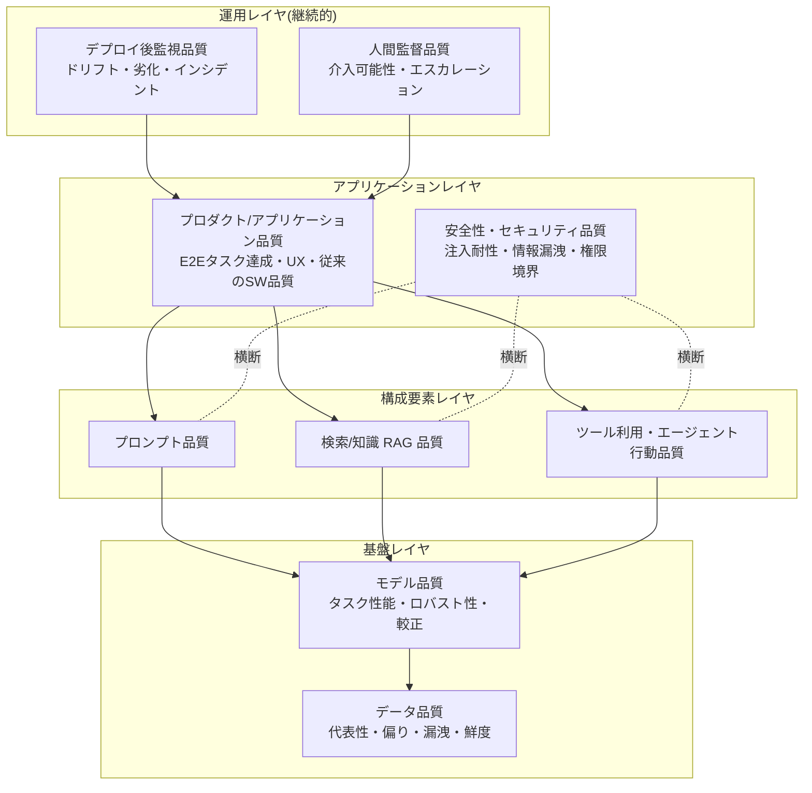

# AIシステム品質モデル(AI/ML/LLM システムのための品質特性と評価設計)

## エグゼクティブサマリ

AI/ML/LLM システムの品質は、**「単体テストが通った」「デモが動いた」では何も保証されません**。従来ソフトウェアの品質モデル(ISO/IEC 25010)が前提とする「同じ入力なら同じ出力」「仕様との一致で合否判定できる」という条件が、確率的に振る舞う AI システムでは成り立たないためです。本ドキュメントは、この前提の崩れを埋めるための品質モデルと評価設計を、規格と実務手法の両面から整理します。

要点は次のとおりです。

- **規格面の基盤は ISO/IEC 25059:2023** です。SQuaRE(ISO/IEC 25000 シリーズ)の AI 拡張として、**機能適応性、ロバスト性、透明性、ユーザ制御可能性、介入可能性**などの AI 固有特性を既存品質モデルに追加します。データ品質は ISO/IEC 5259 シリーズ、ロバスト性評価は ISO/IEC 24029 シリーズ、テスト方法は ISO/IEC TR 29119-11 と後継の ISO/IEC 42119 シリーズ(2025年〜)が担います。
- **AI システムの品質は単一のスコアではなくレイヤの積み重ね**です。プロダクト品質の下に、モデル品質、データ品質、プロンプト品質、ツール利用・エージェント行動品質、RAG 品質、安全性・セキュリティ品質、人間監督品質、デプロイ後監視品質があり、**各レイヤに固有の品質問いと評価方法**があります。上位レイヤのテストだけでは下位レイヤの欠陥(データ漏洩、評価セット汚染など)を検出できません。
- **確率的出力には統計的な評価設計が必須**です。1回の実行結果ではなく、サンプリングに基づく合格基準(pass@k / pass^k)、信頼区間、ペア比較を使います。**LLM-as-a-judge は強力だが位置バイアス・冗長性バイアス・自己選好バイアスを持つ**ため、判定者自体の検証(メタ評価)なしに信頼してはいけません。
- **正解率は品質特性の一つにすぎません**。指示追従、根拠性(groundedness)、拒否失敗と過剰拒否、権限境界、情報漏洩、ツール実行安全性、プロンプト注入耐性を**別個の特性として別個に評価**する必要があります。
- **品質はデプロイ時点で固定されません**。モデル更新時の回帰評価、データドリフト/コンセプトドリフト監視、評価セット汚染の検出、本番トラフィックからの評価データ還流を含む**運用ループ**を持って初めて品質を主張できます。

AI の QA/QC プロセス全体像・規制動向・事例は [AIの品質保証と品質管理に関する調査報告書](../quality-management/ai-quality-assurance-and-management-research-report.md) を、メタモルフィックテストなど個別技法の詳細は [テスト技法スキルカタログ](../test-techniques/test-techniques-skill-catalog.md) を参照してください。本ドキュメントは「何を品質特性とみなし、どう評価を設計するか」に焦点を絞ります。

## 位置づけと関連ドキュメント

| ドキュメント | 扱う内容 | 本ドキュメントとの関係 |
| --- | --- | --- |
| 本ドキュメント | AI/ML/LLM 固有の品質特性、レイヤ分解、確率的出力の評価設計、評価ハーネス実務 | — |
| [iso25010-product-quality-model.md](./iso25010-product-quality-model.md) | 通常ソフトウェアの製品品質モデル(ISO/IEC 25010) | AI 固有でない品質特性(性能効率性、保守性など)はそちらが基盤 |
| [ai-quality-assurance-and-management-research-report.md](../quality-management/ai-quality-assurance-and-management-research-report.md) | AI の QA/QC プロセス、NIST AI RMF、EU AI Act 等の規制、組織導入ロードマップ、事例 | プロセス・ガバナンス面はそちらに委譲 |
| [test-techniques-skill-catalog.md](../test-techniques/test-techniques-skill-catalog.md) | メタモルフィックテスト、プロパティベーステスト、差分テスト等の技法カタログ | 個別技法の手順・スキルカードはそちらに委譲 |

## 規格の全体像: ISO/IEC 25059 と関連規格

### ISO/IEC 25059:2023 の内容

ISO/IEC 25059:2023(Software engineering — SQuaRE — Quality model for AI systems)は、SQuaRE シリーズの**アプリケーション固有拡張**として AI システム向け品質モデルを定義した規格です。ISO/IEC 25010 の製品品質モデル・利用時品質モデルを土台に、AI 固有の特性・副特性を追加し、AI システム品質の仕様化・測定・評価に一貫した用語を与えます。

製品品質モデルへの主な追加・変更は次のとおりです(配置は解説サイト iso25000.com の整理に基づきます。正確な条項は規格原文で確認してください)。

| 親特性 | 追加された AI 固有副特性 | 定義の要旨 |
| --- | --- | --- |
| 機能適合性 | **機能適応性(functional adaptability)** | AI システムがデータや過去の行動の結果から情報を正確に獲得し、将来の予測に利用できる度合い。動的環境への自己適応能力 |
| 使用性/相互作用能力 | **ユーザ制御可能性(user controllability)** | ユーザが AI システムの動作に適切に介入できる度合い |
| 使用性/相互作用能力 | **透明性(transparency)** | AI システムに関する適切な情報がステークホルダーに伝達される度合い |
| 信頼性 | **ロバスト性(robustness)** | あらゆる状況下(未知・偏向・敵対的・無効な入力、外部干渉、環境変動)で性能水準を維持できる度合い |
| セキュリティ | **介入可能性(intervenability)** | 損害や危険を回避するため、オペレータが適時に AI システムの動作へ介入できる度合い |

このほか、機能正確性(functional correctness)は AI では「学習データに基づく統計的な正しさ」として再解釈が必要になる点が特徴です。利用時品質モデル側にも、透明性や社会的・倫理的リスク緩和(societal and ethical risk mitigation)に関する拡張があると複数の解説が報告していますが、副特性の正確な配置は規格原文での確認を推奨します。

実務上の含意は次の 3 点です。

1. **「精度」はロバスト性・透明性・介入可能性と独立に扱う**。テスト分布上の精度が高くても、分布外入力で崩れる(ロバスト性欠如)、判断根拠を説明できない(透明性欠如)、暴走時に止められない(介入可能性欠如)なら品質要求は満たせません。
2. **品質要求定義の段階で 25059 の特性リストを要求チェックリストとして使う**。全特性に定量目標を置く必要はなく、リスクベースで「このシステムではどの特性が支配的か」を決めます。
3. **25059 は「何を」の規格であり「どう測るか」は薄い**。測定・評価の実務は ISO/IEC TS 25058(評価ガイダンス)、ISO/IEC 24029(ロバスト性)、後述の評価ハーネス実務で補完します。

### 第2版改定の動向(2024〜2026年)

ISO/IEC 25059 は第2版への改定が進行中です。2026年3月に DIS(国際規格案)投票が終了しており、実質的な技術変更がなければ発行に進む段階です(2026年7月時点で第2版の発行は未確認)。解説によれば、改定では次が計画されています。

- **単一の製品品質モデルから 3 モデル構成へ拡張**(AI サービス品質モデルの追加を含む)
- **環境持続可能性を性能効率性の副特性として追加**
- **ISO/IEC 25010:2023 改定版との構造整合**(第1版は 25010 の旧版をベースにしていた)

改定後は特性の名称・配置が変わる可能性があるため、規格を契約や監査基準に引用する場合は版を明記してください。

### 関連規格マップ

| 規格 | 発行 | 役割 | 実務での使い所 |
| --- | --- | --- | --- |
| ISO/IEC 25059 | 2023(第2版改定中) | AI システム品質モデル(SQuaRE 拡張) | 品質要求定義・品質特性の共通語彙 |
| ISO/IEC TS 25058 | 2024 | AI システム品質評価のガイダンス | 25059 の特性をどう評価プロセスに落とすか |
| ISO/IEC TR 24028 | 2020 | AI の信頼性(trustworthiness)概観。透明性・説明可能性・制御可能性などによる信頼確立、脅威と緩和策のカタログ | リスク分析の出発点。信頼性のレベル規定はスコープ外 |
| ISO/IEC TR 24029-1 | 2021 | ニューラルネットワークのロバスト性評価の概観。**統計的手法・形式的手法・経験的手法**の 3 分類 | ロバスト性評価の手法選定 |
| ISO/IEC 24029-2 | 2023 | 形式的手法によるロバスト性評価の方法論(手法の選択・適用・管理) | 高保証が必要な NN コンポーネントの検証 |
| ISO/IEC 5259-1〜5 | 2024〜2025 | ML 用データ品質。Part 1: 概観・用語、Part 2: データ品質測定、Part 3: データ品質管理の要求事項、Part 4: データ品質プロセスフレームワーク、Part 5: データ品質ガバナンス | データ品質基準・データ契約・監査の根拠 |
| ISO/IEC TR 29119-11 | 2020 | AI ベースシステムのテストのガイドライン(29119 テスト規格ファミリの AI 拡張) | AI テスト戦略の教科書的整理 |
| ISO/IEC TS 42119-2 | 2025 | AI テストの概観(SC 42 による新シリーズ)。リスクベースで 29119 シリーズを AI テストに適用する要求とガイダンス | 2025年以降の AI テスト計画の一次参照。Part 3(V&V 分析: 形式手法・シミュレーション・評価)は 2026年時点で DTS 承認段階 |

ISO/IEC 42001(AI マネジメントシステム)、ISO/IEC 23894(AI リスクマネジメント)、NIST AI RMF、EU AI Act などガバナンス系は [AIガバナンス・規制・監査証跡リサーチレポート](../governance-compliance/ai-governance-regulation-audit.md) と [AI QA/QC 調査報告書](../quality-management/ai-quality-assurance-and-management-research-report.md) を参照してください。

## AIシステム品質のレイヤ分解

「単体テストが通ったから OK」という主張の誤りは、レイヤ分解で説明できます。単体テストが検証するのはアプリケーションコードの決定的な部分だけで、下図のレイヤの大半をカバーしません。

各レイヤの品質問いと代表的評価方法を整理します。**下位レイヤの欠陥は上位レイヤの評価では原因特定できない**(RAG アプリの回答が悪いとき、検索が悪いのか生成が悪いのかは分離評価しないと判らない)ことが、レイヤ別評価の最大の理由です。

| レイヤ | 中心的な品質問い | 代表的評価方法 | 典型的な失敗 |
| --- | --- | --- | --- |
| プロダクト/アプリケーション品質 | ユーザのタスクは E2E で達成されるか。従来の SW 品質(性能・可用性等)は満たすか | E2E シナリオ評価、タスク完了率、人間評価、A/B テスト。従来品質は [ISO/IEC 25010](./iso25010-product-quality-model.md) ベース | コンポーネント単位では良いのに結合すると劣化。レイテンシ・コスト無視 |
| モデル品質 | タスク性能・較正・ロバスト性は要求水準か。どのスライスで弱いか | ベンチマーク+独自評価セット、スライス評価、較正評価(ECE)、摂動テスト | 集計精度のみ報告し少数群スライスの劣化を見逃す |
| データ品質 | 学習・評価データは代表的で、偏りや漏洩がないか | 分布分析、漏洩検査、ラベル品質監査、ISO/IEC 5259 準拠のデータ品質測定 | 分割設計ミスによる楽観的評価(後述) |
| プロンプト品質 | プロンプト変更で出力品質が意図どおり変わり、既存挙動が壊れていないか | プロンプトごとの回帰評価、プロンプト A/B、変数注入時の頑健性テスト | プロンプトを「設定」扱いしてバージョン管理・回帰評価なしに変更 |
| ツール利用・エージェント行動品質 | 正しいツールを正しい引数で呼び、ドメインポリシーに従い、同じタスクを安定して完遂するか | τ-bench 型の対話+API 環境評価、終了状態(DB 状態)比較、pass^k、軌跡(trajectory)評価 | 「1回成功した」を「できる」と報告。ポリシー違反行動の見逃し |
| 検索/知識(RAG)品質 | 必要な知識を取り出し(検索品質)、それに忠実に回答している(生成品質)か | 検索: context precision / context recall、再現率@k。生成: faithfulness、answer relevancy(RAGAS 等) | 検索と生成を分離せず「回答が悪い」で止まる。知識の鮮度切れ |
| 安全性・セキュリティ品質 | 有害要求を拒否し、注入攻撃に耐え、権限境界を守るか | レッドチーミング、XSTest / HarmBench / AgentDojo 型の安全ベンチマーク、OWASP LLM Top 10 に基づく脅威テスト | 「悪意ある使い方はしない前提」で未評価。過剰拒否の未測定 |
| 人間監督品質 | 人間が出力を検証・修正・停止できる設計か。監督は実際に機能しているか | 介入可能性の設計レビュー、オーバーライド率・見逃し率の測定、疑似異常での監督訓練テスト | 形式的な「人間の確認」ボタン(自動承認化) |
| デプロイ後監視品質 | 品質は本番で維持されているか。劣化を検出→対応できるか | ドリフト検知(PSI/KS 等)、オンライン品質指標、ユーザフィードバック、カナリアリリース | 「デプロイ時評価=恒久品質」の思い込み |

適用手順としては、(1) システム構成からレイヤを特定 → (2) レイヤごとにリスクの大きい品質問いを選定 → (3) 各問いに評価方法と合格基準を割り当て → (4) CI/監視に配置、の順で品質計画を作ります。全レイヤ×全特性を網羅する必要はなく、**リスクベースの間引きが前提**です(判断基準は ISO/IEC TS 42119-2 のリスクベースアプローチと整合します)。

## データ品質の詳細

### 代表性・偏り・鮮度

データ品質は下流のすべてのレイヤを汚染する根本問題であり、ISO/IEC 5259 シリーズが体系化しています。実務での品質問いは次の 4 つに集約されます。

| 観点 | 品質問い | 検査方法 | 判断基準の例 |
| --- | --- | --- | --- |
| 代表性 | 学習・評価データは本番入力の分布を代表しているか | 本番データとのカバレッジ比較、層別サンプリング検査、スキーマ・分布のプロファイリング | 本番の主要セグメントが評価データに最低 n 件以上存在する |
| 偏り | 特定属性・クラス・期間に偏っていないか | 属性別分布分析、ラベル分布の確認、アノテータ間一致率(IAA) | クラス比・属性比が本番と大きく乖離しない。IAA が閾値以上 |
| 漏洩 | 評価データの情報が学習側に混入していないか | 重複検査、時系列整合性検査、後述の漏洩タイプ別チェック | 学習/評価間の完全・近似重複ゼロ |
| 鮮度 | データは現在のドメイン状態を反映しているか | データの収集時期メタデータ、鮮度と性能の相関分析 | 知識の有効期限を定義し、期限切れデータの比率を管理 |

### 漏洩(leakage)と分割設計の失敗パターン

Kapoor & Narayanan は、ML を用いた科学研究 17 分野・294 論文で漏洩による過大評価を確認し、漏洩を 3 カテゴリ 8 タイプに分類しました。この分類は業務システムの評価設計チェックリストとしてそのまま使えます。

| カテゴリ | 失敗パターン | 内容 | 防止策 |
| --- | --- | --- | --- |
| L1: 学習/テスト分離の欠如 | テストセットなし | 学習データで性能を報告 | ホールドアウトの強制 |
| | 前処理を結合データで実施 | 正規化・欠損補完のパラメータをテストデータ込みで推定 | 前処理は学習データのみで fit し、テストには transform のみ |
| | 特徴量選択を結合データで実施 | テストデータを見て特徴量を選ぶ | 特徴量選択も学習データ内で完結させる |
| | 重複データ | 同一・近似サンプルが学習とテストの両方に存在 | 分割前の重複除去(近似重複含む) |
| L2: 不正な特徴量 | 目的変数の代理(proxy)特徴 | 予測時点では入手できない情報(結果から逆算される値)を特徴に使う | 特徴量ごとに「予測時点で入手可能か」を監査 |
| L3: テスト分布の不適切さ | 時間的漏洩 | 未来のデータで学習し過去を予測する分割 | 時系列データは時間順分割(過去→学習、未来→テスト) |
| | サンプル間の非独立 | 同一ユーザ・同一患者・同一文書由来のサンプルが学習とテストに跨る | グループ単位の分割(group split) |
| | テスト分布のサンプリングバイアス | テストセットが関心対象の分布を代表しない | 本番分布に合わせたテストセット設計 |

LLM 時代にはこれに **評価セット汚染(training data contamination)** が加わります。公開ベンチマークや自社評価セットが基盤モデルの事前学習データに含まれていた場合、評価は能力ではなく記憶を測ってしまいます(検出方法は後述)。

**アンチパターン**: 「ランダム分割で 95% 精度」→ 時系列・グループを考慮した分割に直すと 70% に落ちる、は最も頻出する悲劇です。分割設計は評価の妥当性そのものを決めるため、**分割方法をレビュー対象の成果物**として扱ってください。

## 確率的出力に対する評価設計

### 決定的テストとの違い

| 観点 | 決定的テスト(従来) | 確率的評価(AI/LLM) |
| --- | --- | --- |
| 合否 | 期待値と一致すれば PASS | 1回の実行は標本にすぎない。**割合と信頼区間**で判断 |
| 再現性 | 同一入力→同一出力 | temperature=0 でも推論環境により揺れうる。モデル更新で一斉に変わる |
| オラクル | 仕様から導出 | 唯一の正解がない出力(要約・対話)は**性質・ルーブリック・判定者**で代替 |
| 失敗の意味 | バグ(修正対象) | 一定の失敗率は仕様の一部。**許容失敗率の合意**が必要 |
| テストの寿命 | 仕様が変わるまで有効 | モデル・プロンプト・データの変更ごとに再実行が必要(回帰評価) |

実務の帰結: **「テストケース」ではなく「評価データセット+メトリクス+合格基準」の 3 点セット**が確率的システムのテスト単位になります。

### サンプリングと統計的合格基準

Anthropic の「Adding Error Bars to Evals」(Miller, 2024)は、評価を統計実験として扱うための実務指針を与えています。要点は次の 5 つです。

1. **評価スコアには標準誤差・信頼区間を付す**。評価質問は仮想的な母集団からの標本とみなす。
2. **同一質問から複数サンプルを引く場合はクラスタ標準誤差を使う**。ナイーブな標準誤差はクラスタ構造を無視すると 3 倍以上過小になりうる。
3. **モデル間比較はペア差分で行う**。同じ質問に対する 2 モデルの差を取ると分散が減り、少ない質問数で有意差を検出できる。
4. **検出力分析(power analysis)で必要な質問数を事前に見積もる**。「差があるのに検出できない」評価セットは無駄。
5. **質問ごとに複数回答を生成して採点のランダム性を減らす**。

合格基準の設計例: 「golden set 300 問で正答率 90% 以上、かつ前バージョンとのペア差分の 95% 信頼区間が −2pt を下回らないこと」。**点推定のみの合格基準はノイズで揺れるため、リリース判定には使わない**のが原則です。

### pass@k と pass^k

| メトリクス | 定義 | 用途 | 注意点 |
| --- | --- | --- | --- |
| pass@k | k 回試行して**少なくとも 1 回**成功する確率。HumanEval(Chen et al., 2021)が n 回サンプルから不偏推定量 1 − C(n−c, k)/C(n, k) を導入 | コード生成など「候補を複数出して 1 つ当たればよい」タスクの能力測定 | k を増やすほどスコアは上がる。**能力の上限**を測る指標であり、信頼性は測れない |
| pass^k | k 回試行して**すべて**成功する確率(τ-bench が導入)。成功率 p に対し p^k で指数的に減衰(p=0.9 でも k=8 で約 43%) | エージェントの**一貫性・信頼性**測定。同じタスクを毎回こなせるか | 顧客対応エージェント等、失敗が許されない業務では pass@1 より pass^k を主指標にすべき |

**判断基準**: 「人間がレビューして採用する」ワークフローなら pass@k、「無人で実行される」ワークフローなら pass^k を選びます。この選択を誤ると、評価上は優秀なのに本番で信頼できないエージェントが生まれます。

### ルーブリック評価

自由記述出力には、観点別の採点基準(ルーブリック)を定義して人間または LLM が採点します。設計の要点は次のとおりです。

- **観点を分解する**(正確性・完全性・簡潔性・トーンなどを 1 つのスコアに混ぜない)
- **各水準に具体的な記述子を書く**(「良い=4点」ではなく「すべての主張に出典があり矛盾がない=4点」)
- **バイナリ判定の集合に分解できるならそうする**(「出典はあるか Y/N」×5 項目の方が 1〜5 点スケールより判定が安定)
- **少数のサンプルで人間の採点と突き合わせ、ルーブリック自体を校正する**

### LLM-as-a-judge の使い方と限界

LLM に出力品質を判定させる LLM-as-a-judge は、スケーラブルな評価の中核ですが、**判定者自体が系統的バイアスを持つ**ことが繰り返し実証されています(Zheng et al. の MT-Bench 論文ほか)。

| バイアス | 内容 | 報告されている影響規模 | 緩和策 |
| --- | --- | --- | --- |
| 位置バイアス | ペア比較で先(または後)に提示された回答を優遇 | 提示順で勝率が 10〜15pt 程度揺れるとの報告 | 順序を入れ替えて 2 回判定し、一致した場合のみ採用(swap test) |
| 冗長性バイアス | 長い回答を品質と無関係に優遇 | 15〜30pt 程度の選好の偏りの報告 | 長さを揃えた比較、ルーブリックに簡潔性を明示 |
| 自己選好バイアス | 判定者と同系統のモデルの出力を優遇 | 自己出力への過大評価が定量的に確認されている | 被評価モデルと異なる系統の判定モデルを使う |
| その他 | 権威バイアス、迎合(bandwagon)、スタイル優先など複数のバイアスが体系化されている(CoBBLEr、CALM 等のバイアス評価スイート) | — | バイアス評価スイートで判定者を事前診断 |

**LLM-as-a-judge の検証(メタ評価)手順**:

1. 評価対象の代表サンプル(100〜300 件程度)に人間の判定ラベルを付ける
2. LLM 判定と人間判定の一致率・相関(Cohen's κ 等)を測る
3. swap test で位置バイアスを、長さ層別で冗長性バイアスを確認する
4. 一致率が人間同士の一致率と同程度であることを確認して初めて運用に載せる
5. 判定プロンプトやモデルを変更したら再校正する

**アンチパターン**: 校正なしの LLM 判定スコアを KPI にする/判定者モデルと生成モデルを同一にする/「判定者スコアが上がるようにプロンプトを最適化」して判定者バイアスに過剰適合する(Goodhart の法則)。

## LLM固有の品質特性の体系

正解率(タスク性能)以外に、LLM アプリで独立に評価すべき品質特性を整理します。OWASP Top 10 for LLM Applications 2025(LLM01: プロンプト注入、LLM02: 機密情報漏洩、LLM06: 過剰な代理権限、LLM07: システムプロンプト漏洩など)と対応付けています。

| 品質特性 | 定義 | 評価方法 | 代表ベンチマーク/手法 |
| --- | --- | --- | --- |
| 指示追従(instruction following) | プロンプト中の明示的制約(形式・長さ・言語・構造)を守る度合い | 検証可能な指示(「400字以内」「JSON形式」等)をプログラムで機械判定 | IFEval(25 種の検証可能指示・約500プロンプト)、IFBench |
| 根拠性(groundedness)・幻覚 | 出力が与えられた文脈・事実に支えられている度合い。幻覚はその欠如 | 主張を文単位に分解し文脈との含意関係を判定(faithfulness)。人手検証セットとの照合 | RAGAS faithfulness、TruthfulQA・HaluEval 系の幻覚評価セット |
| 拒否失敗(under-refusal) | 安全でない要求に応答してしまう失敗 | 敵対的プロンプト集合への応答を判定器・人手で分類 | HarmBench、ジェイルブレイク耐性のレッドチーミング |
| 過剰拒否(over-refusal) | 安全な要求を不必要に拒否する失敗(安全対策の副作用) | 「危険に見えるが安全」なプロンプト集合で拒否率を測定 | XSTest(安全プロンプトと不安全な対照プロンプトの対で両方向を測定)、OR-Bench |
| 権限境界(excessive agency 対策) | 与えられた権限・ポリシーの範囲内でのみ行動する度合い | ドメインポリシー付きエージェント環境で終了状態を検証。ポリシー違反行動の計数 | τ-bench(ポリシー遵守+DB 終了状態比較)、OWASP LLM06 |
| 情報漏洩耐性 | 学習データ・システムプロンプト・他ユーザ情報を漏らさない度合い | システムプロンプト抽出攻撃、PII 誘導プロンプト、カナリア文字列の露出検査 | OWASP LLM02/LLM07 に基づく漏洩テスト、抽出攻撃のレッドチーミング |
| ツール実行安全性 | ツール呼び出しが安全・正確で、攻撃下でも危険な操作をしない度合い | 攻撃入り環境での攻撃成功率(ASR)と攻撃下タスク遂行率(utility under attack)の同時測定 | AgentDojo(97 タスク・629 セキュリティケース、銀行・Slack・旅行等 4 ドメイン) |
| コンテキスト汚染耐性 | 取得文書・会話履歴に混入した悪意ある指示や誤情報に影響されない度合い | RAG 文書・ツール結果に注入ペイロードを仕込み、挙動変化を測定 | AgentDojo の間接注入シナリオ、RAG 汚染テスト |
| プロンプト注入耐性 | 入力データ中の命令をシステム指示より優先しない度合い(直接・間接) | 既知攻撃パターン(ignore previous instructions 等)+新規パターンの継続的レッドチーミング | OWASP LLM01、AgentDojo の 4 攻撃タイプ |

運用上の要点は 3 つです。

1. **拒否失敗と過剰拒否は必ず対で測る**。片方だけ最適化すると他方が悪化します(XSTest が対構造なのはこのため)。ガードレール強化のたびに両方向の回帰評価を回してください。
2. **セキュリティ系特性は「攻撃下の品質」として測る**。AgentDojo の「ASR と utility under attack の同時測定」が示すとおり、防御を強くしてタスク遂行率が壊れれば品質としては失敗です。
3. **これらは静的な合格で終わらない**。攻撃手法は進化するため、プロンプト注入耐性などは継続的レッドチーミング(定期的な攻撃セット更新)で維持します。

## ロバスト性・説明可能性・公平性・安全性の評価

### ロバスト性

ISO/IEC TR 24029-1 は、NN のロバスト性を「摂動、不確実性、予期しないデータ、悪意ある攻撃、環境変動に直面しても意図した挙動を維持する能力」とし、評価手法を **統計的手法(閾値に対する性質の測定)、形式的手法(数学的証明)、経験的手法(実環境・模擬環境での評価)** に 3 分類します。実務での使い分けは次のとおりです。

| 手法クラス | 具体例 | 適用条件 | トレードオフ |
| --- | --- | --- | --- |
| 統計的 | 摂動テスト(ノイズ付加、パラフレーズ、typo 注入)、分布シフト下の性能測定 | ほぼ全システムに適用可能 | 保証は確率的。テストした摂動の範囲しかカバーしない |
| 形式的 | 入力領域に対する性質の証明(ISO/IEC 24029-2 が方法論を規定) | 小規模 NN・明確な性質定義が可能な場合 | LLM 規模には現状非現実的。高保証領域(制御系)向け |
| 経験的 | シミュレーション、レッドチーミング、本番シャドーテスト | 統合後のシステムレベル評価 | コスト高。再現性の管理が必要 |

LLM への摂動テストは、意味を変えない変換(敬語化、言い換え、句読点変更、多言語化)で出力の一貫性を測る**メタモルフィックテスト**として実装するのが定石です(手順は [テスト技法スキルカタログ SKILL-META-01](../test-techniques/test-techniques-skill-catalog.md) に委譲)。

### 説明可能性・透明性

25059 の透明性は「ステークホルダーへの適切な情報伝達」であり、モデル内部の可視化(解釈可能性)より広い概念です。実務では次を評価します。

- **判断根拠の提示**: 出力に出典・根拠を付けられるか(RAG では引用の正確性を groundedness として測定可能)
- **能力と限界の開示**: モデルカード・システムカードの整備状況
- **説明の忠実性(faithfulness)**: 提示された説明が実際の判断過程を反映しているか。LLM の自己説明(chain-of-thought)は事後的な合理化でありうるため、**説明があること≠説明が正しいこと**として扱う

### 公平性メトリクスと相互矛盾

公平性は単一の指標では定義できず、**主要な基準は数学的に両立しません**。

| メトリクス | 定義の要旨 | 適する文脈 |
| --- | --- | --- |
| デモグラフィックパリティ | 属性グループ間で肯定的判定の割合が等しい | 機会の配分そのものを均等化したい場合 |
| 均等化オッズ(equalized odds) | グループ間で偽陽性率・偽陰性率が等しい | 誤りの負担を均等化したい場合 |
| 較正(calibration) | 予測スコアが示す確率がグループ間で同じ意味を持つ | スコアを人間の意思決定者が解釈する場合 |

Kleinberg らは、較正と均等化オッズ系の基準が「完全予測」か「グループ間で基底率が等しい」場合を除き同時に成立しないことを証明し、Chouldechova は基底率が異なるとき較正と誤り率均等が両立しないことを示しました(Pleiss らは較正と両立できる誤り率制約は高々 1 つで、それにはランダム化が必要と補強)。

**実務の帰結**: 「公平性を満たす」という主張は無意味であり、**どの公平性基準を、どのステークホルダーの利害に基づき優先するかを文書化して選ぶ**ことが品質活動になります。選定した基準はスライス評価(属性グループ別の性能表)として回帰評価に組み込みます。counterfactual テスト(属性語のみを入れ替えた入力対で出力差を測る)は、LLM の公平性を摂動テストの枠組みで検査する実用的手法です。

### 安全性

安全性評価の全体像(リスク分類、レッドチーミング体制、規制要求)は [AI QA/QC 調査報告書](../quality-management/ai-quality-assurance-and-management-research-report.md) に委譲し、ここでは品質モデル上の位置づけのみ述べます。安全性は前節の LLM 固有特性(拒否失敗/過剰拒否、ツール実行安全性など)として測定可能な形に分解し、**「安全性テストに合格」ではなく「これらの特性の測定値がリスク許容度の範囲内」**として管理します。

## モデル更新・運用フェーズの品質

### モデル更新時の回帰評価

基盤モデルの更新(プロバイダ側の新バージョン、自社ファインチューニングの再学習)は、**全機能に対する一斉の非互換変更**とみなすべきです。

- **golden set 全体をペア比較で再実行**する(前掲の統計的合格基準を適用)。集計スコアが同等でも、**改善した項目と劣化した項目が入れ替わる(churn)**ため、項目レベルの差分を必ず確認します
- **プロンプトはモデルバージョンに対して校正されている**ため、モデル更新時はプロンプトの再チューニングを回帰評価とセットで計画します
- 安全性・拒否挙動・指示追従はタスク性能と独立に動くため、**特性別の回帰スイートをすべて回す**(タスク精度が上がって注入耐性が下がることは普通に起きます)
- 判定者に LLM を使っている場合、**判定者モデルの更新も評価結果を変える**ため、判定者は明示的にバージョン固定します

### ドリフト監視(データドリフト/コンセプトドリフト)

| 種類 | 定義 | 検出方法 | 対応 |
| --- | --- | --- | --- |
| データドリフト | 入力特徴量の分布 P(X) が変化(モデルが学んだ関係自体は不変) | PSI(>0.25 で有意な乖離とする運用が一般的、0.1〜0.25 は要注意)、KS 検定、KL/JS ダイバージェンス、Wasserstein 距離。Evidently 等の OSS が標準実装を提供 | 再学習・プロンプト調整の要否判断。入力バリデーションの見直し |
| コンセプトドリフト | 入力と出力の関係 P(Y\|X) が変化(同じ入力への正解が変わる) | 正解ラベルが遅れて得られる場合は遅延性能監視。得られない場合は代理指標(ユーザ修正率、エスカレーション率、判定器スコア) | 再学習・知識ベース更新が原則(入力分布監視では検出できない) |

LLM アプリでは「入力ドリフト」(ユーザの使い方・話題の変化)、「知識ドリフト」(RAG 知識ベースの鮮度切れ)、「上流ドリフト」(プロバイダ側モデルのサイレント変更)の 3 面で監視します。**正解ラベルが本番で手に入らないことが多いため、代理指標の設計(サンプリング人手監査+LLM 判定器のオンライン適用)が監視品質を決めます。**

### 評価セット汚染(contamination)の検出

公開ベンチマークのスコアは、そのデータが基盤モデルの学習に混入している可能性を常に疑う必要があります。主要な検出方法と限界:

| 方法 | 内容 | 限界 |
| --- | --- | --- |
| n-gram 重複検査 | 学習コーパスと評価データの n-gram 衝突を検査(GPT-3 は 13-gram 衝突で除染) | 学習コーパスへのアクセスが必要。言い換えられた混入は検出不能 |
| カナリア文字列 | 評価データに一意な文字列を埋め込み、モデルが再現するか検査 | 自作評価セットにしか適用できない(事前に仕込む必要がある) |
| Min-K% Prob | テキスト中の低確率トークン下位 k% の平均対数尤度が高ければ学習済みと推定(メンバーシップ推論) | 閾値設定が難しく、モデル・ドメインによって精度が揺れる |
| 摂動クイズ(DCQ 等) | 原文と語レベルの言い換え版を選択肢にし、モデルが原文を選ぶ傾向で混入を推定 | 統計的示唆にとどまる |

**実務の防衛策**: (1) リリース判定は公開ベンチマークではなく**非公開の自社 golden set** で行う、(2) golden set はインターネットに公開しない・プロバイダに学習利用されない契約経路でのみ送信する、(3) カナリアを仕込んで定期的に露出検査する、(4) 公開ベンチマークのスコアは「参考値(汚染の疑いあり)」として扱う。

## 評価ハーネスの実務

### golden set 管理

golden set(基準評価データセット)は AI アプリの**実行可能な仕様書**です。コードと同水準の構成管理を適用します。

- **バージョン管理**: 評価データ・ルーブリック・判定プロンプトを Git 管理し、評価結果に評価セットのバージョンを記録する
- **由来(provenance)の記録**: 各ケースの出所(本番障害由来、想定シナリオ、レッドチーム由来)をメタデータ化し、スライス別集計を可能にする
- **規模より分布**: 数十件でも本番分布と失敗モードを代表していれば有用。逆に数千件でも同質なら無意味。検出力分析で「検出したい差」から必要件数を逆算する
- **成長させる**: 本番で見つかった失敗は必ず評価ケース化する(回帰テストの追加と同じ規律)
- **汚染防止**: 前節のとおり非公開を維持し、カナリアを含める

### eval 駆動開発と CI への組み込み

OpenAI の評価ベストプラクティスが推奨するとおり、**評価を後付けの検収ではなく開発の駆動輪にする**(eval-driven development)のが現在の標準です。

1. **機能を作る前に評価を書く**(TDD の RED に相当): 期待挙動を評価ケースとして定義してからプロンプト・パイプラインを実装する
2. **すべてをログする**: 開発中の入出力ログから評価ケースを採掘する
3. **変更のたびに評価を回す**: プロンプト変更・モデル更新・RAG 設定変更はすべて評価対象の変更である

CI への組み込みは実行時間・コストとの戦いになるため、多段構成が定石です。

| 段階 | 実行タイミング | 内容 | 合格基準 |
| --- | --- | --- | --- |
| スモーク評価 | PR ごと | 50〜100 件の高感度サブセット+機械判定のみ | 致命的劣化なし(高速・低コスト優先) |
| フル回帰評価 | ナイトリー/リリース前 | golden set 全体+LLM 判定+特性別スイート(安全性・注入耐性含む) | 統計的合格基準(ペア差分+信頼区間) |
| 深掘り評価 | モデル更新時/四半期 | レッドチーミング、スライス別公平性、pass^k 一貫性測定 | リスク許容度との照合 |

**フレーキネス対策**: 確率的評価は本質的に揺れるため、(1) 判定の temperature を下げる・機械判定を優先する、(2) 合格基準を点推定でなく信頼区間で書く、(3) 境界すれすれのケースは複数回実行の多数決にする、を組み合わせます。

### 本番トラフィックからの評価データ還流

- **失敗シグナルの収集**: 明示的フィードバック(低評価、修正)と暗黙的シグナル(再質問、途中離脱、人間へのエスカレーション)を紐づけてログする
- **サンプリング人手監査**: 本番トラフィックの一定割合を定期的に人手・LLM 判定でスコアリングし、オフライン評価とのギャップ(評価セットの陳腐化)を検出する
- **評価ケース化のパイプライン**: 失敗事例 → 個人情報のマスキング → 期待挙動のアノテーション → golden set への追加、を定常業務として運用する
- **プライバシー境界**: 本番データを評価に使う際は、利用目的の適法性・匿名化・保持期間を必ず確認する(この還流こそが評価セットの代表性を維持する唯一の持続的手段です)

### アンチパターン集

| アンチパターン | なぜ悲劇か | 代替 |
| --- | --- | --- |
| 「単体テストが通ったから OK」 | コードの決定的部分しか検証していない。モデル・データ・プロンプト・安全性レイヤは未評価 | レイヤ別の評価計画(本ドキュメント全体) |
| デモ 5 件での合格判定 | 標本が小さすぎ、選択バイアスもある | 統計的合格基準+代表的 golden set |
| 公開ベンチマークのスコアでリリース判定 | 汚染の疑い+自社タスクとの乖離 | 非公開の自社評価セット |
| 校正なしの LLM-as-a-judge | 判定者バイアスを品質と誤認する | 人間判定とのメタ評価で校正 |
| 集計精度のみの監視 | スライス劣化・churn・安全性劣化を見逃す | スライス評価+特性別スイート |
| プロンプト変更を評価なしでデプロイ | プロンプトは挙動を変えるコードである | プロンプトも CI の評価ゲートを通す |
| 「一度評価したから恒久的に安全」 | ドリフト・モデル更新・新攻撃手法で品質は動く | 監視+定期再評価+継続的レッドチーミング |

### 導入チェックリスト

- [ ] システムのレイヤ構成を特定し、レイヤごとの品質問いを文書化した
- [ ] ISO/IEC 25059 の AI 固有特性(機能適応性・ロバスト性・透明性・ユーザ制御可能性・介入可能性)についてリスクベースで要否を判断した
- [ ] データ分割設計をレビューした(時系列・グループ・重複・前処理の漏洩チェック)
- [ ] 非公開 golden set があり、バージョン管理・由来記録・カナリアを備えている
- [ ] 合格基準が統計的に定義されている(信頼区間・ペア比較・必要標本数)
- [ ] pass@k / pass^k の選択がワークフローの自動化度合いと整合している
- [ ] LLM-as-a-judge を人間判定に対して校正した(位置・冗長性・自己選好バイアスの確認を含む)
- [ ] 拒否失敗と過剰拒否を対で測定している
- [ ] プロンプト注入・情報漏洩・権限境界のテストが OWASP LLM Top 10 と対応付けて存在する
- [ ] CI に多段の評価ゲート(スモーク/フル/深掘り)が組み込まれている
- [ ] 本番でドリフト監視(入力・知識・上流)と代理品質指標が動いている
- [ ] 本番の失敗事例を評価ケース化する還流パイプラインがある
- [ ] モデル・プロンプト・判定者・評価セットのバージョンがすべて記録され、評価結果を再現できる

## 主要参考文献

### 規格(一次情報)

- ISO/IEC 25059:2023 — Quality model for AI systems: https://www.iso.org/standard/80655.html
- ISO/IEC TS 25058:2024 — Guidance for quality evaluation of AI systems: https://www.iso.org/standard/82570.html
- ISO/IEC TR 24028:2020 — Overview of trustworthiness in AI: https://www.iso.org/standard/77608.html
- ISO/IEC TR 24029-1:2021 — Robustness of neural networks Part 1: Overview: https://www.iso.org/standard/77609.html
- ISO/IEC 24029-2:2023 — Robustness of neural networks Part 2: Formal methods: https://www.iso.org/standard/79804.html
- ISO/IEC 5259-1:2024 — Data quality for analytics and ML Part 1: https://www.iso.org/standard/81088.html
- ISO/IEC 5259-2:2024 — Data quality measures: https://www.iso.org/standard/81860.html
- ISO/IEC 5259-4:2024 — Data quality process framework: https://www.iso.org/standard/81093.html
- ISO/IEC TR 29119-11:2020 — Guidelines on the testing of AI-based systems: https://www.iso.org/standard/79016.html
- ISO/IEC TS 42119-2:2025 — Testing of AI Part 2: Overview: https://www.iso.org/standard/84127.html
- ISO/IEC DTS 42119-3 — Testing of AI Part 3: V&V analysis(承認段階): https://www.iso.org/standard/85072.html

### 規格の解説(二次情報)

- ISO/IEC 25059 の品質モデル構造(iso25000.com): https://www.iso25000.com/index.php/en/iso-25000-standards/iso-25059
- ISO/IEC 25059:2023 カタログ情報(OECD.AI): https://oecd.ai/en/catalogue/tools/isoiec-250592023-software-engineering-%E2%80%94-systems-and-software-quality-requirements-and-evaluation-square-%E2%80%94-quality-model-for-ai-systems
- Adam Leon Smith, "ISO/IEC 25059 gets a rewrite"(第2版改定の解説): https://adamleonsmith.substack.com/p/isoiec-25059-gets-a-rewrite-ai-quality

### 評価設計・メトリクス

- Chen et al., "Evaluating Large Language Models Trained on Code"(HumanEval・pass@k 不偏推定量): https://github.com/openai/human-eval
- Miller (Anthropic), "Adding Error Bars to Evals: A Statistical Approach to Language Model Evaluations": https://arxiv.org/abs/2411.00640 / https://www.anthropic.com/research/statistical-approach-to-model-evals
- Yao et al., "τ-bench: A Benchmark for Tool-Agent-User Interaction in Real-World Domains"(pass^k): https://arxiv.org/abs/2406.12045 / https://sierra.ai/blog/benchmarking-ai-agents
- Zhou et al., "Instruction-Following Evaluation for Large Language Models"(IFEval): https://arxiv.org/abs/2311.07911
- OpenAI, "Evaluation best practices"(eval 駆動開発): https://developers.openai.com/api/docs/guides/evaluation-best-practices
- RAG 評価メトリクスの解説(RAGAS: faithfulness / context precision / context recall): https://www.confident-ai.com/blog/rag-evaluation-metrics-answer-relevancy-faithfulness-and-more

### LLM-as-a-judge とそのバイアス

- Zheng et al., "Judging LLM-as-a-Judge with MT-Bench and Chatbot Arena": https://arxiv.org/abs/2306.05685
- "Self-Preference Bias in LLM-as-a-Judge": https://arxiv.org/abs/2410.21819
- "Judging the Judges: A Systematic Study of Position Bias in LLM-as-a-Judge": https://arxiv.org/html/2406.07791
- "Justice or Prejudice? Quantifying Biases in LLM-as-a-Judge"(CALM): https://arxiv.org/pdf/2410.02736

### 安全性・セキュリティ

- OWASP Top 10 for LLM Applications 2025: https://genai.owasp.org/llm-top-10/ / https://genai.owasp.org/resource/owasp-top-10-for-llm-applications-2025/
- AgentDojo ベンチマーク(プロンプト注入下のエージェント評価)解説: https://www.emergentmind.com/topics/agentdojo-benchmark
- 安全性評価データセットのカタログ(XSTest ほか): https://safetyprompts.com/
- "Beyond Over-Refusal: Scenario-Based Diagnostics and Post-Hoc Mitigation for Exaggerated Refusals in LLMs": https://arxiv.org/abs/2510.08158

### データ品質・漏洩・汚染・ドリフト

- Kapoor & Narayanan, "Leakage and the reproducibility crisis in machine-learning-based science"(Patterns, 2023): https://www.cell.com/patterns/fulltext/S2666-3899(23)00159-9 / https://arxiv.org/abs/2207.07048
- "A Comprehensive Survey of Contamination Detection Methods in Large Language Models": https://arxiv.org/abs/2404.00699
- "Benchmark Data Contamination of Large Language Models: A Survey": https://arxiv.org/html/2406.04244v1
- Evidently AI, "What is data drift in ML, and how to detect and handle it": https://www.evidentlyai.com/ml-in-production/data-drift
- Evidently AI, "Which test is the best? We compared 5 methods to detect data drift": https://www.evidentlyai.com/blog/data-drift-detection-large-datasets

### 公平性

- Chouldechova, "Fair Prediction with Disparate Impact"(較正と誤り率均等の非両立): https://www.researchgate.net/publication/309402975_Fair_Prediction_with_Disparate_Impact_A_Study_of_Bias_in_Recidivism_Prediction_Instruments
- "The Impossibility Theorem of Machine Fairness — A Causal Perspective"(Kleinberg らの不可能性定理の整理): https://arxiv.org/pdf/2007.06024
- 公平性メトリクスの比較解説(デモグラフィックパリティ/均等化オッズ/較正): https://mbrenndoerfer.com/writing/fairness-metrics
