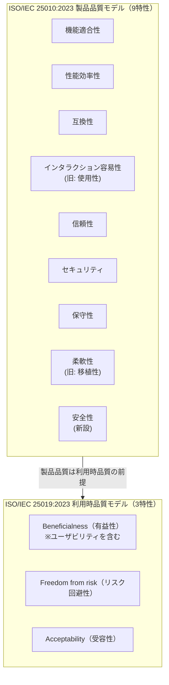
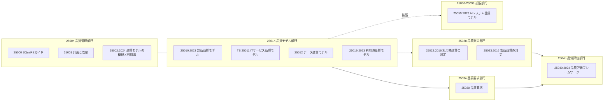

# ISO/IEC 25010:2023 製品品質モデル リファレンス

## エグゼクティブサマリ

ISO/IEC 25010:2023 は、ソフトウェアを含む ICT 製品の品質を **9 つの品質特性（機能適合性、性能効率性、互換性、インタラクション容易性、信頼性、セキュリティ、保守性、柔軟性、安全性）とその配下のサブ特性に分解する国際標準の参照モデル**です。テストケースや受入基準を書く前に「この製品にとって品質とは何か」を網羅的に列挙するための共通語彙であり、**要求定義の抜け漏れ検出、テスト目的の特定、受入基準の設定、品質ゲートの設計**に直接使えます。

実務上の要点は次の 5 つです。

- **2023 年版で品質特性は 8 個から 9 個に増えました。** usability は interaction capability（インタラクション容易性）に、portability は flexibility（柔軟性）に置き換えられ、safety（安全性）が品質特性として新設されました。2011 年版の用語で書かれた既存の非機能要求テンプレートは読み替えが必要です。
- **利用時品質モデルは ISO/IEC 25019:2023 に分離されました。** 「ユーザビリティ」は製品品質の特性ではなくなり、利用時品質（利用成果の品質）の概念として再整理されています。製品側の対話品質は interaction capability が担い、これは利用時品質のユーザビリティの前提条件と位置づけられています。
- **品質特性は「測定・テスト・証跡」とセットで運用してはじめて機能します。** 特性名を並べるだけでは要求になりません。本ドキュメントでは特性ごとに代表メトリクス・テスト方法・残すべき証跡の対応表を用意しています。
- **品質特性間にはトレードオフがあり、全特性を最大化することは不可能です。** 性能効率性 vs 保守性、セキュリティ vs インタラクション容易性などの典型的な対立を認識し、リスクとビジネス目標に基づいて優先順位を明文化することが品質マネジメントの中核です。
- **「バグがないこと＝品質」は誤解です。** 欠陥の少なさは機能適合性（の一部）の証拠にすぎず、9 特性の大半をカバーしません。テスト設計の前に必ず品質特性の分類へ立ち返るべきです。

なお、日本語訳は **JIS X 25010:2025（ISO/IEC 25010:2023 と一致、2025 年 12 月 22 日改正）** の序文で確認できた公式訳語を優先し、確認できなかった箇所は JIS X 25010:2013 の訳語を踏襲した参考訳として明記しています。

関連ドキュメント: 規格全体の使い分けと品質メトリクス運用は [../quality-management/software-quality-management-practical-reference.md](../quality-management/software-quality-management-practical-reference.md)、品質証跡のギャップ分析は [../quality-management/software-quality-gap-analysis-report.md](../quality-management/software-quality-gap-analysis-report.md)、AI システム品質モデル（ISO/IEC 25059 系）の詳細は [./ai-system-quality-model.md](./ai-system-quality-model.md)を参照してください。

## 製品品質モデルの位置づけと全体像

ISO/IEC 25010:2023 は SQuaRE（Systems and software Quality Requirements and Evaluation）シリーズの品質モデル部門に属し、**「製品そのものが持つ品質」を 9 特性で定義**します。一方、「その製品を特定の利用状況で使ったときに利害関係者が得る成果の品質」は ISO/IEC 25019:2023（利用時品質モデル）が扱います。この 2 つは補完関係にあり、製品品質は利用時品質の前提条件です。

規格本文（Scope）は、このモデルの用途として **要求の引き出しと定義、要求定義の網羅性の妥当性確認、設計目標の特定、テスト目的の特定、品質管理基準の特定、受入基準の特定、品質測定の確立**を挙げています。つまり ISO/IEC 25010 は「テストの規格」ではなく、**ライフサイクル全体で品質を仕様化・測定・評価するための語彙体系**です。

2023 年版では定義の記述スタイルも変わり、多くの特性が「degree to which ...（〜の度合い）」から「**capability of a product to ...（製品が〜する能力）**」という表現に改められました。品質特性を「製品が備えるべき能力」として要求文に変換しやすくなっています。

## 9 品質特性・サブ特性 全体リファレンス

以下の表が本ドキュメントの中核です。英語名は ISO/IEC 25010:2023 の一次情報（FDIS プレビューおよび iso25000.com ポータル）で照合済み、日本語名は JIS X 25010:2025 序文で確認できたもの（◎印）以外は JIS X 25010:2013 踏襲の参考訳です。定義は規格本文の参考訳（要約）です。

### 1. 機能適合性（Functional Suitability）

**定義**: 明示された状況下で使用するとき、意図した利用者の明示的・暗黙的ニーズを満たす機能を提供する能力。

| サブ特性 | 英語名 | 定義（参考訳） | 実務での問い |
| --- | --- | --- | --- |
| 機能完全性 | Functional completeness | 指定されたタスクと利用者目標のすべてをカバーする機能集合を提供する能力 | 要求・ユースケースに対して機能が漏れていないか |
| 機能正確性 | Functional correctness | 意図した利用者が使用したとき正確な結果を提供する能力（精度を含む） | 計算・判定・出力は正しいか、必要な精度を満たすか |
| 機能適切性 | Functional appropriateness | 指定されたタスクと目標の達成を容易にする機能を提供する能力（不要な手順がない） | 目的達成に過不足ない手順・機能になっているか |

### 2. 性能効率性（Performance Efficiency）

**定義**: 明示された条件下で、指定された時間・スループットの範囲内で機能を実行し、資源を効率的に使用する能力。

| サブ特性 | 英語名 | 定義（参考訳） | 実務での問い |
| --- | --- | --- | --- |
| 時間効率性 | Time behaviour | 応答時間・スループットが要求を満たす能力 | レイテンシ p95/p99、スループットは目標内か |
| 資源効率性 | Resource utilization | 指定量以下の資源（CPU・メモリ・ストレージ・ネットワーク等）で機能を実行する能力 | 資源消費は予算内か、リークはないか |
| 容量満足性 | Capacity | 製品パラメータの最大限度（同時ユーザ数、格納件数、帯域等）が要求を満たす能力 | 最大負荷・最大データ量で成立するか |

### 3. 互換性（Compatibility）

**定義**: 他の製品と情報を交換でき、かつ/または同一環境・資源を共有しながら要求された機能を実行できる能力。

| サブ特性 | 英語名 | 定義（参考訳） | 実務での問い |
| --- | --- | --- | --- |
| 共存性 | Co-existence | 共通の環境・資源を他製品と共有しながら、他製品に悪影響を与えずに機能を実行する能力 | 同居する他システム・プロセスへ悪影響を与えないか |
| 相互運用性 | Interoperability | 他製品と情報を交換し、交換した情報を相互に利用できる能力 | API/ファイル/プロトコルで意味を保って連携できるか |

### 4. インタラクション容易性（Interaction Capability）◎（旧: 使用性/Usability）

**定義**: 指定された利用者がユーザインタフェースを介して情報を交換し、意図したタスクを完了できるように対話できる能力。利用時品質（ISO/IEC 25019）のユーザビリティの**前提条件**と位置づけられます。※「相互作用能力」「対話能力」という訳が使われる文献もあります。

| サブ特性 | 英語名 | 定義（参考訳） | 実務での問い |
| --- | --- | --- | --- |
| 適切度認識性 | Appropriateness recognizability | 利用者が自分のニーズに適切かどうかを認識できる能力 | 初見で「自分向けの機能か」判断できるか |
| 習得性 | Learnability | 指定時間内に指定機能の使い方を学習できる能力 | 学習コストは許容内か、チュートリアルは機能するか |
| 運用操作性 | Operability | 操作・制御を容易にする機能と属性を持つ能力 | 操作は期待どおりで制御しやすいか |
| ユーザエラー防止性 | User error protection | 操作エラーを防止する能力 | 誤操作を防ぐ設計（確認・制約・undo）があるか |
| ユーザエンゲージメント◎（利用者関与性） | User engagement | 機能と情報を魅力的・動機づけ的に提示し、継続的な対話を促す能力（旧: ユーザインタフェース快美性） | 使い続けたくなる提示になっているか |
| インクルーシビティ◎（包摂性） | Inclusivity | 年齢・能力・文化・言語・経済状況など多様な背景の人々が利用できる能力 | 多様な利用者層を排除していないか |
| ユーザ支援性◎ | User assistance | 最も広範な特性・能力を持つ人々が特定の利用状況で目標を達成できる能力（アクセシビリティ関連） | 障害・環境制約があっても目標達成できるか |
| 自己記述性◎ | Self-descriptiveness | 過剰な操作や外部資料なしに、機能と使い方が利用者に自明になるよう適切な情報を提示する能力 | マニュアルなしで使い方が分かるか |

### 5. 信頼性（Reliability）

**定義**: 明示された条件下で、明示された期間、指定された機能を実行する能力。

| サブ特性 | 英語名 | 定義（参考訳） | 実務での問い |
| --- | --- | --- | --- |
| 無障害性◎ | Faultlessness | 通常運用時にフォールトなしで指定機能を実行する能力（旧: 成熟性/Maturity） | 通常運用での障害発生頻度は許容内か |
| 可用性 | Availability | 使用したいときに運用・アクセスが可能である能力 | 稼働率 SLO を満たすか、計画停止は合意内か |
| 障害許容性 | Fault tolerance | ハードウェア・ソフトウェアのフォールトが存在しても意図どおり動作する能力 | 部分故障時に機能継続・縮退できるか |
| 回復性 | Recoverability | 中断・故障時に、直接影響を受けたデータを回復し、望まれる状態を再確立できる能力 | 障害後に RTO/RPO 内で復旧できるか |

### 6. セキュリティ（Security）

**定義**: 悪意ある行為者による攻撃パターンから防御し、人・製品・システムが権限の種類と水準に応じてアクセスできるよう情報とデータを保護する能力。

| サブ特性 | 英語名 | 定義（参考訳） | 実務での問い |
| --- | --- | --- | --- |
| 機密性 | Confidentiality | アクセスを許可された者だけがデータにアクセスできることを確実にする能力 | 認可外の読み取りを防げるか |
| インテグリティ | Integrity | システム・データが不正な変更・削除から保護されることを確実にする能力 | 改ざん・破壊を防止・検出できるか |
| 否認防止性 | Non-repudiation | 行為や事象の発生を後から否認できないよう証明できる能力 | 重要操作の発生を証明できるか |
| 責任追跡性 | Accountability | エンティティの行為をそのエンティティへ一意に追跡できる能力 | 監査ログで「誰が何をしたか」追えるか |
| 真正性 | Authenticity | 主体・資源の同一性が主張どおりであることを証明できる能力 | なりすましを防げるか |
| 耐攻撃性◎（新設） | Resistance | 悪意ある行為者からの攻撃を受けている間も運用を維持する能力 | DoS 等の攻撃下でも運用を維持できるか |

### 7. 保守性（Maintainability）

**定義**: 意図された保守者によって、修正・改善・環境や要求の変化への適応のために効果的・効率的に変更できる能力。

| サブ特性 | 英語名 | 定義（参考訳） | 実務での問い |
| --- | --- | --- | --- |
| モジュール性 | Modularity | ある構成要素への変更が他の構成要素へ与える影響が最小になるよう、個別の構成要素から構成されている度合い | 変更影響が局所化されているか |
| 再利用性 | Reusability | 複数のシステムや他の資産の構築で資産として使用できる度合い | 共通部品として流用できるか |
| 解析性 | Analysability | 意図した変更の影響、欠陥や故障の原因、修正すべき箇所を効果的・効率的に評価できる度合い | 原因調査・影響分析が容易か |
| 修正性 | Modifiability | 欠陥を混入させることなく効果的・効率的に変更できる度合い | 変更のリードタイムとデグレ率は許容内か |
| 試験性 | Testability | テスト基準を確立し、それを満たすかを判定するテストを実行できる効果性・効率性の度合い | 自動テストで検証可能な構造か |

### 8. 柔軟性（Flexibility）◎（旧: 移植性/Portability）

**定義**: 要求、利用状況、システム環境の変化に適応できる能力。

| サブ特性 | 英語名 | 定義（参考訳） | 実務での問い |
| --- | --- | --- | --- |
| 適応性 | Adaptability | 異なるハードウェア・ソフトウェア・運用/利用環境へ効果的・効率的に適応できる能力 | 環境・要求の変化に構成変更で追従できるか |
| 拡張性◎（新設） | Scalability | 増減するワークロードを処理でき、変動に対応して容量を調整できる能力 | 負荷増減に応じてスケールできるか |
| 設置性 | Installability | 指定環境で効果的・効率的にインストール/アンインストールできる能力 | 導入・撤去は自動化され再現可能か |
| 置換性 | Replaceability | 同一環境で同一目的の他製品を置き換えられる能力 | 旧版・他製品からの移行は成立するか |

### 9. 安全性（Safety）◎（新設）

**定義**: 定義された条件下で、人命・健康・財産・環境が危険にさらされる状態を回避する能力。※セキュリティ（悪意ある攻撃からの保護）とは区別され、こちらは「危害（harm）の回避」を扱います。

| サブ特性 | 英語名 | 定義（参考訳） | 実務での問い |
| --- | --- | --- | --- |
| 運用制約性◎ | Operational constraint | 運用上のハザードに遭遇したとき、安全なパラメータ・状態の範囲内に運用を制約する能力 | 危険域に入る操作を制限できるか |
| リスク識別性◎ | Risk identification | 生命・財産・環境を許容できないリスクにさらす事象・操作の経過を識別できる能力 | 危険な状態遷移を検知できるか |
| フェールセーフ◎ | Fail safe | 故障時に自動的に安全な運転モードへ移行する、または安全な状態へ復帰する能力 | 故障時に安全側へ倒れるか |
| 危険警告性◎ | Hazard warning | 運用や内部統制に対する許容できないリスクの警告を、安全な運用を維持するのに十分な時間内に提供する能力 | 危険を間に合うタイミングで警告できるか |
| 統合時安全性◎ | Safe integration | 1 つ以上の構成要素との統合中および統合後に安全性を維持できる能力 | 結合・更新後も安全性が保たれるか |

## 2011 年版からの変更点

2023 年改訂は単なる用語変更ではなく、**規格の分割と特性体系の再編**です。ISO/IEC 25010:2011 は、第 2 版 ISO/IEC 25010:2023・第 1 版 ISO/IEC 25002:2024（品質モデルの概観と利用法）・第 1 版 ISO/IEC 25019:2023（利用時品質モデル）の 3 規格によって置き換えられました（FDIS 序文および JIS X 25010:2025 序文で確認）。

| 変更区分 | 2011 年版 | 2023 年版 | 実務への影響 |
| --- | --- | --- | --- |
| 規格構成 | 製品品質＋利用時品質を 1 規格に収録 | 製品品質は 25010、利用時品質は 25019、モデルの使い方は 25002 に分割 | 「利用時品質」を参照する文書は参照先規格の変更が必要 |
| 特性数 | 8 特性 | **9 特性（安全性を新設）** | 安全関連システムでなくても安全性の要否判断を要求分析に組み込む |
| 特性名 | Usability（使用性） | **Interaction capability（インタラクション容易性）** | 「ユーザビリティ要求」は製品側（対話能力）と利用時品質側（成果）に分けて書き直す |
| 特性名 | Portability（移植性） | **Flexibility（柔軟性）** | 移植性テンプレートに拡張性（スケーラビリティ）観点を追加 |
| サブ特性追加 | ― | インクルーシビティ、自己記述性（インタラクション容易性配下）／耐攻撃性（セキュリティ配下）／拡張性（柔軟性配下） | 攻撃下の運用継続・スケーラビリティ・包摂性を明示的に要求可能に |
| サブ特性置換 | ユーザインタフェース快美性 | ユーザエンゲージメント（利用者関与性） | 見た目の美しさではなく継続利用の動機づけを評価 |
| サブ特性置換 | 成熟性（Maturity） | 無障害性（Faultlessness） | 「通常運用でフォールトなしに動く度合い」として意味が明確化 |
| サブ特性分割 | アクセシビリティ | インクルーシビティ（包摂性）＋ユーザ支援性 | アクセシビリティ要求は 2 観点に分解して定義 |
| 定義スタイル | degree to which（〜の度合い） | capability of a product to（製品の〜する能力） | 要求文・受入基準への変換が容易に |
| 利用時品質 | 5 特性（有効性・効率性・満足性・リスク回避性・利用状況網羅性） | 25019 で 3 特性（beneficialness／freedom from risk／acceptability）に再編。**利用状況網羅性は削除**され、利害関係者の分類が明示された | 利用時品質の要求・測定体系は 25019 ベースで再設計 |

**アンチパターン**: 2011 年版の特性名のまま社内標準・RFP テンプレート・チェックリストを使い続けると、耐攻撃性・拡張性・安全性・包摂性といった 2023 年版で明示された観点が構造的に抜け落ちます。テンプレート類は 9 特性へのマッピング表を添えて更新してください。

### 日本語訳（JIS）の状況

- 旧版 ISO/IEC 25010:2011 の JIS は **JIS X 25010:2013**。
- **JIS X 25010:2025**（ISO/IEC 25010:2023 と技術的内容・構成が一致する IDT 規格）が 2025 年 12 月 22 日に改正公示され、JIS X 25010:2013 を置き換えました（日本規格協会の規格プレビューで確認）。
- JIS X 25010:2025 序文では、JIS X 25002 および JIS X 25019 への分割も明記されています（両 JIS の発行状況の詳細は未確認）。
- 本ドキュメントの◎印は JIS X 25010:2025 序文で確認できた公式訳語、無印は JIS X 25010:2013 訳語を踏襲した参考訳です。

## SQuaRE シリーズ（ISO/IEC 2500n）全体地図

ISO/IEC 25010 は単独で使う規格ではなく、SQuaRE ファミリの部門（division）構成の中で「品質モデル部門」を担います（部門構成は 25010:2023／25019:2023 の序文で確認）。

| 規格 | 役割 | 実務での使いどころ |
| --- | --- | --- |
| ISO/IEC 25000 | SQuaRE 全体のガイド・共通用語 | シリーズの読み方の起点 |
| ISO/IEC 25001 | 品質要求・評価活動の計画と管理 | 品質評価プログラムの体制設計 |
| ISO/IEC 25002:2024 | 品質モデルの概観と利用法（2011 年版から分離） | 各品質モデルの選び方・組み合わせ方 |
| **ISO/IEC 25010:2023** | **製品品質モデル（本ドキュメントの主題）** | 非機能要求の分類、テスト観点、受入基準の骨格 |
| ISO/IEC TS 25011 | IT サービス品質モデル | 運用サービス（サポート等）の品質定義 |
| ISO/IEC 25012 | データ品質モデル（正確性・完全性・一貫性・最新性など 15 特性） | データ移行・マスタ管理・分析基盤の品質要求 |
| ISO/IEC 25019:2023 | 利用時品質モデル（有益性・リスク回避性・受容性） | UX・業務成果・社会影響の評価軸 |
| ISO/IEC 25022:2016 | 利用時品質の測定量 | 有効性・効率性・満足性などの測定定義 |
| ISO/IEC 25023:2016 | 製品品質の測定量 | 特性・サブ特性ごとの測定式カタログ |
| ISO/IEC 25030 | 品質要求の仕様化フレームワーク | 品質要求書の構造・書き方 |
| ISO/IEC 25040:2024 | 品質評価フレームワーク（5 活動で構成） | 品質評価プロセスの設計、第三者評価 |
| ISO/IEC 25059:2023 | AI システム品質モデル（SQuaRE の AI 拡張） | 詳細は [./ai-system-quality-model.md](./ai-system-quality-model.md) に委譲 |

**注意（執筆時点で確認した範囲）**: 測定部門の ISO/IEC 25022/25023 は 2016 年版のままで、2011 年版モデルの特性体系を前提に測定量が定義されています。**2023 年版で新設・改称された特性（安全性、耐攻撃性、拡張性、インクルーシビティ等）に対応する公式測定量はまだ揃っていない**ため、当面は 25023 の測定量を読み替えつつ、新特性については後述の対応表のようなメトリクスを自組織で定義する必要があります。

## 要求から品質特性へマッピングする方法

### 手順（AI エージェント向け 5 ステップ）

1. **要求を分解する**: 要求文・ユーザストーリー・RFP を「機能要求」「品質（非機能）要求」「制約」に仕分けます。「〜できること」は機能、「どの程度・どんな条件で」は品質要求の候補です。
2. **9 特性で総当たりチェックする**: 各要求・各主要機能に対して 9 特性を順に問い、「関連あり／なし／不明」を判定します。目的は該当特性の特定ではなく、**言及されていない特性の発見**です（暗黙要求の抽出）。
3. **サブ特性で具体化する**: 関連ありの特性はサブ特性まで掘り、「対象（どの機能・データ・利用者に）」「条件（どんな状況で）」「水準（どの程度）」の 3 点を記述します。水準が書けない要求は測定不能であり、ステークホルダーへの確認事項になります。
4. **リスクで重み付けする**: すべてのサブ特性を同じ深さで扱わず、「品質が未達だったときの被害 × 発生しやすさ」で優先度を付けます。これが後のテスト配分と品質ゲート厳しさの根拠になります。
5. **測定・テスト・証跡を割り当てる**: 優先度の高いサブ特性から、次章の対応表を使って測定方法・テスト方法・証跡を決め、受入基準に変換します。

### 要求の手がかり語 → 品質特性 対応表

| 要求文の手がかり語（例） | 第一候補の特性 | 併せて確認すべき特性 |
| --- | --- | --- |
| 「正しく計算」「仕様どおり」「必須機能」 | 機能適合性 | 信頼性（無障害性） |
| 「○秒以内」「同時○人」「大量データ」 | 性能効率性 | 柔軟性（拡張性） |
| 「外部連携」「API」「他システムと同居」 | 互換性 | セキュリティ（真正性） |
| 「使いやすい」「迷わない」「誰でも使える」 | インタラクション容易性 | 利用時品質（25019）へ委譲する部分の切り分け |
| 「24時間365日」「障害時も」「復旧」 | 信頼性 | 安全性、柔軟性（拡張性） |
| 「不正アクセス」「個人情報」「監査」 | セキュリティ | 信頼性、否認防止・責任追跡の証跡設計 |
| 「変更しやすい」「保守契約」「改修頻度」 | 保守性 | 柔軟性（適応性） |
| 「クラウド移行」「負荷増減」「マルチ環境」 | 柔軟性 | 性能効率性、設置性 |
| 「人命」「事故」「危険」「機器制御」 | 安全性 | 信頼性、セキュリティ（safety と security の分担明示） |

### IPA 非機能要求グレードとの対応

日本の実務では IPA「非機能要求グレード」（6 大項目・約 240 メトリクス）が広く使われています。両者は競合ではなく、**ISO/IEC 25010 が「品質を何に分類するか」、非機能要求グレードが「どの水準で合意するか（レベル選択式メトリクス）」**という補完関係です。以下の対応は本ドキュメントの実務的な整理です（両者の公式対応表ではありません）。

| IPA 非機能要求グレード 6 大項目 | 主に対応する 25010:2023 特性 | 補足 |
| --- | --- | --- |
| 可用性 | 信頼性（可用性・障害許容性・回復性） | 稼働率・RTO/RPO は信頼性サブ特性の水準指定に相当 |
| 性能・拡張性 | 性能効率性＋柔軟性（拡張性） | 2023 年版で拡張性が柔軟性配下に明示されたため対応が素直になった |
| 運用・保守性 | 保守性＋信頼性（回復性）＋一部インタラクション容易性（運用者向け操作性） | 監視・バックアップ運用は証跡設計と直結 |
| 移行性 | 柔軟性（適応性・設置性・置換性）＋ISO/IEC 25012（データ品質） | データ移行の品質はデータ品質モデルも併用 |
| セキュリティ | セキュリティ（6 サブ特性） | 耐攻撃性（攻撃下の運用継続）は 2023 年版で明示化 |
| システム環境・エコロジー | 直接対応する特性なし（制約・環境要求として扱う） | 25010 の特性外の要求も存在する好例。「特性に載らない＝不要」ではない |

**判断基準**: 非機能要求グレードでレベルを合意した項目は、必ず対応する 25010 サブ特性に逆マッピングして「特性として抜けている観点がないか」を再チェックします。逆に 25010 起点で洗い出した要求は、非機能要求グレードのメトリクス表で水準を具体化します。双方向に使うことで、分類の網羅性と水準の具体性を両立できます。

## 品質特性ごとの測定・テスト・証跡 対応表

AI エージェントが「この特性はどう測り、どうテストし、何を証跡に残すか」を引くための対応表です。メトリクスの詳細な定義体系は [../quality-management/software-quality-management-practical-reference.md](../quality-management/software-quality-management-practical-reference.md) を、テスト技法の選択は [../test-techniques/test-techniques-skill-catalog.md](../test-techniques/test-techniques-skill-catalog.md) を参照してください。

| 特性 | 代表メトリクス（例） | 主な測定・テスト方法 | 残すべき証跡（evidence） |
| --- | --- | --- | --- |
| 機能適合性 | 要求カバレッジ、機能実装率、欠陥密度、正解率（計算精度） | 要求ベーステスト（同値分割・境界値・デシジョンテーブル）、受入テスト、トレーサビリティ分析 | 要求⇔テストケースのトレーサビリティマトリクス、テスト実行結果、欠陥票 |
| 性能効率性 | 応答時間 p50/p95/p99、スループット、資源使用率、最大同時接続数 | 負荷テスト、ストレステスト、スパイクテスト、耐久（ソーク）テスト、APM 計測 | 性能テスト計画・結果レポート、負荷プロファイル、監視ダッシュボードのスナップショット |
| 互換性 | 連携先別の接続成功率、スキーマ検証違反件数、共存環境での性能劣化率 | インタフェーステスト、契約テスト（consumer-driven contract）、相互接続試験、共存環境試験 | インタフェース仕様書、契約テスト結果、接続試験成績書 |
| インタラクション容易性 | タスク完了率、操作エラー率、習得時間、アクセシビリティ適合率（例: WCAG 達成基準） | ユーザビリティテスト、ヒューリスティック評価、アクセシビリティ検査（自動＋手動）、A/B テスト | ユーザビリティテスト記録・動画、評価チェックリスト、アクセシビリティ検査報告 |
| 信頼性 | 稼働率、MTBF、MTTR、障害件数/重大度別、RTO/RPO 実測値 | 障害注入（カオスエンジニアリング）、フェイルオーバー試験、リカバリ試験、長時間稼働試験、本番監視 | SLO 定義と実績、障害訓練記録、復旧手順書と実施ログ、ポストモーテム |
| セキュリティ | 未修正脆弱性数（深刻度別）、脆弱性修正リードタイム、監査ログカバレッジ、攻撃下の可用性 | 脅威モデリング、SAST/DAST/SCA、ペネトレーションテスト、認証認可テスト、DoS 耐性試験 | 脅威モデル、スキャン結果、診断報告書、監査ログ設計と保全記録、修正履歴 |
| 保守性 | 循環的複雑度、重複率、テストカバレッジ、変更リードタイム、変更失敗率、技術的負債比率 | 静的解析、アーキテクチャ適合性検査、コードレビュー、リファクタリング前後の比較測定 | 静的解析レポートの推移、レビュー記録、ADR（アーキテクチャ決定記録） |
| 柔軟性 | スケールアウト所要時間、対応環境数、インストール成功率、負荷弾力性（オートスケール追従） | スケーラビリティテスト、マルチ環境での導入試験、構成変更試験、IaC の再現性検証 | 対応環境マトリクス、スケール試験結果、導入手順書と検証ログ |
| 安全性 | ハザード対応網羅率、フェールセーフ動作成功率、警告応答時間、リスクアセスメント残存リスク数 | ハザード分析（HAZOP/FTA/FMEA）、フェールセーフ動作試験、フォールト注入、統合安全性試験 | ハザードログ、リスクアセスメント記録、セーフティケース、安全機能試験成績書 |

**運用ルール**: 証跡は「テストをした証拠」ではなく「**品質要求が満たされていると主張するための根拠**」として設計します。受入・監査で提示できない証跡は存在しないのと同じです。証跡の抜け漏れ分析は [../quality-management/software-quality-gap-analysis-report.md](../quality-management/software-quality-gap-analysis-report.md) の枠組みを使ってください。

## 品質特性間のトレードオフと調停

9 特性をすべて最大化することはできません。品質要求の定義とは、実質的には**トレードオフの意思決定を明文化する行為**です。

### 典型的なトレードオフ

| 対立する特性 | 典型的な状況 | 調停の考え方（例） |
| --- | --- | --- |
| 性能効率性 vs 保守性 | 高度な最適化（キャッシュ、非正規化、手書き最適化コード）が可読性・変更容易性を下げる | まず測定し、ボトルネックに限定して最適化。最適化箇所には理由と計測結果を ADR として残す |
| セキュリティ vs インタラクション容易性 | 多要素認証・セッション制限・入力制約が操作の手間を増やす | リスクベースで強度を可変に（重要操作のみ強い認証）。ユーザエラー防止と両立する UI 設計を先に検討 |
| 柔軟性 vs 性能効率性 | 抽象化層・設定駆動・プラグイン機構がオーバーヘッドを生む | 変化が実際に見込まれる軸だけを柔軟化（投機的汎用化の禁止）。性能予算を先に定義して抽象化を評価 |
| 安全性 vs 可用性（信頼性） | フェールセーフによる安全停止がサービス停止を意味する | 「安全側に倒す」を原則として明文化。安全性は他特性より優先する旨を品質方針に書く（安全関連システムの場合） |
| セキュリティ vs 性能効率性 | 暗号化・検査・監査ログが遅延と資源消費を増やす | 保護対象データの分類で処理を差別化。監査ログは非同期化などの設計で緩和 |
| 機能適合性（完全性） vs 納期・保守性 | 機能を盛るほど複雑度が上がり保守性が劣化 | 機能適切性（不要な手順・機能の排除）を評価軸に加え、「足す」以外の選択肢を常に比較 |
| 互換性（相互運用性） vs セキュリティ | 外部連携の開放が攻撃面を拡大 | 連携ごとに真正性・責任追跡性の要求を定義。互換性要求には必ずセキュリティ要求を対にする |

### 調停・優先順位付けの手順

1. **品質特性の優先順位をプロダクト単位で宣言する**: 「本システムでは 安全性 > セキュリティ > 信頼性 > その他」のような順序を、根拠（法規制・事業リスク）付きで文書化します。個別の設計論争をこの順序に還元できるようにします。
2. **品質シナリオで具体化する**: 抽象的な特性名ではなく「刺激（何が起きたとき）→ 環境（どんな条件で）→ 応答（どう振る舞い）→ 応答測定（どの水準で）」の形式でシナリオを書き、シナリオ同士の衝突としてトレードオフを可視化します（アーキテクチャ評価で使われる一般的な手法です）。
3. **却下した選択肢も記録する**: トレードオフの決定は ADR に「採用案・却下案・理由・見直し条件」を残します。前提が変わったときに再調停できることが重要です。
4. **アンチパターンを避ける**: (a) 全特性に「高」を付ける要求定義（＝優先順位の放棄）、(b) 声の大きいステークホルダーの特性だけ過剰達成、(c) トレードオフを実装者の暗黙判断に委ねる、の 3 つは品質不全の常連です。

## 受入基準・品質ゲートへの落とし込みパターン

品質特性は「受入基準の言葉」に変換されてはじめて拘束力を持ちます。変換の基本形は次のとおりです。

**基本形**: 「〔対象〕は〔条件〕のもとで〔測定可能な水準〕を満たすこと。検証方法は〔テスト/測定方法〕、証跡は〔成果物〕とする。」

| 特性 | 悪い受入基準（測定不能） | 良い受入基準（例） |
| --- | --- | --- |
| 性能効率性 | 「十分に高速であること」 | 「検索 API は想定ピーク負荷（100 req/s、データ 1,000 万件）で p95 応答 800ms 以下。負荷テストレポートを証跡とする」 |
| 信頼性 | 「安定して動くこと」 | 「月間稼働率 99.9% 以上。単一ノード障害時に 60 秒以内に自動フェイルオーバーし、データ損失は RPO 5 分以内。フェイルオーバー試験記録を証跡とする」 |
| セキュリティ | 「セキュアであること」 | 「リリース時点で深刻度 High 以上の未修正脆弱性 0 件（SAST/DAST/SCA 実施）。重要操作 100% に操作者を特定できる監査ログが存在する」 |
| インタラクション容易性 | 「使いやすいこと」 | 「初回利用者 5 名中 4 名以上が、マニュアル参照なしに 10 分以内で申請タスクを完了。対象画面は WCAG 2.2 AA の対象達成基準に適合」 |
| 保守性 | 「きれいなコードであること」 | 「新規コードのユニットテストカバレッジ 80% 以上、静的解析の Blocker/Critical 指摘 0 件。循環的複雑度 15 超の関数を追加しない」 |
| 安全性 | 「安全に配慮すること」 | 「ハザード分析で特定した全ハザードに対し、フェールセーフ動作または警告が実装され、フォールト注入試験で 100% 動作確認済み。ハザードログと試験成績書を証跡とする」 |

### 品質ゲートへの配置パターン

| ゲート | 主にチェックする特性 | 判定材料の例 |
| --- | --- | --- |
| 要求レビュー（着手前） | 全特性（分類の網羅性） | 9 特性チェックの実施記録、水準未定義の品質要求 0 件 |
| CI（コミット毎） | 保守性、機能適合性、セキュリティ（静的） | ユニットテスト、静的解析、SAST/SCA、カバレッジ閾値 |
| ステージング（リリース前） | 性能効率性、信頼性、互換性、セキュリティ（動的） | 負荷テスト、フェイルオーバー試験、契約テスト、DAST |
| 受入・リリース判定 | 優先度上位の特性すべて | 受入基準の充足状況一覧と証跡リンク、残存リスクの承認記録 |
| 本番運用（継続） | 信頼性、性能効率性、セキュリティ | SLO 監視、エラーバジェット、脆弱性監視、インシデント分析 |

**判断基準**: ゲートに載せる基準は「優先度上位のサブ特性から」絞り込みます。全特性を全ゲートで検査しようとすると形骸化します。ゲート基準と品質特性の対応表を維持し、「この基準はどの特性の証拠か」を常に答えられる状態にしておくことが、品質ゲートを説明可能にする最小条件です。

## 「バグがないこと＝品質」という誤解への反論

「テストで欠陥が出なかったから品質が高い」は、次の 3 つの理由で誤りです。

1. **カバー範囲の誤り**: 欠陥の少なさが直接示すのは主に機能適合性（と信頼性の一部）です。性能効率性・セキュリティ・保守性・柔軟性・安全性・インタラクション容易性は、機能テストでは原理的にほとんど検証されません。「バグゼロで炎上するシステム」は、遅い・攻撃に弱い・変更できない・使えないという形で残りの特性が未達だったケースです。
2. **要求の誤り**: 品質は「要求を満たす度合い」であり、要求自体が間違っていれば欠陥ゼロでも品質は低い（検証と妥当性確認の違い）。ISO/IEC 25010 の規格本文自身が、モデルの用途の筆頭に「要求の引き出しと定義」「要求定義の網羅性の妥当性確認」を挙げています。テスト前の要求の質が品質の上限を決めます。
3. **証拠の誤り**: 「欠陥が見つからなかった」は「欠陥がない」ことの証明ではありません（テストは欠陥の存在しか示せない）。だからこそ特性ごとに測定量と証跡を設計し、「どの特性を・どの水準まで・どんな方法で確認したか」を主張できる形にする必要があります。

### AI エージェント向け: 品質モデルを使う思考手順チェックリスト

テスト設計・レビュー・品質評価のタスクを受けたとき、次の順で自問してください。

- [ ] **分類の前提**: このタスクの「品質」は製品品質（25010）か、利用時品質（25019）か、データ品質（25012）か、AI 特有の品質（25059 → [./ai-system-quality-model.md](./ai-system-quality-model.md)）か
- [ ] **網羅チェック**: 9 特性すべてについて「関連あり／なし／不明」を判定したか。「なし」の判定に理由を付けたか
- [ ] **暗黙要求**: 要求文書に書かれていないが文脈上必須の特性（例: 個人情報を扱うならセキュリティ、機器制御なら安全性）を補ったか
- [ ] **水準の具体性**: 関連ありのサブ特性に「対象・条件・測定可能な水準」が定義されているか。未定義なら確認事項として報告したか
- [ ] **優先順位**: 特性間のトレードオフと優先順位が明文化されているか。なければ提案したか
- [ ] **測定とテスト**: 各サブ特性に測定方法とテスト方法を割り当てたか（機能テストだけで「品質確認済み」と主張していないか）
- [ ] **証跡**: 受入・監査で提示する証跡が特定され、生成される仕組みがあるか
- [ ] **用語の版**: 参照している資料が 2011 年版の用語（使用性・移植性・8 特性）で書かれていないか。2023 年版へ読み替えたか
- [ ] **結論の限定**: 報告時に「確認した特性と水準」「確認していない特性」を分けて明示したか

## 検証メモ（本ドキュメントの根拠と限界）

- 9 特性・サブ特性の英語名と定義は、ISO/IEC FDIS 25010 および ISO/IEC 25010:2023 の公開プレビュー（標準機関の試読 PDF、用語定義 3.1〜3.4 まで収録）と iso25000.com ポータル（全特性）を突き合わせて確認しました。ISO 規格本文の全文は有料のため、**条項番号の引用は行わず、定義は参考訳（要約）として記載**しています。
- 日本語訳は JIS X 25010:2025 プレビュー（序文）で確認できた範囲を◎で明示し、それ以外は JIS X 25010:2013 踏襲の参考訳です。JIS X 25002・JIS X 25019 の発行状況の詳細は未確認です。
- ISO/IEC 25019:2023 の 3 特性（beneficialness／freedom from risk／acceptability）は複数の二次情報で照合しましたが、サブ特性の完全な一覧は一次情報で確認できなかったため本ドキュメントでは扱っていません。
- ISO/IEC 25022/25023 の 2023 年版モデルへの改訂状況は執筆時点（2026 年 7 月）の調査に基づきます。参照時は最新の発行状況を確認してください。

## 主要参考文献

- ISO/IEC 25010:2023 Product quality model（ISO 公式ページ）: https://www.iso.org/standard/78176.html
- ISO/IEC 25010:2023 公開プレビュー（iTeh Standards、序文・Scope・用語 3.1〜3.4）: https://cdn.standards.iteh.ai/samples/78176/13ff8ea97048443f99318920757df124/ISO-IEC-25010-2023.pdf
- ISO/IEC FDIS 25010 公開プレビュー（iTeh Standards）: https://cdn.standards.iteh.ai/samples/78176/da352588834f46f2a1235f00d1fc23db/ISO-IEC-FDIS-25010.pdf
- ISO/IEC 25019:2023 Quality-in-use model（ISO 公式ページ）: https://www.iso.org/standard/78177.html
- ISO/IEC 25019:2023 公開プレビュー（iTeh Standards、序文・Scope・用語）: https://cdn.standards.iteh.ai/samples/78177/7c8fe3ed9fdc4c06a8c9a14a8cdae2ec/ISO-IEC-25019-2023.pdf
- ISO/IEC 25002:2024 Quality model overview and usage（ISO 公式ページ）: https://www.iso.org/standard/78175.html
- ISO/IEC 25040:2024 Quality evaluation framework（ISO 公式ページ）: https://www.iso.org/standard/83467.html
- ISO/IEC 25023:2016 Measurement of system and software product quality（ISO 公式ページ）: https://www.iso.org/standard/35747.html
- ISO/IEC 25059:2023 Quality model for AI systems（ISO 公式ページ）: https://www.iso.org/standard/80655.html
- ISO 25010（iso25000.com ポータル、全 9 特性・サブ特性の解説）: https://iso25000.com/index.php/en/iso-25000-standards/iso-25010
- Update on ISO 25010, version 2023（arc42 Quality Model）: https://quality.arc42.org/articles/iso-25010-update-2023
- ISO/IEC 25010 – News from the 2nd Edition (2023-11)（spree.de）: https://blog.spree.de/2024/01/02/iso-iec-25010-news-from-the-2nd-edition-2023-11/
- JIS X 25010:2025 規格プレビュー（日本規格協会、序文に主要変更点と公式訳語）: https://webdesk.jsa.or.jp/preview/pre_jis_x_25010_000_000_2025_j_ed10_ch.pdf
- SQuaRE 規格群 JIS 原案作成委員会 活動報告（情報処理学会 情報規格調査会）: https://itscj.ipsj.or.jp/committee-activities/report/jisSQuaRE-2024.html
- ISO/IEC 25010:2023 と ISO/IEC 25019:2023 の日本語勝手対訳（ソフトウェアの品質を学びまくる）: https://www.kzsuzuki.com/entry/2025/05/06/183645
- ISO/IEC 25010:2011 が改定されたこと（U-Site）: https://u-site.jp/lecture/revision-of-iso-iec-25010
- 非機能要求グレード（IPA アーカイブ）: https://www.ipa.go.jp/archive/digital/iot-en-ci/jyouryuu/hikinou/index.html
- 非機能要求グレードとは？6 つのカテゴリと使い方・活用ポイント（Qbook）: https://www.qbook.jp/column/741.html
