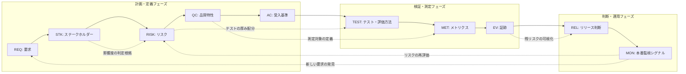
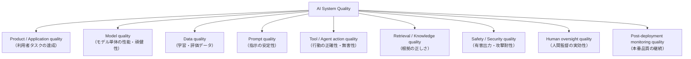

# ソフトウェア品質知識スキーマ（品質トレーサビリティチェーンと AI 品質分解ツリー）

## エグゼクティブサマリ

本ドキュメントは、この知識ベース全体を貫く**中核スキーマ（ハブドキュメント）**です。結論を先に述べます。

- **品質は「テストの量」ではなく「チェーンの完全性」で説明します。** 要求（REQ）→ ステークホルダー（STK）→ リスク（RISK）→ 品質特性（QC）→ 受入基準（AC）→ テスト・評価方法（TEST）→ メトリクス（MET）→ 証跡（EV）→ リリース判断（REL）→ 本番監視シグナル（MON）という 10 ノードのトレーサビリティチェーンが本スキーマの中核です。テストを増やしても、このチェーンのどこかが切れていれば「品質が高い」とは主張できません。
- **各ノードはデータ契約として定義します。** [テスト活動プロセス調査まとめ](../test-techniques/test-process-research-summary-test-design.md)の ID 体系（`REQ-` / `RISK-` / `HTC-` / `DTC-` / `TC-` 等）と互換であり、本スキーマはその上位に「誰のための品質か（STK）」「何の品質か（QC）」「出荷してよいか（REL）」「出荷後も品質を保っているか（MON）」を追加します。
- **AI/LLM システムの品質は 9 レイヤに分解します。** プロダクト品質・モデル品質・データ品質・プロンプト品質・ツール/エージェント行動品質・検索/知識品質・安全性/セキュリティ品質・人間監督品質・デプロイ後監視品質です。モデル単体のベンチマークスコアは 9 レイヤのうち 1 つの部分証跡にすぎません。
- **AI エージェントはこのスキーマを推論手順として使います。** 品質相談を受けたら、チェーンを上流（要求・ステークホルダー）から下流（本番監視）へ順にたどり、各ステップで本知識ベースの該当ドキュメントを参照します。アンチパターンは「チェーンのどのノードが欠けているか」として診断します。

本ドキュメントは参考文献よりリンクハブの性格が強いため、末尾の「関連ドキュメント」に全マッピングを再掲しています。

---

## 1. 品質トレーサビリティチェーン

### 1.1 チェーン全体像

品質の説明責任は、次の 10 ノードを双方向にたどれることで成立します。実線が主チェーン、点線が横断リンクとフィードバックです。

主チェーンは「品質を作り込み、確かめ、判断し、維持する」という時系列を表しますが、実際のノード間関係は多対多です（1.4 節）。また、MON から REQ / RISK への点線は、**本番運用で得た知見を次の要求とリスク評価に還流するループ**を表します。このループがないチェーンは一方通行の「出荷して終わり」になります。

### 1.2 ID 体系と既存データ契約との対応

本スキーマの ID プレフィックスは以下のとおりです。既存のテスト設計データ契約（[テスト活動プロセス調査まとめ 6章](../test-techniques/test-process-research-summary-test-design.md)）と共存させるため、`REQ-` と `RISK-` は同一 ID 空間を共有し、`TEST-` ノードは既存のテスト設計チェーン（`HTC-` → `DTC-` → `TAE-` → `COV-` → `TC-` → `TPR-` → `RUN-`）全体を内包する粗粒度ノードとして定義します。

| ノード | プレフィックス | 既存 ID 体系との関係 |
| --- | --- | --- |
| Requirement | `REQ-` | 既存の `REQ-` と同一 |
| Stakeholder | `STK-` | 新規 |
| Risk | `RISK-` | 既存の `RISK-` と同一 |
| Quality Characteristic | `QC-` | 新規（既存 `HTC-` の「品質特性単位の確認側面」を上流で正規化） |
| Acceptance Criterion | `AC-` | 新規 |
| Test / Evaluation Method | `TEST-` | `HTC-`〜`RUN-` のテスト設計チェーン全体を内包。詳細分解は既存契約に委譲 |
| Metric | `MET-` | 新規 |
| Evidence | `EV-` | `RUN-`（実行結果）・`BUG-`（欠陥）を包含し、レビュー記録・SBOM・監査ログ等の非テスト証跡へ一般化 |
| Release Decision | `REL-` | 既存トレースチェーン末尾の「完了・リリース判断（DEC）」を正式ノード化 |
| Production Monitoring Signal | `MON-` | 新規 |

### 1.3 ノード定義（データ契約）

各ノードの定義・目的・代表属性を示します。属性は必須最小限であり、プロジェクトごとに拡張して構いません。

#### REQ: Requirement（要求）

品質の起点です。機能要求だけでなく、非機能要求・制約・規制由来の要求を含みます。**目的**: 「何を満たすべきか」を追跡可能な単位で明文化することです。

| 属性 | 型・値域 | 説明 |
| --- | --- | --- |
| `id` | `REQ-nnn` | 一意 ID |
| `statement` | string | 要求文。検証可能な表現にする |
| `type` | functional / non_functional / constraint / regulatory | 規制由来（regulatory）は保持要件・監査対応が変わるため明示する |
| `source` | string | 出所（顧客、法令、社内標準、インシデント等） |
| `stakeholder_refs` | `STK-*`[] | この要求の受益者・影響を受ける者 |
| `acceptance_criterion_refs` | `AC-*`[] | 要求を判定可能にした受入基準 |
| `status` | draft / approved / retired | 承認状態 |

#### STK: Stakeholder（ステークホルダー）

**目的**: 「誰のための品質か」と「失敗したとき誰がどんな不利益を受けるか」を明示し、リスク影響度判定の根拠にすることです。エンドユーザー・発注者だけでなく、運用者・規制当局・間接的に影響を受ける社会集団を含みます。主参照: [アクセシビリティ・UX・人間中心品質](../human-centered-quality/accessibility-ux-human-centered-quality.md)。

| 属性 | 型・値域 | 説明 |
| --- | --- | --- |
| `id` | `STK-nnn` | 一意 ID |
| `name` | string | 名称（ロールでよい。例: 決済利用者、運用オンコール、監査人） |
| `category` | end_user / business / operator / regulator / affected_third_party | 直接の利用者以外を漏らさないための分類 |
| `interests` | string[] | 期待する価値・関心事 |
| `harm_exposure` | string[] | 品質不全時に受けうる不利益（金銭、安全、権利、機会損失等） |
| `oversight_role` | string \| null | 人間監督上の役割（承認者、介入者等。AI システムで特に重要） |

#### RISK: Risk（リスク）

**目的**: 品質活動の優先度と厚みを決める根拠です。影響度はステークホルダーの `harm_exposure` から導出します。規制ドメインでは影響度の判定自体が規格で定義されることがあります（主参照: [ドメイン別品質・安全規格](../governance-compliance/domain-specific-quality-and-safety-standards.md)）。

| 属性 | 型・値域 | 説明 |
| --- | --- | --- |
| `id` | `RISK-nnn` | 一意 ID |
| `statement` | string | 「〜により〜が起き、STK-x が〜の不利益を受ける」形式 |
| `category` | product / project / safety / security / compliance / ethical | 安全・規制・倫理リスクを一般の製品リスクと区別する |
| `likelihood` | low / medium / high | 発生しやすさ |
| `impact` | low / medium / high / critical | `affected_stakeholder_refs` の不利益から判定 |
| `affected_stakeholder_refs` | `STK-*`[] | 影響を受ける者 |
| `requirement_refs` | `REQ-*`[] | 関連要求 |
| `treatment` | mitigate / accept / transfer / avoid | 対応方針 |
| `residual_risk` | string \| null | 対応後に残るリスク。REL の判断材料になる |

#### QC: Quality Characteristic（品質特性）

**目的**: リスクと要求を「何の品質の話か」という標準語彙に正規化し、抜け漏れ確認を可能にすることです。主参照: [ISO/IEC 25010 製品品質モデル](./iso25010-product-quality-model.md)（2023 年版の 9 特性）、AI システムでは [AI システム品質モデル](./ai-system-quality-model.md)（ISO/IEC 25059 ほか）。

| 属性 | 型・値域 | 説明 |
| --- | --- | --- |
| `id` | `QC-nnn` | 一意 ID |
| `model_ref` | string | 参照品質モデル（例: ISO/IEC 25010:2023、ISO/IEC 25059） |
| `characteristic` | string | 特性名（例: 信頼性、セキュリティ） |
| `sub_characteristic` | string \| null | 副特性名（例: 障害許容性） |
| `rationale` | string | この特性を重視する理由（どの RISK / REQ から来たか） |
| `risk_refs` / `requirement_refs` | `RISK-*`[] / `REQ-*`[] | 上流リンク |

#### AC: Acceptance Criterion（受入基準）

**目的**: 品質特性を「合否判定可能な文」に変換することです。閾値と測定方法を持たない受入基準は判定が人依存になります。

| 属性 | 型・値域 | 説明 |
| --- | --- | --- |
| `id` | `AC-nnn` | 一意 ID |
| `statement` | string | 判定可能な基準文（例: 「決済 API の p99 レイテンシが 500ms 以下」） |
| `requirement_refs` | `REQ-*`[] | 対応する要求 |
| `qc_refs` | `QC-*`[] | 対応する品質特性 |
| `threshold` | string | 合否閾値（数値または明確な条件） |
| `metric_refs` | `MET-*`[] | 判定に使うメトリクス |
| `verification_stage` | unit / integration / system / acceptance / production | どの段階で検証するか（production は MON で継続検証） |

#### TEST: Test / Evaluation Method（テスト・評価方法）

**目的**: 受入基準を検証する手段の選択と実行です。動的テストに限らず、静的レビュー・探索的テスト・LLM 評価（オフライン eval、LLM-as-a-judge）・レッドチーミング・監査を含みます。詳細なテスト設計分解（`HTC-`〜`RUN-`）は[既存データ契約](../test-techniques/test-process-research-summary-test-design.md)に委譲します。主参照: [テスト標準と保証概念](../test-techniques/testing-standards-and-assurance-concepts.md)（ISO/IEC/IEEE 29119 シリーズ、ISTQB、テストオラクル、カバレッジの限界）。

| 属性 | 型・値域 | 説明 |
| --- | --- | --- |
| `id` | `TEST-nnn` | 一意 ID |
| `name` | string | 方法名 |
| `method_type` | dynamic_test / static_review / exploratory / llm_eval / human_eval / red_team / audit | 手段の種別 |
| `acceptance_criterion_refs` | `AC-*`[] | 検証対象の受入基準 |
| `technique_refs` | string[] | 使用技法（[テスト技法スキルカタログ](../test-techniques/test-techniques-skill-catalog.md)の技法 ID 等） |
| `oracle` | string | 合否をどう判定するか（期待値、メタモルフィック関係、人間判定等） |
| `design_chain_refs` | `HTC-*` / `DTC-*` / `TC-*`[] | 既存テスト設計チェーンへのリンク |
| `evidence_refs` | `EV-*`[] | 実行によって生成された証跡 |

#### MET: Metric（メトリクス）

**目的**: 品質の程度を定量的に語ることです。ただしメトリクスは目標化されると歪むため（Goodhart の法則）、`gaming_risk` の記載を必須とします。主参照: [品質メトリクスの落とし穴](../quality-management/quality-metrics-pitfalls.md)。

| 属性 | 型・値域 | 説明 |
| --- | --- | --- |
| `id` | `MET-nnn` | 一意 ID |
| `name` | string | 指標名（例: 欠陥流出率、変更失敗率） |
| `definition` | string | 算出式・母集団の定義 |
| `unit` | string | 単位・尺度 |
| `target` | string \| null | 目標値・閾値（AC の threshold と整合させる） |
| `collection_point` | design / ci / release / production | どこで収集するか |
| `qc_refs` | `QC-*`[] | 測定している品質特性 |
| `gaming_risk` | string | この指標が誤用・操作されるパターンと防止策 |

#### EV: Evidence（証跡）

**目的**: 「品質を説明し、測定し、追跡し、承認できる」状態の物的基盤です。証跡が確認できない項目はリリース判定・監査上 Missing と同等に扱います（主参照: [ソフトウェア品質ギャップ分析報告書](../quality-management/software-quality-gap-analysis-report.md)）。SBOM・プロビナンスもサプライチェーン品質の証跡です（[セキュア開発とサプライチェーン](../secure-development/secure-development-and-supply-chain.md)）。

| 属性 | 型・値域 | 説明 |
| --- | --- | --- |
| `id` | `EV-nnn` | 一意 ID |
| `type` | test_result / review_record / metric_snapshot / benchmark_report / sbom / provenance / audit_log / incident_report | 証跡種別 |
| `source_refs` | `TEST-*` / `MET-*` / `RUN-*` / `BUG-*`[] | 生成元 |
| `produced_at` | datetime | 生成日時 |
| `location` | string | 保管場所（CI アーティファクト、ALM、監査システム等） |
| `integrity` | string | 改ざん防止・完全性の担保方法 |
| `retention` | string | 保持期間（規制ドメインでは法定要件に従う） |

#### REL: Release Decision（リリース判断）

**目的**: 「誰が・何を根拠に・どの残リスクを受容して」出荷したかを記録することです。判断基準（AC / MET の閾値）と証跡への参照を持たないリリース判断は再現も監査もできません。主参照: [ソフトウェア品質管理実務リファレンス](../quality-management/software-quality-management-practical-reference.md)（品質ゲート）、[AI ガバナンス・規制・監査](../governance-compliance/ai-governance-regulation-audit.md)（承認・監査証跡）。

| 属性 | 型・値域 | 説明 |
| --- | --- | --- |
| `id` | `REL-nnn` | 一意 ID |
| `scope` | string | 対象バージョン・変更範囲 |
| `decision` | go / no_go / conditional_go | 判断結果 |
| `criteria_refs` | `AC-*`[] | 判定に用いた受入基準 |
| `evidence_refs` | `EV-*`[] | 判断根拠の証跡 |
| `residual_risk_refs` | `RISK-*`[] | 受容した残リスク |
| `exceptions` | string[] | 基準未達のまま出荷した項目と受容理由・期限 |
| `approver` | string | 承認者（権限を持つ者） |
| `decided_at` | datetime | 判断日時 |

#### MON: Production Monitoring Signal（本番監視シグナル）

**目的**: リリース後も品質主張を維持し、劣化を検知して REQ / RISK に還流することです。SLO・アラート・ドリフト指標・ユーザーフィードバック・インシデントを含みます。主参照: [本番品質・SRE・可観測性](../operations-quality/production-quality-sre-observability.md)（DORA 指標、SLO、インシデント対応）。

| 属性 | 型・値域 | 説明 |
| --- | --- | --- |
| `id` | `MON-nnn` | 一意 ID |
| `name` | string | シグナル名（例: 決済成功率 SLO） |
| `signal_type` | slo_sli / alert / drift_metric / user_feedback / incident | 種別 |
| `qc_refs` / `ac_refs` | `QC-*`[] / `AC-*`[] | 本番で継続検証している品質特性・受入基準 |
| `threshold` | string | 発報・違反の閾値（エラーバジェット等） |
| `owner` | string | 対応責任者 |
| `feedback_target_refs` | `REQ-*` / `RISK-*`[] | 検知結果を還流する先 |

### 1.4 ノード間関係と双方向トレース

主要な関係は多対多です。「1 対 1 で紐づくはず」という前提でツールを作ると破綻します。

| 関係 | 多重度 | 補足 |
| --- | --- | --- |
| REQ ↔ STK | 多対多 | 1 要求に複数の利害関係者、1 者が複数要求に関与 |
| REQ / STK ↔ RISK | 多対多 | 1 リスクが複数要求を脅かし、複数ステークホルダーに影響する |
| RISK ↔ QC | 多対多 | 1 リスクが複数特性（例: セキュリティと信頼性）にまたがる |
| QC ↔ AC | 1 対多が基本 | 1 特性を複数の受入基準に分解する |
| AC ↔ TEST | 多対多 | 1 基準を複数手段で検証し、1 手段が複数基準をカバーする |
| TEST / QC ↔ MET | 多対多 | 同一メトリクスを複数のテスト・特性が参照する |
| EV → REL | 多対 1 | 1 回のリリース判断は多数の証跡を集約する |
| MON ↔ QC / AC | 多対多 | 本番シグナルは複数の品質主張を継続検証する |

双方向トレースの要件は次の 2 方向です。

- **フォワードトレース（REQ → MON）**: 「この要求はどう検証され、どんな根拠で出荷され、いま本番でどう監視されているか」に答えます。未検証の要求（AC や TEST にリンクのない REQ）の検出に使います。
- **バックワードトレース（MON → REQ）**: 「このアラート・このテスト・この証跡は、誰のどの要求とどのリスクのために存在するか」に答えます。目的を説明できないテストや監視項目（＝削除・整理候補、あるいは暗黙要求の発見）の検出に使います。

### 1.5 チェーンが切れていると何が言えなくなるか

チェーンの完全性チェックは、そのまま品質説明責任の診断になります。

| 欠けているノード | 言えなくなること | 典型症状 |
| --- | --- | --- |
| STK | 誰のための品質か。影響度判定が主観になる | 「重要度: 高」の根拠を誰も説明できない |
| RISK | テスト・レビューの厚み配分の根拠 | 全機能を同じ深さでテストし、重要領域が薄くなる |
| QC | 「何の品質か」の語彙と網羅性 | 性能・セキュリティ等の非機能が「気づいた人がいれば見る」状態 |
| AC | 合否の客観判定 | テスト結果の解釈が担当者ごとに異なる |
| TEST | 検証したという主張そのもの | 受入基準が「たぶん満たしている」で通過する |
| MET | 品質の程度・傾向 | 「良くなっている／悪くなっている」を定量的に語れない |
| EV | **品質を説明できない**（監査上は Missing と同等） | 「テストはやったはず」だが記録がない |
| REL | 誰が何を根拠に出荷を決めたか | 障害後に判断過程を再現できず、責任分界が不明瞭 |
| MON | **リリース後の品質を主張できない** | 出荷時点の品質が「現在の品質」として語られ続ける |

---

## 2. AI/LLM システム向け品質分解ツリー

AI システムの品質は単一のベンチマークでは語れません。次の 9 レイヤに分解し、レイヤごとに品質問い・メトリクス・評価方法を割り当てます。主参照: [AI システム品質モデル](./ai-system-quality-model.md)（ISO/IEC 25059、LLM 品質特性）、[AI の品質保証と品質管理に関する調査報告書](../quality-management/ai-quality-assurance-and-management-research-report.md)。

| レイヤ | 品質問い（何が満たされるべきか） | 代表メトリクス | 評価方法 | 失敗例 |
| --- | --- | --- | --- | --- |
| Product / Application | エンドユーザーのタスクが実環境で達成できるか | タスク成功率、ISO/IEC 25010 系特性の充足度 | E2E テスト、UAT、シナリオ評価 | ベンチマークは高得点だが実ユーザーのタスクが完了しない |
| Model | モデル単体が要求水準の精度・頑健性を持つか | accuracy / F1、ハルシネーション率、頑健性スコア | held-out データでのオフライン eval、ベンチマーク | 訓練データ汚染で評価スコアが過大 |
| Data | 学習・評価データが代表的で汚染がないか | 欠損率、ラベル一致率、代表性指標、リーク検査結果 | データプロファイリング、データ契約テスト | 評価セットに学習データが混入し性能を過大評価 |
| Prompt | プロンプト変更後も意図した挙動が安定して得られるか | 回帰 eval 合格率、出力の分散・感度 | プロンプト回帰スイート、A/B 評価 | プロンプト微修正で無関係な機能が静かに劣化（silent regression） |
| Tool / Agent action | エージェントの行動が正確で副作用が制御されているか | ツール呼び出し成功率、危険操作の発生率、軌跡逸脱率 | trajectory 評価、サンドボックス実行、権限テスト | エージェントが確認なしに破壊的操作（削除・送信）を実行 |
| Retrieval / Knowledge | 回答が正しい根拠に接地しているか | recall@k、groundedness / faithfulness スコア | RAG 評価、引用検証、知識鮮度チェック | 古い文書を引いてもっともらしく誤答する |
| Safety / Security | 有害出力を抑止し、攻撃に耐えるか | jailbreak 成功率、有害出力率、OWASP Top 10 for LLM 該当項目の残存数 | レッドチーミング、敵対的テスト、プロンプトインジェクション試験 | 間接プロンプトインジェクションで機密データが流出 |
| Human oversight | 人間が適切なタイミングで介入・承認できるか | 人間の override 率、確認スキップ率、信頼較正の度合い | HITL 設計レビュー、運用監査、認知負荷評価 | 自動化バイアスで承認者が内容を見ずに承認し続ける |
| Post-deployment monitoring | 本番で品質劣化・分布変化を検知できているか | ドリフト指標、本番タスク成功率、インシデント件数、SLO 達成率 | オンライン評価、可観測性、フィードバックループ監査 | 入力分布の変化を検知せず精度劣化が数か月放置される |

このツリーとトレーサビリティチェーンの関係は次のとおりです。各レイヤは QC ノードの AI 向け具体化であり、レイヤごとに AC → TEST → MET → EV を割り当てます。特に Human oversight は STK の `oversight_role` と、Post-deployment monitoring は MON ノードと直結します。ガバナンス要件（ISO/IEC 42001、NIST AI RMF、EU AI Act）は Human oversight と EV / REL に対する外部制約として働きます（[AI ガバナンス・規制・監査](../governance-compliance/ai-governance-regulation-audit.md)）。

---

## 3. AI エージェントの推論手順

品質に関する相談（「この機能のテストをどうすべきか」「リリースしてよいか」「AI 機能の品質保証は何をすべきか」等）を受けたとき、AI エージェントは次の 8 ステップでチェーンを構築・診断します。**途中のステップを飛ばしてテストケース生成に直行しないこと**が最重要ルールです。

| ステップ | 問い | 生成・確認するノード | 主参照ドキュメント |
| --- | --- | --- | --- |
| ① 要求とステークホルダーの特定 | 何を満たすべきか。誰のためか。誰が不利益を受けうるか | REQ, STK | [品質管理実務リファレンス](../quality-management/software-quality-management-practical-reference.md)、[アクセシビリティ・UX・人間中心品質](../human-centered-quality/accessibility-ux-human-centered-quality.md)（WCAG 2.2、多様な利用者） |
| ② リスクと影響度の評価 | 何が起きると誰がどれほど困るか。規制ドメインか | RISK | [ドメイン別品質・安全規格](../governance-compliance/domain-specific-quality-and-safety-standards.md)（機能安全・影響度判定）、[AI ガバナンス・規制・監査](../governance-compliance/ai-governance-regulation-audit.md)（EU AI Act のリスク区分）、[テスト活動プロセス調査まとめ](../test-techniques/test-process-research-summary-test-design.md)（リスク分析） |
| ③ 品質特性の選択 | どの品質特性の話か。抜けている特性はないか | QC | [ISO/IEC 25010 製品品質モデル](./iso25010-product-quality-model.md)、AI なら [AI システム品質モデル](./ai-system-quality-model.md) と本書 2 章の 9 レイヤ |
| ④ 受入基準化 | 合否を客観判定できる文になっているか | AC | [品質管理実務リファレンス](../quality-management/software-quality-management-practical-reference.md)（品質ゲート）、[品質ギャップ分析報告書](../quality-management/software-quality-gap-analysis-report.md)（基準の証跡化） |
| ⑤ テスト・評価方法の選択 | どの手段・技法で検証するか。オラクルは何か | TEST | [テスト標準と保証概念](../test-techniques/testing-standards-and-assurance-concepts.md)、[テスト技法スキルカタログ](../test-techniques/test-techniques-skill-catalog.md)、[テスト活動プロセス調査まとめ](../test-techniques/test-process-research-summary-test-design.md)（TRA→TAD→TDD）、探索が必要なら[探索的テスト 4 部作](../exploratory-testing/exploratory-testing-concepts-and-practice.md)、AI 評価は [AI QA/QC 調査報告書](../quality-management/ai-quality-assurance-and-management-research-report.md) |
| ⑥ メトリクスと証跡の設計 | 程度をどう測るか。証跡は残り、改ざんされないか | MET, EV | [品質メトリクスの落とし穴](../quality-management/quality-metrics-pitfalls.md)（誤用防止）、[セキュア開発とサプライチェーン](../secure-development/secure-development-and-supply-chain.md)（SBOM・プロビナンス）、[品質ギャップ分析報告書](../quality-management/software-quality-gap-analysis-report.md)（証跡監査の観点） |
| ⑦ リリース判断 | 基準・証跡・残リスクを揃えて誰が判断するか | REL | [品質管理実務リファレンス](../quality-management/software-quality-management-practical-reference.md)（品質ゲート・判定）、[AI ガバナンス・規制・監査](../governance-compliance/ai-governance-regulation-audit.md)（承認・監査証跡・人間監督） |
| ⑧ 本番監視への接続 | リリース後の品質をどのシグナルで主張し続けるか | MON | [本番品質・SRE・可観測性](../operations-quality/production-quality-sre-observability.md)（SLO・DORA・インシデント）、AI なら [AI QA/QC 調査報告書](../quality-management/ai-quality-assurance-and-management-research-report.md)（ドリフト監視） |

運用ルールを 3 点補足します。

1. **相談が途中のステップから始まったら、上流を遡って確認します。** 「テストケースを作って」と言われても、①〜④が不明なら質問または仮説明示（`unknowns` として記録）を先に行います。
2. **各ステップの出力にはノード ID とリンクを付与します。** トレーサビリティは後付けせず、生成時点で埋め込みます（既存アンチパターン「トレーサビリティを最後に作る」への対策と同一です）。
3. **AI システムの相談では、③で必ず 2 章の 9 レイヤを走査します。** 「どのレイヤの品質の話か」を特定してから ④ 以降に進みます。

---

## 4. アンチパターン集

各アンチパターンを「スキーマ上どこが欠けているか」として診断します。

| アンチパターン | 症状 | スキーマ上の欠落 | 是正 |
| --- | --- | --- | --- |
| テストを増やして安心する | テスト件数・実行回数は増えるが品質議論が進まない | TEST が AC / RISK にリンクしていない。バックワードトレース不能 | 各テストに `acceptance_criterion_refs` を必須化し、根拠のないテストは削除または要求の発見として REQ 化する |
| カバレッジ目標だけを追う | カバレッジ n% 達成が目的化し、アサーションの薄いテストが量産される | MET がテストの量しか測らず QC / AC と未接続。`gaming_risk` 未記載 | カバレッジは「未検証領域の検出装置」と位置づけ直し、[品質メトリクスの落とし穴](../quality-management/quality-metrics-pitfalls.md)の対策を適用する |
| リリース後は見ない | 出荷時のテスト結果だけで「品質が高い」と言い続ける | MON が存在しない。MON → RISK / REQ のフィードバックループ欠落 | AC のうち `verification_stage: production` のものを定義し、SLO・ドリフト監視に接続する（[本番品質・SRE・可観測性](../operations-quality/production-quality-sre-observability.md)） |
| 規制ドメインを Web アプリ感覚で扱う | 医療・金融・車載等で一般的なアジャイル QA だけを適用する | RISK の影響度判定が規格に基づかない。regulatory な REQ と EV の保持要件が欠落 | [ドメイン別品質・安全規格](../governance-compliance/domain-specific-quality-and-safety-standards.md)で該当規格を特定し、影響度分類・証跡保持・承認プロセスを規格要件に合わせる |
| ベンチマークスコアで AI 品質を主張する | モデルの評価スコアのみでプロダクト品質を語る | 9 レイヤのうち Model 以外（特に Product / Data / Monitoring）の AC / TEST が欠落 | 2 章のツリーで各レイヤに品質問いを立て、レイヤごとに評価を設計する |
| 証跡が人の記憶にしかない | 「テストはやったはず」「レビューした記憶がある」 | EV が存在しない。監査上は Missing と同等 | CI・ALM 上に証跡を自動生成・保全する（[品質ギャップ分析報告書](../quality-management/software-quality-gap-analysis-report.md)の是正順序に従う） |
| ステークホルダー＝発注者だけ | エンドユーザー・運用者・第三者への影響が考慮されない | STK の `category` が business のみ。`harm_exposure` 未記載 | [アクセシビリティ・UX・人間中心品質](../human-centered-quality/accessibility-ux-human-centered-quality.md)を参照し、影響を受ける全カテゴリを列挙してから RISK 評価をやり直す |
| リリース判断が雰囲気で決まる | 「大丈夫そうなので出します」で出荷される | REL に `criteria_refs` / `evidence_refs` / `residual_risk_refs` がない | 品質ゲートを事前定義し、例外出荷は `exceptions` として理由・期限つきで記録する |
| 人間監督が形骸化する（AI） | 人間承認ステップはあるが実質素通し | Human oversight レイヤの AC / MET（override 率等）が未定義 | STK の `oversight_role` を定義し、監督の実効性自体を測定・監査対象にする（[AI ガバナンス・規制・監査](../governance-compliance/ai-governance-regulation-audit.md)） |

---

## 5. 知識ベース全ドキュメントのスキーマへのマッピング

各ドキュメントが、トレーサビリティチェーンのどのノード／AI 品質分解ツリーのどのレイヤを主にカバーするかを示します。◎ は主参照、○ は補助参照です。

| ドキュメント | 主カバーノード | AI 品質レイヤ | 役割 |
| --- | --- | --- | --- |
| [ISO/IEC 25010 製品品質モデル](./iso25010-product-quality-model.md) | **QC ◎** | Product / Application | 品質特性の標準語彙（2023 年版 9 特性）・測定・トレードオフ |
| [AI システム品質モデル](./ai-system-quality-model.md) | **QC ◎**, AC ○ | 全 9 レイヤ ◎（定義） | ISO/IEC 25059・LLM 品質特性・評価設計 |
| [品質管理実務リファレンス](../quality-management/software-quality-management-practical-reference.md) | REQ ○, AC ◎, MET ○, **REL ◎** | — | 規格の使い分け・品質ゲート・メトリクス運用 |
| [世界最高水準の QA アーキテクト総合分析](../quality-management/world-class-qa-architect-comprehensive-analysis.md) | 全ノード横断 ○ | — | チェーン全体を運用する人材の能力体系 |
| [AI の品質保証と品質管理調査報告書](../quality-management/ai-quality-assurance-and-management-research-report.md) | TEST ○, MON ○ | Model / Data / Prompt / Monitoring ◎ | AI 特有の QA/QC 手法と事例 |
| [ソフトウェア品質ギャップ分析報告書](../quality-management/software-quality-gap-analysis-report.md) | **EV ◎**, REL ○ | — | 証跡の欠落を検出するギャップ分析フレーム |
| [品質メトリクスの落とし穴](../quality-management/quality-metrics-pitfalls.md) | **MET ◎** | — | メトリクス誤用・Goodhart 対策（`gaming_risk` の根拠） |
| [テスト活動プロセス調査まとめ（テスト設計）](../test-techniques/test-process-research-summary-test-design.md) | RISK ○, **TEST ◎**, EV ○ | — | TEST ノード内部の詳細データ契約（HTC〜RUN）とレビューゲート |
| [テスト標準と保証概念](../test-techniques/testing-standards-and-assurance-concepts.md) | **TEST ◎**, MET ○ | — | ISO/IEC/IEEE 29119・ISTQB・オラクル・flaky・カバレッジ限界 |
| [テスト技法スキルカタログ](../test-techniques/test-techniques-skill-catalog.md) | **TEST ◎** | — | skill-card 形式の技法カタログ（原案 95 技法、135 技法の状態判定は CSV。`technique_refs` の参照先） |
| [テスト技法カタログ納品ノート](../test-techniques/software-test-techniques-catalog-delivery.md) | TEST ○ | — | 技法カタログの検証経緯（EV の実例でもある） |
| [探索的テストの概念と実践](../exploratory-testing/exploratory-testing-concepts-and-practice.md) | **TEST ◎**（exploratory） | — | 探索的テスト・SBTM の定義と実践知 |
| [探索的テストツアー検証最終版](../exploratory-testing/exploratory-testing-tours-verification-final.md) | TEST ○ | — | ツアー一覧の原典検証 |
| [探索的テスト観点ライブラリ](../exploratory-testing/exploratory-testing-perspective-library.md) | TEST ○, RISK ○ | — | チャーター前段の観点ライブラリ |
| [探索的テストチャーターカタログ](../exploratory-testing/exploratory-testing-charter-catalog-by-tour.md) | TEST ○ | — | 実行可能なチャーターカタログ |
| [セキュア開発とサプライチェーン](../secure-development/secure-development-and-supply-chain.md) | QC ○（セキュリティ）, **EV ◎**（SBOM・provenance） | Safety / Security ◎ | SSDF・OWASP Top 10 for LLM・サプライチェーン証跡 |
| [本番品質・SRE・可観測性](../operations-quality/production-quality-sre-observability.md) | MET ○, **MON ◎** | Post-deployment monitoring ◎ | DORA・SLO・可観測性・インシデント |
| [AI ガバナンス・規制・監査](../governance-compliance/ai-governance-regulation-audit.md) | EV ○, **REL ◎**, STK ○ | Human oversight ◎ | ISO/IEC 42001・NIST AI RMF・EU AI Act・監査証跡 |
| [ドメイン別品質・安全規格](../governance-compliance/domain-specific-quality-and-safety-standards.md) | **RISK ◎**（影響度判定） | Safety / Security ○ | 機能安全・ドメイン別規格による影響度分類 |
| [アクセシビリティ・UX・人間中心品質](../human-centered-quality/accessibility-ux-human-centered-quality.md) | **STK ◎**, QC ○ | Human oversight ○, Product ○ | WCAG 2.2・UX・信頼較正・人間影響 |

このマッピングから逆に、**チェーンの各ノードに主参照が最低 1 つ存在すること**が知識ベースの完全性条件になります。新規ドキュメントを追加するときは、この表に行を足し、どのノード・レイヤを補強するのかを明記してください。どのノードにも対応しないドキュメントは、知識ベースの目的（品質を要求・リスク・証跡・運用・規制・人間影響までつなげる）から外れていないかを確認します。

---

## 関連ドキュメント

### quality-models/（品質モデル）

- [ISO/IEC 25010 製品品質モデル](./iso25010-product-quality-model.md) — QC ノードの主参照
- [AI システム品質モデル](./ai-system-quality-model.md) — AI 品質 9 レイヤの主参照

### quality-management/（品質マネジメント）

- [ソフトウェア品質管理実務リファレンス](../quality-management/software-quality-management-practical-reference.md) — AC / REL（品質ゲート）
- [世界最高水準の QA アーキテクト総合分析](../quality-management/world-class-qa-architect-comprehensive-analysis.md) — チェーン全体の運用能力
- [AI の品質保証と品質管理調査報告書](../quality-management/ai-quality-assurance-and-management-research-report.md) — AI レイヤの評価・監視
- [ソフトウェア品質ギャップ分析報告書](../quality-management/software-quality-gap-analysis-report.md) — EV（証跡ギャップ診断）
- [品質メトリクスの落とし穴](../quality-management/quality-metrics-pitfalls.md) — MET（誤用防止）

### test-techniques/（テスト技法・プロセス）

- [テスト活動プロセス調査まとめ（テスト設計）](../test-techniques/test-process-research-summary-test-design.md) — TEST の詳細データ契約
- [テスト標準と保証概念](../test-techniques/testing-standards-and-assurance-concepts.md) — TEST（標準・オラクル・限界）
- [テスト技法スキルカタログ](../test-techniques/test-techniques-skill-catalog.md) — TEST（技法選択）
- [テスト技法カタログ納品ノート](../test-techniques/software-test-techniques-catalog-delivery.md) — TEST（検証経緯）

### exploratory-testing/（探索的テスト）

- [探索的テストの概念と実践](../exploratory-testing/exploratory-testing-concepts-and-practice.md)
- [探索的テストツアー検証最終版](../exploratory-testing/exploratory-testing-tours-verification-final.md)
- [探索的テスト観点ライブラリ](../exploratory-testing/exploratory-testing-perspective-library.md)
- [探索的テストチャーターカタログ](../exploratory-testing/exploratory-testing-charter-catalog-by-tour.md)

### secure-development/・operations-quality/・governance-compliance/・human-centered-quality/

- [セキュア開発とサプライチェーン](../secure-development/secure-development-and-supply-chain.md) — Safety/Security・EV（SBOM・provenance）
- [本番品質・SRE・可観測性](../operations-quality/production-quality-sre-observability.md) — MON の主参照
- [AI ガバナンス・規制・監査](../governance-compliance/ai-governance-regulation-audit.md) — REL・EV・Human oversight
- [ドメイン別品質・安全規格](../governance-compliance/domain-specific-quality-and-safety-standards.md) — RISK（影響度判定）の主参照
- [アクセシビリティ・UX・人間中心品質](../human-centered-quality/accessibility-ux-human-centered-quality.md) — STK（人間影響）の主参照
