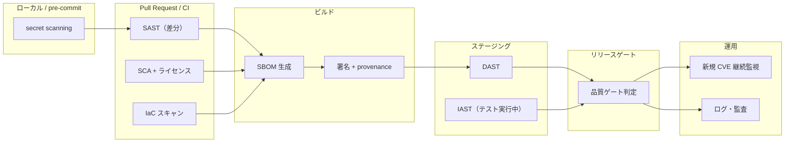

# セキュア開発とソフトウェアサプライチェーン

## エグゼクティブサマリ

本ドキュメントの結論は次のとおりです。**セキュリティは品質特性の一つであり、品質エンジニアリングから切り離した瞬間に「リリース後に発覚する最も高価な欠陥クラス」になります**。したがって、セキュリティ活動は独立したイベント（年 1 回の診断など）ではなく、要求・設計・実装・テスト・リリース判定・運用の各段階に埋め込まれた品質プロセスとして扱う必要があります。

要点は以下の 5 点です。

- **共通言語は NIST SSDF（SP 800-218 v1.1）**。Prepare the Organization / Protect the Software / Produce Well-Secured Software / Respond to Vulnerabilities の 4 グループ・19 プラクティスが、セキュア開発の「何をやるべきか」の網羅的なチェックリストになります。生成 AI 向けには SP 800-218A（SSDF Community Profile）が拡張を提供します。
- **リスク認知には OWASP Top 10、検証には ASVS**。Top 10（Web 2025 / LLM 2025）は「何が起きるか」の啓発リストであり、そのままテスト仕様にはなりません。要件ベースの検証は OWASP ASVS 5.0（17 章・3 レベル）を受入基準として使います。
- **脅威モデリングはセキュリティ版のテスト分析**。STRIDE・attack tree・abuse/misuse case で「何が失敗しうるか」を列挙し、品質要求とテスト条件に変換します。これは既存のテスト設計プロセスと同じ骨格で運用できます。
- **サプライチェーンは「自分が書いていないコード」の品質管理**。SBOM（SPDX / CycloneDX）で構成を可視化し、SCA で脆弱性・ライセンス・EOL を追跡し、署名と provenance（Sigstore / SLSA）で「ビルドされた通りのものが届いた」ことを証明します。
- **最終的にはリリース判定の品質ゲートと証跡に落とす**。「Critical 脆弱性ゼロ（または期限付き例外）」「SBOM 生成済み」「署名検証済み」のような機械判定可能な条件と、その証跡の保存が、セキュリティを品質保証として成立させます。

LLM/AI エージェントを組み込むシステムでは、プロンプト注入・過剰な代理権限・RAG 汚染といった従来と異なる欠陥クラスが加わります。**防御は「モデルの善意」に依存せず、権限境界・許可リスト・人間承認・出力検証というシステム設計側で行い、敵対的テストで検証する**のが原則です。

---

## 1. NIST SSDF（SP 800-218）: セキュア開発の共通言語

### 1.1 構成: 4 プラクティスグループ

NIST SP 800-218（Secure Software Development Framework, SSDF）v1.1 は、セキュアなソフトウェア開発の実践を 4 グループ・19 プラクティス・42 タスクに整理したフレームワークです。特定のツールや開発手法を強制せず、「成果として何が達成されるべきか」を記述しているため、既存の品質プロセスへのマッピングに向いています。

| グループ | ID | 目的 | 代表プラクティス |
| --- | --- | --- | --- |
| Prepare the Organization（組織の準備） | PO | 人・プロセス・技術の面で組織がセキュア開発を実行できる状態を作る | PO.1 セキュリティ要求の定義、PO.2 役割と責任の実装、PO.3 支援ツールチェーンの実装、PO.4 ソフトウェアセキュリティチェックの基準定義、PO.5 セキュアな開発環境の実装・維持 |
| Protect the Software（ソフトウェアの保護） | PS | コードと成果物そのものを改ざん・不正アクセスから守る | PS.1 全形態のコードの保護、PS.2 リリース完全性の検証手段の提供（署名等）、PS.3 各リリースのアーカイブと保護 |
| Produce Well-Secured Software（セキュアなソフトウェアの生産） | PW | 脆弱性の少ないソフトウェアを設計・実装・検証する | PW.1 セキュリティ要求を満たす設計（脅威モデリング）、PW.2 設計レビュー、PW.4 既存のセキュアなソフトウェアの再利用、PW.5 セキュアコーディング、PW.6 ビルドプロセスの安全な構成、PW.7 コードレビュー・静的解析、PW.8 実行コードのテスト、PW.9 セキュアなデフォルト設定 |
| Respond to Vulnerabilities（脆弱性への対応） | RV | リリース後の脆弱性を継続的に特定・修正し、再発を防ぐ | RV.1 脆弱性の継続的な特定と確認、RV.2 評価・優先順位付け・修正、RV.3 根本原因分析 |

### 1.2 品質プロセスへの統合方法

SSDF の各プラクティスは、既存の品質活動の「セキュリティ拡張」として実装するのが最も定着しやすい方法です。

| SSDF プラクティス | 対応する既存の品質活動 | 統合のポイント |
| --- | --- | --- |
| PO.1 セキュリティ要求定義 | 要求分析・非機能要求定義 | ASVS のレベル選定を非機能要求グレードと同列に扱う |
| PO.4 チェック基準の定義 | 品質ゲート・完了条件（DoD）定義 | 「Critical 脆弱性ゼロ」等を exit criteria に組み込む |
| PW.1 / PW.2 設計と脅威分析 | 設計レビュー・リスク分析 | 脅威モデリングをリスクベーステストのインプットにする |
| PW.7 コードレビュー・静的解析 | コードレビュー・静的解析 | SAST・secret scanning を既存 CI に追加する |
| PW.8 実行コードのテスト | システムテスト・回帰テスト | DAST・ファジング・ペネトレーションテストをテスト計画に含める |
| RV.1〜RV.3 脆弱性対応 | 欠陥管理・根本原因分析 | 脆弱性を欠陥台帳と同じ SLA・トリアージで管理する |

### 1.3 SP 800-218A と SSDF v1.2 の位置づけ

- **SP 800-218A**（2024 年 7 月公開）は、生成 AI・デュアルユース基盤モデル向けの **SSDF Community Profile** です。SP 800-218 v1.1 のプラクティスを置き換えるのではなく、AI モデル開発に固有のタスク・推奨事項・参考情報を「追補」する形式で、モデル開発者・AI システム開発者・調達者を対象にしています。学習データの保護やモデルの完全性検証など、後述の LLM セキュリティの土台になります。
- **SSDF v1.2（SP 800-218r1）** は 2025 年 12 月 17 日に初期公開ドラフト（IPD）が公開され、パブリックコメント期間は 2026 年 1 月 30 日に終了しました。本ドキュメント執筆時点（2026 年 7 月）では**最終版は未公開**のため、現行の正式版は v1.1 です。

---

## 2. OWASP Top 10（Web）と ASVS 5.0: リスク認知から要件ベース検証へ

### 2.1 OWASP Top 10:2025（Web アプリケーション）

OWASP Top 10 は「最も重大な Web アプリケーションセキュリティリスク」に関する合意リストで、2025 年版が公開されています。

| ID | カテゴリ | 概要 |
| --- | --- | --- |
| A01:2025 | Broken Access Control | 認可の不備。引き続き第 1 位で、SSRF は本カテゴリに統合 |
| A02:2025 | Security Misconfiguration | 設定不備（デフォルト設定、不要機能、権限過剰など） |
| A03:2025 | Software Supply Chain Failures | 依存関係・ビルドシステム・CI/CD を含むサプライチェーン全体の侵害（A06:2021 の拡張として新設） |
| A04:2025 | Cryptographic Failures | 暗号の不使用・誤用による機密データ露出 |
| A05:2025 | Injection | SQL/OS コマンド/XSS 等のインジェクション |
| A06:2025 | Insecure Design | 設計段階でのセキュリティ考慮欠如（脅威モデリングの不在） |
| A07:2025 | Authentication Failures | 認証・セッション管理の不備 |
| A08:2025 | Software or Data Integrity Failures | 完全性検証を欠いた更新・デシリアライズ・CI/CD |
| A09:2025 | Security Logging and Alerting Failures | ログ・検知・アラートの不足 |
| A10:2025 | Mishandling of Exceptional Conditions | 例外・エラー・想定外条件の不適切な処理（新設） |

品質保証の観点では、A03（サプライチェーン）と A10（例外条件の誤処理）の追加が重要です。前者は本ドキュメント第 7 章の SBOM・SLSA に直結し、後者はエラーハンドリング・ネガティブテストという古典的なテスト技術がセキュリティカテゴリに昇格したことを意味します。

### 2.2 OWASP ASVS 5.0: 要件ベースのセキュリティ検証

Top 10 が「啓発リスト」であるのに対し、**ASVS（Application Security Verification Standard）は検証可能な要件集**です。ASVS 5.0.0 は 2025 年 5 月に公開され、17 章・約 350 要件で構成されます。

| 章 | 内容 |
| --- | --- |
| V1 Encoding and Sanitization | エンコーディングとサニタイズ（インジェクション対策） |
| V2 Validation and Business Logic | 入力妥当性検証とビジネスロジック |
| V3 Web Frontend Security | ブラウザ側の防御（CSP、ヘッダ、Cookie 属性） |
| V4 API and Web Service | REST/GraphQL/WebSocket などマシン向けインターフェース |
| V5 File Handling | ファイルアップロード・ダウンロード |
| V6 Authentication | 認証・多要素認証・資格情報管理 |
| V7 Session Management | セッション管理 |
| V8 Authorization | 認可 |
| V9 Self-contained Tokens | JWT 等の自己完結型トークン |
| V10 OAuth and OIDC | OAuth 2.x / OpenID Connect |
| V11 Cryptography | 暗号 |
| V12 Secure Communication | 通信の保護（TLS 等） |
| V13 Configuration | 設定管理 |
| V14 Data Protection | データ保護 |
| V15 Secure Coding and Architecture | セキュアコーディングとアーキテクチャ |
| V16 Security Logging and Error Handling | セキュリティログとエラー処理 |
| V17 WebRTC | WebRTC |

3 段階の検証レベル（L1: 基本的な保証の第一歩 / L2: 機微データを扱う大半のアプリケーションの標準 / L3: 高い保証が必要なクリティカルシステム）があり、**「このシステムは ASVS レベル 2 を満たす」という宣言が、そのままセキュリティの受入基準になります**。

### 2.3 Top 10 と ASVS の使い分け

| 観点 | OWASP Top 10 | OWASP ASVS |
| --- | --- | --- |
| 性格 | リスクの啓発・優先順位付け | 検証可能な要件の標準 |
| 粒度 | 10 カテゴリ | 約 350 要件（識別子付き） |
| 品質プロセスでの用途 | リスク分析・教育・経営説明 | 要求定義・受入基準・トレーサビリティ |
| アンチパターン | Top 10 を「テスト仕様」として使う | レベル選定なしに全要件を適用する |

実務では、**Top 10 でリスクの言語を揃え、ASVS のレベルと要件 ID で要求とテストを紐づける**構成が、要求→テスト→欠陥のトレーサビリティ（[ギャップ分析レポート](../quality-management/software-quality-gap-analysis-report.md)参照）と整合します。

---

## 3. OWASP Top 10 for LLM Applications（2025）

LLM を組み込むアプリケーション固有のリスクは、OWASP GenAI Security Project の「Top 10 for LLM Applications 2025」に整理されています。以下は genai.owasp.org の正式リストに基づきます。

| ID | リスク | 概要 | 品質保証観点での対策 | テスト方法 |
| --- | --- | --- | --- | --- |
| LLM01:2025 | Prompt Injection | ユーザ入力や外部コンテンツがモデルの挙動・指示を意図せず変更する | 挙動の制約（システムプロンプトはアクセス制御の代替にしない）、入出力フィルタ、特権分離、高リスク操作の人間承認 | 直接・間接注入の攻撃コーパスによる敵対的テスト、レッドチーミング |
| LLM02:2025 | Sensitive Information Disclosure | 個人情報・機密情報・独自アルゴリズムの漏えい | 学習・文脈投入前のデータサニタイズ、出力側 PII フィルタ、アクセス制御 | 機密データの引き出しを試みるプローブテスト、出力ログ監査 |
| LLM03:2025 | Supply Chain | モデル・データセット・プラグイン等の第三者コンポーネント経由の侵害 | モデル/データの出所検証、署名検証、ML-BOM（CycloneDX AI/ML-BOM）、ライセンス確認 | 依存モデル・データセットの棚卸しと完全性検証の確認 |
| LLM04:2025 | Data and Model Poisoning | 事前学習・ファインチューニング・埋め込みデータの汚染 | データ来歴（provenance）の追跡、取り込みデータの検証、異常検知 | 汚染シナリオを想定した挙動回帰テスト、ベンチマーク監視 |
| LLM05:2025 | Improper Output Handling | LLM 出力を無検証で下流（DB、シェル、ブラウザ）に渡すことによる XSS/SQLi 等 | **LLM 出力を「信頼できない入力」として扱う**。文脈別エンコード・パラメータ化・スキーマ検証 | 出力に攻撃ペイロードを混入させた統合テスト |
| LLM06:2025 | Excessive Agency | 過剰な機能・権限・自律性を持つ LLM エージェントの誤動作・悪用 | ツールと権限の最小化、人間承認（human-in-the-loop）、操作の完全な監査ログ | 権限境界の越境を試みるシナリオテスト |
| LLM07:2025 | System Prompt Leakage | システムプロンプトの開示とそこに含まれる機密・制御情報の露出 | **秘密情報や認可制御をシステムプロンプトに置かない**。制御はモデル外で実装 | プロンプト抽出攻撃の再現テスト |
| LLM08:2025 | Vector and Embedding Weaknesses | RAG のベクトルストア・埋め込みの弱点（汚染、越権取得、情報漏えい） | ベクトル DB のアクセス制御・テナント分離、取り込み時の検証、ソースの来歴管理 | 権限外文書の検索可否テスト、汚染文書混入テスト |
| LLM09:2025 | Misinformation | もっともらしい誤情報（ハルシネーション）への過度な依存 | RAG による根拠付け、重要判断への人間の監督、限界の明示 | 事実性評価（ground truth との突合）、引用検証テスト |
| LLM10:2025 | Unbounded Consumption | 無制限の推論消費によるサービス妨害・経済的損失（DoW）・モデル抽出 | レート制限、入力サイズ制限、クォータ、タイムアウト、コスト監視 | 負荷テスト、リソース枯渇シナリオのテスト |

LLM06 の対策詳細と防御側の設計パターンは第 9 章で扱います。

---

## 4. 脅威モデリング: 何が失敗しうるかを設計段階で列挙する

脅威モデリングは「セキュリティ版のテスト分析」です。Threat Modeling Manifesto が示す 4 つの問いが骨格になります。

1. 何を作っているのか（What are we working on?）
2. 何がうまくいかない可能性があるのか（What can go wrong?）
3. それに対して何をするのか（What are we going to do about it?）
4. 対応は十分だったか（Did we do a good enough job?）

### 4.1 STRIDE

STRIDE は Microsoft 由来の脅威分類で、データフロー図（DFD）の各要素に対して 6 種類の脅威を体系的に問いかけます。

| 脅威 | 侵害されるセキュリティ性質 | 例 | 対策の起点 |
| --- | --- | --- | --- |
| Spoofing（なりすまし） | 真正性（認証） | 盗んだトークンでの API 呼び出し | 認証、MFA、資格情報保護 |
| Tampering（改ざん） | 完全性 | ビルド成果物の差し替え、パラメータ改変 | 署名、ハッシュ検証、入力検証 |
| Repudiation（否認） | 否認防止 | 「その操作はしていない」と主張される | 監査ログ、タイムスタンプ |
| Information Disclosure（情報漏えい） | 機密性 | エラーメッセージからの内部情報露出 | 暗号化、アクセス制御、出力最小化 |
| Denial of Service（サービス妨害） | 可用性 | リソース枯渇攻撃 | レート制限、クォータ、冗長化 |
| Elevation of Privilege（権限昇格） | 認可 | 一般ユーザによる管理機能実行 | 最小権限、認可の一元化 |

進め方: (1) DFD で信頼境界（trust boundary）を描く → (2) 境界をまたぐデータフロー・プロセス・データストアごとに STRIDE を適用 → (3) 脅威ごとにリスク評価と対策を決定 → (4) 対策を要件・テスト条件として記録します。

### 4.2 Attack Tree

Attack tree は攻撃者の最終目標をルートに置き、達成手段を AND/OR で分解する木構造です。

- **作り方**: ルート =「攻撃者のゴール」（例: 顧客データの窃取）→ 子ノード = 達成経路（例: 認証の突破 / DB への直接アクセス / バックアップの窃取）→ 葉 = 具体的な手段。各葉にコスト・技能・検知可能性を注記します。
- **品質への変換**: 「最も安価で検知されにくい経路」が優先的にテスト・対策すべき箇所です。葉ノードはそのままセキュリティテストケースの候補になります。

### 4.3 Abuse Case / Misuse Case

- **Misuse case** は、ユースケース図に「悪意あるアクター」と「望まれないユースケース」を追加し、通常のユースケースとの間に threatens（脅かす）/ mitigates（緩和する）の関係を描く手法です。
- **Abuse case** は、OWASP のチートシートで整理されているとおり、「機能が悪用されるシナリオ」をユーザーストーリー形式で記述し、受入基準に悪用防止条件を含めます（例:「攻撃者として、クーポンコードを総当たりして割引を得たい」→ 対策: 試行回数制限 → テスト: 制限の実効性検証）。

### 4.4 品質要求・テスト条件への変換

脅威モデリングの成果は、次の変換パイプラインで品質プロセスに接続します。

| 脅威モデリング成果物 | 変換先 | 例 |
| --- | --- | --- |
| STRIDE で特定した脅威 | セキュリティ要求（ASVS 要件 ID に紐づけ） | 「Tampering: 成果物改ざん」→ PS.2 相当の署名検証要件 |
| Attack tree の高リスク経路 | リスクベーステストの優先テスト条件 | 「認証突破経路」→ 認証系の異常系・総当たりテスト |
| Abuse case | ネガティブテストケース・受入基準 | 「クーポン悪用」→ レート制限の境界値テスト |
| 未対策と判断した脅威 | リスク登録簿（承認付き残留リスク） | 期限・オーナー付きで記録 |

脅威モデリングからテストを作る実行手順は、[テスト技法スキルカタログ](../test-techniques/test-techniques-skill-catalog.md)の **SKILL-SEC-01（脅威モデリングからセキュリティテストを作る）** として skills 化されています。

---

## 5. Secure by Design / Secure by Default（CISA）

CISA と国際パートナーによる共同ガイダンス「Shifting the Balance of Cybersecurity Risk」は、**セキュリティの負担を顧客からソフトウェア製造者側に移す**ことを求め、3 原則を示しています。

| 原則 | 内容 | 品質保証観点でのチェック |
| --- | --- | --- |
| Take Ownership of Customer Security Outcomes | 顧客のセキュリティ成果に製造者が責任を持つ（ハードニング、安全な機能、安全なデフォルト設定への投資） | 「顧客側の設定作業なしで安全か」を受入観点に含める |
| Embrace Radical Transparency and Accountability | 脆弱性アドバイザリと CVE 記録の完全性・正確性、SDLC や脆弱性開示ポリシーの公開 | CVE/アドバイザリ発行プロセスと開示ポリシーの存在確認 |
| Lead From the Top | 経営層のコミットメント。役員レベルの責任者がプログラムを統括し、取締役会へ報告 | セキュリティ品質指標の経営報告ルートの有無 |

**Secure by default** は「製品が追加コスト・追加設定なしに、最初から重要なセキュリティ制御を有効にした状態で出荷される」ことを意味します。代表例は、デフォルトパスワードの廃止、MFA の既定有効化、最小権限の初期設定です。「分厚いハードニングガイドが必要」という状態自体が、設計がセキュアでないことの兆候として扱われます。

品質プロセスへの統合としては、**「デフォルト構成のままでのセキュリティテスト」**を必須テスト条件にすること（顧客が最初に触る構成こそが最も検証されるべき構成）、および SSDF の PW.9（セキュアなデフォルト設定）との対応付けが実務的です。

---

## 6. セキュリティテスト・解析の使い分け

### 6.1 特性比較

| 手法 | 検出対象 | 分析方式 | 誤検知傾向 | 主な限界 | CI/CD への組み込み位置 |
| --- | --- | --- | --- | --- | --- |
| SAST（静的解析） | 自作コード中の脆弱パターン（インジェクション、危険 API 等） | ソースコードを実行せず解析 | **高め**（データフローの文脈を見誤る）。ルール調整とベースライン管理が必須 | 実行時設定・環境起因の問題は見えない | PR 時（差分スキャン）+ 定期フルスキャン |
| DAST（動的解析） | 稼働中アプリの外形的脆弱性（認証、ヘッダ、インジェクションの実挙動） | ブラックボックスで HTTP 等から攻撃を試行 | 低め（実際に応答を観測）だが**検出漏れは多い** | カバレッジが到達可能な画面/API に限定。実行環境が必要で遅い | ステージング環境デプロイ後（夜間・リリース前） |
| IAST | 実行中コード内部の脆弱性（テスト実行を利用） | アプリ内エージェントが実行時のデータフローを観測 | 低め（実行された経路のみ報告） | テストが通らない経路は見えない。言語・ランタイム対応に制約 | 結合テスト・E2E テスト実行時 |
| SCA（ソフトウェア構成解析） | 依存ライブラリの既知脆弱性（CVE）、ライセンス、EOL | マニフェスト・ロックファイル・バイナリの照合 | 中程度（**到達可能性を考慮しない検出**が多い。VEX や reachability 分析で削減） | 未知の脆弱性・自作コードは対象外 | PR 時 + 依存更新時 + **リリース後も継続監視** |
| Secret scanning | ハードコードされた資格情報（API キー、トークン、秘密鍵） | パターン + エントロピー検知 | 中程度（テスト用ダミーを誤検知） | 独自形式のシークレットは定義が必要 | **pre-commit（最重要）** + PR 時 + 履歴の定期走査 |

使い分けの原則は次のとおりです。

- **SAST と DAST は代替関係ではなく補完関係**です。SAST は「コードのどこが悪いか」を早く指摘し、DAST は「実際に攻撃が成立するか」を確認します。
- **SCA は一度きりのスキャンでは意味がありません**。リリース後に公表される新規 CVE を SBOM と突合し続ける運用（継続監視）が本体です。
- **secret scanning は「コミットされる前」が勝負**です。履歴に入ったシークレットは漏えいとして扱い、ローテーションが必要になります。
- 誤検知は「ツールのノイズ」ではなく**トリアージ工数という品質コスト**です。ベースライン化（既知の指摘を管理台帳へ）、抑制コメントのレビュー必須化、例外の期限管理をセットで運用します。

### 6.2 CI/CD パイプライン上の配置

---

## 7. ソフトウェアサプライチェーン: 自分が書いていないコードの品質管理

### 7.1 SBOM: SPDX と CycloneDX

SBOM（Software Bill of Materials）は、ソフトウェアを構成するコンポーネントとその関係の正式な記録です。米国 NTIA の最小要素（2021）では、7 つのデータフィールド（サプライヤ名、コンポーネント名、バージョン、一意識別子、依存関係、SBOM 作成者、タイムスタンプ）に加え、自動化サポートとプロセス実践が求められます（CISA が 2025 年に最小要素の更新版を公開しています）。

| 観点 | SPDX | CycloneDX |
| --- | --- | --- |
| 主体 | Linux Foundation | OWASP / Ecma TC54 |
| 標準化 | ISO/IEC 5962:2021（SPDX 2.2.1 が対象） | ECMA-424 |
| 出自・強み | ライセンスコンプライアンス由来。ライセンス表現・ファイル単位の帰属が豊富 | セキュリティ由来。脆弱性管理・VEX との統合が容易 |
| モデル | パッケージと関係（DEPENDS_ON 等）で表現 | コンポーネント中心のフラットな構造 + dependencies |
| 拡張 | 3.x でソフトウェア以外（AI、データ、ビルド等）のプロファイルへ拡大中 | SBOM 以外に HBOM / SaaSBOM / CBOM / **AI/ML-BOM** / VEX をカバー |
| 選定目安 | 規制・調達でフォーマル標準が要求される場合、ライセンス管理重視 | 脆弱性運用（Dependency-Track 等）中心、AI コンポーネント管理 |

両フォーマットは機能的に収斂しつつあり、**「どちらを選ぶか」より「生成を自動化し、リリース単位で保存し、CVE と突合し続けるか」が品質上の争点**です。SBOM・証跡が欠けている状態のリスク評価は[ギャップ分析レポート](../quality-management/software-quality-gap-analysis-report.md)を参照してください。

### 7.2 依存関係リスク・ライセンスリスク・EOL 管理

| リスク | 内容 | 管理方法 |
| --- | --- | --- |
| 既知脆弱性 | 依存の CVE。推移的依存（間接依存）が大半を占める | SCA + SBOM 継続照合。修正 SLA（例: Critical 48 時間、High 7 日）を定義 |
| 悪意あるパッケージ | typosquatting、乗っ取り、依存かく乱（dependency confusion） | ロックファイル固定、社内レジストリ/プロキシ、公開前レビュー、名前空間の予約 |
| ライセンス | コピーレフト等の義務違反、ライセンス変更 | 許可/禁止ライセンスのポリシー化と CI での自動判定 |
| EOL / メンテ停止 | 更新が来ない依存に脆弱性が発見される | EOL 情報の追跡、単一メンテナ依存の棚卸し、代替計画 |

### 7.3 署名と provenance: Sigstore と SLSA

**Sigstore** は、鍵管理の負担を減らして成果物署名を普及させるためのオープンソース基盤です。

- **Cosign**: コンテナイメージ・バイナリへの署名/検証を行う CLI。
- **Fulcio**: OIDC アイデンティティ（例: CI ジョブの ID やメールアドレス）に紐づく**短命証明書**を発行する認証局。長期秘密鍵の管理が不要になります（keyless signing）。
- **Rekor**: 署名イベントを記録する改ざん検知可能な**透明性ログ**（append-only）。「いつ・誰が・何に」署名したかを第三者が監査できます。

**SLSA（Supply-chain Levels for Software Artifacts）** は、ビルドの完全性を段階評価するフレームワークです。v1.0 の Build トラックは 4 レベルで構成されます。

| レベル | 要件 | 保証されること |
| --- | --- | --- |
| Build L0 | 要件なし | （開発・テスト用ビルド） |
| Build L1 | ビルドが provenance（ビルド元・ビルダー・成果物ハッシュの記録）を生成する | ビルドの由来を記録・追跡できる（改ざん耐性はまだない） |
| Build L2 | ホスト型ビルドプラットフォームでビルドし、プラットフォームが provenance に署名する | 署名検証により provenance の偽造が困難になる |
| Build L3 | ビルド同士の干渉防止、署名鍵にユーザ定義ステップからアクセス不可などの強化されたビルド環境 | ビルドプロセス内部からの provenance 偽造・混入にも耐性を持つ |

品質ゲートとしては、「成果物の署名検証をデプロイ前提条件にする」「provenance の内容（ソースリポジトリ・ブランチ・ビルダー）をポリシーで検証する」が実装形です。

### 7.4 ビルド再現性（Reproducible Builds）

Reproducible builds は「同じ入力から**ビット単位で同一**の成果物が再生成できる」状態を指し、ソースからバイナリまでの独立検証可能な経路を提供します。第三者が同じソースからビルドして配布物と一致することを確認できるため、ビルド基盤の侵害（配布物へのバックドア混入）を検出できます。実現にはビルドの決定論化（タイムスタンプ・ファイル順序・ビルドパスの固定など）と、独立した検証者の存在が必要です。SLSA の provenance が「誰がどう作ったかの証言」だとすれば、再現可能ビルドは「誰でも作り直して検算できる」ことによる、より強い完全性保証です。

---

## 8. 権限設計: 最小権限・監査ログ・職務分離

セキュア開発は、コードだけでなく**開発プロセス自体の権限設計**を含みます。SSDF の PO.5（セキュアな開発環境）・PS.1（コードの保護）の実装領域です。

| 原則 | 内容 | 開発プロセスでの実装例 | 検証方法 |
| --- | --- | --- | --- |
| 最小権限（least privilege） | 必要最小限の権限のみを、必要な期間だけ付与する | CI トークンのスコープ最小化・短命化、本番アクセスのジャストインタイム付与、デフォルト読み取り専用 | 権限の棚卸し（定期レビュー）、未使用権限の検出 |
| 職務分離（separation of duties） | 一人で「変更の作成と承認」「デプロイと承認」を完結できないようにする | ブランチ保護 + 他者レビュー必須、デプロイ承認者とコミッターの分離、本番鍵と開発鍵の分離 | 「単独でリリースを完遂できる人物がいないこと」の証明 |
| 監査ログ | 誰が・いつ・何を・どの権限で行ったかを改ざん困難な形で記録する | リポジトリ/CI/本番環境の監査ログ有効化、ログの集中管理と保持期間定義、書き込み専用ストレージ | ログの完全性検証、代表的操作の追跡テスト（否認防止の確認） |

これらは STRIDE の Repudiation（否認）・Elevation of Privilege（権限昇格）への直接の対策であり、ASVS V8（Authorization）・V16（Security Logging and Error Handling）の要件と対応します。監査ログは「攻撃の検知」だけでなく、**リリース判定・監査時に「誰が何を承認したか」を示す品質証跡**としても機能します。

---

## 9. LLM/AI エージェント固有のセキュリティ品質

LLM/AI エージェントを組み込むシステムの防御設計は、**「モデルは指示とデータを確実には区別できない」ことを前提に、モデルの外側に安全機構を置く**のが基本原則です。以下は OWASP LLM Top 10（2025）の対策を防御側の設計パターンとして再整理したものです。

### 9.1 プロンプト注入・間接プロンプト注入への防御設計

| 設計パターン | 内容 | 対応リスク |
| --- | --- | --- |
| 信頼境界の明示 | ユーザ入力・RAG 文書・Web ページ・メール等の外部コンテンツを「信頼できないデータ」として区別し、可能な限り指示と分離してモデルに渡す | LLM01 |
| 挙動の制約と出力検証 | 期待する出力形式（スキーマ）を定義し、決定論的コードで検証する。形式外の出力は破棄・再試行 | LLM01, LLM05 |
| 出力の無害化 | LLM 出力を下流（DB・シェル・ブラウザ・他エージェント）へ渡す前に、文脈に応じたエンコード・パラメータ化を行う | LLM05 |
| 権限による被害限定 | 注入が成功しても実行できる操作を最小権限で制限する（注入の「発生防止」ではなく「影響限定」） | LLM01, LLM06 |
| システムプロンプトの非機密化 | システムプロンプトは漏えいする前提で設計し、秘密情報・認可ロジックを含めない | LLM07 |

**重要な前提**: プロンプト注入を完全に防ぐ方法は現時点で確認されていません。したがって品質保証は「注入が発生しないこと」ではなく、**「注入が成功しても重大な被害に至らないこと」（影響限定の検証）**を目標に設計します。

### 9.2 ツール悪用防止とエージェントの権限境界

| 設計パターン | 内容 | 対応リスク |
| --- | --- | --- |
| ツール許可リスト | エージェントが呼べるツールを明示的な許可リストで限定する（拒否リストではなく許可リスト）。ツールの引数もスキーマで検証 | LLM06 |
| サンドボックス実行 | コード実行・ファイル操作等は隔離環境（コンテナ、権限制限プロセス）で実行し、ネットワーク egress も制限 | LLM06 |
| 人間承認（human-in-the-loop） | 不可逆・高影響の操作（送金、削除、外部送信、権限変更）は実行前に人間の承認を必須にする | LLM01, LLM06 |
| 権限境界の設計 | エージェントの資格情報は「エージェント自身の ID」で発行し、呼び出しユーザの権限を超えない（confused deputy の防止）。セッション単位・タスク単位で権限を絞る | LLM06 |
| レート制限・クォータ | 呼び出し回数・トークン量・コストの上限を設定し、暴走と DoW（Denial of Wallet）を防ぐ | LLM10 |
| 完全な監査ログ | エージェントの全ツール呼び出し（誰の代理で・どの入力で・何を実行したか）を記録する | LLM06 |

### 9.3 RAG 汚染対策

| 設計パターン | 内容 | 対応リスク |
| --- | --- | --- |
| 取り込みパイプラインの検証 | ナレッジベースへ投入する文書のソース検証・来歴記録・（可能なら）人手レビュー | LLM04, LLM08 |
| 権限を考慮した検索 | ベクトルストアの検索結果に、呼び出しユーザのアクセス権限フィルタを適用する（埋め込み後も元文書の権限を維持） | LLM08, LLM02 |
| テナント・用途の分離 | マルチテナントでは埋め込み空間・インデックスを分離する | LLM08 |
| 引用と根拠の提示 | 回答に参照元を付与し、検証可能にする | LLM09 |

### 9.4 テスト観点

| テスト種別 | 内容 |
| --- | --- |
| 敵対的テスト（レッドチーミング） | 直接注入・間接注入（RAG 文書、Web ページ、メール経由）の攻撃コーパスを維持し、回帰テストとして自動実行する |
| 権限境界テスト | 「ユーザ A の会話からユーザ B のデータへ到達できないこと」「許可リスト外のツール呼び出しが拒否されること」を検証する |
| 出力処理テスト | LLM 出力に攻撃ペイロード（スクリプト、SQL 断片）を意図的に混入させ、下流での無害化を検証する |
| 承認フローのテスト | 高リスク操作が人間承認なしで実行されないことを E2E で検証する |
| 消費上限テスト | レート制限・コスト上限・タイムアウトの実効性を負荷テストで検証する |
| 事実性・根拠の評価 | ground truth との突合、引用の実在性検証を定期評価として運用する |

これらは従来の機能テストと異なり**確率的な挙動**を対象にするため、単発の合否ではなく、攻撃成功率・検出率を継続測定する評価体系（AI 品質評価の詳細は [AI 品質保証リサーチ](../quality-management/ai-quality-assurance-and-management-research-report.md)参照）と組み合わせます。

---

## 10. 品質ゲートと証跡: リリース判定にセキュリティを組み込む

セキュリティ活動は、**機械判定可能なゲート条件**と**保存される証跡**に落ちて初めて品質保証になります。以下はリリース判定チェックリストの雛形です（閾値は例であり、リスクレベルに応じて調整します）。

### 10.1 フェーズ別ゲート条件

| フェーズ | ゲート条件（例） | 証跡 |
| --- | --- | --- |
| 要求・設計 | 脅威モデルが存在し、アーキテクチャ変更時に更新されている / ASVS レベルが選定され要件に展開されている | 脅威モデル文書（更新履歴付き）、ASVS 対応表 |
| コミット・PR | secret scanning 検出ゼロ / SAST の Critical・High が解消または期限付き例外承認済み / 他者レビュー承認（職務分離） | CI 実行ログ、例外承認記録、レビュー記録 |
| ビルド | SBOM（SPDX または CycloneDX）が生成・保存されている / 成果物が署名され provenance が生成されている（SLSA Build L2 以上を目標） | SBOM ファイル、署名・provenance、検証ログ |
| テスト | SCA で Critical 脆弱性ゼロ（または VEX で非該当を文書化） / DAST がステージングで実行され High 以上が解消 / 高リスク機能に脅威モデル由来のテストが実施済み | スキャンレポート、VEX、テスト結果とトレーサビリティ |
| リリース判定 | 未解決脆弱性がすべて「期限・オーナー付き例外」として承認されている / デフォルト設定でのセキュリティ確認済み / 署名検証がデプロイ条件になっている | リリース判定記録（承認者・日時）、例外台帳 |
| 運用 | 新規 CVE と SBOM の継続照合が稼働 / 脆弱性対応 SLA（例: Critical 48h）が守られている / 監査ログが保全されている | 監視設定、SLA 実績、ログ保全設定 |

### 10.2 運用の原則

- **例外は禁止しないが、無期限の例外は禁止する**。すべての例外に承認者・理由・期限を付け、期限切れをゲート違反として扱います。
- **ゲート条件は「人の判断」より先に「機械の判定」**。CI で自動評価できる形式（件数・重大度・署名検証の合否）に条件を定義します。
- **証跡はリリース単位でアーカイブする**。後日「このバージョンには何が入っていて、誰が何を確認して出荷したか」を再構成できることが、監査対応とインシデント対応の両方の基盤になります。
- ゲート・証跡を含む品質管理の全体像は[品質マネジメント実務リファレンス](../quality-management/software-quality-management-practical-reference.md)を、証跡欠如のリスク評価は[ギャップ分析レポート](../quality-management/software-quality-gap-analysis-report.md)を参照してください。

---

## 関連ドキュメント

- [ソフトウェア品質ギャップ分析報告書](../quality-management/software-quality-gap-analysis-report.md) — SBOM・証跡・トレーサビリティのギャップ評価
- [品質マネジメント実務リファレンス](../quality-management/software-quality-management-practical-reference.md) — 品質管理プロセスの全体像
- [テスト技法スキルカタログ](../test-techniques/test-techniques-skill-catalog.md) — SKILL-SEC-01: 脅威モデリングからセキュリティテストを作る
- [AI 品質保証・品質マネジメント調査報告](../quality-management/ai-quality-assurance-and-management-research-report.md) — AI システムの品質評価

## 主要参考文献

- NIST SP 800-218 v1.1: Secure Software Development Framework (SSDF) — https://csrc.nist.gov/pubs/sp/800/218/final
- NIST SSDF プロジェクトページ — https://csrc.nist.gov/projects/ssdf
- NIST SP 800-218A: Secure Software Development Practices for Generative AI and Dual-Use Foundation Models — https://csrc.nist.gov/news/2024/nist-publishes-sp-800-218a / https://nvlpubs.nist.gov/nistpubs/SpecialPublications/NIST.SP.800-218A.pdf
- NIST SP 800-218r1 (SSDF v1.2) Initial Public Draft — https://csrc.nist.gov/pubs/sp/800/218/r1/ipd
- OWASP Top 10:2025 — https://owasp.org/Top10/2025/
- OWASP Top 10 for LLM Applications 2025（OWASP GenAI Security Project） — https://genai.owasp.org/llm-top-10/ / https://genai.owasp.org/resource/owasp-top-10-for-llm-applications-2025/
- OWASP Application Security Verification Standard (ASVS) — https://owasp.org/www-project-application-security-verification-standard/ / https://github.com/OWASP/ASVS （v5.0.0）
- CISA Secure by Design — https://www.cisa.gov/resources-tools/resources/secure-by-design
- CISA et al., "Shifting the Balance of Cybersecurity Risk: Principles and Approaches for Secure by Design Software" — https://www.cisa.gov/sites/default/files/2023-10/SecureByDesign_1025_508c.pdf
- SLSA v1.0 Security Levels — https://slsa.dev/spec/v1.0/levels
- Sigstore ドキュメント（Cosign / Fulcio / Rekor） — https://docs.sigstore.dev/cosign/signing/overview/
- SPDX (ISO/IEC 5962:2021) — https://spdx.dev/
- CycloneDX (ECMA-424) — https://cyclonedx.org/
- NTIA, "The Minimum Elements For a Software Bill of Materials (SBOM)" (2021) — https://www.ntia.gov/sites/default/files/publications/sbom_minimum_elements_report_0.pdf
- CISA, "2025 Minimum Elements for a Software Bill of Materials" — https://www.cisa.gov/sites/default/files/2025-08/2025_CISA_SBOM_Minimum_Elements.pdf
- Reproducible Builds — https://reproducible-builds.org/
