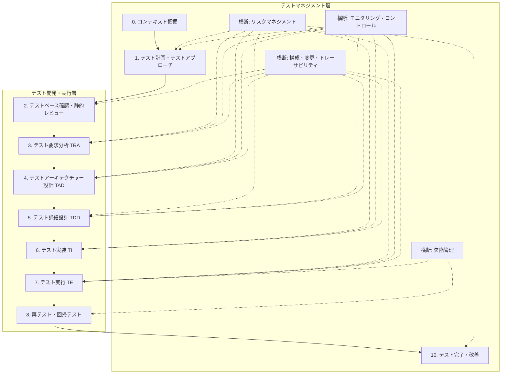
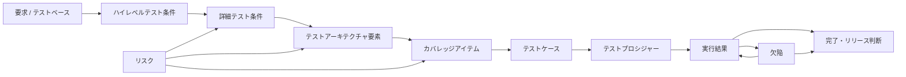

# テスト活動プロセス調査まとめ（テスト設計）

目的: ISTQB / JSTQB、JCSQE / SQuBOK、ISO/IEC/IEEE 29119、TMMi、関連研究などをもとに、agent / skills 化しやすいテスト活動プロセスを整理する。

---

## 0. 確認結果サマリ

結論として、添付チュートリアルの内容は、前回整理した ISTQB / JSTQB 中心のテスト活動プロセスと本質的な齟齬はない。

ただし、agent / skills 化の観点では、前回版に対して次の補強が必要である。

1. **テストアーキテクチャー設計（TAD）を明示的な活動として追加する。**
    
    JSTQB の分類では主に「テスト分析」と「テスト設計」の間に含まれがちな、構造化、要素分解、厚み調整、責務割当を、独立した skill として扱う。
    
2. **テスト設計を「テスト詳細設計（TDD）」と「テスト実装（TI）」に分けて扱う。**
    
    テストパラメーター、値候補、カバレッジアイテム、組合せ制御は TDD、実行順序、テストスイート、手順、スクリプト化は TI として分離する。
    
3. **「テスト観点」という曖昧語をそのまま agent の内部データ型にしない。**
    
    チュートリアルでは、テストケースを書く前のアウトプットを広く「テスト観点」と呼ぶが、実装上は `HighLevelTestCondition`、`DetailedTestCondition`、`TestParameter`、`CoverageItem`、`RiskItem`、`ModelElement`、`TestProcedure` に分解する。
    
4. **リスクは単独工程ではなく、計画、TRA、TAD、TDD、TI、TE、完了判断に横断させる。**
    
    プロダクトリスクは「何を厚く見るか」「どの順で実行するか」「どこまで網羅するか」に直接効かせる。
    
5. **成果物品質として、文書点、工程一貫性、説明責任を追加する。**
    
    AI agent の出力は、読みにくい、つながらない、根拠が説明できない場合、テスト設計成果物として弱い。
    

---

## 1. 添付チュートリアルの扱い

### 1.1 取り込んだ情報

添付資料から、プロセス整理に必要な情報だけを採用した。

| 採用した情報 | 反映箇所 |
| --- | --- |
| テストは「大丈夫か？」を確認するエンジニアリング活動 | テスト活動の目的定義 |
| テストレベル、テストタイプ、テストサイクルの 3 概念 | テストアプローチ設計 |
| テスト開発プロセス: TRA / TAD / TDD / TI / TE | agent / skills の中核プロセス |
| テスト要求分析（TRA）の 3 視点: ユーザー、プロダクト、テスト・組織 | コンテキスト分析とテスト分析 |
| プロダクトリスクの識別・評価 | リスクベースドテスト |
| 詳細なテスト条件とテストパラメーターの識別 | データ契約 |
| テストアーキテクチャー設計（TAD） | 新規 skill として追加 |
| テスト詳細設計（TDD）でのパラメーター、値、カバレッジアイテム | テストケース生成前段 |
| テスト実装（TI）でのテストスイート、手順、実行順序 | 実行可能化 |
| 文書点、工程一貫性点、総合点 | レビューゲートと AI 出力品質基準 |

### 1.2 除外したノイズ

プロセス設計と agent / skills 化に直接不要な情報は除外した。

| 除外した情報 | 理由 |
| --- | --- |
| 開会、質疑応答、懇親会、アンケート案内 | テスト活動プロセスではなくイベント運営情報 |
| SNS 投稿ルール、レコーディング注意 | プロセス情報ではない |
| テスト設計コンテストのクラス、日程、応募フロー | コンテスト参加には有用だが汎用プロセスではない |
| 歴代表彰チーム | 技術プロセスに関係しない |
| 講師略歴 | 出典の信頼性確認には有用だが、プロセス定義には不要 |
| YouTube チャンネル案内 | 参照導線であり、プロセス情報ではない |

---

## 2. 採用する全体モデル

標準・資格体系と添付チュートリアルを統合すると、テスト活動は次の二層で扱うのがよい。

1. **テストマネジメント層**
    
    目的、方針、制約、リスク、スケジュール、体制、モニタリング、欠陥、構成、完了判断を扱う。
    
2. **テスト開発・実行層**
    
    テストベースから「何を確認するか」を導き、構造化し、実行可能なテストケース・手順に落とし、実行する。
    



このモデルでは、JSTQB の主要活動を中核にしつつ、添付チュートリアルで強調されている TAD を明示する。TAD を入れないと、agent が「分析結果から突然テストケースを生成する」動きになりやすい。これは便利そうに見えて、実際には根拠の薄いケースを量産するだけになりがちである。

---

## 3. 参照体系ごとの位置づけ

### 3.1 ISTQB / JSTQB

JSTQB Foundation Level v4.0 系では、テストはコンテキスト次第であり、汎用的なテスト活動のセットを状況に応じて調整するものとされる。活動は論理的には順序立って見えるが、実際には反復・並行して実施されることが多い。

JSTQB の主要活動は次のように整理できる。

| JSTQB 活動 | 主な意味 | 本資料での扱い |
| --- | --- | --- |
| テスト計画 | テスト目的を定義し、制約下で有効なアプローチを選ぶ | テストマネジメント層 |
| テストモニタリングとコントロール | 進捗を計画と比較し、必要な是正を行う | 横断活動 |
| テスト分析 | テストベースを分析し、テスト条件、リスク、カバレッジ観点を明らかにする | TRA を中心に扱う |
| テスト設計 | テスト条件をテストケースやテストウェアに落とし、カバレッジアイテム、データ、環境を決める | TAD + TDD に分解 |
| テスト実装 | テストデータ、テストプロシジャー、スイート、スクリプト、環境を準備する | TI として扱う |
| テスト実行 | テストを実行し、期待結果と実結果を比較し、結果を記録する | TE として扱う |
| テスト完了 | テスト活動のデータ、経験、テストウェアを統合し、完了判断と改善につなげる | 完了・改善活動 |

### 3.2 添付チュートリアルの位置づけ

添付チュートリアルは、JSTQB の全活動を網羅的に説明する資料ではなく、特に **テスト開発プロセス** に焦点を当てている。テストマネジメント向けの活動や、プロジェクトリスク、リソース確保、スケジュールなどの制約は意図的に省かれている。

したがって、チュートリアルの TRA / TAD / TDD / TI / TE は、包括プロセスの中では次のように位置づける。

| チュートリアル分類 | 対応する JSTQB 分類 | agent / skills 化での意味 |
| --- | --- | --- |
| TRA: テスト要求分析 | テスト計画の一部 + テスト分析 | テスト対象、使われ方、仕組み、全体像、リスク、詳細条件、パラメーターを明らかにする |
| TAD: テストアーキテクチャー設計 | テスト分析とテスト設計の橋渡し | テスト全体を構造化し、要素、関係、厚み、担当グループ、粒度を決める |
| TDD: テスト詳細設計 | テスト設計 | パラメーター、値、制約、カバレッジアイテム、テストケースを設計する |
| TI: テスト実装 | テスト実装 | テストスイート、テストプロシジャー、スクリプト、実行順序、データ、環境を準備する |
| TE: テスト実行 | テスト実行 | 実行し、期待結果と実結果を比較し、結果や欠陥候補を記録する |

### 3.3 ISO/IEC/IEEE 29119

ISO/IEC/IEEE 29119-2 は、任意の組織、プロジェクト、テスト活動でソフトウェアテストを統治、管理、実装するためのテストプロセスを扱う。ISO/IEC/IEEE 29119-3 は、29119-2 のプロセス出力として利用できるテスト文書テンプレートを扱う。

本資料では、ISO 29119 を「すべての文書を重厚に作る義務」ではなく、**必要なテストウェアと証跡を設計するための参照モデル**として扱う。

### 3.4 JCSQE / SQuBOK

JCSQE / SQuBOK は、テスト単体の手順というより、品質技術・品質マネジメント全体の知識体系として使う。特に V&V、リスクマネジメント、構成管理、変更管理、不具合管理、トレーサビリティ管理、レビュー、品質評価、Quality Gate を横断活動として取り込む。

### 3.5 TMMi

TMMi は、テストプロセス改善の成熟度モデルとして使う。agent / skills 化では、現状のプロセスがアドホックなのか、管理されているのか、組織標準として定義されているのか、測定されているのか、最適化されているのかを診断する観点になる。

---

## 4. 詳細プロセス定義

### 4.1 0. コンテキスト把握

#### 目的

何のために、何を、どの制約の中でテストするかを明確にする。

#### 入力

- プロダクト概要
- 要求仕様、ユーザーストーリー、業務フロー、画面仕様、API 仕様、設計資料
- リリース計画、契約、規制、監査要求
- 利用者、利用場面、障害時影響
- 開発方式、チーム構成、外部依存

#### タスク

1. テスト対象と対象外を分ける。
2. テスト目的を分類する。
3. 利用者、業務、利用頻度、重要シナリオを把握する。
4. 品質特性を特定する。
5. 制約、前提、不明点を記録する。

#### 出力

- `TestContextBrief`
- `ScopeDefinition`
- `StakeholderMap`
- `AssumptionList`
- `UnknownList`

---

### 4.2 1. テスト計画・テストアプローチ

#### 目的

テスト目的を達成するためのアプローチ、範囲、基準、体制、スケジュール、リソース、メトリクスを決める。

#### タスク

1. テスト目的を明文化する。
2. テストレベルを定義する。
    - コンポーネントテスト
    - 統合テスト
    - システムテスト
    - システム統合テスト
    - 受け入れテスト
3. テストタイプを定義する。
    - 機能テスト
    - 性能テスト
    - セキュリティテスト
    - 使用性テスト
    - 互換性テスト
    - 信頼性テスト
    - 構造テスト
4. テストサイクルを定義する。
    - 新機能テスト
    - リグレッションテスト
    - スプリント内テスト
    - リリース前総合テスト
    - UAT
5. テストレベル、テストタイプ、テストサイクルを組み合わせ、どこで何をいつ確認するかを定義する。
6. 開始基準、終了基準、停止・再開基準を定義する。
7. リスクに応じた優先順位づけ方針を決める。

#### 出力

- `TestPlan`
- `TestApproach`
- `EntryCriteria`
- `ExitCriteria`
- `MetricPlan`

---

### 4.3 2. テストベース確認・静的レビュー

#### 目的

テストケース作成の根拠となる情報を確認し、曖昧さ、不整合、抜け、テスト不能性を早期に見つける。

#### 入力

- 要求仕様
- 設計書
- API 仕様
- 画面仕様
- 業務フロー
- ソースコード
- 運用・監視・ログ仕様

#### タスク

1. テストベースを一覧化する。
2. 版数、更新日、対象範囲、信頼度を記録する。
3. 曖昧、矛盾、未定、不足、観測不能、制御不能を抽出する。
4. レビュー指摘とテスト影響を紐づける。

#### 出力

- `TestBasisInventory`
- `ReviewFindingList`
- `TestabilityIssueList`

---

### 4.4 3. テスト要求分析（TRA）

#### 目的

テスト対象を理解し、「何を確認すべきか」と「どこが危ないか」を明らかにする。

#### 入力

- テストベース
- テスト計画、テストアプローチ
- 利用者・業務情報
- 設計・構造情報
- 過去欠陥、障害、問い合わせ

#### タスク

1. ユーザー視点で使われ方を理解する。
    - よく使われる操作
    - 失敗すると困る利用シーン
    - 初心者と常連の違い
    - 時間帯やイベントによる使われ方の変化
2. プロダクト視点で仕組みを理解する。
    - 機能構成
    - 外部連携
    - データ保持・更新箇所
    - 複雑で壊れやすい箇所
3. テスト・組織視点で全体像を整理する。
    - どのテストレベルで確認するか
    - どのテストタイプで確認するか
    - どのテストサイクルで確認するか
    - 誰がどこまで責任を持つか
4. プロダクトリスクを識別・評価する。
    - 影響度
    - 発生しやすさ
    - 検出しにくさ（必要に応じて）
5. ハイレベルテスト条件を識別する。
6. 詳細なテスト条件を識別する。
7. テストパラメーターを識別する。
8. 不明点、仮定、確認事項を分ける。

#### 出力

- `UserUsageModel`
- `ProductStructureModel`
- `TestOverviewMap`
- `RiskRegister`
- `HighLevelTestConditionList`
- `DetailedTestConditionList`
- `TestParameterCandidateList`
- `OpenQuestionList`

#### 完了条件

- 「何を確認するか」がテスト条件として説明できる。
- 高リスク領域が説明できる。
- 詳細設計へ渡すテスト条件とパラメーターが分離されている。

---

### 4.5 4. テストアーキテクチャー設計（TAD）

#### 目的

TRA の結果をもとに、テスト全体を意味のある要素に分解し、関係、厚み、責務、粒度を決める。

TAD は今回の反映で最も重要な追加点である。ここを省くと、agent はテスト条件から直接テストケースを生成しがちになる。人間もよくやる。だから燃える。

#### 入力

- `HighLevelTestConditionList`
- `DetailedTestConditionList`
- `TestParameterCandidateList`
- `RiskRegister`
- `TestApproach`
- `ProductStructureModel`
- `UserUsageModel`

#### タスク

1. テスト全体を構造化する。
    - 機能単位
    - 品質特性 / テストタイプ単位
    - ソフトウェア設計責務単位
    - テストレベル単位
    - テストサイクル単位
2. 要素間の関係を明らかにする。
    - 依存
    - 重複
    - 委譲
    - 上位 / 下位
    - 影響範囲
3. リスクや責務分担に応じて厚みを決める。
    - 厚く見る
    - 標準的に見る
    - 絞って見る
    - 別レベルへ委譲する
4. 詳細なテスト条件の担当グループを決める。
    - 同じ条件を複数箇所で見すぎない
    - 誰も見ない条件をなくす
    - トレーサビリティを作れる単位にする
5. 割り当てたテスト条件を調整する。
    - 顧客影響
    - 他機能影響
    - 利用頻度
    - コード複雑度
    - 変更量
    - 下位レベルでの担保状況

#### 出力

- `TestArchitectureModel`
- `TestElementList`
- `ElementRelationshipMap`
- `TestThicknessPolicy`
- `ConditionAssignmentMatrix`
- `AdjustedDetailedTestConditionList`

#### 完了条件

- テスト全体の「整理棚」がある。
- 各詳細テスト条件をどこで扱うかが決まっている。
- 高リスク領域が厚く、低リスク領域が必要十分に絞られている。
- TDD が迷わずカバレッジアイテムを決められる。

---

### 4.6 5. テスト詳細設計（TDD）

#### 目的

TAD で決めた構造と厚みに沿って、パラメーター、値、制約、カバレッジアイテム、テストケースを設計する。

#### 入力

- `AdjustedDetailedTestConditionList`
- `ConditionAssignmentMatrix`
- `TestParameterCandidateList`
- `TestThicknessPolicy`
- テスト設計技法
- 仕様上の制約

#### タスク

1. テストパラメーターと値候補を仮決めする。
    - 入力値
    - 状態
    - 事前条件
    - 環境条件
    - データ状態
    - 操作回数
2. リスクと厚みに応じて値候補を追加・削除する。
3. 組合せ爆発を避ける。
    - 同値分割
    - 境界値分析
    - デシジョンテーブル
    - 状態遷移
    - ペアワイズ / 組合せテスト
    - エラー推測
    - チェックリスト
4. テストカバレッジアイテムを定義する。
5. テストケースを作成する。
6. 期待結果、事後条件、観測点を明示する。
7. テストデータ要件と環境要件を更新する。

#### 出力

- `TestParameterList`
- `ValueCandidateList`
- `ConstraintList`
- `CoverageItemList`
- `TestCaseList`
- `ExpectedResultList`
- `TestDataRequirementList`
- `TestEnvironmentRequirementList`

#### 完了条件

- 各テストケースの根拠となる詳細テスト条件とカバレッジアイテムが追える。
- 期待結果が判定可能である。
- ケース数が必要十分に絞られている。

---

### 4.7 6. テスト実装（TI）

#### 目的

テストケースを、実行しやすく、記録しやすく、再現しやすい形に組み立てる。

#### 入力

- `TestCaseList`
- `ExpectedResultList`
- `TestDataRequirementList`
- `TestEnvironmentRequirementList`
- 自動化方針
- 実行制約

#### タスク

1. テストケースをテストスイートにまとめる。
2. テストプロシジャーを作る。
3. 実行順序を決める。
    - 前提条件を満たす順序
    - 同じ準備データでまとめられる順序
    - 環境切替が少ない順序
    - 重要ケースを先に実行する順序
    - 異常終了時の影響が小さい順序
4. テストデータを作る。
5. テスト環境を構築・確認する。
6. 手動手順または自動化スクリプトを作る。
7. 実行ログ、証跡、判定方法を定義する。

#### 出力

- `TestSuiteList`
- `TestProcedureList`
- `ExecutionSchedule`
- `ManualTestScript`
- `AutomatedTestScript`
- `PreparedTestData`
- `VerifiedTestEnvironment`

#### 完了条件

- 実行者が迷わず実行できる。
- 自動化する場合、スクリプトが環境、データ、期待結果と紐づく。
- 実行順序の理由が説明できる。

---

### 4.8 7. テスト実行（TE）

#### 目的

テストを実行し、期待結果と実結果を比較し、結果、異常、欠陥候補、残リスクを記録する。

#### 入力

- `TestSuiteList`
- `TestProcedureList`
- `ExecutionSchedule`
- `PreparedTestData`
- `VerifiedTestEnvironment`
- テスト対象ビルド / バージョン

#### タスク

1. エントリ基準を確認する。
2. テストを実行する。
3. 実結果を記録する。
4. 期待結果と比較する。
5. 不一致、不正、ブロック、未実行を分類する。
6. 欠陥候補を分析する。
7. 欠陥票を起票する。
8. 必要に応じてテスト条件、ケース、データ、環境の修正要求を出す。

#### 出力

- `TestExecutionLog`
- `ActualResultList`
- `TestResultStatus`
- `AnomalyList`
- `DefectCandidateList`
- `DefectReport`
- `BlockedTestList`

#### 完了条件

- 実行結果と証跡が残っている。
- 欠陥票が再現可能な情報を持っている。
- 未実行、スキップ、ブロックの理由が説明できる。

---

### 4.9 8. 再テスト・回帰テスト

#### 目的

修正確認と副作用確認を行い、リスクが許容範囲まで低減されたかを確認する。

#### タスク

1. 欠陥修正を確認するための再テストを選定する。
2. 変更影響範囲を分析する。
3. 回帰テスト範囲を決める。
4. 自動化済みテスト、手動テスト、探索的テストを組み合わせる。
5. 回帰結果と残リスクを記録する。

#### 出力

- `RetestResult`
- `RegressionTestSelection`
- `RegressionTestResult`
- `ResidualRiskUpdate`

---

### 4.10 9. モニタリング・コントロール

#### 目的

計画と実績の差を見て、テスト目的を達成できるように調整する。

#### タスク

1. 進捗、実行数、合否、欠陥、ブロック、残リスクを収集する。
2. 計画、終了基準、リスク、カバレッジと比較する。
3. 逸脱を検知する。
4. 必要なコントロールを実施する。
    - 優先度変更
    - スコープ調整
    - 追加テスト
    - テストケース削減
    - 環境・人員・日程の再調整
5. ステークホルダーへ報告する。

#### 出力

- `TestStatusReport`
- `ControlActionList`
- `RevisedTestPlan`
- `RiskStatusReport`

---

### 4.11 10. テスト完了・改善

#### 目的

終了判断、残リスク整理、テストウェア保管、教訓化、プロセス改善を行う。

#### タスク

1. 終了基準の達成状況を評価する。
2. カバレッジ、欠陥、未解決事項、残リスクを整理する。
3. リリース判断材料を作る。
4. テストウェアをアーカイブする。
5. 教訓と改善アクションをまとめる。
6. agent / skills のプロンプト、ルール、データ契約に改善を反映する。

#### 出力

- `TestCompletionReport`
- `ResidualRiskReport`
- `ReleaseDecisionInput`
- `ArchivedTestware`
- `LessonsLearned`
- `ProcessImprovementBacklog`

---

## 5. agent / skills 化の推奨構成

### 5.1 Skill 分割

| Skill | 役割 | 主な入力 | 主な出力 |
| --- | --- | --- | --- |
| `context_reader` | テスト対象、利用者、制約、不明点を抽出する | 要求、仕様、設計、業務資料 | `TestContextBrief`, `ScopeDefinition` |
| `test_planner` | テスト目的、レベル、タイプ、サイクル、基準を設計する | コンテキスト、制約、品質目標 | `TestPlan`, `TestApproach` |
| `test_basis_reviewer` | テストベースの曖昧さ、不整合、テスト不能性を検出する | テストベース | `ReviewFindingList`, `TestabilityIssueList` |
| `test_requirement_analyzer` | TRA を実施する | テストベース、利用情報、構造情報 | `HighLevelTestConditionList`, `DetailedTestConditionList`, `RiskRegister` |
| `risk_analyzer` | 影響度、発生しやすさ、検出しにくさを評価する | リスク候補、利用頻度、変更量 | `RiskRegister`, `RiskPriority` |
| `test_architecture_designer` | TAD を実施する | TRA 出力、リスク、テストアプローチ | `TestArchitectureModel`, `ConditionAssignmentMatrix` |
| `test_detail_designer` | TDD を実施する | TAD 出力、技法、制約 | `CoverageItemList`, `TestCaseList` |
| `test_implementer` | TI を実施する | テストケース、データ、環境 | `TestSuiteList`, `TestProcedureList`, `ExecutionSchedule` |
| `test_executor_assistant` | 実行支援と結果記録を行う | 手順、環境、データ、ビルド | `TestExecutionLog`, `DefectCandidateList` |
| `defect_manager` | 欠陥票、再テスト、回帰選定を支援する | 異常、欠陥票、変更情報 | `DefectReport`, `RegressionTestSelection` |
| `test_reporter` | ステータス、完了、残リスク、改善をまとめる | 実行結果、欠陥、カバレッジ | `TestStatusReport`, `TestCompletionReport` |
| `traceability_manager` | 要求、条件、ケース、結果、欠陥を接続する | 全成果物 | `TraceabilityMatrix` |
| `artifact_quality_reviewer` | 文書点、工程一貫性、説明責任をレビューする | 成果物一式 | `ArtifactReviewFindingList` |

### 5.2 最小構成

最初に実装するなら、次の 5 skills が最小構成になる。

1. `test_requirement_analyzer`
2. `risk_analyzer`
3. `test_architecture_designer`
4. `test_detail_designer`
5. `traceability_manager`

テストケース生成だけを最初に作ると、根拠も構造もないケースが大量に出る。人間はこれを「AI 活用」と呼びがちだが、実態は整理されていない Excel を増やすだけである。

---

## 6. データ契約

### 6.1 基本 ID 体系

| 種別 | 例 | 説明 |
| --- | --- | --- |
| 要求 | `REQ-001` | 要求、仕様、ユーザーストーリー |
| リスク | `RISK-001` | プロダクトリスク、プロジェクトリスク |
| ハイレベルテスト条件 | `HTC-001` | フィーチャーや品質特性単位の確認側面 |
| 詳細テスト条件 | `DTC-001` | 具体的に確認したい振る舞い |
| テストパラメーター | `TP-001` | 振る舞いを変化させる要素 |
| アーキテクチャ要素 | `TAE-001` | テスト構造上の整理単位 |
| カバレッジアイテム | `COV-001` | 網羅すべき具体的な組合せ・条件 |
| テストケース | `TC-001` | 実行・判定可能なケース |
| テストプロシジャー | `TPR-001` | 実行手順 |
| 実行結果 | `RUN-001` | 実行単位の結果 |
| 欠陥 | `BUG-001` | 欠陥票 |

### 6.2 `DetailedTestCondition`

```json
{
  "id": "DTC-001",
  "title": "1桁短いカード番号を拒否する",
  "source_refs": ["REQ-012"],
  "high_level_condition_id": "HTC-003",
  "risk_refs": ["RISK-004"],
  "precondition_hint": "支払い画面を表示している",
  "action_hint": "カード番号を入力して支払い確定する",
  "expected_behavior_hint": "カード番号桁数エラーを表示し、決済を実行しない",
  "postcondition_hint": "注文は未確定のまま",
  "unknowns": [],
  "status": "draft"
}
```

### 6.3 `TestArchitectureElement`

```json
{
  "id": "TAE-001",
  "name": "支払い処理 - 画面入力テスト",
  "element_type": "function_responsibility_group",
  "test_level": "system",
  "test_type": "functional",
  "test_cycle": "new_feature_test",
  "risk_level": "high",
  "thickness": "deep",
  "assigned_conditions": ["DTC-001", "DTC-002", "DTC-003"],
  "delegated_to": null,
  "rationale": "支払い失敗時のユーザー影響が大きく、入力制御の変更量も大きいため"
}
```

### 6.4 `CoverageItem`

```json
{
  "id": "COV-001",
  "condition_id": "DTC-001",
  "architecture_element_id": "TAE-001",
  "parameters": {
    "card_number_length": 13,
    "expiration_status": "valid",
    "brand": "Diners",
    "submit_count": 1
  },
  "expected_result": "1桁短いカード番号として拒否される",
  "coverage_rationale": "Diners は14桁が有効値のため、13桁を短すぎる境界として確認する"
}
```

### 6.5 `TestCase`

```json
{
  "id": "TC-001",
  "coverage_item_refs": ["COV-001"],
  "preconditions": ["支払い画面を表示している", "カートに購入可能商品がある"],
  "test_data_refs": ["TD-001"],
  "steps": [
    "カード番号に13桁のDiners相当番号を入力する",
    "有効期限に有効な年月を入力する",
    "支払い確定ボタンを押下する"
  ],
  "expected_results": [
    "カード番号桁数エラーが表示される",
    "決済APIが呼び出されない",
    "注文状態が未確定のままである"
  ],
  "priority": "high"
}
```

---

## 7. トレーサビリティ

### 7.1 最低限のトレースチェーン



### 7.2 トレース項目

| 接続 | 目的 |
| --- | --- |
| 要求 → ハイレベルテスト条件 | 要求や品質特性が確認対象に変換されたことを示す |
| ハイレベル条件 → 詳細条件 | 抽象的な確認側面を具体的な振る舞いへ分解したことを示す |
| リスク → 詳細条件 | 高リスク項目が確認対象に反映されたことを示す |
| 詳細条件 → アーキテクチャ要素 | どこで確認するかを示す |
| アーキテクチャ要素 → カバレッジアイテム | 厚みと網羅方針を示す |
| カバレッジアイテム → テストケース | テストケースの根拠を示す |
| テストケース → プロシジャー | 実行単位への変換を示す |
| プロシジャー → 実行結果 | 実行証跡を示す |
| 実行結果 → 欠陥 | 欠陥の根拠を示す |
| 実行結果 / 欠陥 / 残リスク → 完了判断 | 品質意思決定の根拠を示す |

---

## 8. レビューゲート

### 8.1 TRA レビュー

| 観点 | チェック |
| --- | --- |
| 使われ方 | 利用者、頻度、重要シーン、失敗時影響を理解しているか |
| 仕組み | 機能構成、外部連携、データ更新、複雑箇所を理解しているか |
| 全体像 | テストレベル、タイプ、サイクル、責務が整理されているか |
| リスク | 影響度と発生しやすさで優先度が説明できるか |
| テスト条件 | ハイレベル条件と詳細条件が分離されているか |
| パラメーター | 振る舞いを変える要素を識別しているか |
| 不明点 | 推測と確認済み事実を分けているか |

### 8.2 TAD レビュー

| 観点 | チェック |
| --- | --- |
| 構造 | テスト全体が意味のある単位に分けられているか |
| 関係 | 要素間の依存、重複、委譲が見えるか |
| 厚み | リスクに応じて厚く見る箇所と絞る箇所が説明できるか |
| 担当 | 詳細テスト条件をどこで扱うか決まっているか |
| 重複・漏れ | 同じ条件を見すぎていないか、誰も見ない条件がないか |
| 粒度 | TDD に渡せる粒度へ調整されているか |

### 8.3 TDD レビュー

| 観点 | チェック |
| --- | --- |
| パラメーター | 入力、状態、環境、データ、操作が必要十分に識別されているか |
| 値候補 | 正常、異常、境界、代表値が適切か |
| 制約 | 実在しない組合せを除外しているか |
| カバレッジ | 何をどこまで網羅するかが測定可能か |
| 技法 | 目的に合ったテスト設計技法を使っているか |
| 期待結果 | 判定可能な期待結果になっているか |
| ケース数 | 多すぎず、少なすぎないか |

### 8.4 TI レビュー

| 観点 | チェック |
| --- | --- |
| 実行順序 | 前提条件、データ、環境、重要度を考慮しているか |
| 手順 | 実行者が迷わないか |
| 自動化 | スクリプト、データ、期待結果、環境が紐づいているか |
| 証跡 | ログ、スクリーンショット、API 応答、DB 状態などが残るか |
| 再現性 | 失敗時に再現できる情報があるか |

### 8.5 成果物品質レビュー

| 観点 | チェック |
| --- | --- |
| 文書点 | 文書体系、情報量、表現統一、更新性、レビューしやすさがあるか |
| 工程一貫性 | 前工程の成果物が次工程で使われていることが分かるか |
| トレーサビリティ | ID が一意で、要求から結果まで追えるか |
| 説明責任 | AI agent の出力理由、前提、不明点、採用・不採用理由が残っているか |
| 技術的妥当性 | モデリング、技法、カバレッジ、リスク反映が適切か |

---

## 9. アンチパターン

| アンチパターン | 問題 | 対策 |
| --- | --- | --- |
| いきなりテストケースを生成する | 目的、リスク、構造、根拠が消える | TRA → TAD → TDD の順で通す |
| テスト観点を全部同じ型で扱う | 条件、リスク、パラメーター、手順が混ざる | 内部データ型を分ける |
| TAD を省略する | 全体構造、厚み、責務分担が不明になる | `test_architecture_designer` を必須 skill にする |
| 全部同じ深さでテストする | 重要領域が薄く、低リスク領域が過剰になる | リスクと利用価値で厚みを決める |
| 組合せを機械的に増やす | ケース数が爆発する | 技法と制約でカバレッジアイテムを絞る |
| 期待結果が曖昧 | 合否判断が人依存になる | 観測点、事後状態、オラクルを明記する |
| 実行順序を後回しにする | 実行効率が落ち、前提条件違反が増える | TI でスイートとプロシジャーを設計する |
| トレーサビリティを最後に作る | 根拠が復元できない | 最初から ID とリンクを付与する |
| AI 出力を説明できない | 技術レベルが高いとは言えない | 根拠、前提、採用理由、不採用理由を出力させる |

---

## 10. 実装ロードマップ

### Phase 1: テスト設計の骨格

1. `test_requirement_analyzer`
2. `risk_analyzer`
3. `test_architecture_designer`
4. `test_detail_designer`
5. `traceability_manager`

### Phase 2: 実行可能化

1. `test_implementer`
2. テストデータ要件生成
3. テスト環境要件生成
4. 実行順序最適化
5. 手動手順 / 自動化スクリプト生成

### Phase 3: 実行・欠陥・報告

1. `test_executor_assistant`
2. `defect_manager`
3. 再テスト選定
4. 回帰テスト選定
5. ステータスレポート生成

### Phase 4: 完了・改善

1. 完了レポート生成
2. 残リスク評価
3. リリース判断入力生成
4. 欠陥傾向分析
5. プロセス改善バックログ生成

---

## 11. 結論

添付チュートリアルは、標準体系と矛盾するものではなく、むしろ agent / skills 化に必要な実装粒度を補っている。

最終的な推奨は次の通り。

1. ISTQB / JSTQB の活動群を包括プロセスの骨格にする。
2. 添付チュートリアルの TRA / TAD / TDD / TI / TE を、テスト開発・実行層の具体プロセスとして採用する。
3. 特に TAD を独立 skill として明示し、テスト条件からテストケースへ直接飛ばないようにする。
4. JCSQE / SQuBOK の V&V、リスク、構成、変更、欠陥、トレーサビリティ、レビュー、品質評価を横断管理として取り込む。
5. ISO/IEC/IEEE 29119 を、プロセスと文書・テストウェアの参照モデルとして使う。
6. TMMi を、プロセス改善と成熟度診断の補助軸として使う。
7. AI agent の出力は、文書点、工程一貫性、トレーサビリティ、説明責任を満たすことを必須条件にする。

最終的な agent は、単なるテストケース自動生成器ではなく、**テスト目的、リスク、構造、設計、実装、実行、欠陥、完了判断をトレーサブルに接続する品質意思決定支援システム**として設計する。

---

## 参考文献・参照元