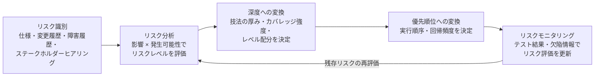

# テスト標準体系と保証概念リファレンス

目的: 「AI がテストを生成できても、そのテストが何を保証しているのかを説明できなければ、ただの自動化された願掛けである」という問題に答えるため、テスト標準体系（ISO/IEC/IEEE 29119、ISTQB/JSTQB）と保証概念（テストレベル・タイプ、リスク、オラクル、flaky、テスト負債、カバレッジの限界）を一枚に整理します。

想定読者: QA エンジニア、テストアーキテクト、SET/SDET、AI エージェント・skills 設計者。

関連ドキュメント:

- 個別のテスト技法の詳細 → [テスト技法スキルカタログ](./test-techniques-skill-catalog.md)（原案 95 技法。135 技法の状態判定は [テスト技法状態判定一覧 CSV](./test-technique-status-assessment.csv)）
- テスト設計プロセス・データ契約・レビューゲート → [テスト活動プロセス調査まとめ（テスト設計）](./test-process-research-summary-test-design.md)
- 品質規格全体の使い分け（ISO 9001 / 25010 / 12207 / IEEE 1012 等） → [ソフトウェア品質管理実務リファレンス](../quality-management/software-quality-management-practical-reference.md)

---

## エグゼクティブサマリ

本ドキュメントの結論は次の 5 点です。

第一に、**テストの「共通語彙と骨格」は ISO/IEC/IEEE 29119 シリーズと ISTQB CTFL 4.0 で既に標準化されており、AI エージェントの出力フォーマットはここに寄せるのが最も説明可能性が高い**です。29119 は概念（Part 1:2022）、プロセス（Part 2:2021）、文書（Part 3:2021）、技法（Part 4:2021）、キーワード駆動（Part 5:2024）に加え、AI システムのテストを扱う技術報告書 TR 29119-11:2020 まで揃っています。

第二に、**「何を保証するか」はテストレベル × テストタイプ × 技法の三軸で初めて言明できます**。CTFL 4.0 の 5 レベル（コンポーネント / コンポーネント統合 / システム / システム統合 / 受け入れ）と 4 タイプ（機能 / 非機能 / ブラックボックス / ホワイトボックス）は直交しており、「どのレベルで・どの品質特性を・どの網羅モデルで確認したか」を明示しないテスト報告は保証の言明として不完全です。

第三に、**テストの深さと優先順位はリスクから導出するのが標準の立場**です。プロダクトリスクを影響 × 発生可能性で分析し、リスクレベルを技法の厚み・カバレッジ強度・実行順序・回帰頻度に変換する手順を持つことで、「なぜこのテストはここまでで良いのか」を説明できます。

第四に、**テストが保証できる範囲はオラクルの強さで決まります**。Barr らの分類（specified / derived / implicit / 人間オラクル）に基づけば、アサーションのないテストやクラッシュ検出だけのテストは「暗黙オラクルによる頑健性の確認」以上の主張ができません。同様に、**カバレッジは「実行した」証拠であって「検証した」証拠ではなく**、Inozemtseva らの研究が示す通りカバレッジとテストスイートの欠陥検出力の相関は限定的です。検出力の言明にはミューテーションスコア等の補完が必要です。

第五に、**保証は時間とともに劣化します**。flaky test（Google では全テスト実行の約 1.5% が flaky な結果、約 16% のテストに何らかの flakiness）、テストスメル、回帰スイートの陳腐化（CTFL 原則「テストは弱化する」）を定量管理しない限り、テストスイートは「動いているが何も保証しない資産」に変質します。本ドキュメント末尾に、**AI エージェントがテスト生成時に添えるべき「保証内容・前提・限界」の説明テンプレート**を定義します。

---

## 1. ISO/IEC/IEEE 29119 シリーズの構成と現況

ISO/IEC/IEEE 29119 は「あらゆるライフサイクルモデルで使えるテストの国際標準」を目的としたシリーズで、2013 年の初版群が 2021〜2024 年にかけて第 2 版へ改訂されています。各パートの現況は次の通りです。

| パート | 最新版 | 種別 | 役割 |
| --- | --- | --- | --- |
| 29119-1 General concepts | **2022 年（第 2 版）** | 国際規格 | シリーズ全体の用語・一般概念。旧題「Concepts and definitions」から改題 |
| 29119-2 Test processes | **2021 年（第 2 版）** | 国際規格 | 組織レベル・テストマネジメントレベル・動的テストレベルの 3 層プロセスモデル |
| 29119-3 Test documentation | **2021 年（第 2 版）** | 国際規格 | テスト方針・計画・報告など文書のテンプレートと記載例 |
| 29119-4 Test techniques | **2021 年（第 2 版）** | 国際規格 | 仕様ベース / 構造ベース / 経験ベース技法の定義と対応カバレッジ測定 |
| 29119-5 Keyword-driven testing | **2024 年 12 月（第 2 版）** | 国際規格 | キーワード駆動テストの概念、フレームワーク要件、ツール間データ交換形式 |
| TR 29119-11 Testing of AI-based systems | **2020 年（初版）** | 技術報告書 | AI ベースシステムのテストガイドライン |
| TR 29119-13 Biometric systems | **2022 年（初版）** | 技術報告書 | 29119 シリーズの生体認証システムテストへの適用 |

実務上の要点は三つあります。

1. **Part 2 のプロセスモデルは「組織 → マネジメント → 動的テスト」の 3 層構造**であり、AI エージェントに落とす場合も「テスト方針（組織）」「テスト計画・モニタリング（マネジメント）」「設計・実装・実行・完了（動的）」の階層を崩さないほうが、成果物間のトレーサビリティを保てます。動的テストプロセスの詳細な skills 分解は [テスト活動プロセス調査まとめ](./test-process-research-summary-test-design.md) を参照してください。
2. **Part 4 の技法 3 分類（仕様 / 構造 / 経験ベース）+ カバレッジ測定**は、[テスト技法スキルカタログ](./test-techniques-skill-catalog.md) の分類骨格と一致します。技法の選択根拠を説明するとき、「29119-4 のどのカテゴリの技法を、どのカバレッジ項目に対して適用したか」という語彙で記述すると規格準拠の説明になります。
3. **TR 29119-11 は AI システムのテストにおける最大の課題としてテストオラクル問題を明示**しています。AI ベースシステムは複雑・非決定的で仕様が不完全になりやすく、期待結果の決定（＝合否判定）が困難であること、ブラックボックスアプローチとニューラルネットワーク向けホワイトボックステストの指針が扱われています。本ドキュメント第 5 章のオラクル分類は、この課題への標準側の応答と接続します。

なお、29119 と他規格（IEEE 1012 の V&V、ISO/IEC 25010 の品質特性など）の役割分担は [ソフトウェア品質管理実務リファレンス](../quality-management/software-quality-management-practical-reference.md) に整理済みのため、本ドキュメントでは繰り返しません。

---

## 2. ISTQB CTFL 4.0 の体系と JSTQB 対応

### 2.1 CTFL 4.0 の位置づけ

ISTQB Certified Tester Foundation Level (CTFL) v4.0 は 2023 年 4 月 21 日にリリースされ、現行のシラバスは v4.0.1（2024 年改訂）です。6 章構成・64 学習目標で、v3.1 から学習目標が大幅に削減され（K1: 21→14、K2: 53→42、K3: 15→8）、旧 Agile Tester シラバス（2014）の内容が統合されました。シラバス第 2 章はテストを SDLC の文脈で扱い、シーケンシャル型（ウォーターフォール / V 字）と反復・漸進型（Agile）の双方への適用、シフトレフト、テストファースト（TDD / BDD / ATDD）、DevOps とテストの関係を含みます。**「テストは最後の工程」ではなく「あらゆるライフサイクルモデルに埋め込まれる活動」というのが現行標準の前提**です。

JSTQB は 2023 年 9 月に日本語翻訳版（Version 2023V4.0.J01）を公開し、現行版は J02（2024 年 7 月更新）です。V4.0 ベースの Foundation Level 試験は 2024 年秋（2024 年 11 月開催分）から適用されています。

### 2.2 テストの 7 原則（v4.0 現行表現）

v4.0 で原則 5 が「殺虫剤のパラドックス」から「テストは弱化する（Tests wear out）」へ改められた点が最大の変更です。以下は英語原文の要旨です（正式な日本語訳は JSTQB 版シラバスを参照）。

| # | 原則（v4.0 英語表現） | 要旨 | 保証概念への含意 |
| --- | --- | --- | --- |
| 1 | Testing shows the presence, not the absence of defects | テストは欠陥の存在は示せるが、不在は証明できない | テスト合格は「欠陥ゼロ」の主張ではなく「探した範囲で見つからなかった」という限定的な主張 |
| 2 | Exhaustive testing is impossible | 全数テストは不可能 | だからこそ技法（網羅モデル）とリスクで範囲を決め、その範囲を明示する必要がある |
| 3 | Early testing saves time and money | 早期テストで時間とコストを節約できる | 静的テスト・レビューも保証活動の一部として設計する |
| 4 | Defects cluster together | 欠陥は偏在する | リスクベースの深度配分（第 4 章）の根拠 |
| 5 | Tests wear out | 同じテストの繰り返しは新しい欠陥への検出力を失う | 回帰スイートの刈り込み・更新（第 7 章）の根拠 |
| 6 | Testing is context dependent | テストのやり方は状況に依存する | 「常に正しいテスト戦略」は存在しない。保証の言明には文脈（前提）が必須 |
| 7 | Absence-of-defects fallacy | 欠陥がないことの誤謬。仕様通りでもユーザニーズを満たすとは限らない | 検証（verification）と妥当性確認（validation）を区別して主張する |

**7 原則はそのまま「AI が生成したテストの保証範囲を説明する際の禁止事項リスト」として機能します**。すなわち、(1) 欠陥ゼロを主張しない、(2) 網羅の範囲を明示する、(5) テストの陳腐化条件を明示する、(7) 検証と妥当性確認を混同しない、という制約です。

### 2.3 テストレベルとテストタイプ

CTFL 4.0 は **5 つのテストレベル**と **4 つのテストタイプ**を定義し、両者は直交します（どのタイプもどのレベルでも実施可能）。

| テストレベル | 主な対象 | 主な責務 |
| --- | --- | --- |
| コンポーネントテスト | 分離された単一ユニット | 主に開発者。テストハーネス・ユニットテストフレームワークを利用 |
| コンポーネント統合テスト | コンポーネント間のインターフェースと相互作用 | 統合戦略（ボトムアップ / トップダウン / ビッグバン）に依存 |
| システムテスト | システム全体の振る舞いと能力（E2E の機能・非機能） | 独立したテストチームが担うことが多い |
| システム統合テスト | 他システム・外部サービスとの相互作用 | 外部依存を含む結合の確認 |
| 受け入れテスト | 受け入れ基準の充足、ステークホルダーのニーズ | 検証よりも妥当性確認に重心 |

| テストタイプ | 問い | 判定基準の出どころ |
| --- | --- | --- |
| 機能テスト | 「何をするか」が正しいか | 機能要求・仕様・ユーザストーリー |
| 非機能テスト | 「どの程度うまく」動くか | ISO/IEC 25010 の品質特性（性能効率性、セキュリティ、使用性など） |
| ブラックボックステスト | 仕様に対して正しいか（内部構造を見ない） | 仕様・外部振る舞い |
| ホワイトボックステスト | 内部構造を網羅できているか | コード・アーキテクチャの構造 |

確認テスト（confirmation）と回帰テスト（regression）は、v4.0 では変更に伴うテスト実践として別枠で扱われます。静的テスト（レビュー、静的解析。実行せずに評価する）と動的テスト（実行して評価する）の区別も v4.0 の基本語彙であり、静的テストは「欠陥を直接発見できる」「実行前に適用できる」点で動的テストと相補的です。

---

## 3. テストレベル × テストタイプ × 技法の保証マトリクス

「このテストは何を保証するか」は、**レベル（どこで）× タイプ（何の品質を）× 技法（どの網羅モデルで）**の三軸を埋めて初めて言明になります。以下は実務で使える対応表です。個別技法の手順・完了条件は [テスト技法スキルカタログ](./test-techniques-skill-catalog.md) に委譲します。

| テストレベル | そのレベルで保証できること | 保証できないこと | 代表的な技法（カタログ参照） |
| --- | --- | --- | --- |
| コンポーネント | 単一ユニットのロジック・境界・例外処理が仕様通り | 結合時の相互作用、システム全体の性能、ユーザニーズ適合 | 同値分割、境界値分析、デシジョンテーブル、プロパティベース、ステートメント / ブランチカバレッジ |
| コンポーネント統合 | インターフェース契約（型・値域・順序・エラー伝搬）の整合 | 単体ロジックの正しさ（下位レベルに委譲）、E2E 挙動 | 契約テスト、インターフェース分析、状態遷移テスト |
| システム | E2E の機能充足、非機能特性（性能・信頼性・セキュリティ等） | 外部システムとの実結合、本番運用条件の忠実な再現 | ユースケーステスト、シナリオテスト、状態遷移、性能・負荷テスト、探索的テスト |
| システム統合 | 外部システム・サードパーティとのデータ交換・プロトコル整合 | 外部システム内部の正しさ | 契約テスト、差分テスト、E2E シナリオ |
| 受け入れ | 受け入れ基準の充足、ビジネス目的・利用文脈への適合（妥当性確認） | 内部品質・構造的網羅 | 受け入れ基準ベース、ATDD/BDD、探索的テスト、アルファ / ベータ |

タイプ × 保証の対応は次の通りです。

| テストタイプ | 保証の言明形式 | 典型的な網羅・判定モデル |
| --- | --- | --- |
| 機能 | 「仕様 S の機能 F は、条件 C の範囲で期待通り動作する」 | 要求カバレッジ、同値クラス / 境界値の網羅 |
| 非機能 | 「品質特性 Q は、負荷・条件 L のもとで目標値 T を満たす」 | SLO / 品質要求値との比較、運用プロファイル |
| ブラックボックス | 「外部仕様に定義された振る舞いを、仕様アイテムの網羅率 X% で確認した」 | 仕様アイテムカバレッジ |
| ホワイトボックス | 「実装構造の X%（文 / 分岐 / 条件）をテストが実行した」 | コードカバレッジ（※実行の証拠。第 8 章参照） |

このマトリクスの使い方は二つです。**設計時は「保証したい主張」から逆算してレベル・タイプ・技法を選ぶ**（例: 「決済金額計算の境界が正しい」→ コンポーネントレベル × 機能 × 境界値分析）。**報告時はテストが埋めたセルを明示し、埋めていないセルを「保証範囲外」と宣言する**（例: コンポーネントテストのみ実施なら、結合・非機能・妥当性は未保証と明記する）。テストピラミッド運用では、下位レベルで保証済みの主張を上位レベルで重複確認しないことがスイート肥大の防止になります。

---

## 4. リスクベーステスト: リスクをテスト深度に変換する

### 4.1 標準の立場

CTFL 4.0 第 5 章は、リスクを「プロダクトリスク」と「プロジェクトリスク」に区分し、リスクレベルを**発生可能性（likelihood）× 影響（impact）**で分析し、その結果でテストの厚みと順序を制御する立場を取ります。29119-1 もリスクベーステストをシリーズ全体の基本概念として扱っています。

| 区分 | 定義 | 例 | テストへの効き方 |
| --- | --- | --- | --- |
| プロダクトリスク | 成果物の品質に直結するリスク | 計算誤り、性能劣化、セキュリティ欠陥、データ破損 | テストの深さ・技法選択・優先順位を決める |
| プロジェクトリスク | プロジェクト遂行能力に関するリスク | スケジュール遅延、要員不足、環境不備、仕様凍結遅れ | テスト計画・体制・スケジュールのコンティンジェンシーを決める |

### 4.2 リスク → テスト深度の変換手順



変換の実務は「リスクレベルごとの深度ポリシー」をあらかじめ決めておくことに尽きます。以下はポリシー表の例です（値は組織・ドメインごとに調整します）。

| リスクレベル | 技法の厚み | カバレッジ目標の例 | 実行順序 / 回帰頻度 |
| --- | --- | --- | --- |
| 高（影響大 × 可能性高） | 複数技法の重ね掛け（境界値 + デシジョンテーブル + 探索的）。部分オラクルの追加設計 | 分岐カバレッジ + 主要パスのミューテーション確認 | 最優先で実行。毎コミットの回帰対象 |
| 中 | 単一の体系的技法（同値分割 + 境界値など） | 文カバレッジ + 仕様アイテム網羅 | 通常順。日次〜週次の回帰対象 |
| 低 | スモーク / ハッピーパスのみ、または探索的セッションで代替 | 主要シナリオの疎通のみ | 後回し可。リリース前のみ回帰 |

**重要なのは、この表自体を成果物としてレビュー可能にすること**です。AI エージェントがテストを生成する場合、「このテスト群はリスク項目 R-12（高）に対応し、ポリシー表の『高』行を適用した」という参照が付いていれば、テストの深さの妥当性を人間が監査できます。リスク項目をテスト設計成果物（テスト条件、カバレッジアイテム）に横断させるデータ設計は [テスト活動プロセス調査まとめ](./test-process-research-summary-test-design.md) の `RiskItem` 型の議論を参照してください。

---

## 5. テストオラクル問題: 合否判定の根拠

### 5.1 オラクルの分類（Barr et al. 2015）

テストオラクルとは「観測した振る舞いが正しいかどうかを判定する手段」であり、その入手困難性がテストオラクル問題です。Barr らのサーベイ（IEEE Transactions on Software Engineering, 41(5), 2015）は、この問題への取り組みを **specified / derived / implicit の 3 種のオラクル + オラクル不在への対処（人間オラクル）** の 4 側面で整理しました。

| 分類 | 判定根拠 | 具体例 | 保証の強さ |
| --- | --- | --- | --- |
| Specified oracle（明示仕様オラクル） | 形式仕様・契約・モデルなど明示的に規定された期待値 | 事前・事後条件（契約）、アサーション、形式仕様、モデル準拠判定 | 最も強い。仕様が正しい限り、合否は仕様適合の証拠になる |
| Derived oracle（導出オラクル） | 仕様以外のアーティファクトから導出した判定基準 | 旧バージョンとの比較（回帰）、他実装との比較（差分テスト）、メタモルフィック関係、実行履歴から推定した不変条件 | 中程度。「参照物と矛盾しない」ことを保証。参照物の正しさは別途前提 |
| Implicit oracle（暗黙オラクル） | どんなプログラムでも異常とみなせる一般知識 | クラッシュしない、未処理例外・デッドロック・メモリリークがない | 弱いが汎用。頑健性のみを保証（ファジングの主たる判定基準） |
| 人間オラクル（オラクル不在への対処） | 人間の判断・ドメイン知識・期待 | 探索的テストでの評価、出力の目視確認、クラウドソーシング | 柔軟だが高コスト・非再現的。判断根拠の記録が必須 |

### 5.2 オラクルが無い / 弱い場合に何が保証できるか

**テストの保証力はオラクルの強さで上限が決まります**。この対応を明示すると、生成されたテストの限界を機械的に説明できます。

| テストの状態 | 実際に保証していること | 保証していないこと |
| --- | --- | --- |
| アサーションなしで実行だけするテスト | 「その入力でクラッシュ・例外なく完走する」（暗黙オラクルのみ） | 出力の正しさは一切保証しない |
| スナップショット / ゴールデンファイル比較 | 「前回記録した出力と同一」（導出オラクル） | 前回出力が正しかったことは保証しない（誤りの固定化リスク） |
| 他実装・旧版との差分比較 | 「参照実装と一致する」 | 両実装が同じ誤りを持つケースは検出できない |
| メタモルフィック関係の検査 | 「入力変換に対して出力が既知の関係を満たす」（部分的正しさ） | 関係を満たす誤答は検出できない |
| 仕様由来のアサーション | 「仕様のこの条項を満たす」 | 仕様自体の妥当性、書かれていない要求 |

### 5.3 部分オラクルとの関係

完全な期待値が書けない対象（数値計算、ML モデル、検索、レコメンド、LLM 出力など）では、**部分オラクル（partial oracle）を複数束ねて保証を積み上げる**のが現実解です。

- **メタモルフィック関係**: 入力の変換と出力の関係（例: 入力を並べ替えても合計は不変）で検査する。Segura らのサーベイ（IEEE TSE 2016）が体系化しており、オラクル問題の代表的緩和策です。
- **プロパティ（不変条件）**: 「出力は常にソート済み」「シリアライズ→デシリアライズで元に戻る」などの性質をプロパティベーステストで大量入力に対して検査する。
- **差分・回帰**: 他実装・他バージョン・他モデルとの比較で「不一致」を欠陥候補として検出する。

TR 29119-11 が AI システムテストの最大課題をオラクル問題としている通り、**AI が生成するテストにも、AI システムを対象とするテストにも、「オラクルは何か・その強さはどれか」を明記する規律が必要**です。これら技法の実行手順は [テスト技法スキルカタログ](./test-techniques-skill-catalog.md)（メタモルフィックテスト、プロパティベーステスト、差分テスト、テストオラクル設計）を参照してください。

---

## 6. flaky test: 非決定的テストの管理

### 6.1 定義と規模感

flaky test は「同一のコードに対して合格と不合格の両方の結果を示すテスト」です。Google は 2016 年に、**全テスト実行の約 1.5% が flaky な結果を返し、約 16% のテストに何らかの flakiness があり、post-submit テストにおける合格→不合格遷移の約 84% に flaky テストが関与している**と報告しました。flaky テストが多いスイートでは「不合格＝欠陥」という信号が壊れるため、**テストスイート全体の保証力が失われます**。

### 6.2 原因分類（Luo et al. FSE 2014）

Luo らは 51 の OSS プロジェクトにおける flaky テスト修正コミット 201 件を分析し、原因を 10 カテゴリに分類しました。上位は次の通りです。

| 原因カテゴリ | 割合 | 内容 | 典型的な修復 |
| --- | --- | --- | --- |
| Async wait（非同期待ち） | **45%** | 非同期処理の完了を固定 sleep で待つ | 条件成立を待つ waitFor 型の待機への置き換え |
| Concurrency（並行性） | **20%** | レースコンディション、アトミック性違反、デッドロック | ロック追加、共有状態の排除、同期設計の修正 |
| Test order dependency（テスト順序依存） | 第 3 位 | 他テストが残した状態への依存 | テスト間の状態分離、セットアップ / クリーンアップの明示化 |
| その他 | — | リソースリーク、ネットワーク、時刻、I/O、乱数、浮動小数点、コレクションの順序不定 など | 依存の注入・固定化（時刻・乱数シードの固定、外部依存のスタブ化） |

Microsoft の大規模調査（Lam et al., ISSTA 2019）は、**CI 上で flaky と判定されたテストをローカルで 100 回再実行しても 86% は再現しない（CI パイプラインでのみ flaky）**ことを示し、環境要因の切り分けを支援するツール RootFinder を提案しました。flaky の再現・原因究明はローカル再実行だけでは不十分だということです。

### 6.3 定量管理と隔離・修復戦略

| 施策 | 内容 | 判断基準の例 |
| --- | --- | --- |
| flake rate の計測 | テスト単位・スイート単位で「同一コードでの結果不一致率」を継続測定する | flake rate が閾値超過のテストを自動検出 |
| 再実行による切り分け | 失敗時に自動再実行し、合格に転じたら flaky 候補としてマークする（Google の運用が典型） | 再実行は切り分け手段であり、恒久対策ではない |
| 隔離（quarantine） | flaky 判定されたテストをブロッキング対象から外し、隔離スイートで監視する | 隔離には修復期限を必ず併設する（無期限隔離は削除と同義） |
| 根本修復 | Luo らの分類に沿って原因を特定し、待機・分離・依存固定で修復する | 修復不能・価値の低いテストは削除する |
| 発生予防 | 時刻・乱数・外部 I/O をテストダブルで固定する設計規約を敷く | 新規テストのレビュー観点に flakiness を含める |

**AI エージェントへの含意**: 生成したテストに sleep 固定待ち・実時刻依存・乱数シード未固定・テスト間共有状態があれば、それは flaky の主要原因を埋め込んでいることになります。生成時の静的チェックリストとして上表の「発生予防」を組み込むべきです。

---

## 7. テスト負債とテスト保守性

### 7.1 テストコード品質とテストスメル

テストコードもプロダクトコードと同様に劣化します。van Deursen らは 2001 年の「Refactoring Test Code」でテストスメル（テストコード特有のアンチパターン）11 種と対応リファクタリングを体系化し、Garousi & Küçük のサーベイ（Journal of Systems and Software, 2018）が産業界・学術の知見を集約しています。代表的なスメルは次の通りです。

| テストスメル | 症状 | 保証への影響 |
| --- | --- | --- |
| Mystery Guest | テストが外部ファイル・DB など不可視の外部資源に依存する | テストの前提が読めず、環境差で flaky 化する |
| Eager Test | 1 テストで複数の対象メソッドを検査する | 失敗時に何が壊れたか特定できず、保証単位が曖昧になる |
| Assertion Roulette | 説明のないアサーションが多数並ぶ | どの主張が破れたのか失敗メッセージから分からない |
| General Fixture | 巨大な共通フィクスチャを全テストが共有する | テストごとの前提が不明瞭になり、順序依存の温床になる |
| Test Code Duplication | テストコードの重複 | 仕様変更時の修正漏れ・保守コスト増 |
| Indirect Testing | 対象を他クラス経由で間接的にテストする | 保証対象の境界が不明確になる |

### 7.2 回帰スイートの劣化と刈り込み

CTFL 原則 5「テストは弱化する」の通り、**同じ回帰テストを回し続けるだけでは新しい欠陥への検出力が落ちます**。さらにスイートは追加され続ける一方で削除されにくいため、実行時間の増大・flaky の蓄積・重複した保証が進行します。刈り込みの実務は次の順で行います。

1. **保証の重複を特定する**: 同じ主張（レベル × タイプ × 対象）を複数テストが確認していないかをマトリクス（第 3 章）で棚卸しする。上位レベルの重い E2E が下位レベルで保証済みの主張を再確認しているなら、下位に寄せる。
2. **検出実績と失敗情報量で評価する**: 一度も欠陥を検出せず、落ちたときも情報を生まない（flaky・環境起因ばかりの）テストは削除候補。
3. **回帰テスト選択・優先順位付けを導入する**: 変更影響に基づいて実行対象を絞る（技法詳細は [カタログ](./test-techniques-skill-catalog.md) の回帰テスト選択・優先順位付けを参照）。
4. **削除を意思決定として記録する**: 「このテストが保証していた主張」をテンプレート（第 9 章）で確認し、代替保証があるか・保証を放棄するかを明示して消す。

**テスト負債の本質は「何を保証しているのか誰も説明できないテストの蓄積」**です。テストごとに保証内容が記録されていれば、刈り込みは機械的な作業になります。

---

## 8. カバレッジ指標の限界と正しい使い方

### 8.1 カバレッジ ≠ 保証

コードカバレッジは「テストがコードのどれだけを**実行したか**」の指標であり、「実行した結果を**検証したか**」は測りません。アサーションのないテストでも高カバレッジは達成できます。したがって**カバレッジ X% は「未実行コードが (100−X)% ある」ことの証拠としては有効ですが、「X% が正しく動く」ことの証拠にはなりません**。

実証面では、Inozemtseva & Holmes（ICSE 2014、ACM Distinguished Paper / ICSE 2024 Most Influential Paper）が、テストスイートのサイズを統制するとカバレッジと欠陥検出力（ミュータント検出力）の相関は低〜中程度にとどまり、**より強いカバレッジ基準（分岐など）を使っても検出力の予測は改善しない**ことを示しました。「カバレッジ目標の達成」をそのまま「品質の達成」と読み替えることはできません。

### 8.2 ミューテーションスコアとの関係

ミューテーションテストは、コードに人工的な欠陥（ミュータント）を注入し、テストスイートがそれを検出（kill）できる割合＝ミューテーションスコアで**検出力そのもの**を測ります。Just らの研究（FSE 2014）は、ミュータント検出力が実欠陥の検出力と統計的に有意に相関し、その相関はカバレッジとは独立であることを示しました。Google は大規模開発でミューテーションテストを運用しており（Petrović & Ivanković, ICSE-SEIP 2018）、約 1,500 万ミュータントの分析から、ミューテーションテストを使う開発者はより多くの高品質なテストを書くようになり、ミュータントが実欠陥と結び付いていることを報告しています（Petrović et al., ICSE 2021）。

| 指標 | 測っているもの | 保証の言明に使える形 |
| --- | --- | --- |
| コードカバレッジ | テストが実行したコードの範囲 | 「未実行（未保証）の領域が X% ある」という**ギャップの言明** |
| 仕様 / 要求カバレッジ | 網羅した仕様アイテムの範囲 | 「仕様のこの範囲を確認した」という**範囲の言明** |
| ミューテーションスコア | 人工欠陥への検出力 | 「この種の欠陥なら検出できる」という**検出力の言明** |

### 8.3 カバレッジの正しい使い方

1. **ギャップ検出器として使う**: カバレッジの低い箇所は「テストが存在しない」確実な証拠。テスト追加の優先順位付けに使う。
2. **必要条件であって十分条件ではない完了基準として使う**: 「分岐カバレッジ 80% 未満ならレビューに進まない」は妥当。「80% 以上だから品質十分」は誤り。
3. **差分カバレッジを重視する**: 変更行に対するカバレッジは、全体率より意思決定に効く。
4. **数値目標のゲーム化を防ぐ**: カバレッジ目標だけを課すと、アサーションのない実行だけのテストを誘発する（Goodhart の法則）。ミューテーションスコアやレビューでの補完が前提。
5. **技法のカバレッジ（29119-4 の網羅基準）と併記する**: コード網羅だけでなく「同値クラスを全て網羅」「状態遷移の 0-switch を網羅」のようにテスト設計モデル上の網羅を言明する。

---

## 9. 「このテストは何を保証するか」説明テンプレート

以上の全章を集約すると、テストの保証は「**レベル × タイプ × 技法（第 3 章）で範囲を定め、リスク（第 4 章）で深さを正当化し、オラクル（第 5 章）で判定根拠の強さを示し、カバレッジ / ミューテーション（第 8 章）で網羅と検出力を示し、flaky・陳腐化（第 6・7 章）で有効期限を示す**」ことで初めて言明になります。AI エージェントがテストを生成する際は、次のテンプレートを各テスト（またはテスト群）に添付します。

```yaml
assurance_statement:
  # --- 何を保証するか ---
  target: 対象（機能 / コンポーネント / 品質特性）
  claim: >
    このテスト群が合格した場合に成立する品質主張。
    「〜の範囲で〜が仕様通りである」の形式で、範囲を必ず含める。
  test_level: コンポーネント | コンポーネント統合 | システム | システム統合 | 受け入れ
  test_type: 機能 | 非機能 | ブラックボックス | ホワイトボックス
  technique: 使用技法（テスト技法スキルカタログの skill_id）

  # --- なぜこの深さか ---
  risk_link:
    risk_item: 対応するプロダクトリスク ID
    risk_level: 高 | 中 | 低
    depth_policy: 適用した深度ポリシー（第 4 章の表の行）

  # --- 合否判定の根拠 ---
  oracle:
    kind: specified | derived | implicit | human
    description: 期待結果の出どころ（仕様条項 / 参照実装 / メタモルフィック関係 等）
    strength: 完全 | 部分 | 頑健性のみ
    known_blind_spots: このオラクルでは検出できない誤りの種類

  # --- 網羅と検出力 ---
  coverage:
    model: 網羅モデル（同値クラス / 分岐 / 状態遷移 0-switch 等）
    achieved: 実測値
    not_covered: 意図的に網羅しなかった範囲とその理由
  fault_detection_evidence: ミューテーションスコア等の検出力の根拠（無ければ「未測定」と明記）

  # --- 前提と限界 ---
  assumptions:
    - 実行環境・テストデータ・スタブ化した依存などの前提
  limitations:
    - このテストが保証しないこと（上位レベル・他タイプへの委譲を含む）
  flakiness_controls: 時刻固定 / 乱数シード固定 / 外部依存スタブ化 / 状態分離 の実施状況
  decay_conditions: このテストを見直すべき条件（仕様変更、依存更新、flake rate 閾値超過 等）
```

記入例（抜粋）:

```yaml
assurance_statement:
  target: 送料計算モジュール calculateShipping()
  claim: >
    重量 0kg〜30kg・国内 3 配送区分の範囲で、送料が料金表仕様 v2.3 の
    境界を含めて仕様通りに算出される。
  test_level: コンポーネント
  test_type: 機能
  technique: boundary-value-analysis, decision-table
  risk_link: { risk_item: R-07, risk_level: 高, depth_policy: 高リスク行 }
  oracle:
    kind: specified
    description: 料金表仕様 v2.3 の期待値をアサーションとして実装
    strength: 完全
    known_blind_spots: 料金表仕様自体の誤り、30kg 超・海外配送
  coverage:
    model: 境界値（2 点法）+ デシジョンテーブル全ルール
    achieved: 境界 12/12、ルール 9/9、分岐カバレッジ 100%
    not_covered: 30kg 超は仕様外のため対象外（入力検証は別テスト T-201）
  fault_detection_evidence: ミューテーションスコア 92%（生存 3 件は等価ミュータント確認済み）
  assumptions: [料金マスタはフィクスチャで固定, 外部税率 API はスタブ化]
  limitations:
    - 実 API との結合時の挙動は保証しない（コンポーネント統合 T-310 に委譲）
    - 性能・同時実行時の挙動は保証しない
  flakiness_controls: 時刻・乱数非依存、共有状態なし
  decay_conditions: 料金表仕様の改訂、配送区分の追加
```

このテンプレートのレビュー（保証主張が妥当か、限界の申告が正直か）は、[テスト活動プロセス調査まとめ](./test-process-research-summary-test-design.md) のレビューゲート（文書点・工程一貫性・説明責任）に組み込むことを推奨します。**テンプレートを埋められないテストは、「何を保証しているのか説明できないテスト」であり、それ自体がテスト負債のシグナルです**。

---

## 主要参考文献

### 規格・標準

- ISO/IEC/IEEE 29119-1:2022 Software testing — Part 1: General concepts — https://www.iso.org/standard/81291.html
- ISO/IEC/IEEE 29119-5:2024 Software testing — Part 5: Keyword-driven testing — https://www.iso.org/standard/87233.html
- ISO/IEC TR 29119-11:2020 Guidelines on the testing of AI-based systems — https://www.iso.org/standard/79016.html
- ISO/IEC TR 29119-13:2022 Testing of biometric systems — https://www.iso.org/standard/84220.html
- ISO/IEC 29119 series 概観（各パートの版年） — https://en.wikipedia.org/wiki/ISO/IEC_29119

### ISTQB / JSTQB

- ISTQB Certified Tester Foundation Level Syllabus v4.0.1 — https://istqb.org/wp-content/uploads/2024/11/ISTQB_CTFL_Syllabus_v4.0.1.pdf
- ISTQB CTFL v4.0 Overview — https://istqb.org/certifications/certified-tester-foundation-level-ctfl-v4-0/
- ISTQB releases CTFL v4.0（2023-04-21） — https://istqb.org/istqb-releases-certified-tester-foundation-level-v4-0-ctfl/
- JSTQB Foundation Level シラバス 日本語版 Version 2023V4.0.J02 — https://jstqb.jp/dl/JSTQB-SyllabusFoundation_VersionV40.J02.pdf
- JSTQB CTFL v4.0 日本語版リリースと変更点（二次情報） — https://www.co-well.jp/blog/softwaretest_jstqb_v4.0

### テストオラクル・部分オラクル

- Barr, E. T., Harman, M., McMinn, P., Shahbaz, M., Yoo, S. "The Oracle Problem in Software Testing: A Survey." IEEE Transactions on Software Engineering 41(5), 2015 — https://doi.org/10.1109/TSE.2014.2372785 （著者版 PDF: https://earlbarr.com/publications/testoracles.pdf ）
- Segura, S., Fraser, G., Sánchez, A. B., Ruiz-Cortés, A. "A Survey on Metamorphic Testing." IEEE Transactions on Software Engineering 42(9), 2016 — https://eprints.whiterose.ac.uk/id/eprint/110335/1/segura16-tse.pdf

### flaky test

- Luo, Q., Hariri, F., Eloussi, L., Marinov, D. "An Empirical Analysis of Flaky Tests." FSE 2014 — https://dl.acm.org/doi/10.1145/2635868.2635920 （著者版 PDF: https://mir.cs.illinois.edu/lamyaa/publications/fse14.pdf ）
- Micco, J. "Flaky Tests at Google and How We Mitigate Them." Google Testing Blog, 2016 — https://testing.googleblog.com/2016/05/flaky-tests-at-google-and-how-we.html
- Lam, W., Godefroid, P., Nath, S., Santhiar, A., Thummalapenta, S. "Root Causing Flaky Tests in a Large-Scale Industrial Setting." ISSTA 2019 — https://www.microsoft.com/en-us/research/publication/root-causing-flaky-tests-in-a-large-scale-industrial-setting/

### カバレッジ・ミューテーション

- Inozemtseva, L., Holmes, R. "Coverage Is Not Strongly Correlated with Test Suite Effectiveness." ICSE 2014 — https://dl.acm.org/doi/10.1145/2568225.2568271
- Just, R., Jalali, D., Inozemtseva, L., Ernst, M. D., Holmes, R., Fraser, G. "Are Mutants a Valid Substitute for Real Faults in Software Testing?" FSE 2014 — https://dl.acm.org/doi/10.1145/2635868.2635929
- Petrović, G., Ivanković, M. "State of Mutation Testing at Google." ICSE-SEIP 2018 — https://research.google.com/pubs/archive/46584.pdf
- Petrović, G., Ivanković, M., Fraser, G., Just, R. "Does Mutation Testing Improve Testing Practices?" ICSE 2021 — https://arxiv.org/abs/2103.07189

### テストスメル・テスト保守性

- van Deursen, A., Moonen, L., van den Bergh, A., Kok, G. "Refactoring Test Code." XP 2001 — https://www.researchgate.net/publication/2534882_Refactoring_Test_Code
- Garousi, V., Küçük, B. "Smells in software test code: A survey of knowledge in industry and academia." Journal of Systems and Software 138, 2018 — https://www.sciencedirect.com/science/article/abs/pii/S0164121217303060
- Software Unit Test Smells（テストスメルカタログ） — https://testsmells.org/
